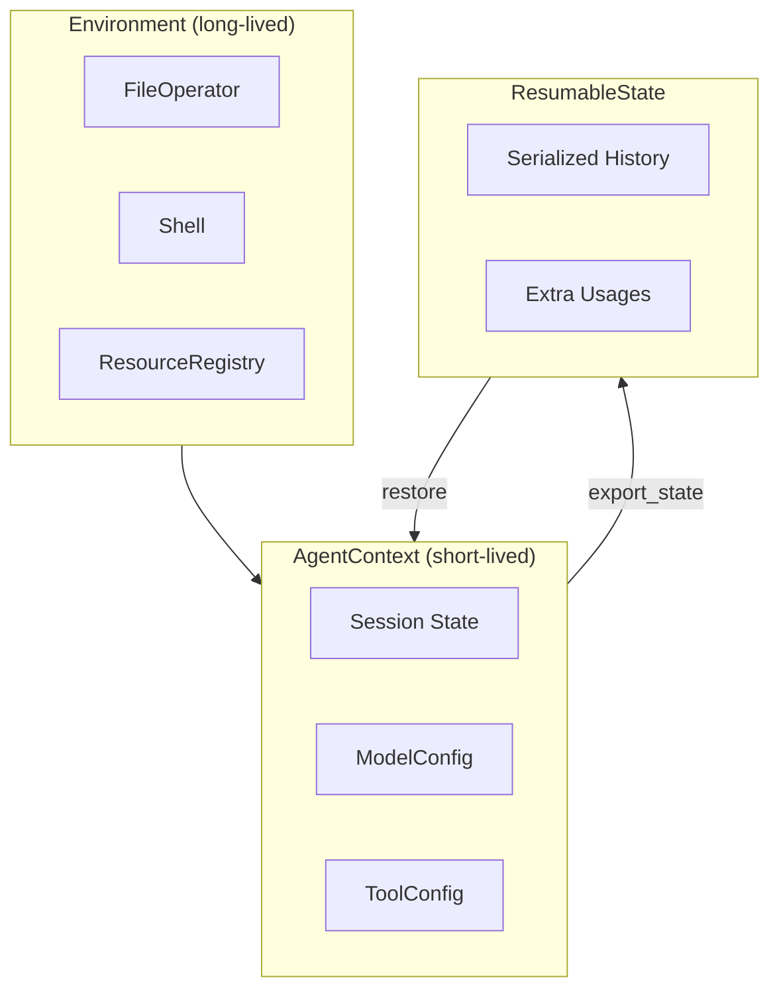

# AgentContext and Session Management

Session state management, resumable sessions, and extending for custom use cases.

## Overview

- **Session State**: Run ID, timing, user prompts, handoff messages
- **Model Configuration**: Context window, capabilities, and model settings
- **Tool Configuration**: API keys and tool-specific settings
- **Resumable Sessions**: Export/restore state for session persistence



## Basic Usage

### Recommended: create_agent + stream_agent

```python
from pai_agent_sdk.agents import create_agent, stream_agent

runtime = create_agent("openai:gpt-4")
async with stream_agent(runtime, "Hello") as streamer:
    async for event in streamer:
        print(event)
```

### Manual Context Management

```python
from pai_agent_sdk.environment import LocalEnvironment
from pai_agent_sdk.context import AgentContext, ModelConfig, ToolConfig

async with LocalEnvironment() as env:
    async with AgentContext(
        env=env,
        model_cfg=ModelConfig(context_window=200000),
        tool_config=ToolConfig(tavily_api_key="..."),
    ) as ctx:
        await ctx.file_operator.read_file("test.txt")
```

## Resumable Sessions

Export and restore session state for multi-turn conversations across restarts.

```python
# Export
state = ctx.export_state()
with open("session.json", "w") as f:
    f.write(state.model_dump_json())

# Restore
from pai_agent_sdk.context import ResumableState
state = ResumableState.model_validate_json(Path("session.json").read_text())
runtime = create_agent("openai:gpt-4", state=state)
```

The `with_state` method accepts `None` for conditional restoration:

```python
async with AgentContext(...).with_state(maybe_state) as ctx:
    ...
```

## Configuration Classes

### ModelConfig

```python
ModelConfig(
    context_window=200000,
    has_image_capability=True,
    has_video_capability=False,
)
```

### ToolConfig

```python
ToolConfig(
    tavily_api_key="tvly-xxx",
    firecrawl_api_key="fc-xxx",
)
```

## ResumableState Fields

| Field                     | Type                     | Description                                  |
| ------------------------- | ------------------------ | -------------------------------------------- |
| `subagent_history`        | `dict[str, list[dict]]`  | Serialized conversation history per subagent |
| `extra_usages`            | `list[ExtraUsageRecord]` | Token usage records from tools/filters       |
| `user_prompts`            | `list[str]`              | Collected user prompts                       |
| `handoff_message`         | `str \| None`            | Context handoff message                      |
| `need_user_approve_tools` | `list[str]`              | Tool names requiring user approval           |

## Extending AgentContext

Extend `AgentContext` and `ResumableState` for custom fields:

```python
class MyContext(AgentContext):
    custom_field: str = ""

    def export_state(self) -> "MyState":
        base = super().export_state()
        return MyState(**base.model_dump(), custom_field=self.custom_field)

class MyState(ResumableState):
    custom_field: str = ""

    def restore(self, ctx: "MyContext") -> None:
        super().restore(ctx)
        ctx.custom_field = self.custom_field
```

> Full examples: `pai_agent_sdk/context.py`

## ToolIdWrapper

Normalizes tool call IDs across different model providers (OpenAI `call_`, Anthropic `toolu_`, etc.) for consistent session resumption and HITL flows.

Used automatically by the SDK streaming infrastructure.

## See Also

- [environment.md](environment.md) - FileOperator, Shell, and ResourceRegistry
- [toolset.md](toolset.md) - Creating and using tools
- [agent-environment](https://github.com/youware-labs/agent-environment) - Base protocol definitions
