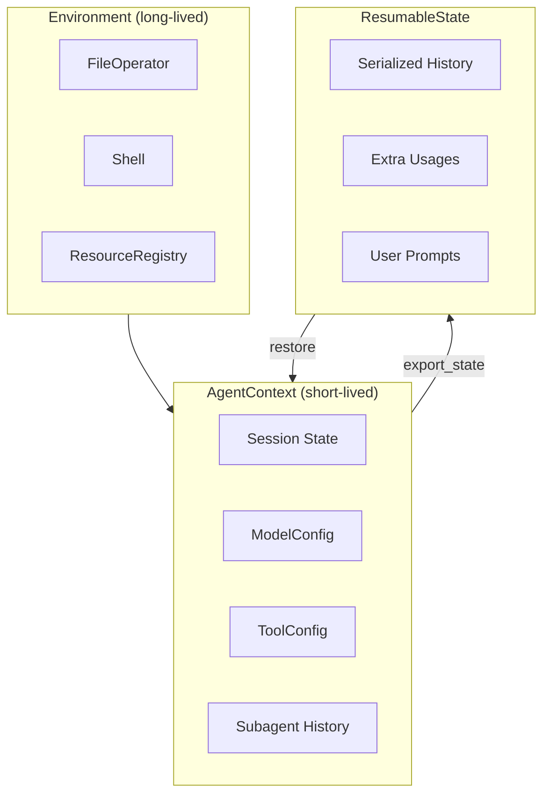

# AgentContext and Session Management

This document describes the AgentContext architecture in pai-agent-sdk, including session state management, resumable sessions, and extending for custom use cases.

## Overview

The AgentContext system provides:

- **Session State**: Run ID, timing, user prompts, handoff messages
- **Model Configuration**: Context window, capabilities, and model settings
- **Tool Configuration**: API keys and tool-specific settings
- **Resumable Sessions**: Export/restore state for session persistence
- **Subagent History**: Conversation history management for subagents

## Architecture



## Basic Usage

### Using create_agent and stream_agent (Recommended)

```python
from pai_agent_sdk.agents import create_agent, stream_agent

# create_agent returns AgentRuntime (not a context manager)
runtime = create_agent("openai:gpt-4")

# stream_agent manages runtime lifecycle automatically
async with stream_agent(runtime, "Hello") as streamer:
    async for event in streamer:
        print(event)
```

### Using create_agent with agent.run

```python
from pai_agent_sdk.agents import create_agent

runtime = create_agent("openai:gpt-4")
async with runtime:  # Enter runtime to manage env/ctx/agent
    result = await runtime.agent.run("Hello", deps=runtime.ctx)
    print(result.output)
```

### Manual Context Management (Advanced)

```python
from pai_agent_sdk.environment import LocalEnvironment
from pai_agent_sdk.context import AgentContext, ModelConfig, ToolConfig

async with LocalEnvironment() as env:
    async with AgentContext(
        env=env,
        model_cfg=ModelConfig(context_window=200000),
        tool_config=ToolConfig(tavily_api_key="..."),
    ) as ctx:
        # Use ctx here
        await ctx.file_operator.read_file("test.txt")
```

## Resumable Sessions

AgentContext supports exporting and restoring session state, enabling:

- Multi-turn conversations across restarts
- Session persistence to database or file
- State transfer between different contexts

### Exporting State

```python
# Save state to JSON file
state = ctx.export_state()
with open("session.json", "w") as f:
    f.write(state.model_dump_json(indent=2))
```

### Restoring State

```python
from pai_agent_sdk.context import ResumableState

# Load and restore with create_agent
with open("session.json") as f:
    state = ResumableState.model_validate_json(f.read())

runtime = create_agent("openai:gpt-4", state=state)
async with stream_agent(runtime, "Continue our conversation") as streamer:
    # Session is restored
    async for event in streamer:
        print(event)
```

### Chaining with with_state

The `with_state` method supports `None` for convenient conditional restoration:

```python
# Works with both state and None
maybe_state = load_state_if_exists()  # Returns ResumableState | None
async with AgentContext(...).with_state(maybe_state) as ctx:
    ...
```

## Extending AgentContext

### Custom Context with Additional Fields

```python
from pai_agent_sdk.context import AgentContext, ResumableState

class MyContext(AgentContext):
    """Custom context with additional session state."""

    custom_field: str = ""
    session_metadata: dict[str, Any] = {}

    def export_state(self) -> "MyState":
        """Export including custom fields."""
        base = super().export_state()
        return MyState(
            **base.model_dump(),
            custom_field=self.custom_field,
            session_metadata=self.session_metadata,
        )
```

### Custom ResumableState

Extend `ResumableState` and override `restore()` to handle custom fields:

```python
class MyState(ResumableState):
    """Custom state with additional fields."""

    custom_field: str = ""
    session_metadata: dict[str, Any] = {}

    def restore(self, ctx: "MyContext") -> None:
        """Restore base state plus custom fields."""
        super().restore(ctx)
        ctx.custom_field = self.custom_field
        ctx.session_metadata = dict(self.session_metadata)
```

### Complete Example

```python
from typing import Any
from pai_agent_sdk.context import AgentContext, ResumableState
from pai_agent_sdk.agents import create_agent

class MyState(ResumableState):
    user_preferences: dict[str, Any] = {}
    conversation_topic: str = ""

    def restore(self, ctx: "MyContext") -> None:
        super().restore(ctx)
        ctx.user_preferences = dict(self.user_preferences)
        ctx.conversation_topic = self.conversation_topic


class MyContext(AgentContext):
    user_preferences: dict[str, Any] = {}
    conversation_topic: str = ""

    def export_state(self) -> MyState:
        base = super().export_state()
        return MyState(
            **base.model_dump(),
            user_preferences=self.user_preferences,
            conversation_topic=self.conversation_topic,
        )


# Usage
runtime = create_agent(
    "openai:gpt-4",
    context_type=MyContext,
    state=loaded_state,  # MyState instance
)
async with runtime:
    runtime.ctx.conversation_topic = "Python programming"
    result = await runtime.agent.run("Hello", deps=runtime.ctx)

    # Save for later
    state = runtime.ctx.export_state()
```

## Configuration Classes

### ModelConfig

Configure model-related settings:

```python
from pai_agent_sdk.context import ModelConfig

model_cfg = ModelConfig(
    context_window=200000,      # Max tokens for context
    has_image_capability=True,  # Enable image processing
    has_video_capability=False, # Disable video processing
)
```

### ToolConfig

Configure tool-specific settings and API keys:

```python
from pai_agent_sdk.context import ToolConfig

tool_config = ToolConfig(
    tavily_api_key="tvly-xxx",      # For web search
    firecrawl_api_key="fc-xxx",     # For web scraping
    # Add other tool-specific settings
)
```

## ResumableState Fields

The base `ResumableState` includes:

| Field                     | Type                     | Description                                    |
| ------------------------- | ------------------------ | ---------------------------------------------- |
| `subagent_history`        | `dict[str, list[dict]]`  | Serialized conversation history per subagent   |
| `extra_usages`            | `list[ExtraUsageRecord]` | Token usage records from tools/filters         |
| `user_prompts`            | `list[str]`              | Collected user prompts                         |
| `handoff_message`         | `str \| None`            | Context handoff message                        |
| `deferred_tool_metadata`  | `dict[str, dict]`        | Metadata for deferred tool calls               |
| `need_user_approve_tools` | `list[str]`              | Tool names requiring user approval (HITL flow) |

## Best Practices

1. **Use create_agent for new projects**: It handles lifecycle management automatically
2. **Always use AsyncExitStack**: When manually managing multiple contexts
3. **Extend ResumableState.restore()**: When adding custom fields to ensure proper restoration
4. **Export state before shutdown**: To enable session resumption
5. **Validate state before restore**: Use Pydantic's validation when loading from external sources

## ToolIdWrapper

The `ToolIdWrapper` class handles normalization of tool call IDs across different model providers.

### Why Tool ID Wrapping is Needed

Different model providers generate tool call IDs in inconsistent formats:

- **OpenAI**: Uses `call_` prefix (e.g., `call_abc123`)
- **Anthropic**: Uses `toolu_` prefix (e.g., `toolu_01ABC`)
- **Google**: Uses different patterns

When resuming sessions across providers or when IDs need to be consistent for external systems (logging, tracing, HITL approval flows), these inconsistencies cause problems:

1. **Session Resumption**: A session started with OpenAI cannot be resumed with Anthropic if tool call IDs are provider-specific
2. **External Integration**: Systems that track tool calls need stable, predictable IDs
3. **Deferred Tool Requests**: HITL (Human-in-the-Loop) flows require consistent IDs between request and approval

### How It Works

`ToolIdWrapper` maintains a mapping from original tool call IDs to normalized IDs with a consistent prefix (`pai-`). It wraps:

- **Stream events**: Tool call and result events during streaming
- **Message history**: Tool call IDs in conversation history for session resumption
- **Deferred tool requests**: Tool call IDs in HITL approval flows

```python
# Internal usage in stream_agent
event = ctx.tool_id_wrapper.wrap_event(event)

# Message history normalization (used by filters)
history = ctx.tool_id_wrapper.wrap_messages(run_ctx, history)

# Deferred tool requests (HITL)
result.output = ctx.tool_id_wrapper.wrap_deferred_tool_requests(result.output)
```

### Usage Notes

The `ToolIdWrapper` is automatically used by the SDK's streaming infrastructure. You typically don't need to interact with it directly unless:

- Building custom streaming implementations
- Implementing session persistence with external storage
- Creating custom HITL approval flows

## Related Documentation

- [Environment Management](environment.md) - FileOperator, Shell, and ResourceRegistry
- [Toolset Architecture](toolset.md) - Creating and using tools
- [Logging Configuration](logging.md) - Configure SDK logging
