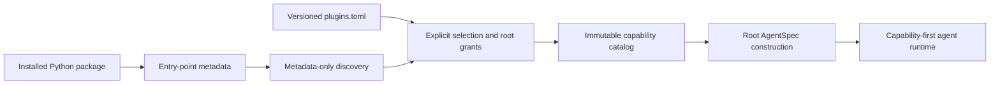

# Installable Capability Plugin Example

This example is a complete, installable Python distribution that contributes one
custom Pydantic AI capability to YA Agent SDK through package entry-point metadata.
It demonstrates the packaging boundary that an inline capability class cannot show.

The plugin itself depends only on Pydantic AI. `run.py` acts as the host: it verifies
metadata-only discovery, loads the SDK-owned `plugins.toml`, builds one immutable
catalog, applies the configured root grant to an `AgentSpec`, and executes the
contributed tool with `TestModel`.



## Run the example

From the repository root:

```bash
uv run --frozen --with-editable ./examples/capability_plugin \
  python ./examples/capability_plugin/run.py
```

The command installs this example distribution into an ephemeral uv environment layered
on the repository environment. It does not add the example to the monorepo workspace or
to the repository lockfile. `--frozen` protects the repository lockfile; uv may still
resolve or download the editable plugin's dependencies when they are not cached. The
example uses no model credentials and performs no network I/O after installation.

Expected output has this shape:

```text
Discovered metadata: example.text_metrics -> example_capability_plugin:TextMetricsCapability
Selected plugin: entry-point:ya-agent-sdk-capability-plugin-example@0.1.0:...
Agent result: {"text_metrics":{"characters":1,"words":1,"lines":1,"max_characters":5000,"truncated":false}}
```

`TestModel` generates deterministic placeholder tool arguments, so the counts are for
that generated argument rather than the sentence in the prompt. The reported
`max_characters` value proves that the serialized capability configuration reached the
tool instance. The important behavior is that the tool was reconstructed from
`AgentSpec` and invoked after entry-point selection.

## Package layout

```text
capability_plugin/
├── README.md
├── plugins.toml
├── pyproject.toml
├── run.py
└── src/
    └── example_capability_plugin/
        ├── __init__.py
        └── capability.py
```

`pyproject.toml` declares one entry point:

```toml
[project.entry-points."ya_agent_sdk.capabilities"]
"example.text_metrics" = "example_capability_plugin:TextMetricsCapability"
```

The entry-point name must exactly match the class serialization name:

```python
@classmethod
def get_serialization_name(cls) -> str:
    return "example.text_metrics"
```

One entry point maps to one `AbstractCapability` dataclass. A distribution may expose
multiple capability types by declaring multiple entry points.

## Host-side configuration

Installation only makes metadata discoverable. It does not import or grant the plugin.
This example uses the SDK's strict, versioned `plugins.toml` contract:

```toml
schema_version = 1
entry_points = ["example.text_metrics"]

[[capabilities]]
name = "example.text_metrics"
arguments = { max_characters = 5000 }
```

`entry_points` selects the exact installed types that the host may import.
`capabilities` appends configured instances to the root agent. The host loads the file
once and uses the same resolved snapshot for spec construction and runtime creation:

```python
plugins = load_capability_plugins(Path("plugins.toml"))
spec = plugins.apply_to_root_agent_spec(
    AgentSpec.from_dict({"name": "capability-plugin-example"})
)

runtime = create_agent(
    model,
    spec=spec,
    custom_capability_types=plugins.custom_capability_types,
)
```

A selected but ungranted type remains available for an explicitly configured named
child. Root grants never implicitly enter named children or self forks. Applications
that already import a capability class can pass it through
`resolve_capability_plugins(..., explicit_types=[TextMetricsCapability])` or
`build_default_capability_catalog(explicit_types=[TextMetricsCapability])`; direct
imports extend the catalog but do not satisfy manifest entry-point selection.

## Extension boundaries

A capability may contribute tools, instructions, model/request/history hooks, model
settings, run-local state, and native `CapabilityOrdering`. Keep live resources,
credentials, host services, and durable execution state outside the catalog and obtain
them through typed runtime dependencies.

Entry-point loading imports trusted Python code into the host process; it is not a
sandbox. Hosts must install only trusted distributions, use exact manifest selections,
and never ambiently load every installed plugin. Manifest arguments are durable,
non-secret configuration: secret-like keys, invalid TOML, unknown fields, missing
entry points, import failures, and collisions fail closed.

YAACLI loads this same format from the optional fixed path
`~/.yaacli/plugins.toml`. YA Claw loads it from the optional explicit
`YA_CLAW_CAPABILITY_PLUGIN_MANIFEST` path. In both cases, install the distribution into
the application's own Python environment and restart the process after changing the
package or manifest.
