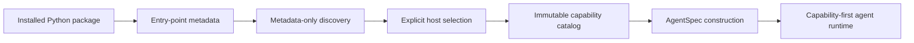

# Installable Capability Plugin Example

This example is a complete, installable Python distribution that contributes one
custom Pydantic AI capability to YA Agent SDK through package entry-point metadata.
It demonstrates the packaging boundary that an inline capability class cannot show.

The plugin itself depends only on Pydantic AI. `run.py` acts as the host: it discovers
installed metadata, explicitly selects the capability type, builds an immutable catalog,
parses an `AgentSpec`, and executes the contributed tool with `TestModel`.



## Run the example

From the repository root:

```bash
uv run --frozen --with-editable ./examples/capability_plugin \
  python ./examples/capability_plugin/run.py
```

The command installs this example distribution into an ephemeral uv environment layered
on the repository environment. It does not add the example to the monorepo workspace or
to the repository lockfile. The example uses no model credentials and performs no network I/O
once its Python dependencies are available.

Expected output has this shape:

```text
Discovered metadata: example.text_metrics -> example_capability_plugin:TextMetricsCapability
Selected plugin: entry-point:ya-agent-sdk-capability-plugin-example@0.1.0:...
Agent result: {"text_metrics":{"characters":1,"words":1,"lines":1}}
```

`TestModel` generates deterministic placeholder tool arguments, so the counts are for
that generated argument rather than the sentence in the prompt. The important behavior
is that the tool was reconstructed from `AgentSpec` and invoked after entry-point
selection.

## Package layout

```text
capability_plugin/
├── README.md
├── pyproject.toml
├── run.py
└── src/
    └── example_capability_plugin/
        ├── __init__.py
        └── capability.py
```

`pyproject.toml` declares one entry point:

```toml
[project.entry-points."ya_agent_sdk.capabilities"]
"example.text_metrics" = "example_capability_plugin:TextMetricsCapability"
```

The entry-point name must exactly match the class serialization name:

```python
@classmethod
def get_serialization_name(cls) -> str:
    return "example.text_metrics"
```

One entry point maps to one `AbstractCapability` dataclass. A distribution may expose
multiple capability types by declaring multiple entry points.

## Host-side selection

Installation only makes metadata discoverable. It does not import the plugin or grant it
to an agent. The host must select the installed type explicitly:

```python
references = discover_capability_types()  # Reads metadata without importing targets.

catalog = build_default_capability_catalog(
    selected_entry_points=["example.text_metrics"],
)
```

The selected catalog types are then supplied when a declarative agent is constructed:

```python
spec = AgentSpec.from_dict(
    {
        "capabilities": [
            {
                "example.text_metrics": {
                    "max_characters": 5_000,
                }
            }
        ]
    }
)

runtime = create_agent(
    model,
    spec=spec,
    custom_capability_types=catalog.custom_capability_types,
)
```

Applications that already import a capability class can bypass package discovery while
using the same catalog validation:

```python
catalog = build_default_capability_catalog(
    explicit_types=[TextMetricsCapability],
)
```

## Extension boundaries

A capability may contribute tools, instructions, model/request/history hooks, model
settings, run-local state, and native `CapabilityOrdering`. Keep live resources,
credentials, host services, and durable execution state outside the catalog and obtain
them through typed runtime dependencies.

Entry-point loading imports trusted Python code into the host process; it is not a
sandbox. Hosts should therefore use an explicit allowlist such as
`selected_entry_points`, never ambiently load every installed plugin.

YAACLI and YA Claw do not currently expose user configuration for selecting external
entry points. This example targets standalone SDK hosts and shows the contract those
durable hosts can adopt later without changing the plugin package.
