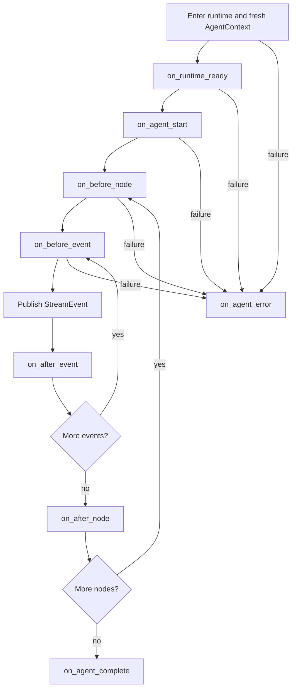

# 01 - Lifecycle Extensions

Status: Implemented

## Purpose

Lifecycle extensions attach host orchestration and observation to the SDK streaming
boundary without creating another behavior-composition system. Pydantic AI capabilities
remain the sole agent behavior boundary; lifecycle extensions observe or coordinate an
entered runtime and its stream.

Typical uses include:

- initializing a service integration after Environment entry;
- observing model nodes and stream events;
- recording terminal results and failures;
- consuming compact or handoff summaries for memory systems; and
- publishing telemetry that should not alter the agent's tool or instruction catalog.

## Composition Boundary

`create_agent()` accepts one ordered `capabilities=` sequence and an independent ordered
`lifecycle_extensions=` sequence:

```python
from ya_agent_sdk.agents.main import create_agent
from ya_agent_sdk.agents.lifecycle import BaseLifecycleExtension
from ya_agent_sdk.capabilities import RuntimeFoundationCapability


class AuditExtension(BaseLifecycleExtension):
    name = "audit"

    async def on_agent_complete(self, ctx) -> None:
        await write_audit_record(ctx.result)


runtime = create_agent(
    "openai-chat:gpt-4o",
    capabilities=[RuntimeFoundationCapability()],
    lifecycle_extensions=[AuditExtension()],
)
```

The two surfaces have different authority:

- capabilities own tools, instructions, history/request processing, wrappers, and
  run-local capability state;
- lifecycle extensions own host callbacks around `stream_agent()` and compact/handoff
  operations.

An extension must not mutate private Pydantic AI agent internals to simulate capability
composition.

## Extension Contract

`BaseLifecycleExtension[AgentDepsT, EnvT]` provides async no-op methods:

```python
class BaseLifecycleExtension:
    async def on_runtime_ready(self, ctx): ...
    async def on_agent_start(self, ctx): ...
    async def on_before_node(self, ctx): ...
    async def on_after_node(self, ctx): ...
    async def on_before_event(self, ctx): ...
    async def on_after_event(self, ctx): ...
    async def on_agent_complete(self, ctx): ...
    async def on_agent_error(self, ctx): ...
    async def on_context_handoff_complete(self, ctx): ...
    async def on_compact_start(self, ctx): ...
    async def on_compact_complete(self, ctx): ...
    async def on_compact_failed(self, ctx): ...
```

Extensions execute in registration order. Errors propagate; the SDK does not silently
log and continue. An optional telemetry integration that wants best-effort behavior must
catch and report its own failures.

The extension instances are runtime objects. They are copied onto each fresh
`AgentContext` run but are excluded from `ResumableState`; a restored host reconstructs
them from runtime configuration.

## Streaming Lifecycle

`stream_agent()` invokes extension methods and then the matching call-site hook at each
boundary:



The supported call-site hooks remain:

- `on_runtime_ready`
- `on_agent_start`
- `on_agent_complete`
- `pre_node_hook` and `post_node_hook`
- `pre_event_hook` and `post_event_hook`

Runtime extensions run first, in registration order, followed by the one call-site hook.
`on_agent_error` is extension-only and receives `AgentErrorContext` with the runtime,
agent metadata, output queue, and original exception.

`stream_agent()` creates a fresh per-run context and logical input router before these
callbacks. Extensions therefore observe native steering/enqueue behavior rather than a
MessageBus or replay cursor.

## Compact and Handoff Callbacks

Automatic compaction and summarize-tool handoff share a typed completion boundary:

```python
@dataclass
class ContextHandoffCompleteContext:
    event_id: str
    deps: AgentDepsT
    source: ContextHandoffSource
    original_messages: list[ModelMessage]
    trimmed_messages: list[ModelMessage]
    handoff_messages: list[ModelMessage]
    summary_markdown: str
    usage: RunUsage | None
    metadata: dict[str, Any]
```

`ContextHandoffSource` is `COMPACT` or `SUMMARIZE_TOOL`.
`CompactCompleteContext` extends this value with `compacted_messages` and the optional
structured `condense_result`. Start and failure callbacks receive
`CompactStartContext` and `CompactFailedContext` respectively.

The ordering on successful automatic compact is:

1. `on_compact_start`;
2. compact execution and history replacement;
3. `on_context_handoff_complete`;
4. `on_compact_complete`;
5. filter-local `CompactLifecycleCallback` values;
6. typed compact completion event for stream consumers.

On failure, `on_compact_failed` runs before the failed sideband event is emitted.
Summarize-tool handoff invokes `on_context_handoff_complete` with the same canonical
history views.

Memory integrations should consume `trimmed_messages` and `summary_markdown` rather
than scraping display events. `handoff_messages` is the canonical replacement history;
stream events are notification only.

## Cache-Friendly Compact Invariant

Cache-friendly compact reuses the active agent but disables tools for the compact model
request with `ModelSettings(tool_choice="none")`. Pydantic AI performs the normal model
settings merge, so provider settings, prompt-cache fields, headers, and model-specific
values remain intact. Extensions may observe this operation but must not reconstruct or
replace that settings merge.

## Non-goals

Lifecycle extensions do not provide:

- a second tool, toolset, filter, or capability registration path;
- portable child-agent construction or background execution;
- durable scheduling, exactly-once delivery, or session persistence;
- hidden error suppression policies; or
- cross-run MessageBus delivery.

Portable named children and self forks use `AgentSpec`, `SubagentSpec`,
`SubagentPlanResolver`, and `SubagentExecutionService`. Durable hosts implement their
own execution store/driver and input delivery at the application boundary.

## Verification Contract

The SDK tests must cover:

- ordered runtime extension and call-site hook execution;
- fresh-run context attachment;
- error propagation and `on_agent_error` notification;
- compact start, complete, failure, and shared handoff callbacks;
- filter-local compact callbacks;
- TestModel execution through `stream_agent()`; and
- cache-friendly compact preserving native settings merge while forcing
  `tool_choice="none"`.
