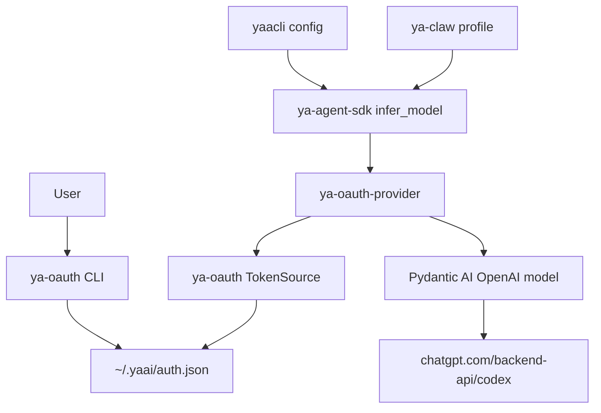

# OAuth-backed Codex Provider

## Goal

YA provides a reusable OAuth path for users who want to run agents with their own ChatGPT/Codex subscription. The implementation is split into three packages:

- `ya-oauth`: OAuth login, refresh, logout, token storage, and CLI.
- `ya-oauth-provider`: Pydantic AI model/provider helpers that consume `ya-oauth` token sources.
- `ya-agent-sdk`: model string integration, runtime session headers, and SDK-level assembly.

YAACLI and YA Claw expose this through configuration and documentation.

## User Flow

```bash
ya-oauth login codex
```

The CLI uses the Codex device-code login flow, stores credentials in `~/.yaai/auth.json`, and can refresh them later.

SDK users can run:

```python
from ya_agent_sdk.agents.main import create_agent

async with create_agent("oauth@codex:gpt-5.5") as runtime:
    result = await runtime.agent.run("Hello", deps=runtime.ctx)
    print(result.output)
```

YAACLI config:

```toml
[general]
model = "oauth@codex:gpt-5.5"
model_settings = "openai_responses_high"
model_cfg = "gpt5_350k"
```

YA Claw profile:

```yaml
version: 2
profiles:
  - schema_version: 2
    name: codex-oauth
    agent:
      model: oauth@codex:gpt-5.5
      name: codex-oauth
      model_settings:
        openai_reasoning_effort: high
      capabilities:
        - FilesystemCapability
        - ShellCapability
    host:
      model_config_preset: gpt5_350k
      tool_groups: [session]
    subagents: []
```

## Package Responsibilities



### `ya-oauth`

- Owns `~/.yaai/auth.json`.
- Implements file locking and atomic writes.
- Provides `OAuthStore`, `OAuthTokenRecord`, and store-backed token sources.
- Provides Codex login, refresh, revoke/logout, status, and doctor commands.

### `ya-oauth-provider`

- Owns OAuth-to-Pydantic-AI model assembly.
- Consumes any `OAuthTokenSource` that can provide and refresh access tokens.
- Adds provider-specific headers such as `ChatGPT-Account-ID`.
- Adds SDK-provided session headers.
- Refreshes on 401 and retries once.

### `ya-agent-sdk`

- Parses `oauth@provider:model` strings.
- Lazy imports `ya-oauth-provider` for OAuth-backed models.
- Passes model extra headers from `AgentContext` into `infer_model()`.
- Keeps package dependency optional through an `oauth` extra.

## Codex Reference Details

The implementation should stay aligned with OpenAI Codex. The checked reference source is under the local research checkout:

- `/tmp/ya_agent_yfdq7chm/codex/codex-rs/login/src/device_code_auth.rs`
- `/tmp/ya_agent_yfdq7chm/codex/codex-rs/login/src/server.rs`
- `/tmp/ya_agent_yfdq7chm/codex/codex-rs/login/src/auth/manager.rs`
- `/tmp/ya_agent_yfdq7chm/codex/codex-rs/model-provider/src/bearer_auth_provider.rs`
- `/tmp/ya_agent_yfdq7chm/codex/codex-rs/codex-api/src/requests/headers.rs`

Codex constants and endpoints:

```text
issuer = https://auth.openai.com
client_id = app_EMoamEEZ73f0CkXaXp7hrann
device_user_code_endpoint = https://auth.openai.com/api/accounts/deviceauth/usercode
device_token_endpoint = https://auth.openai.com/api/accounts/deviceauth/token
token_endpoint = https://auth.openai.com/oauth/token
revoke_endpoint = https://auth.openai.com/oauth/revoke
codex_base_url = https://chatgpt.com/backend-api/codex
```

Device code request:

```http
POST /api/accounts/deviceauth/usercode
Content-Type: application/json

{"client_id":"app_EMoamEEZ73f0CkXaXp7hrann"}
```

Device token poll:

```http
POST /api/accounts/deviceauth/token
Content-Type: application/json

{"device_auth_id":"...","user_code":"..."}
```

Token exchange after device authorization:

```http
POST /oauth/token
Content-Type: application/x-www-form-urlencoded

grant_type=authorization_code&code=...&redirect_uri=https%3A%2F%2Fauth.openai.com%2Fdeviceauth%2Fcallback&client_id=...&code_verifier=...
```

The polling response supplies `authorization_code`, `code_challenge`, and `code_verifier`. The redirect URI for device code exchange is:

```text
https://auth.openai.com/deviceauth/callback
```

Refresh request:

```http
POST /oauth/token
Content-Type: application/json

{
  "client_id": "app_EMoamEEZ73f0CkXaXp7hrann",
  "grant_type": "refresh_token",
  "refresh_token": "..."
}
```

Codex auth file shape uses `tokens.id_token`, `tokens.access_token`, `tokens.refresh_token`, `tokens.account_id`, and `last_refresh`.

## Token Store Schema

`~/.yaai/auth.json` stores providers by name:

```json
{
  "version": 1,
  "providers": {
    "codex": {
      "type": "oauth2",
      "issuer": "https://auth.openai.com",
      "client_id": "app_EMoamEEZ73f0CkXaXp7hrann",
      "token_endpoint": "https://auth.openai.com/oauth/token",
      "revoke_endpoint": "https://auth.openai.com/oauth/revoke",
      "base_url": "https://chatgpt.com/backend-api/codex",
      "scopes": ["openid", "profile", "email", "offline_access", "api.connectors.read", "api.connectors.invoke"],
      "tokens": {
        "id_token": "...",
        "access_token": "...",
        "refresh_token": "..."
      },
      "account": {
        "email": "user@example.com",
        "chatgpt_user_id": "user_...",
        "chatgpt_account_id": "acct_...",
        "chatgpt_plan_type": "plus",
        "chatgpt_account_is_fedramp": false
      },
      "last_refresh_at": "2026-05-13T03:00:00Z"
    }
  }
}
```

## Request Headers

`ya-oauth-provider` attaches:

```http
Authorization: Bearer <access_token>
ChatGPT-Account-ID: <chatgpt_account_id>
X-OpenAI-Fedramp: true
originator: ya_agent_sdk
session_id: <session_id>
session-id: <session_id>
x-session-id: <session_id>
thread_id: <thread_id>
thread-id: <thread_id>
x-client-request-id: <thread_id>
```

`X-OpenAI-Fedramp` is attached only when the account metadata carries `chatgpt_account_is_fedramp = true`. The provider intentionally omits Codex's `version` header by default so YA package versions are not treated as Codex CLI release versions.

OAuth Codex requests additionally project backend-routing headers from the effective
request:

```http
x-codex-routing-hint: model=<model>
x-codex-routing-hint: model=<model>;tier=<service-tier>
```

The tier suffix is present only when `openai_service_tier` or the unified
`service_tier` setting is selected. This projection is specific to the ChatGPT/Codex
OAuth backend and is not applied to generic OpenAI Responses models.

## Turn State

The OAuth Codex model owns a first-write-wins `x-codex-turn-state` cell for each
Pydantic AI run ID. The first value can arrive in an HTTP streaming response header,
a WebSocket upgrade response header, or a WebSocket `response.metadata.headers`
event. Later values in the same run cannot replace it, and a different run ID starts
without state.

Subsequent HTTP requests in the same run send the value as the
`x-codex-turn-state` header. Subsequent WebSocket `response.create` messages send it
as `client_metadata["x-codex-turn-state"]`, matching the current Codex WebSocket
protocol. WebSocket-to-HTTP fallback shares the same run-scoped cell. Generic
`openai-responses:*` and `openai-responses-ws:*` models do not implement this OAuth
backend contract.

## SDK Session Headers

`AgentContext.get_model_extra_headers()` returns the provider session and thread headers
for the active execution context. Unless a host overrides it, `provider_session_id` is
initialized once from the context's initial `run_id` and survives `prepare_new_run()`;
native run IDs remain fresh unless `provider_thread_id` explicitly pins the thread.
Consequently, the default `x-session-id` is stable for the context lifetime without
collapsing distinct native runs. Every SDK child context instead binds both provider IDs
to its root child execution ID, keeping the child separate from its main agent and
stable across linked continuation. Durable hosts bind equivalent identities explicitly:
YAACLI uses its durable `session_id` for the main provider session/thread and the root
child execution ID for each child provider session/thread. YA Claw uses the main or
child durable session ID for `provider_session_id` and each durable run ID for
`provider_thread_id`; resumed Claw child executions reuse their existing child session.

For context-header transports, request model settings are derived from the active
`RunContext` on every model call rather than frozen when `create_agent()` constructs a
reusable runtime. All provider session/thread header aliases are replaced together. If
the model configuration declares `ModelFeature.openai_prompt_cache_key`, the same step
binds `openai_prompt_cache_key` to the current `x-session-id` and removes a conflicting
request-body `prompt_cache_key`.

## Implementation Order

1. Add workspace members `packages/ya-oauth` and `packages/ya-oauth-provider`.
2. Implement store, Codex login, refresh, logout, status, and doctor in `ya-oauth`.
3. Implement OAuth Pydantic AI provider assembly in `ya-oauth-provider`.
4. Add `oauth@` parsing in `ya-agent-sdk` and pass context model headers.
5. Add README/config/profile docs for SDK, YAACLI, and YA Claw.
6. Add tests for auth schema, Codex refresh, header injection, and model parsing.
7. Run account-backed verification after implementation.
