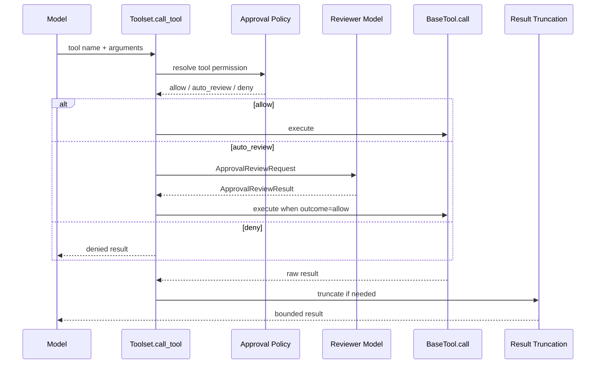
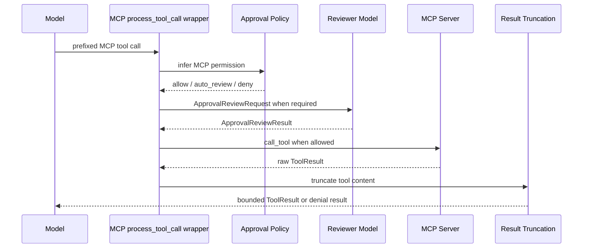

# 03 - Approval Review

`ya-agent-sdk` should provide a first-class approval review system for tool and MCP execution.

The goal is to let agent runtimes classify tool calls, send risky calls to an automatic reviewer, and apply a strict allow or deny decision before execution. The design follows the Codex-style runtime approval review pattern while keeping YA-specific toolsets, MCP servers, tool proxying, and Claw profiles aligned.

## Current State

The SDK already has these pieces:

- `BaseTool.tags` and `superseded_by_tags` describe capability replacement.
- `AgentContext.need_user_approve_tools` and `need_user_approve_mcps` trigger Pydantic AI HITL approval.
- `Toolset.call_tool(...)` is the central execution boundary for SDK tools.
- MCP servers are built in `ya_agent_sdk.mcp` and can use a `process_tool_call` callback.
- `ToolProxyToolset._execute_call(...)` proxies dynamic tools through a stable two-tool surface.
- Shell execution uses the same `Toolset.call_tool(...)` approval review boundary as other protected tools.

These pieces provide useful hooks. Approval review turns them into one generic SDK policy surface that covers tools, MCP calls, and proxied execution.

## Goals

- Classify tool and MCP calls through explicit permission metadata.
- Keep capability tags focused on discovery and replacement.
- Apply a three-action runtime policy: `allow`, `auto_review`, `deny`.
- Use a separate reviewer model for risky tool calls.
- Use a closed-deny fallback when reviewer execution, parsing, or validation fails.
- Give the reviewer compact context plus the exact pending action JSON.
- Cover SDK tools, MCP tools, and tool-proxy calls through one policy model.
- Truncate large tool results centrally before they flow back into the agent loop.
- Preserve existing HITL paths as user-approval inputs.
- Make YA Claw profile configuration map cleanly to SDK security config.

## Scope Boundaries

This spec focuses on runtime approval review for tool execution. Product surfaces such as PR review workflow, approval inbox UX, browser permission prompts, desktop permission prompts, and distributed policy services belong in product-level specs.

## Concepts

### Capability Tags

`BaseTool.tags` remains a capability mechanism.

Examples:

- `shell`
- `fileops`
- `search`
- `task-manager`

Tags answer this question: what capability does this tool provide?

### Permission Metadata

`BaseTool.permission` describes security-relevant behavior.

Permission metadata answers these questions:

- What kind of action can this tool perform?
- What scope can it affect?
- Which source provides the tool?
- What default policy applies before runtime inference?

### Runtime Inference

Static metadata is the baseline. Runtime inference can refine the decision from call arguments.

Examples:

- A file tool may be `read` by default and become `credential` when reading likely secret files.
- A file tool may be `write` by default and become `destructive` when deleting broad paths.
- A shell tool may inspect the command and classify network, destructive, or credential behavior.
- An MCP server may infer scope from transport, namespace, tool name, and arguments.

### Reviewer Decision

The reviewer makes the final allow or deny decision for `auto_review` calls. It returns structured output with risk, user authorization, outcome, and rationale.

## Data Model

### Enums

```python
from enum import StrEnum

class ToolSource(StrEnum):
    BUILTIN = "builtin"
    MCP = "mcp"
    SUBAGENT = "subagent"
    SKILL = "skill"
    USER = "user"

class ToolCategory(StrEnum):
    READ = "read"
    WRITE = "write"
    EXECUTE = "execute"
    NETWORK = "network"
    DESTRUCTIVE = "destructive"
    CREDENTIAL = "credential"
    EXTERNAL_INTEGRATION = "external_integration"
    CONTEXT_MANAGEMENT = "context_management"
    DELEGATION = "delegation"

class ToolScope(StrEnum):
    WORKSPACE = "workspace"
    SESSION = "session"
    LOCAL_SYSTEM = "local_system"
    NETWORK = "network"
    EXTERNAL_SERVICE = "external_service"

class PermissionDecision(StrEnum):
    ALLOW = "allow"
    AUTO_REVIEW = "auto_review"
    DENY = "deny"

class ApprovalReviewOutcome(StrEnum):
    ALLOW = "allow"
    DENY = "deny"

class ApprovalRiskLevel(StrEnum):
    LOW = "low"
    MEDIUM = "medium"
    HIGH = "high"
    EXTRA_HIGH = "extra_high"

class UserAuthorizationLevel(StrEnum):
    EXPLICIT = "explicit"
    IMPLIED = "implied"
    MISSING = "missing"
    CONFLICTING = "conflicting"
```

### ToolPermissionProfile

```python
from pydantic import BaseModel, Field

class ToolPermissionProfile(BaseModel):
    source: ToolSource = ToolSource.BUILTIN
    categories: frozenset[ToolCategory] = Field(default_factory=frozenset)
    scopes: frozenset[ToolScope] = Field(default_factory=frozenset)
    default_decision: PermissionDecision = PermissionDecision.ALLOW
    rationale: str = ""
    metadata: dict[str, object] = Field(default_factory=dict)
```

Suggested presets:

```python
ToolPermissionProfile.read_workspace()
ToolPermissionProfile.write_workspace()
ToolPermissionProfile.execute_local_system()
ToolPermissionProfile.network_external()
ToolPermissionProfile.context_management()
ToolPermissionProfile.delegation()
```

### MCP Permission Metadata

```python
class McpPermissionProfile(BaseModel):
    server_name: str
    transport: str
    default_decision: PermissionDecision = PermissionDecision.AUTO_REVIEW
    categories: frozenset[ToolCategory] = Field(default_factory=frozenset)
    scopes: frozenset[ToolScope] = Field(default_factory=frozenset)
    tool_overrides: dict[str, ToolPermissionProfile] = Field(default_factory=dict)
    metadata: dict[str, object] = Field(default_factory=dict)
```

Default MCP classification should be conservative:

- `stdio` servers: `external_integration`, `local_system`
- `streamable_http` servers: `external_integration`, `network`, `external_service`
- tool names containing read/list/get/search/fetch: add `read`
- tool names containing write/create/update/delete/remove/run/exec: add `write`, `execute`, or `destructive` as applicable
- server-level profile overrides win over name heuristics

### ApprovalReviewRequest

```python
class ApprovalReviewRequest(BaseModel):
    request_id: str
    run_id: str | None = None
    agent_id: str | None = None
    tool_call_id: str | None = None
    source: ToolSource
    tool_name: str
    tool_args: dict[str, object]
    permission: ToolPermissionProfile
    mcp_server: str | None = None
    mcp_tool: str | None = None
    user_goal: str | None = None
    recent_context: list[dict[str, object]] = Field(default_factory=list)
    metadata: dict[str, object] = Field(default_factory=dict)
```

The request includes the exact pending action JSON. The reviewer receives the same action payload that the runtime will execute after approval.

### ApprovalReviewResult

```python
class ApprovalReviewResult(BaseModel):
    request_id: str
    outcome: ApprovalReviewOutcome
    risk_level: ApprovalRiskLevel
    authorization: UserAuthorizationLevel
    rationale: str
    metadata: dict[str, object] = Field(default_factory=dict)
```

A reviewer execution failure produces a synthetic deny result:

```python
ApprovalReviewResult(
    request_id=request.request_id,
    outcome=ApprovalReviewOutcome.DENY,
    risk_level=ApprovalRiskLevel.EXTRA_HIGH,
    authorization=UserAuthorizationLevel.MISSING,
    rationale="Approval reviewer used closed-deny fallback.",
)
```

## Public SDK API

### BaseTool

```python
class BaseTool(ABC):
    permission: ToolPermissionProfile = ToolPermissionProfile.read_workspace()

    def resolve_permission(
        self,
        ctx: RunContext[AgentContext],
        args: dict[str, object],
    ) -> ToolPermissionProfile:
        return self.permission
```

Tools can keep class-level static metadata and override `resolve_permission(...)` for argument-sensitive classification.

Example:

```python
class ShellExecTool(BaseTool):
    name = "shell_exec"
    description = "Execute a shell command."
    tags = frozenset({"shell"})
    permission = ToolPermissionProfile(
        categories=frozenset({ToolCategory.EXECUTE}),
        scopes=frozenset({ToolScope.LOCAL_SYSTEM, ToolScope.WORKSPACE}),
        default_decision=PermissionDecision.AUTO_REVIEW,
        rationale="Shell commands can affect the local workspace and host environment.",
    )

    def resolve_permission(self, ctx, args):
        command = str(args.get("command") or "")
        profile = self.permission
        if "rm -rf" in command or "delete" in command:
            profile = profile.with_categories(ToolCategory.DESTRUCTIVE)
        return profile
```

### SecurityConfig

```python
class ApprovalReviewConfig(BaseModel):
    enabled: bool = False
    model: str | Model | None = None
    model_settings: str | dict[str, object] | None = None
    prompt: str | None = None
    timeout_seconds: float = 30.0
    max_denials: int = 3
    include_recent_messages: int = 12
    truncation: ToolResultTruncationConfig = Field(default_factory=ToolResultTruncationConfig)
    mcp_permissions: dict[str, McpPermissionProfile] = Field(default_factory=dict)

class SecurityConfig(BaseModel):
    approval_review: ApprovalReviewConfig | None = None

    @classmethod
    def auto_review(
        cls,
        *,
        reviewer_model: str | Model,
        model_settings: str | dict[str, object] | None = None,
        prompt: str | None = None,
        timeout_seconds: float = 30.0,
        max_denials: int = 3,
        truncation: ToolResultTruncationConfig | None = None,
        mcp_permissions: dict[str, McpPermissionProfile] | None = None,
    ) -> "SecurityConfig": ...
```

`SecurityConfig.auto_review(...)` is the preferred adoption path for SDK users.

### Reviewer Interface

```python
from typing import Protocol

class ApprovalReviewer(Protocol):
    async def review(
        self,
        ctx: AgentContext,
        request: ApprovalReviewRequest,
    ) -> ApprovalReviewResult: ...
```

The SDK should ship a model-backed reviewer implementation:

```python
class ModelApprovalReviewer:
    def __init__(self, config: ApprovalReviewConfig): ...

    async def review(self, ctx, request): ...
```

The reviewer prompt should include:

- user goal and recent steering
- compact recent transcript
- current workspace context when available
- recent approval review records
- exact pending action JSON
- strict JSON schema instructions

The reviewer output schema should be parsed through Pydantic. Parse errors produce a closed-deny fallback.

## Runtime Flow

### SDK Tool Call



Policy resolution order:

1. `ctx.tool_call_approved` bypass for already-approved Pydantic AI deferred calls
2. global and tool pre-hooks produce the final execution arguments
3. tool `resolve_permission(ctx, args)`
4. runtime classifier refinement
5. permission `default_decision`
6. reviewer for `auto_review`
7. denial circuit breaker

A deny result should be returned to the model as a normal tool result with a clear instruction:

```text
Tool call denied by approval review. Continue with a safe alternative plan that respects the denied boundary.
```

This keeps the agent loop active while preserving the boundary.

### MCP Tool Call

MCP uses a wrapper around `process_tool_call`.



MCP wrapper inputs:

- server name
- server transport
- MCP config metadata
- optional `McpPermissionProfile`
- tool name and arguments
- `call_tool` callback

The wrapper should support server-level and tool-level overrides. It should preserve pydantic-ai control flow for HITL approval.

### Tool Proxy

`ToolProxyToolset._execute_call(...)` delegates to the underlying toolset. The underlying toolset should run approval review for SDK tools. The proxy path should still apply result truncation around proxied outputs because dynamic tool results can be large.

Proxy metadata should include:

- proxy tool call name: `call_tool`
- underlying tool name
- namespace id when available
- underlying tool permission when available

## Output Truncation

Large tool outputs should be bounded centrally.

```python
class ToolResultTruncationConfig(BaseModel):
    enabled: bool = True
    max_text_chars: int = 60000
    head_chars: int = 30000
    tail_chars: int = 20000
    max_json_chars: int = 60000
    marker: str = "\n\n[Tool output truncated: {omitted_chars} characters omitted]\n\n"
```

Rules:

- Strings are truncated by head and tail.
- JSON-like structures are serialized with stable defaults and truncated as text when required.
- MCP text content is truncated per content item and may also apply an aggregate cap.
- Binary or media content is represented through metadata and size summaries when a text representation would exceed limits.
- Denial messages are small and pass through unchanged.

Truncation should happen after execution and after post-hooks that intentionally transform the result. Products can lower limits through `SecurityConfig.auto_review(..., truncation=...)`.

## Denial Circuit Breaker

`AgentContext` should keep recent approval review records for the current run.

```python
approval_review_records: deque[ApprovalReviewResultRecord]
```

When a run accumulates `max_denials` denied review results, subsequent `auto_review` requests can be denied immediately with a circuit breaker rationale. This prevents repeated attempts around the same protected boundary.

The reviewer prompt should include recent records so repeated equivalent requests become easier to classify.

## Claw Integration

YA Claw should expose this through profile security configuration.

Example profile YAML:

```yaml
security:
  approval_review:
    enabled: true
    model: oauth@codex:gpt-5.5
    timeout_seconds: 30
    max_denials: 3
    truncation:
      enabled: true
      max_text_chars: 60000
    mcp_permissions:
      filesystem:
        default_decision: auto_review
        categories: [read, write]
        scopes: [workspace]
      github:
        default_decision: auto_review
        categories: [external_integration, network, write]
        scopes: [external_service]
```

Claw runtime assembly responsibilities:

- parse `security.approval_review` from profiles
- convert YAML values into SDK `SecurityConfig`
- pass the security config into `ClawAgentContext`
- build MCP servers with the approval review wrapper enabled
- include Claw run/session identifiers in review requests
- project approval review results into run trace and live events
- continue to accept `need_user_approve_tools` and `need_user_approve_mcps` fields for explicit user approval
- use approval review for shell tools and other protected tool boundaries

Trace projection should include:

- request id
- tool name
- source
- categories and scopes
- decision path
- reviewer outcome
- risk level
- authorization level
- concise rationale

Tool arguments may contain sensitive content. Trace storage should redact values using the same policy used for tool-call trace projections.

## Delivery Plan

### Phase 1: SDK Foundation

- Add `ya_agent_sdk.security.approval` models and helpers.
- Add `BaseTool.permission` and `BaseTool.resolve_permission(...)`.
- Add `SecurityConfig.approval_review` and `SecurityConfig.auto_review(...)`.
- Add approval review records to `AgentContext` current-run state.
- Add result truncation helper.

### Phase 2: Execution Integration

- Wire approval review into `Toolset.call_tool(...)`.
- Add model-backed reviewer implementation.
- Add MCP `process_tool_call` wrapper.
- Add truncation to SDK tool results, MCP results, and `ToolProxyToolset._execute_call(...)`.
- Keep explicit HITL approval paths active.

### Phase 3: Claw Profile Integration

- Add Claw profile parsing for `security.approval_review`.
- Pass resolved approval config into runtime assembly.
- Update seeded profiles.
- Add run trace projections for approval review records.

### Phase 4: Removal of shell-specific review surface

- Remove shell-specific review config, helpers, tests, and eval artifacts.
- Express shell command review through generic tool permission metadata and approval review.
- Move shell tool reviewer prompt guidance into generic reviewer context.

## Testing Plan

SDK tests:

- static permission metadata on `BaseTool`
- runtime permission override through `resolve_permission(...)`
- allow decision executes tool directly
- deny decision returns denial result
- auto-review allow executes tool
- auto-review deny blocks execution
- reviewer timeout and parse failure produce closed-deny fallback
- denial circuit breaker activates after configured threshold
- string and JSON result truncation
- MCP permission inference and overrides
- ToolProxy result truncation

Claw tests:

- profile YAML parses `security.approval_review`
- runtime builder constructs SDK `SecurityConfig`
- MCP build path receives review config
- run trace contains approval review projection
- approval review configuration is the only security review path

## Documentation Updates

When implementation lands, update:

- `packages/ya-agent-sdk/README.md`
- `skills/agent-builder/toolset.md`
- `skills/agent-builder/SKILL.md`
- `packages/ya-claw/profiles.yaml`
- `packages/ya-claw/spec/06-runtime-assembly.md`
- `packages/ya-claw/README.md` if profile security configuration changes
