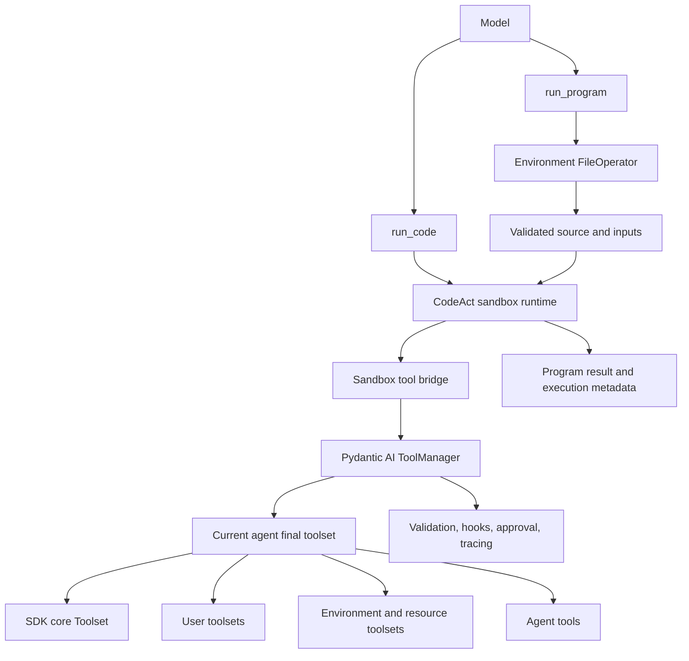

# 03 - CodeAct Programs

Status: Implemented

## Summary

YA Agent SDK should support CodeAct as two related execution surfaces:

1. **Inline CodeAct** executes model-authored code for one-off orchestration during an agent run.
2. **CodeAct programs** execute parameterized source files from the workspace in a fresh sandbox so a useful orchestration can be reviewed, versioned, and run again.

Both surfaces expose only tools that explicitly opt into CodeAct and that are currently available to the executing agent. Every nested tool call must go through Pydantic AI's `ToolManager`; CodeAct must not introduce a second tool router or bypass SDK hooks, approval, availability, subagent filtering, or tracing.

A program replay means **a new execution of the saved logic against current state**. It is not playback of recorded outputs, a transaction, an exactly-once guarantee, or automatic resumption from a prior failure.

The initial implementation uses a YA-owned Pydantic AI toolset wrapper and Monty. It depends only on public Pydantic AI and Monty APIs. Harness is an MIT-licensed reference for the snapshot execution loop, not a runtime dependency or public architecture boundary.

## Motivation

A model often spends several model round trips performing a sequence that could be expressed as a small program:

- search several sources concurrently, filter results, then fetch only the useful pages
- inspect multiple files and aggregate matching records
- query several toolsets and join the returned data
- perform a repeatable computer-use routine with state checks
- run the same operational checklist with different inputs

Inline CodeAct reduces model round trips. A file-backed program adds reuse:

```text
prototype inline code
-> verify the behavior
-> parameterize it
-> save it as a workspace file
-> execute it later with new inputs
```

The durable artifact is source code. Execution metadata is separate trace evidence; it becomes an immutable audit record only when a host retains the exact source and trace in an immutable store.

### Why not replay a recorded call list?

A recorded macro is useful only when arguments and ordering are static. It does not naturally preserve data dependencies, branching, concurrency, state checks, or recovery logic. Replaying captured computer coordinates is especially brittle.

A new declarative DAG format could represent more structure, but it would add another language, validator, serializer, and versioning surface. A restricted Python program already expresses the required control flow and can be reviewed with normal developer tools.

YA may later offer a model-assisted "promote trace to program" action, but that action should produce explicit source for review rather than treating a historical trace as executable authority.

## Terminology

| Term | Meaning |
| --- | --- |
| CodeAct | Model-authored code that invokes host tools through a restricted sandbox bridge. |
| nested tool call | A host tool call initiated by sandboxed code rather than emitted directly by the model. |
| inline execution | An ad hoc `run_code` call whose source is included in the tool arguments. |
| program | A parameterized source file executed through the CodeAct runtime. |
| program replay | A fresh execution of a saved program. Nested tools run again. |
| trace replay | Rendering or inspecting a historical execution without executing its tools again. |
| resume | Continuing a suspended interpreter from a checkpoint. Resume is not part of the initial program contract. |
| catalog fingerprint | A digest of the names and schemas of the tools exposed to one CodeAct execution. |

## Goals

- Let code orchestrate tools from multiple toolsets in one model tool call.
- Let an agent save useful orchestration code to the workspace and run it again.
- Make reusable programs parameterized, reviewable, versionable, and auditable.
- Use one explicit tool-level flag to opt tools into CodeAct.
- Preserve the final per-agent tool boundary, including subagent filtering.
- Preserve validation, hooks, approval, capability hooks, sequential execution, and instrumentation.
- Fail closed on missing tools, ambiguous names, incompatible schemas, or unavailable policy handlers.
- Keep inline and file-backed execution simple enough for an initial implementation.
- Support stateful tools such as computer-use tools without claiming that replay is transactional or idempotent.

## Non-goals

The first version does not provide:

- full CPython or arbitrary third-party packages
- ambient host filesystem, network, environment, process, or clock access from sandbox code
- deterministic replay of external systems
- automatic replay of recorded tool calls
- exactly-once nested tool execution
- rollback of completed nested tool calls
- cross-run interpreter persistence
- suspension and later restoration of a Monty frame across YA deferred-result runs
- a general workflow scheduler or DAG engine
- automatic conversion of every successful trace into a safe reusable program

## Core Design Decisions

### 1. Source is durable; interpreter state is not

A reusable automation is a source file plus explicit JSON-compatible inputs. Each `run_program` call starts from a fresh sandbox.

This avoids hidden dependencies on variables left by an earlier conversation turn and gives file-backed programs a clear replay contract.

Inline `run_code` may preserve REPL state between calls within one agent run. That state is discarded when the run ends.

### 2. Program execution and trace replay are different operations

Running a program executes current tools against current external state. Inspecting an old trace does not execute anything.

The SDK must not call program execution "deterministic replay". Products may use labels such as "run again" or "re-execute" in user-facing interfaces.

### 3. CodeAct eligibility is explicit and deny-by-default

A tool is not callable from CodeAct merely because the model can call it directly. Tool authors or toolset assemblers must opt it in.

Eligibility is not an authorization grant and does not imply that the tool is read-only, deterministic, idempotent, or safe to retry.

### 4. Current agent policy is always authoritative

A saved program names capabilities; it does not carry capabilities. On every execution, the program receives the intersection of:

- tools present in the executing agent's final toolset
- tools currently available in its `RunContext`
- tools allowed by main-agent/subagent policy
- tools explicitly marked CodeAct-eligible
- tools allowed by the active CodeAct configuration

A program cannot restore a tool that the current agent does not have.

### 5. Nested calls use the standard Pydantic AI dispatch path

The sandbox bridge must construct nested `ToolCallPart` values and invoke them through a `ToolManager` tied to the wrapped final toolset.

It must not call `BaseTool.call()` directly, depend on `ToolProxyToolset` caches, or implement a parallel routing policy.

### 6. Re-execution is never implicit after side effects begin

Syntax and static type failures that happen before the first nested call may be retried according to normal tool retry policy.

Once any nested call has started, the CodeAct runtime must not automatically re-run the whole program. A failure returns a partial execution record to the model. A subsequent execution requires a new explicit `run_program` or `run_code` call.

This rule limits accidental duplication when programs contain mutating tools.

## Architecture



The capability or wrapper must be applied independently to each agent after that agent's own tool filtering. A main agent, named subagent, and self fork must not share one main-agent tool catalog.

## Tool Eligibility Contract

### SDK `BaseTool` flag

Add one class-level flag to `BaseTool`:

```python
class BaseTool(ABC):
    codeact: bool = False
    """Whether this tool may be invoked from CodeAct sandbox code."""
```

Example:

```python
class ScreenshotTool(BaseTool):
    name = "computer_screenshot"
    description = "Capture the current computer screen."
    codeact = True

    async def call(self, ctx: RunContext[AgentContext]) -> Screenshot: ...
```

The flag defaults to `False` for backwards compatibility and least privilege.

The SDK `Toolset` copies the declaration into `ToolDefinition.metadata`:

```python
{
    "codeact": True,
}
```

The effective metadata must be attached after `prepare_tool_def()` without dropping metadata already supplied by Pydantic AI or another wrapper.

The CodeAct selector uses this metadata:

```python
CodeMode(tools={"codeact": True})
```

### Semantics

`codeact=True` means only:

> The tool author supports invoking this tool programmatically from restricted CodeAct code, subject to all normal runtime checks.

It does not mean:

- bypass approval
- bypass `is_available()`
- inherit into subagents
- allow a subagent to access a main-agent-only tool
- safe to retry
- read-only
- deterministic
- transaction-safe

`is_available(ctx)` remains authoritative when the current step's tool catalog is assembled. `main_agent_only`, SDK hooks, toolset wrappers, and host policy remain authoritative at their normal listing and call boundaries. A tool whose availability can change during one long program must also enforce that volatile condition inside its own call path; CodeAct does not make `is_available()` a per-nested-call check.

### External toolsets

Non-SDK toolsets opt in by attaching the same `ToolDefinition.metadata["codeact"] = True` declaration, for example through Pydantic AI metadata wrappers.

The CodeAct selector must not infer eligibility from tool name, namespace, MCP origin, description text, or whether the tool appears read-only.

Host toolset assemblers may explicitly attach the metadata as a product policy. In particular, YA's host-managed `NamedMCPToolset` marks its actual MCP tools `codeact=True` by default. This is an explicit MCP builder policy, not selector inference. Provider-native MCP does not pass through this bridge, and proxy mode exposes only its generic proxy calls if those calls are explicitly marked.

### Dynamic eligibility

The initial contract uses a static declaration plus existing dynamic availability. It does not add a second `is_codeact_available(ctx)` hook.

If a future use case requires context-dependent CodeAct eligibility that cannot be represented by final tool metadata, it can add a `prepare_tool_def`-style policy later. The first version should avoid duplicating `is_available()`.

### Recommended initial classifications

Likely candidates for `codeact=True`:

- read-only search, list, get, view, glob, and grep tools
- deterministic conversion and parsing tools
- idempotent query APIs
- computer-use observation tools
- computer-use action tools whose owner intentionally supports programmatic orchestration

Tools that should normally remain native initially:

- structured user interaction
- tools requiring external deferred continuation
- context compaction and run-control tools
- delegation and self-fork control tools
- destructive tools whose owner has not designed replay behavior
- code execution tools, including `run_code` and `run_program` themselves

Code execution tools must never be nested inside CodeAct.

## Public SDK Configuration

CodeAct is opt-in at agent construction. Prefer a typed configuration over a boolean because execution budgets and program policy are part of the security boundary.

```python
from ya_agent_sdk.agents.main import create_agent
from ya_agent_sdk.codeact import CodeActConfig

runtime = create_agent(
    model,
    tools=[...],
    toolsets=[...],
    codeact=CodeActConfig(),
)
```

Proposed configuration:

```python
@dataclass(frozen=True, kw_only=True)
class CodeActConfig:
    inline: bool = True
    programs: bool = True
    max_source_bytes: int = 256 * 1024
    max_output_bytes: int = 10 * 1024 * 1024
    max_tool_calls: int = 128
    max_concurrency: int = 16
    timeout_seconds: float = 300.0
    max_memory_bytes: int = 100 * 1024 * 1024
    max_recursion_depth: int = 1000
    trace_preview_bytes: int = 4096
```

Rules:

- `codeact=None` exposes no CodeAct tools. Monty remains an SDK core dependency so installation shape does not vary by runtime configuration.
- `CodeActConfig()` enables the standard policy.
- Hosts may lower budgets.
- Version 1 relies exclusively on the current Environment `FileOperator` path and authorization policy rather than attempting a backend-neutral lexical root check.
- The SDK should recommend `.agents/codeact/` as the conventional workspace location without requiring it in the protocol.
- Dynamic catalog placement is an internal integration choice, enabled when Tool Search or deferred loading benefits from it; it is not part of the stable public configuration.

Every field exposed by `CodeActConfig` is normative and must be enforced at its documented boundary. Construction or execution fails closed if the selected backend cannot enforce a configured limit; limits must never be accepted and ignored. The first implementation may omit unsupported fields from the public configuration, but it may not expose them as advisory settings.

YA owns source-byte, execution-deadline initiation, nested-call-count, concurrency, nested-result, returned-output, and trace-preview enforcement around the backend. Monty owns separately documented hard memory and pure-compute limits. `timeout_seconds` is the deadline at which CodeAct requests cancellation, not a promise that arbitrary in-process host Python has already terminated; active host ownership is drained before CodeAct returns, so elapsed completion can exceed the deadline. `max_tool_calls` is reserved atomically before dispatch. `max_concurrency` admits a call before Monty materializes its host arguments and limits the complete active host dispatch, including argument serialization, asynchronous argument validators, validation hooks, and execution. A call is classified as side-effect-started only after validation succeeds. `max_output_bytes` bounds each nested argument set, nested tool result or supplemental content item, cumulative nested result values in one execution, and the final returned value; a bounded JSON size walk rejects oversized supported host values before allocating a complete encoded copy or crossing into Monty, and unknown host value types fail closed.

## Tool Surface

### `run_code`

Purpose: ad hoc orchestration during the current agent run.

Conceptual schema:

```python
async def run_code(
    code: str,
    restart: bool = False,
) -> object: ...
```

Semantics:

- source comes from the current model tool call
- the sandbox may retain REPL state across `run_code` calls in one agent run
- `restart=True` discards that state
- state is not exported in `ResumableState`
- source is bounded by `max_source_bytes`
- only current CodeAct-eligible tools are injected

Once the first nested call has started, runtime, tool, timeout, and unresolved-deferred failures must return a failed tool result containing bounded partial execution metadata and must not raise `ModelRetry`. Syntax, typing, and preflight failures before the first nested call may raise `ModelRetry`.

Eligible tools remain available as direct model tools as well as sandbox functions. CodeAct augments the normal tool surface; it does not force every single eligible call through `run_code`. A future explicit code-only mode may hide eligible direct tools, but replacement semantics are not the version 1 default.

### `run_program`

Purpose: execute a saved, parameterized workspace program.

Proposed schema:

```python
async def run_program(
    path: str,
    inputs: dict[str, JsonValue] | None = None,
) -> object: ...
```

Rules:

- `path` is resolved and read through the current Environment `FileOperator`.
- The file must use strict UTF-8 and have a `.py` suffix.
- The implementation reads at most `max_source_bytes + 1` bytes and rejects an oversized source before sandbox creation.
- The source digest is computed from exactly the bytes returned by that bounded read.
- Exactly one fresh sandbox session is created for each invocation.
- The program cannot depend on state from a previous `run_code` or `run_program` call.
- `inputs` defaults to an empty object and crosses the sandbox boundary as JSON-compatible data.
- The source digest is computed from the exact UTF-8 bytes that were executed.
- The program result uses the same serialization and multimodal rules as inline CodeAct.
- `run_program` is exposed only when the current Environment supplies a `FileOperator`; it is model-visible but is never CodeAct-eligible.

Existing filesystem tools remain responsible for creating, viewing, editing, moving, and deleting program files. The SDK should not add redundant `save_program`, `list_programs`, or `delete_program` tools in the first version.

`run_program` must be registered by the same CodeAct capability/wrapper that owns the sandbox bridge. It must not be implemented as an unrelated core `BaseTool` with a pointer to a global router. This keeps it bound to the current agent's wrapped final toolset and gives inline and file-backed execution one eligibility policy.

## Program File Contract

A program is a Python source file with one async entrypoint:

```python
import asyncio


async def main(inputs):
    query = inputs["query"]
    results = await search(query=query)
    pages = await asyncio.gather(*(fetch(url=item["url"]) for item in results[:5]))
    return {
        "query": query,
        "pages": pages,
    }
```

Requirements:

- The entrypoint name is exactly `main`.
- `main` accepts exactly one argument named `inputs`.
- `main` may return any value supported by the CodeAct serialization boundary.
- Host tools are injected as generated Python functions.
- Tool arguments are passed by keyword.
- Only the Python subset and standard-library subset supported by the configured sandbox may be used.
- The source must not rely on host imports, ambient credentials, or direct network/filesystem access.
- A program must not call `main` itself; the host invokes it once.
- Preflight parses the module and validates the async `main(inputs)` definition and exact signature before creating an executable session.
- Module scope may contain sandbox-supported imports, declarations, docstrings, and side-effect-free constants only. Assignment targets must be simple names, and annotations/defaults must not contain definition-time execution.
- Top-level `await`, host-tool calls, executable assignment targets, invocation of `main`, and other executable statements are rejected before any source executes.

The host conceptually executes:

```python
result = await main(<validated inputs>)
result
```

The actual implementation must inject inputs as data, not by unsafe string concatenation.

### No required manifest in the first version

A sidecar manifest or embedded frontmatter is not required initially. The executable source and current tool catalog are the source of truth.

This keeps the authoring flow lightweight. Compatibility is recorded through execution metadata rather than a lock file.

A future program package format may add declared tools, semantic versions, descriptions, input schemas, or signatures if real use cases justify it.

## Authoring and Reuse Workflow

The recommended agent workflow is:

1. Prototype orchestration with `run_code`.
2. Inspect the nested call trace and verify behavior.
3. Generalize volatile values into the `inputs` object.
4. Write a program under `.agents/codeact/` with the normal filesystem tools.
5. Verify it once using `run_program`.
6. Reuse it later by calling `run_program` with new inputs.

The SDK should not automatically persist every inline snippet. Most snippets are task-specific and saving them would create low-quality durable artifacts.

Promotion from inline code to a program is an explicit agent action, visible as a file write.

## Replay Semantics

Calling the same program again:

- reads the file again
- computes a new source digest
- resolves the current eligible tool catalog again
- starts a fresh sandbox
- invokes nested tools again
- observes current external state
- creates a new execution ID and trace

It does not:

- reuse prior tool results
- skip calls that previously succeeded
- guarantee the same ordering under concurrency
- guarantee the same result
- roll back earlier calls if a later call fails
- continue from the previous program counter

### Program changes

Changing a file changes its source digest. Existing history continues to identify the old digest; future runs execute the new bytes.

Products that schedule or approve a particular program revision may pin an expected digest at a higher layer. Digest pinning is not required in the first model-facing tool schema.

### Tool schema changes

Each execution records a catalog fingerprint computed from canonical JSON over sorted tool records containing:

- sandbox-visible name
- canonical tool name
- canonical input schema
- return schema when available
- `sequential` behavior
- CodeAct contract version

The current catalog is always used. YA preflights the selected catalog and rejects canonical duplicates, sanitized-name duplicates, and collisions with `run_code` or `run_program` before exposing either execution tool. It must not silently hide one colliding tool, route to a similarly named tool, or use ToolProxy's last-wins behavior.

A missing direct-name function reference fails conservative static preflight when detectable. Inline preflight includes names successfully bound by earlier snippets in the same run-local REPL. Invalid call arguments fail validation before that nested call is classified as started, and validation diagnostics exclude Pydantic input values. The first version has no historical schema lock and therefore does not claim general cross-version incompatibility detection.

The first version does not require a tool schema lock file. The fingerprint provides trace evidence and input for future compatibility tooling.

## Computer-use Guidance

Computer-use is a strong use case for saved programs, but replaying raw coordinate sequences is fragile.

Programs should prefer:

- semantic element identifiers or accessibility selectors
- observation before action
- assertions about the current screen or application state
- bounded retries around state transitions
- explicit handling of already-completed states
- a final verification step

Example shape:

```python
async def main(inputs):
    state = await computer_state()
    if state["page"] != "settings":
        await computer_open(page="settings")

    current = await computer_get_toggle(name=inputs["setting"])
    if current["enabled"] != inputs["enabled"]:
        await computer_set_toggle(
            name=inputs["setting"],
            enabled=inputs["enabled"],
        )

    return await computer_get_toggle(name=inputs["setting"])
```

A screenshot alone is not automatically understandable to sandbox code. Adaptive visual behavior requires a tool that exposes semantic state, performs visual location, or calls an appropriate vision capability.

`codeact=True` on a computer-use action tool is an explicit decision by that tool's owner. It does not make coordinate replay safe.

## Approval and Deferred Calls

Nested calls retain normal approval and deferred behavior through `ToolManager`.

Pydantic AI's `HandleDeferredToolCalls` can resolve a request inline if its handler returns the required results before the nested call returns to the sandbox. This can support automatic approval or a host callback that remains inside the active run.

If approval or deferral remains unresolved:

- the sandbox frame cannot be exported through YA's normal deferred result
- the execution fails rather than returning a resumable top-level `DeferredToolRequests`
- completed earlier calls are not rolled back
- the whole program must not be automatically replayed

Tools that rely on YAACLI-style cross-run deferred continuation should remain native and should not set `codeact=True` in the initial release.

A future durable CodeAct backend may suspend a live cell or persist a program checkpoint, but that is a separate execution model.

## Failure and Retry Semantics

The runtime tracks whether any nested call has started.

### Before the first nested call

The following failures may be returned as retryable model errors:

- syntax error
- static type error
- invalid entrypoint
- invalid inputs
- missing required tool detected during preflight

### After a nested call starts

Runtime, typed tool, CodeAct-enforced timeout, and unresolved-deferred failures return a structured failed execution result with:

- execution ID
- program path or inline marker
- source digest
- bounded/redacted descriptors for completed nested calls
- a bounded/redacted descriptor for the failed nested call when known
- error text
- whether side effects may have occurred

The outer CodeAct tool must not automatically execute the source again or emit a `RetryPromptPart`. The model may inspect the partial record and explicitly decide whether a new attempt is appropriate.

A nested call is failed only when the standard dispatch path emits or raises a typed failure. Existing tools that encode failure as an ordinary string are observed as successful returns. Mutating built-ins should migrate to `ModelRetry`, a tool return with an explicit failed outcome, or another typed failure before being marked `codeact=True`; CodeAct must not infer failure from result text.

External caller or agent-run cancellation cancels and awaits active nested calls, terminates the sandbox, records best-effort sideband trace data, and re-raises `CancelledError`; a model-visible outer result is not guaranteed. A CodeAct-enforced timeout requests cancellation and may return the structured partial result only after cleanup completes. Neither cancellation nor timeout implies rollback.

A tool marked `codeact=True` is a trusted host declaration that the tool is cancellation-cooperative: cancellation must stop local work, release locally owned resources, and propagate. A tool that indefinitely suppresses cancellation violates this eligibility contract and can block its containing agent run. True hard termination of such in-process code requires a future process- or container-isolated dispatch executor; CodeAct does not abandon a live task merely to meet a response-time promise.

## Concurrency

Sandbox code may invoke independent tools concurrently when supported by the backend.

The runtime must respect:

- `ToolDefinition.sequential`
- Pydantic AI global sequential execution mode
- `CodeActConfig.max_concurrency`
- tool-specific concurrency controls
- cancellation

`max_tool_calls` is shared across sequential and concurrent nested calls and must be enforced atomically.

Concurrent call completion order is not part of the replay contract.

## Security Model

The sandbox starts with no ambient authority. Host capabilities enter only through injected CodeAct-eligible tools and explicitly configured sandbox adapters.

Default program execution provides no direct:

- host filesystem access
- network access
- environment variables
- subprocess execution
- wall clock
- credentials

`run_program` reads source on the host through `FileOperator`; the sandbox does not receive general filesystem access merely because source came from a file.

If future configuration exposes mounts or OS callbacks, those must be explicit and independently documented. A writable mount is not implied by `codeact=True` on filesystem tools.

Program files are untrusted input. Executing a file does not bypass nested tool policy, even if the file was previously approved or committed to source control.

## Subagent Isolation

For each agent, CodeAct wraps only that agent's final filtered toolset.

Required invariants:

- a named subagent sees only its configured toolsets and inherited SDK subset
- a self fork sees only its filtered self-fork toolsets
- `main_agent_only` tools remain unavailable in children
- a program saved by the main agent gains no authority when run by a child
- a child cannot name a hidden main-agent tool and reach it through CodeAct
- stale catalogs do not bypass call-time context policy

The CodeAct runtime and catalog may share immutable backend resources, but must not share a main-agent routing table with child agents.

## Events and Observability

The model sees one outer `run_code` or `run_program` call, but hosts need the nested execution graph.

Each execution should expose:

- outer tool call ID
- CodeAct execution ID
- agent ID and run ID
- execution kind: `inline` or `program`
- source digest
- program path when applicable
- catalog fingerprint
- start and end timestamps
- nested calls and returns
- completion, failure, timeout, or cancellation status
- partial-side-effect warning when applicable

Pydantic AI instrumentation should retain parent/child spans. YA stream adapters should eventually project nested calls into typed sideband events:

```text
CodeActExecutionStarted
CodeActToolCallStarted
CodeActToolCallCompleted
CodeActToolCallFailed
CodeActExecutionCompleted
```

Until live projection is implemented, the outer result must contain a complete execution graph, not complete argument or result payloads. Each call record contains IDs, canonical and sandbox names, timing, outcome, side-effect uncertainty, byte sizes, digests, and bounded/redacted argument and result previews. Full intermediate values remain ephemeral unless an explicitly configured secure trace sink stores them.

Raw nested arguments and results must not enter YA message history, events, or persistence. Sensitive arguments and results follow bounded preview and key/header-based redaction policies; Pydantic validation inputs are omitted entirely. Exact payloads remain ephemeral while byte sizes and digests make truncation observable. The exception is explicit `ToolReturn.content`, whose public Pydantic AI meaning is model-facing supplemental content: CodeAct preserves it in nested-call order on a successful outer result and includes its serialized size in the cumulative output budget. Nested `ToolReturn.metadata` is not merged into the outer tool metadata because namespaces and security policies are tool-specific; the trace records that such metadata was omitted.

## Result Metadata

Conceptual outer result metadata:

```python
{
    "codeact": {
        "execution_id": "...",
        "kind": "program",
        "path": ".agents/codeact/collect_pages.py",
        "source_sha256": "...",
        "catalog_sha256": "...",
        "status": "completed",
        "calls": [
            {
                "tool_call_id": "...",
                "sandbox_name": "fetch",
                "tool_name": "fetch",
                "outcome": "completed",
                "args_preview": "...",
                "args_sha256": "...",
                "result_preview": "...",
                "result_sha256": "...",
                "result_bytes": 1234,
                "truncated": True,
            }
        ],
    }
}
```

Inline source should not be duplicated into metadata if it is already present in message history. Program source is identified by path and digest. Execution metadata is trace evidence, not an immutable audit record unless the host configures immutable trace retention and stores the exact executed source bytes in a content-addressed record keyed by `source_sha256`.

## Resource and Output Limits

The runtime must bound at least:

- source bytes
- pure-compute execution time
- memory
- printed output
- returned output
- nested tool-call count
- concurrent nested calls

Large nested values remain ephemeral across the host/sandbox bridge unless the program returns them or an explicitly configured secure trace sink retains them. They must not be copied into message metadata merely to make the graph complete. This is a major CodeAct benefit, but it must not permit unbounded host memory growth.

YA's existing bounded-output helpers should be reused for model-visible previews and persisted trace descriptors. Backend-level memory and pure-compute limits remain the sandbox's responsibility.

Limit enforcement is part of the security boundary. Tests must cover nested call-count exhaustion, admission-bounded concurrent fan-out, oversized source, argument, result, and binary values, execution-deadline expiry, and nested tools that delay or temporarily suppress cancellation. Repeated outer cancellation must not bypass the ownership drain. The runtime must not report cleanup complete while such work still owns host resources.

## Backend Strategy

### Initial backend

The SDK owns a `CodeActCapability` and `CodeActToolset` implemented against public Pydantic AI 2.21 APIs:

- `AbstractCapability.get_wrapper_toolset()` wraps each agent's assembled non-output toolset.
- `RunContext.tool_manager` plus the public `ToolManager.validate_tool_call()`, `execute_tool_call()`, and `resolve_deferred_tool_calls()` APIs preserve the final wrapper policy, validation, hooks, approvals, capability hooks, and tracing for nested calls. Validation runs inside the dispatch semaphore and completes before a call is classified as started.
- CodeAct dispatches its two reserved entrypoints directly after outer wrappers have applied their policy; it never jumps back through an arbitrary rebound `ToolsetTool.toolset`, so standard owner-rebinding wrappers such as `PrefixedToolset` remain composable.
- Direct tools are returned unchanged while `run_code` and `run_program` are added through a `FunctionToolset`.
- `for_run()` and toolset entry create isolated run-local state; `for_run_step()` shares only that run's state.

Monty 0.0.19 is a default SDK dependency and the only version-1 backend. The SDK uses its public async snapshot API so pure sandbox computation and worker I/O do not block the host event loop. No Harness package or private Pydantic AI module is imported. The adapted MIT snapshot-loop logic retains attribution in `ya_agent_sdk/codeact/THIRD_PARTY_NOTICES.md`.

### Environment boundary

Environment and CodeAct have complementary ownership:

- Environment owns the current logical filesystem, shell, browser/computer resources, and their toolsets.
- CodeAct owns only restricted interpreter orchestration and the current agent's tool bridge.
- `run_program` reads at most `max_source_bytes + 1` through `ctx.deps.file_operator.read_bytes()`, then applies strict UTF-8 validation and hashes the exact source bytes.
- Monty receives no workspace mount or ambient OS adapter. Filesystem, shell, network, browser, and computer actions remain ordinary Environment tools.
- Inline Monty state belongs to one Pydantic agent run and is never stored in `ResourceRegistry` or `ResumableState`.
- Every `run_program` call checks out a fresh session. A worker pool may be shared only as a future authority-free optimization; it must never contain a catalog, `RunContext`, `ToolManager`, or REPL state.

This separation is portable across Local, Sandbox/Docker, Composite, and remote FileOperator implementations and prevents main agents, named subagents, self forks, or later turns from sharing interpreter authority.

### Backend protocol

If more than one backend becomes necessary, introduce a narrow internal protocol only after the first implementation proves the required operations:

```python
class CodeActBackend(Protocol):
    async def execute_inline(...): ...
    async def execute_program(...): ...
```

Do not introduce a pluggable backend framework before there is a second real backend.

## Interaction with Tool Search and Proxy Toolsets

Framework control tools such as Tool Search remain native. A tool discovered by Tool Search may become available to CodeAct only if its final definition carries `codeact=True`.

CodeAct routes through the final `ToolManager`; it does not invoke `ToolProxyToolset._execute_call()` or consume private proxy caches.

Duplicate canonical or sanitized names fail closed. CodeAct must not inherit ToolProxy's last-wins duplicate behavior.

## Interaction with Skills

A skill may instruct an agent to use or maintain a program file. The program remains a normal workspace artifact and is not automatically activated merely because its containing skill was inspected.

A future skill package may ship CodeAct programs, but skill activation and program execution remain separate decisions:

- activation grants instructions
- current tool policy grants capabilities
- `run_program` explicitly executes source

Program source never expands a skill's tool permissions.

## Compatibility and Versioning

The initial contract version is `1` even though no manifest is required. Runtime traces should record:

```python
"contract_version": 1
```

Backward-compatible changes may add optional metadata or accept more sandbox syntax. Changes to entrypoint semantics, input injection, tool naming, or result serialization require a new contract version or a migration path.

Programs are coupled to tool names and schemas. Catalog fingerprints make that coupling observable; they do not guarantee compatibility.

## Proposed Delivery Phases

### Phase 1: Tool metadata and inline CodeAct

- add `BaseTool.codeact = False`
- propagate the flag to `ToolDefinition.metadata`
- add Monty as a core SDK dependency
- add `CodeActConfig`
- implement a YA-owned public-API Pydantic/Monty wrapper behind augmentation, collision, limit, failure, and trace contracts
- verify main-agent, named-subagent, and self-fork boundaries
- support inline `run_code` without hiding eligible direct tools
- return bounded partial metadata instead of `ModelRetry` after nested dispatch starts
- document and test approval and retry limitations

### Phase 2: File-backed programs

- add `run_program(path, inputs)`
- read source through `FileOperator`
- enforce fresh-session execution
- implement the `main(inputs)` contract
- record source and catalog digests
- prevent automatic whole-program retry after nested execution begins
- add examples under `.agents/codeact/`

### Phase 3: Observability and product integration

- project nested execution events
- adapt AGUI traces
- render program path, digest, nested calls, and partial failures in YAACLI and YA Claw
- expose execution metadata through run trace APIs

### Phase 4: Optional durable execution

Only if required by concrete use cases:

- live yielded cells with `wait` and `terminate`
- inline external approval while the cell remains active
- persisted checkpoints or durable workflow integration
- scheduled programs with digest pinning
- explicit idempotency and compensation conventions

## Acceptance Criteria

The initial complete feature is accepted when:

1. An agent can call tools from at least two independent toolsets in one `run_code` execution.
2. A tool without `codeact=True` cannot be called from sandbox code.
3. `is_available()` filters the execution catalog, and `main_agent_only` still applies at both listing and nested-call boundaries.
4. A subagent cannot reach any tool outside its own final toolset through CodeAct.
5. An agent can write a `main(inputs)` file and run it twice with different inputs.
6. Each `run_program` call starts with no interpreter state from the prior call.
7. Both runs record source digest, catalog fingerprint, and nested call trace.
8. Missing statically referenced functions fail preflight when detectable, and invalid arguments fail validation before dispatch.
9. A mutating nested call followed by a runtime error executes the mutation once, returns `status="failed"` with a bounded completed-call descriptor, and produces no `RetryPromptPart`.
10. External cancellation cancels and awaits active nested calls, terminates the sandbox, re-raises cancellation, and does not claim rollback or guarantee a model-visible result.
11. Unresolved approval/deferred behavior is explicit and tested.
12. Canonical duplicates, sanitized-name duplicates such as `a-b` versus `a.b`, and execution-tool name collisions fail closed.
13. Call-count, admission/concurrency, source/argument/result size, timeout initiation, and cancellation ownership draining are tested.
14. Raw intermediate arguments and results do not enter message history or persistence through CodeAct metadata.
15. Typed nested tool failures are distinguished from ordinary string return values.
16. `codeact=None` exposes no CodeAct tools even though Monty is installed as an SDK core dependency.

## Open Questions

The following can remain open until implementation discovery:

1. Whether live nested events should originate in a YA capability hook or be reconstructed from bounded CodeAct trace descriptors.
2. Which built-in SDK tools should initially set `codeact=True`; the flag mechanism should land before a broad allowlist.
3. Whether scheduled YA Claw programs should require a pinned source digest by default.
4. Whether computer-use toolsets need a separate program-level approval keyed by source digest, in addition to per-call approval.

These questions do not change the core contract: explicit eligibility, current-agent authority, fresh file-backed execution, standard tool dispatch, and re-execution rather than recorded-output playback.
