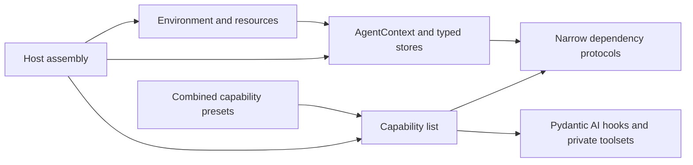

# Architecture and Boundaries

## 1. Vocabulary

| Term | Meaning |
| --- | --- |
| capability | The public unit that composes agent-run behavior. It may contribute tools, private toolsets, instructions, model settings, native tools, and hooks. |
| leaf capability | One cohesive behavior or policy with an independently useful boundary. |
| preset capability | A `CombinedCapability` that composes leaf capabilities without hidden behavior. |
| tool | A model-callable operation owned by a capability. Its schema describes invocation rather than feature policy. |
| private toolset | A Pydantic AI execution adapter used by a capability for listing, validation, wrapping, or dispatch. |
| transformer | A pure, capability-private function that returns replacement messages or parts. |
| store | Durable or resumable domain state owned by context or a host and accessed through a narrow protocol. |
| run-local service | Derived state valid for one run and normally owned by the capability returned from `for_run()`. |
| host service | Runtime infrastructure such as a database controller, event sink, background monitor, or active-run registry. |
| Environment | Owner of filesystem, shell, resources, temporary storage, and lifecycle authority. |

A capability is not a durable database, an Environment, a host controller, or a second
implementation of Pydantic AI `ToolManager`.

## 2. Dependency Direction



Capabilities may use `ctx.fs` or `ctx.file_operator`, `ctx.shell`, and typed services.
They never construct or replace those authorities. They do not import a concrete Claw
controller or require a specific `AgentContext` subclass.

Shared services are explicit typed dependencies. Capabilities do not discover one
another through dynamic context attributes or global registries.

## 3. Native Pydantic AI Composition

The SDK uses Pydantic AI's capability types directly:

- `Capability` for static tools, private toolsets, instructions, and descriptions;
- `AbstractCapability` for reusable hooks, wrappers, model settings, and `for_run()`
  behavior;
- `CombinedCapability` for presets;
- `DynamicCapability` for deterministic dependency-based run selection;
- `pydantic_ai.capabilities.Toolset` when a capability intentionally owns an external toolset;
- `Hooks` for application-local cross-cutting hooks;
- `CapabilityOrdering` for semantic partial ordering;
- native `ToolSearch`, `MCP`, and `ReinjectSystemPrompt` where their contracts match.

The SDK does not define another capability superclass, lifecycle, ordering engine, or
registry of capability instances. It does define the construction-time custom-type
catalog in [Custom Capability Type Discovery](../06-capability-plugins/README.md).
`CapabilityCatalog` validates SDK built-ins, explicitly imported classes, and selected
per-type entry points before native `AgentSpec` resolution. It contains definitions and
lightweight provenance, not runtime instances.

Every SDK-owned capability has a stable ID. Singleton feature IDs cannot be registered
twice. Repeatable integrations, such as named MCP servers, include their namespace in
the ID. External capabilities remain opaque unless they opt into an SDK identity
contract.

## 4. Agent Construction

`create_agent()` constructs an unentered `AgentRuntime` plan. Pydantic AI Agent
construction is deferred until `AgentRuntime.__aenter__()` because Environment setup and
resource restoration may create capability contributors.

Runtime entry proceeds in this order:

1. enter the Environment and restore registered resources;
2. construct or bind `AgentContext` and restore its state;
3. collect host, context, Environment, and per-resource capability contributions;
4. validate provenance, identities, dependencies, and ordering; and
5. construct and enter the Pydantic AI Agent and lifecycle extensions.

Exit runs the inverse ownership order. `AgentRuntime.agent` and the final
`AgentRuntime.capabilities` are available only after runtime entry. This preserves the
existing synchronous factory shape without resolving static Pydantic AI capabilities
before their authority providers exist.

Agent-run behavior is normalized into one resolved capability list with source
provenance. Programmatic callers provide the first source through `capabilities=`.
Declarative YAACLI and Claw profiles instead embed a native Pydantic AI `AgentSpec` for
all native agent-definition fields and serialized capability entries; their host
profile envelope contains only workspace, scheduler, durability, security, and product
policy. Custom serialized types resolve through the SDK's immutable `CapabilityCatalog`;
hosts do not construct a parallel Pydantic AI registry. For a root/main runtime, the
assembly sources are:

1. the host's explicit `capabilities=` argument or native `AgentSpec.capabilities`;
2. `AgentContext.get_capabilities()`; and
3. Environment/resource contribution groups.

This source order and each source's returned sequence form the initial Pydantic AI
capability order. The SDK catalog's serialization-name sort never participates in
runtime assembly. `CapabilityOrdering` then imposes only semantic edges; the initial
source order breaks ties among nodes ready in the same native topological batch. It is
not a global pairwise-stability guarantee for all nodes without a path. Entry-point and
explicit import paths resolve the same class and therefore cannot change its ordering
behavior.

Named children use a stricter resolved-plan entry path. Context and
Environment/resource contributions populate the available catalog and dependency
providers, but do not automatically enable child features. The effective child feature
set is exactly its native `AgentSpec.capabilities`. The host may inject only an
enumerated mandatory infrastructure/policy set: runtime foundation, selected durability
adapter, logical-run/ingress integration, and final visibility enforcement. Every
injected capability and version is visible in the resolved plan and fingerprint. Child
runtime entry binds that plan and does not rerun the root merge algorithm.

Declarative plan resolution preserves native `AgentSpec.output_schema`: it becomes the
base Pydantic AI `StructuredDict` output when present. The resolver adds
`DeferredToolRequests` as a separate effective output alternative when a selected or
host-injected capability implements `SupportsDeferredOutput`; native nested
`CapabilitySpec` fields and standard combined/wrapper capability graphs retain that
signal. SDK approval and user-interaction capabilities implement the marker. Custom
capabilities whose tools may suspend for approval or external completion must implement
it as part of their declared output contract. A host output override cannot silently
replace either contract. The effective output is fingerprinted.

All declarative profiles render native `TemplateStr` values through the portable
`template: AgentTemplateContext` dependency projection, whose exact cross-host schema is
defined in the portable subagent contract. Root and child SDK, YAACLI, and Claw deps
expose that same serializable schema; templates
cannot access live authorities or host-specific context fields.

Reference hosts include `RuntimeFoundationCapability` explicitly in their host
capability list. `create_agent()` does not inject a hidden foundation. A custom host
that replaces the preset with its leaves remains responsible for preserving the
required runtime contracts.

`AgentRuntime.capabilities` exposes the resolved composition for inspection. These are
sources of the same capability plane rather than independent execution paths.

YA Agent SDK 2.0 removes `AgentContext.get_history_capabilities()`. Custom contexts
implement `get_capabilities()`, which may return any Pydantic AI capability rather than
history processors only.

The 2.0 API has no separate `pre_capabilities` list and no `tools=`, `agent_tools=`, or
`toolsets=` behavior parameters. Relative placement is declared by
`CapabilityOrdering`. Direct function tools use `Capability(tools=[...])`; an external
toolset is explicitly wrapped by the Pydantic AI Toolset capability inside
`capabilities=`.

## 5. Runtime Foundation

`RuntimeFoundationCapability` is a `CombinedCapability` composed from leaves:

- `ReasoningCompatibilityCapability`;
- `MediaCompatibilityCapability`;
- `ToolArgumentRepairCapability`;
- `ToolIdCompatibilityCapability`;
- `ContextCompactionCapability`;
- `ColdStartCapability`;
- `EnvironmentContextCapability`;
- `RuntimeContextCapability`;
- `DeferredTerminalCapability`;
- Pydantic AI `ReinjectSystemPrompt`; and
- `OverallRetryBudget` when configured.

Required relationships use `CapabilityOrdering.requires`, `wraps`, and `wrapped_by`.
List order breaks ties among leaves ready in the same topological batch; active
constraints may still move a node past another node with which it has no direct path.
No SDK- or YAACLI-owned capability uses `CapabilityOrdering.position` in the 2.0 baseline. Pydantic AI already
uses the global outermost/innermost tiers for framework-wide boundaries; YA leaves use
local type relationships instead of competing for those coarse positions.

## 6. Tool Execution Policy

Feature capabilities own callable behavior. Cross-cutting tool policy applies to the
final assembled Pydantic AI function-tool surface through independently useful leaves:

- `ToolApprovalCapability` for approval and deferred-call policy;
- `ToolTimeoutCapability` for execution deadlines;
- `ToolVisibilityCapability` for final host allow/deny, dynamic availability, and
  main-agent-only enforcement; and
- `ToolObservationCapability` for host pre/post observation hooks.

CodeAct eligibility remains trusted tool metadata consumed by `CodeActCapability`; it
is not a policy capability by itself. Hosts select the independently useful policy
leaves explicitly. Filesystem, shell, web, external plugin, and other feature
capabilities do not depend on a monolithic SDK `Toolset` for policy.

The leaves use native capability hooks rather than a five-deep wrapper-toolset stack.
Visibility filters the prepared definitions and rechecks the validated execution
boundary; approval projects native approval requirements; observation and timeout use
tool-execution hooks. Provider-native model tools remain under their native provider
contract. Observation wraps one logical validated call and timeout bounds the attempt.
Only that two-leaf execution nesting needs a `CapabilityOrdering` edge. Timeout expiry
raises native `ModelRetry`, so Pydantic AI owns retry accounting and model correction.

Claw profile entries and explicit child capability lists define the coherent feature
surface. `ToolVisibilityCapability` is final enforcement for dynamic host restrictions;
it never slices or reassembles capabilities, and its execution-boundary recheck does not
depend on list position.

Pydantic AI control-flow exceptions such as `ApprovalRequired`, `CallDeferred`, and
`ModelRetry` propagate unchanged. Model correction, transport recovery, and execution
recovery remain distinct budgets.

The host-facing deferred-interaction boundary does not expose
`AgentRuntime.core_toolset`. `AgentRuntime` exposes a typed interaction resolver backed
by the tool policy capability or uses Pydantic AI's deferred result contract directly.
A host does not locate the private toolset that contributed a tool.

## 7. State Ownership

A capability instance contains configuration and run-local behavior. Durable session
state remains in context-owned stores or host persistence.

### 7.1 Durable stores

`TaskManager` and `NoteManager` remain the context-owned task and note state
abstractions. Their default implementations round-trip through `ResumableState`.

`RunInputLedger` is context-owned resumable state keyed by logical run ID. It records
accepted initial and enqueued user inputs in product order, preserving structured
content and applied/rejected disposition. It survives native attempt replacement,
compact, handoff, and deferred continuation segments, and resets only when a new
logical run starts. It is a retention source for history reconstruction, not an input
queue.

Capabilities depend on narrow store protocols covering the existing domain
operations, while context dependency protocols expose those stores. A custom
`AgentContext` subclass may supply another compatible implementation without
capability subclass checks. The same pattern applies to notes, filesystem, shell,
event sinks, and active-run registries.

### 7.2 Run-local state

Run-local state belongs in the instance returned from `for_run()`:

- skill catalog snapshot and generation;
- CodeAct Monty session;
- proxy or discovery caches derived from configured tools;
- one-shot request bookkeeping;
- tool wrapper state; and
- one registration token for the current native `AgentRun`.

A mutable run-local capability always returns an isolated instance from `for_run()`.
Construction-time capability instances are otherwise immutable.

### 7.3 Ownership matrix

| Object | Owner |
| --- | --- |
| task data | context-owned `TaskManager` |
| note data | context-owned `NoteManager` |
| logical-run user input record | context-owned `RunInputLedger` and `ResumableState` |
| handoff and file-inspection continuation state | context and `ResumableState` |
| Pydantic AI `ToolManager` | Pydantic AI |
| tool ID mapping | run-local `ToolIdCompatibilityCapability` helper |
| model feature metadata | `ModelFeature`, not a capability manager |
| skill catalog/cache | run-local `SkillsCapability` service |
| native Tool Search loaded state | Pydantic AI Tool Search and canonical history |
| Tool Proxy discovery state | context-owned `ToolProxyState` and `ResumableState` |
| shell process registry | Environment `Shell` |
| shell completion formatting/delivery | `ShellCapability` |
| Claw background monitors | Claw host services |
| Claw database controllers | Claw host services |
| logical-run pending input | root `LogicalRunInputRouter` spanning native attempts and deferred continuation segments |
| active main/child registry | root logical execution/context service shared explicitly with child contexts |
| current native-run registration token | the capability/driver instance for that `AgentRun` |

The SDK does not copy or wrap Pydantic AI `ToolManager` into another manager. CodeAct
continues to use the active native manager for nested validation and execution.

### 7.4 Shared active-run services

`ActiveRunRegistry` is a root logical-execution service, not mutable state isolated by
an individual capability's `for_run()`. Child contexts share the registry explicitly.
Each main/child run receives an isolated registration token and unregisters only its
own handle.

`LogicalRunInputRouter` belongs to the root logical execution and spans native attempt
replacement and deferred continuation segments. Each `AgentStreamer` binds its current
native run to that router. The router binds accepted user inputs from `RunInputLedger`
to attempt enqueue IDs, writes delivery state back to the ledger, and buffers other
canonical producers while no segment is bound. Its `current_native_attempt_id` is the
single identity shared with host capabilities at graph boundaries; those capabilities
must not derive a competing attempt identity from Pydantic AI run metadata. A capability
instance may register the current native run into these services, but does not own them.

## 8. Subagent Composition

The same native `AgentSpec` core used by declarative main-agent profiles defines every
portable child agent. A
thin YA `SubagentSpec` envelope adds only delegation routing, host requirements,
history/fork, recursion, and execution policy. The SDK does not duplicate native model,
name, description, instruction, settings, retry, template, or serialized capability
fields.

After Environment and context contributions are available, the host treats them as the
complete capability/service catalog and resolves the native spec and YA envelope into an
immutable `ResolvedSubagentPlan`. The selected feature list remains exactly
`AgentSpec.capabilities`; only the enumerated mandatory infrastructure/policy set is
injected. The plan contains those two distinguished sets, model and effective output
policy, history policy, final visibility policy, and a stable fingerprint.

Subagents do not automatically inherit arbitrary parent capabilities. The resolver
never slices an arbitrary `CombinedCapability` by tool name, tag, or private toolset
type. A self fork is resolved from an explicit `SelfForkPolicy` and catalog references;
it does not clone the parent's live capability instances.

Main-agent-only features, including structured user interaction, are absent from child
plans. Delegation is absent unless recursion policy explicitly grants it. The final
`ToolVisibilityCapability` remains an execution-boundary defense.

External Pydantic AI capability subclasses pass through unchanged for a main plan, but
a child or durable self fork can include one only through a re-resolvable catalog
entry. SDK assembly does not clone it, reconstruct its private toolsets, or assume an
SDK base class.

Definition/resolution is separate from execution. A public `SubagentRegistry` and
`SubagentExecutionService` serve SDK hosts; the standalone SDK, YAACLI, and YA Claw bind
in-process, local SQLite/session, and SQL session/run drivers respectively. The complete
contract is defined in [07-subagent-runtime.md](07-subagent-runtime.md).

## 9. Environment and Resources

`Environment` remains a lower-level authority provider and does not import
`ya-agent-sdk` or implement feature policy.

Each Environment-level provider and each registered resource contributes independently
through a neutral provenance record:

```python
@dataclass(frozen=True, slots=True)
class AgentContributionGroup:
    source_id: str
    capabilities: tuple[object, ...] = ()


def get_agent_contributions(self) -> list[AgentContributionGroup]: ...
```

`source_id` is `environment` for Environment-owned contributions and
`resource:<registry-key>` for a resource. The neutral record lives in
`ya-agent-environment`; its opaque objects avoid a reverse dependency on the SDK or
Pydantic AI.

Every Environment/resource provider implements `get_capabilities()`. The registry
builds one provenance group per provider. Contributions are collected only after
Environment entry and `resources.restore_all()`, so setup-created and restored
resources participate before the static Pydantic AI Agent is constructed. The SDK then
validates objects, detects duplicate singleton IDs, and reports errors with `source_id`
before flattening the groups.

`Environment.get_toolsets()`, `Resource.get_toolsets()`, and aggregate raw toolset
storage do not exist in 2.0. Provenance groups preserve source diagnostics and
deterministic assembly.

Environment context text remains available through
`Environment.get_context_instructions()` and is consumed by
`EnvironmentContextCapability`.

## 10. Host Assembly

### 10.1 YAACLI

YAACLI profiles embed native `AgentSpec` cores and keep TUI/session/durability policy in
the host envelope. They compose built-in feature capabilities and configure Skills,
Tool Proxy, CodeAct, MCP, and delegation through the native capability list. Unlike
ordinary SDK runtime entry, YAACLI's local worker builds one SDK `CapabilityCatalog`,
enters the Environment, restores resources, and resolves and constructs every executable
registered plan before dispatching product work. The coordinator selects one already
registered plan; it never reconstructs behavior from mutable current configuration.

Product turns run through `LocalExecutionCoordinator` and `AgentExecutionHarness`;
interactive input is committed to `SessionStore` before the host-owned node capability
drains it and routes it through native enqueue. Session truth and stable segment
checkpoints remain in the host store
authorities. MessageBus types are absent from its 2.0 runtime. See
[06-yaacli-durable-sessions.md](06-yaacli-durable-sessions.md).

### 10.2 YA Claw

Claw profiles embed a native `AgentSpec` for the agent-definition core and keep
workspace, scheduling, authorization, durability, and product policy in the outer host
envelope. The native spec describes capability identifiers and typed configuration:

```yaml
agent:
  name: main
  model: openai:gpt-5
  capabilities:
    - filesystem:
        writable: true
    - shell:
        background: true
    - tasks
    - skills
    - delegation
```

The SDK's immutable `CapabilityCatalog` supplies validated custom capability types and
provenance to Pydantic AI's native registry, while YA resolves required host
dependencies. Claw supplies its trusted explicit classes or selected installed names to
the SDK; it does not scan entry points or maintain a parallel custom-type/factory
registry. The catalog is a construction boundary, not another capability runtime. The Pydantic AI Agent receives
instantiated capabilities.

Claw database controllers, run supervisors, input channels, and background monitors
remain host services. Capabilities access host state only through typed dependencies or
host APIs.
