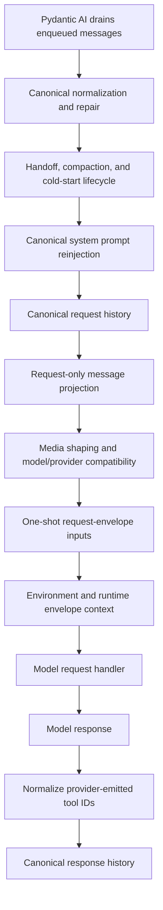

# Instructions and Request Pipeline

## 1. Instruction Ownership

A capability owns the complete behavioral guidance for its feature. Tool schemas own
call parameters and immediate invocation semantics.

The runtime does not derive feature policy by scanning tool classes. It does not use
first-wins instruction groups, recurse through wrapped toolsets, or depend on tool
registration order for prompt identity.

Every SDK capability has one stable instruction identity derived from its stable
capability ID. Duplicate singleton capabilities fail at construction.

## 2. Prompt Channels

The runtime separates stable guidance, changing catalogs, transient request context,
and canonical conversation content.

### 2.1 Stable capability guidance

Examples:

- filesystem safety and editing workflow;
- shell process management;
- task and note workflow;
- delegation policy;
- skill routing rules; and
- CodeAct security and orchestration guidance.

Rules:

1. The capability returns guidance from `get_instructions()`.
2. Static text uses a static/cacheable instruction representation.
3. Prompt files are loaded at construction or capability resolution, not per tool and
   not per model request.
4. Tool schemas do not repeat capability workflow policy.
5. Wrapper capabilities publish only their own protocol guidance. They do not call
   wrapped toolsets' `get_instructions()` recursively.
6. A deferred capability uses `defer_loading=True`, making its description, tools,
   settings, and instructions visible together.
7. A capability unavailable for the resolved run contributes neither tools nor
   instructions.

`BaseTool.get_instruction()`, SDK `Instruction.group`, and first-wins aggregation do
not exist in 2.0.

### 2.2 Changing capability catalogs

Skills and delegation catalogs change independently of ordinary runtime context. They
use a shared cached snapshot:

1. `for_run()` obtains the current catalog generation.
2. A watcher or explicit refresh invalidates the generation.
3. Filesystem/network scanning updates the cache only after invalidation.
4. A dynamic instruction callable renders from the cached snapshot without I/O.
5. Catalog tools and instructions read the same snapshot.

A `DynamicCapability` factory remains deterministic from run dependencies. I/O occurs
through the capability's cache/toolset boundary rather than a durable-flow capability
factory.

### 2.3 Transient request envelope

Pydantic AI 2.21 writes the messages returned from `before_model_request` back to
canonical `message_history`. That hook is reserved for transformations intentionally
persisted in history.

Transient data is added by request-only `wrap_model_request` decorators:

- elapsed time and usage;
- context-window pressure and reminders;
- Environment paths and shell configuration;
- active process status summaries;
- active agent/subagent summaries;
- one-shot file inspection reminders; and
- provider-specific media projection.

A decorator creates replacement messages and a replacement `ModelRequestContext`,
passes them only to `handler()`, and leaves the original request context untouched.
The replacement preserves every field not intentionally changed, including Pydantic
AI runtime-managed `model_id` and `streaming` fields. The decorated messages are never
assigned to graph state.

A one-shot source is cleared only after `handler()` returns a model response. If the
handler raises, the source remains pending for recovery/retry.

### 2.4 Canonical conversation content

Content that the model must remember enters Pydantic AI canonical history:

- initial user prompts;
- immediate or queue-until-idle steering;
- completed background shell results;
- completed background subagent results;
- ordinary tool returns and retry prompts; and
- explicit host/user conversation events.

User steering and asynchronous feature results use Pydantic AI enqueue semantics. They
do not masquerade as dynamic instructions or transient status.

### 2.5 Logical-run user input retention

`RunInputLedger` preserves the user-authored inputs for one logical run independently
of how canonical history is reduced. Initial input is recorded as applied before first
graph advancement. Each accepted `steer` or `queue` input is recorded with its stable
input ID and structured content; `EnqueuedMessagesEvent` marks it applied.

Compact and handoff rebuild history from the summary plus every applied ledger entry in
original order. Accepted or enqueued entries that are not yet applied remain solely on
the delivery path, and rejected entries are not presented to the model. The ledger is
not cleared by history reduction and is reset only at the next logical-run boundary.
It replaces the steering-only text replay field without replacing canonical history or
Pydantic AI enqueue.

## 3. Toolset Instructions

Pydantic AI may still collect instructions from a private toolset, but SDK feature
policy is capability-owned. A private toolset uses instructions only when the text is
intrinsic to that adapter's protocol and cannot be represented by its owning
capability.

The SDK does not add another collection pass. `add_toolset_instructions()` is removed.

Tool Search and Tool Proxy do not recursively reconstruct child instructions. Deferred
capabilities use native visibility. Proxy protocol guidance belongs to
`ToolProxyCapability`; underlying feature guidance belongs to the underlying feature
capability.

## 4. Canonical and Request-Only Processing

SDK processors do not mutate `ModelMessage` or part instances supplied as canonical
history.

A canonical processor implemented through `before_model_request`:

1. reads the input sequence;
2. preserves unchanged message instances;
3. replaces every changed message and part;
4. returns a replacement list when structure changes; and
5. accepts that Pydantic AI will write the result into graph history.

A request-envelope decorator implemented through `wrap_model_request`:

1. copies only the messages/parts it decorates;
2. clones the request context while preserving all current and future fields other than
   the intentional message replacement;
3. calls `handler()` with that replacement context;
4. never assigns decorated messages to graph state; and
5. commits one-shot consumption only after a successful handler response.

Native Pydantic AI capabilities follow their native request-context contract. SDK code
does not alter native objects after Pydantic AI has emitted delivery events.

This contract preserves:

- provider request consistency;
- retry determinism;
- enqueue event payload identity;
- prompt cache reasoning;
- compact/handoff reproducibility; and
- reliable history export and replay.

## 5. Processing Stages



The semantic stages are:

1. **Pending messages**: Pydantic AI drains `asap` or `when_idle` content into
   canonical history.
2. **Canonical repair**: reasoning, restored non-normalized provider tool IDs, and
   recoverable tool argument history are normalized before lifecycle reduction.
3. **Lifecycle reduction**: handoff, compaction, and cold-start select retained
   canonical history; compact and handoff restore applied logical-run user inputs from
   `RunInputLedger`.
4. **System prompt boundary**: Pydantic AI `ReinjectSystemPrompt` restores the
   configured prompt after reconstruction or reset.
5. **Request projection**: `wrap_model_request` creates a request-only message view.
6. **Media compatibility**: retained media is shaped, uploaded when configured, and
   filtered for the selected model only in the request view.
7. **Envelope context**: one-shot reminders, process summaries, and
   Environment/runtime data decorate the request view.
8. **Response normalization**: provider-emitted tool IDs become stable YA IDs before
   persistence and host event emission.

Canonical YA tool IDs are reused for subsequent provider requests and host events.

## 6. Ordering Invariants

1. Enqueued user and feature content is present before SDK lifecycle processing.
2. History required by compaction is repaired before compaction.
3. System prompt reinjection runs after every capability that can replace retained
   canonical history.
4. Request-envelope decorators run only after canonical processing has finished.
5. Compact and handoff never observe request-envelope Environment/runtime context.
6. Media upload follows local resize/compression and precedes unsupported-media
   filtering in the request view.
7. One-shot request input is added after lifecycle reset selects retained history.
8. Environment envelope context precedes runtime envelope context unless a provider
   protocol requires a different part order.
9. Provider-emitted tool IDs are normalized before persistence or host emission.
10. Compact and handoff restore each applied run input exactly once and never consume
    an unresolved or rejected ledger entry.
11. One-shot consumers are exactly once across retries/recovery.
12. Caller/source order is Pydantic AI's tiebreaker among nodes ready in the same
    topological batch. It is not a global pairwise-stability guarantee for every pair
    without a path between them.

Each leaf declares `CapabilityOrdering` beside its implementation. Ordering is tested
as a graph of semantic relationships, not as one manually concatenated filter list.
Entry-point enumeration and the SDK type catalog's serialization-name sort never feed
this graph: declarative callers supply `AgentSpec.capabilities` order, programmatic
callers supply `capabilities=` order, and runtime contribution sources preserve their
specified sequences. A dependency cycle fails construction with Pydantic AI's native
ordering error.

## 7. Capability Ordering Matrix

### 7.1 Position rule

No SDK- or YAACLI-owned capability uses `CapabilityOrdering.position` in the 2.0
baseline. `position` is a coarse global tier, not a unique slot: multiple outermost or
innermost capabilities still use caller order when they are ready in the same
topological batch. Pydantic AI already uses those tiers for framework-wide boundaries
including instrumentation, Tool Search, pending-message drain, and durable execution.
YA does not compete with or copy those boundaries.

Each YA leaf declares only local type relationships required for correctness.
`requires` means that a target must be present and does not imply order. Type references
are used instead of instance references so `for_run()` replacement preserves the graph.
An omitted relationship adds no edge. A fully unconstrained list retains caller/source
order, but active constraints elsewhere may change the final relative placement of two
nodes that have no path between them.

### 7.2 Canonical history

The canonical `before_model_request` relationships are:

| Capability | `wraps` | Reason |
| --- | --- | --- |
| `ReasoningCompatibilityCapability` | `HandoffCapability`, `ContextCompactionCapability`, `ColdStartCapability`, Pydantic AI `ReinjectSystemPrompt` | normalize retained reasoning before lifecycle reduction or prompt restoration |
| `ToolArgumentRepairCapability` | `HandoffCapability`, `ContextCompactionCapability`, `ColdStartCapability`, Pydantic AI `ReinjectSystemPrompt` | repair recoverable calls before they can be summarized, trimmed, or passed to prompt restoration |
| `ToolIdCompatibilityCapability` | `HandoffCapability`, `ContextCompactionCapability`, `ColdStartCapability`, Pydantic AI `ReinjectSystemPrompt` | normalize restored IDs before lifecycle reduction or prompt restoration |
| `OverallRetryBudget` | `HandoffCapability`, `ContextCompactionCapability`, `ColdStartCapability`, Pydantic AI `ReinjectSystemPrompt` | count current-run retry prompts before a reducer or prompt restoration can hide them |
| `HandoffCapability` | `ContextCompactionCapability`, `ColdStartCapability`, Pydantic AI `ReinjectSystemPrompt` | apply the handoff transition before later reduction and prompt restoration |
| `ContextCompactionCapability` | `ColdStartCapability`, Pydantic AI `ReinjectSystemPrompt` | compact before cold-start trimming and prompt restoration |
| `ColdStartCapability` | Pydantic AI `ReinjectSystemPrompt` | finish history reduction before prompt restoration |

Every later optional leaf whose relative order matters appears directly in `wraps`.
The graph therefore remains correct if, for example, compaction is absent between
handoff and cold start, or all three lifecycle reducers are absent before system-prompt
reinjection. The three repair leaves and `OverallRetryBudget` are unrelated to one
another; when considered as a fully unconstrained subset they retain caller order.

`ToolIdCompatibilityCapability` also implements `after_model_request`. Its outer
placement makes response unwinding run late, so provider-emitted IDs are normalized
before response persistence and host emission without adding a second ordering system.
Pydantic AI's outermost pending-message drain runs before this YA chain. No YA leaf
redeclares that native position.

### 7.3 Request-only envelope

Pydantic AI completes canonical `before_model_request` processing before it enters
`wrap_model_request`, so no cross-phase ordering edges are declared. Request-only
relationships are:

| Capability | `wraps` | Reason |
| --- | --- | --- |
| `MediaCompatibilityCapability` | `FileInspectionCapability`, `ShellCapability`, `EnvironmentContextCapability`, `RuntimeContextCapability` | finish provider-specific media projection before adding textual envelopes |
| `FileInspectionCapability` | `EnvironmentContextCapability`, `RuntimeContextCapability` | place the one-shot reminder before general context even when Environment context is absent |
| `ShellCapability` | `EnvironmentContextCapability`, `RuntimeContextCapability` | place transient process status before general context even when Environment context is absent |
| `EnvironmentContextCapability` | `RuntimeContextCapability` | preserve the stable Environment-before-runtime envelope contract |

`FileInspectionCapability` and `ShellCapability` have the same active predecessor and
successor constraints; caller order within their ready batch determines their relative
part order. Active agent/subagent summaries belong to
`RuntimeContextCapability`, so delegation does not introduce another envelope stage.
Capabilities with no request/history behavior omit these constraints.

### 7.4 Node-terminal boundary

`DeferredTerminalCapability` declares no global position. Pydantic AI's injected
pending-message drain is already outermost, so reverse `after_node_run` unwinding invokes
`DeferredTerminalCapability` first. It acts only on an `End` carrying
`DeferredToolRequests`, returning unapplied pending envelopes to the logical-run router
so the host sees the suspension. Other node endings retain native behavior.

YAACLI's `DurableInboxPumpCapability` declares:

```python
CapabilityOrdering(
    wrapped_by=(DeferredTerminalCapability,),
    requires=(DeferredTerminalCapability,),
)
```

Reverse `after_node_run` unwinding then runs the durable pump before the deferred
terminal boundary. The pump reads the host inbox, enqueues ordinary-node input while the
native segment is bound before pending processing, retains
new input for a deferred continuation, and performs the close-and-drain fence at an
ordinary terminal.

### 7.5 Tool execution policy

Tool policy uses native phase ordering before it uses capability ordering:

| Capability | Native hook boundary | Ordering |
| --- | --- | --- |
| `ToolVisibilityCapability` | `prepare_tools` plus a `before_tool_execute` enforcement recheck | none |
| `ToolApprovalCapability` | `prepare_tools` projects native approval requirements; native deferred resolution owns continuation | none |
| `ToolObservationCapability` | `wrap_tool_execute` around one logical validated call | wraps `ToolRetryCapability` and `ToolTimeoutCapability` |
| `ToolRetryCapability` | `wrap_tool_execute` around non-native execution attempts | wraps `ToolTimeoutCapability` |
| `ToolTimeoutCapability` | `wrap_tool_execute` around one attempt | none |

This yields `observation -> retry -> timeout -> tool` when all three wrappers are
present. Direct observation-to-timeout ordering preserves logical-call observation when
retry is omitted. Visibility and approval are not inserted into that wrapper chain:
prepared definitions are resolved before validated execution, and the visibility guard
fails closed at execution even for stale calls. All function tools contributed by SDK,
Pydantic AI toolset, or external capabilities cross the same final `ToolManager` policy
hooks. Provider-native model tools remain under their native provider contract.

Pydantic AI control-flow exceptions remain control flow rather than retryable execution
failures. An external policy capability declares its own local relationship only when
its correctness depends on one of these public types; otherwise it adds no edge and
native ready-node tie-breaking applies.

## 8. File Inspection

The existing `auto_load_files` behavior is a path reminder, not automatic content
loading. The target name is `FileInspectionCapability`, and resumable state uses a
matching pending-file-inspection field.

The capability:

- treats every path as inert untrusted data;
- never reads file content automatically;
- emits one request-envelope reminder after handoff/compact restoration;
- retains pending paths when the model handler fails;
- clears pending paths only after the handler returns a response; and
- cannot be registered twice.

## 9. Background Results

`ShellCapability` and background delegation capabilities enqueue completed results as
canonical exactly-once content. They own completion correlation IDs, output truncation
and overflow-file storage, and feature-specific delivery events. `ShellCapability` also
owns its request-only process-status summary. `RuntimeContextCapability` renders active
agent/subagent status from the shared registry; delegation does not add a second request
envelope.

They depend on the root `LogicalRunInputRouter`; they do not create or retain a second
input queue.

A completion enters the logical-run input router rather than MessageBus. When a native
attempt is bound, Pydantic AI pending-message delivery keeps it alive. During recovery
or deferred continuation gaps, the bounded router retains the completion and a durable
host persists it where required. The next segment enqueues it before graph advancement;
a typed notification event is never a substitute for canonical delivery.

## 10. Request and Retention Budgets

Pydantic AI 2.21 performs its normal pre-request token check before
`wrap_model_request` decorators add request-only context. The SDK therefore reserves a
bounded envelope budget in context-lifecycle calculations.

- `RuntimeFoundationCapability` configures `request_envelope_token_reserve` and a
  logical-run user-input retention budget.
- Compaction and proactive context thresholds reserve both the request envelope and the
  current rendered `RunInputLedger` before allocating summary/history space.
- Each envelope capability has a deterministic output bound.
- The combined decorator rejects or truncates according to typed policy before calling
  the model handler.
- Tests count the fully decorated request and prove it remains within the configured
  context window.

The envelope cannot grow without affecting lifecycle pressure, even though it is absent
from canonical history. User ingress cannot exceed the retention budget and then make
verbatim compact restoration impossible; it receives explicit backpressure before
acceptance.

## 11. System Prompt

Pydantic AI `ReinjectSystemPrompt` replaces the SDK system prompt filter. The runtime
uses server-authoritative replacement when history originates from an untrusted host
surface; otherwise existing trusted system prompt parts remain authoritative.

Ordering constraints place reinjection after compact, handoff, and cold-start history
replacement. SDK code does not maintain a second system-prompt reconstruction path.

## 12. Verification

The instruction/request pipeline is complete when:

- migrated feature guidance has one capability owner;
- no migrated tool implements `get_instruction()`;
- no wrapper recursively scans child instructions;
- static guidance is stable across requests;
- catalog refresh performs I/O only after generation invalidation;
- transient context does not appear in exported canonical history;
- canonical asynchronous results survive compact/export/restore according to ordinary
  history rules;
- every applied initial, `steer`, and `queue` input is restored in order across repeated
  compact/handoff cycles, while unresolved inputs are not duplicated;
- no migrated SDK processor mutates input canonical-history objects; and
- ordering tests assert declared edges and fully unconstrained caller order rather than
  unsupported global pairwise stability between every unrelated pair.
