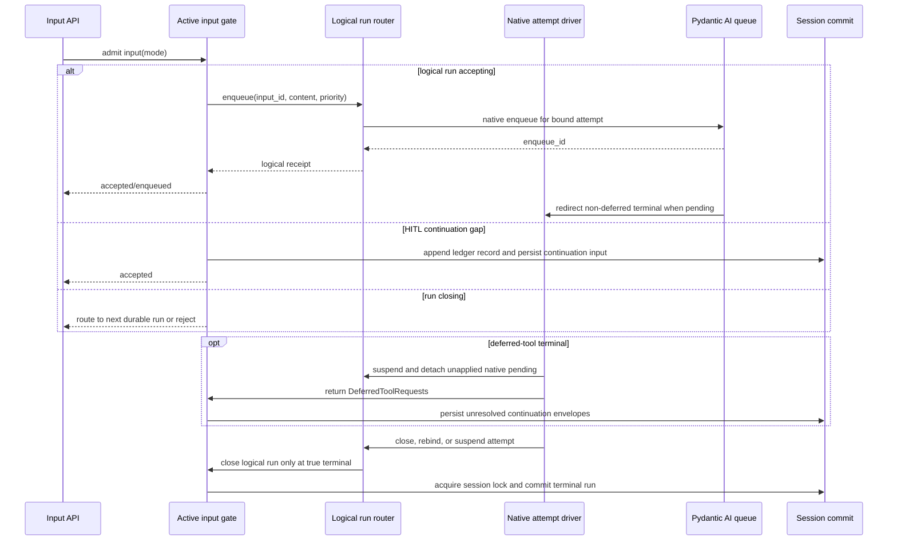

# Native Steering and YA Claw Queue

## 1. Steering Primitive

All user steering uses Pydantic AI `AgentRun.enqueue()` or `RunContext.enqueue()`.

- `priority="asap"` delivers at the earliest model opportunity and redirects a run
  that would otherwise end.
- `priority="when_idle"` delivers only when the run would otherwise end, after all
  pending `asap` content.
- FIFO order is preserved within each priority.
- The returned `enqueue_id` correlates acceptance with
  `EnqueuedMessagesEvent` delivery.
- Enqueue does not consume model-correction retry budgets.

The SDK does not wrap actual user content in a MessageBus reminder. A logical-run
router adds recovery and correlation around the native pending-message queue without
becoming another content-injection mechanism.

## 2. SDK Streamer API

`AgentStreamer` exposes the logical stream rather than whichever native attempt is
currently stored in `streamer.run`:

```python
@dataclass(frozen=True, slots=True)
class EnqueueReceipt:
    logical_run_id: str
    input_id: str
    disposition: InputDisposition
    enqueue_id: str | None = None


async def enqueue(
    self,
    *content: EnqueueContent,
    priority: PendingMessagePriority = "asap",
    origin: InputOrigin = InputOrigin.user,
    input_id: str | None = None,
) -> EnqueueReceipt:
    return await self.input_router.enqueue(
        *content,
        priority=priority,
        origin=origin,
        input_id=input_id,
    )
```

Contract:

- the method is valid while the logical run accepts input, including recovery and
  deferred-continuation gaps;
- empty logical input is invalid; every accepted non-empty call returns an
  `EnqueueReceipt`;
- it accepts text, multimodal `UserContent`, and supported request parts;
- `input_id` is stable across native attempt replacement and may be supplied by a
  durable host; repeating it with equal content/origin/priority returns the existing
  receipt, while reuse with different semantics fails;
- `enqueue_id` is native and attempt-specific, and is `None` while waiting for a
  native attempt;
- content is assembled into a `ModelRequest` carrying logical input metadata;
- the router invokes native enqueue on the attempt's owner event loop; and
- cross-thread or cross-loop callers await the marshalled operation.

A host execution record may begin with its initial input in `accepted` state. The owning
driver binds a logical run ID and its `RunInputLedger` before first graph advancement;
native `record_initial()` is its admission boundary and records that input as applied.
Failure or cancellation before this boundary rejects the host input, while a later model
failure does not downgrade applied admission. Each non-empty enqueue is recorded before
its receipt returns. Recovery attempts and deferred continuation segments reuse that
logical run ID; a new product run starts a new ledger.

`streamer.run` remains an observability reference to the current/latest native
`AgentRun`; it is not the steering authority.

`drive_streamed_run()` remains hook-aware. A bare `async for node in AgentRun` cannot
replace it while SDK node streaming requires custom graph advancement, because native
pending-message redirect occurs in node lifecycle hooks.

## 3. Canonical History

Applied enqueue content is ordinary Pydantic AI canonical history. Canonical history
remains the execution record, while context-owned `RunInputLedger` protects exact user
intent when compact or handoff deliberately replaces that history.

At host logical-run creation, the initial user input is accepted; at the driver's native
`record_initial()` or equivalent durable host-admission boundary it becomes applied.
Every accepted `steer` or `queue` input is recorded with stable input identity and
structured content. Semantic identity excludes constructor-generated message timestamps,
so a durable retry of the same content does not look different merely because it was
remapped later.
`EnqueuedMessagesEvent` advances its ledger state to applied. Compact and handoff
restore all applied entries in product order on every reduction cycle. They do not
clear the ledger or restore unresolved/rejected entries.

The native steering migration removes `AgentContext.steering_messages`, its text-only
`ResumableState` field, user-source bus injection, the completion guard, and bus input
events. It replaces the steering-specific replay field with the generalized ledger;
it does not remove user-input retention. Multimodal content is never flattened to
text.

The SDK maps `EnqueuedMessagesEvent` into its public stream event surface without
changing the delivered message objects.

## 4. Logical Run Router and Active Run Registry

### 4.1 Logical run input router

One `LogicalRunInputRouter` lives for the full logical run. It spans every
`AgentStreamer` continuation segment and all recoverable native `AgentRun` attempts.

The router accepts typed canonical envelopes from user and feature producers. User
envelopes reference `RunInputLedger`; shell/subagent completion envelopes carry their
producer correlation ID. The router tracks priority/FIFO sequence, current and
superseded attempt enqueue IDs, and the assembled `ModelRequest` metadata. While bound,
`current_native_attempt_id` is the authoritative identity for both router retries and
capability-driven graph-boundary drains, preventing two enqueue calls for one input in
the same attempt.

Attempt lifecycle:

1. `bind_attempt(run, attempt_index)` registers the native run and owner loop before
   graph advancement.
2. The router enqueues every unresolved input in FIFO/priority order.
3. A capability event hook consumes `EnqueuedMessagesEvent` before host emission and
   marks the matching user ledger or feature-completion record applied.
4. On recoverable attempt failure, the router closes that native handle. Inputs that
   were enqueued but not applied return to accepted state; their old native IDs are
   marked superseded.
5. Before the next attempt starts, the router reconciles logical input metadata in
   recovered canonical history. Applied inputs are never enqueued again.
6. Inputs accepted between attempts remain pending and bind to the next attempt.
7. A deferred-tool `End` suspends the logical run; unresolved envelopes remain pending
   for the continuation segment.
8. On terminal success/failure/cancellation, the router closes and marks every
   unresolved record rejected.

`DeferredTerminalCapability` runs before Pydantic AI's pending-message terminal drain.
When an `End` carries `DeferredToolRequests`, it detaches enqueued-but-unapplied native
messages back to the logical router and lets the deferred result reach the host
unchanged. The next continuation streamer rebinds those envelopes. All non-deferred
terminal redirects remain native Pydantic AI behavior.

This preserves `asap` and `when_idle` input across SDK recovery and HITL suspension
without copying Pydantic AI's pending-message implementation.

### 4.2 Shared active-run registry

`ActiveRunRegistry` is owned by the root logical execution/context and shared
explicitly with child contexts. It is not isolated inside each capability's
`for_run()` instance.

Every main agent, delegated subagent, and self fork registers a handle pointing to its
logical-run router. A handle contains agent identity, parent identity, owner loop,
router, active/closing state, and an ownership-safe unregister token.

The per-native-run capability/driver owns only its registration token. Targeted child
steering resolves the shared registry and enqueues through the child's logical router.
Tests cover concurrent child lookup and cleanup.

## 5. MessageBus Removal

YA Agent SDK 2.0 removes `MessageBus`, `BusMessage`, bus cursors, bus history filters,
and the completion guard. User input, parent-to-child steering, background results,
and host notifications use logical-run routers or typed host event channels.
There is no mailbox compatibility capability.

## 6. Claw Queue Semantics

Claw keeps four queue concepts separate:

1. **Durable run queue**: `RunRecord(status="queued")` waits to be claimed.
2. **Pre-bind ingress**: a short host buffer covers database claim before the logical
   run router is available.
3. **Logical-run pending envelopes**: accepted user and feature content survives native
   attempt replacement and deferred continuation gaps.
4. **Pydantic AI attempt queue**: the currently bound native run owns pending messages
   and their `asap`/`when_idle` ordering.

The HITL continuation store is durable persistence for unresolved logical-run
envelopes, not a fifth delivery queue. It stores both user input and canonical
shell/subagent completions until the next segment binds.

One count-and-byte ingress budget covers pre-bind, bound, recovery, and HITL states.
Moving an envelope between those states does not create new capacity. Applied or
rejected feature envelopes release their retained payload; user content remains under
a separate logical-run retention budget because compact must be able to restore every
applied ledger entry. Capacity exhaustion returns explicit backpressure rather than
growing Pydantic AI or host queues without bound.

`DispatchMode.QUEUE` belongs only to durable run dispatch. It never selects active-run
input priority.

`mode="queue"` has the lifetime of the current active Claw run and follows native
attempt recovery and deferred-tool continuations. It is not a durable next run and the
active model execution itself is not resumed after process loss. Durable future work
uses normal session submission and a queued `RunRecord`.

## 7. Claw API

```python
class SteerMode(StrEnum):
    STEER = "steer"
    QUEUE = "queue"


class SteerRequest(BaseModel):
    input_parts: list[InputPart] = Field(default_factory=list)
    mode: SteerMode = SteerMode.STEER
```

Mapping:

| Claw mode | Pydantic AI priority | Product behavior |
| --- | --- | --- |
| `steer` | `asap` | Steer now at the next model opportunity. |
| `queue` | `when_idle` | Queue after the agent's current work. |

`SessionSubmitRequest` has an independent active-run field:

```python
active_mode: SteerMode = SteerMode.STEER
```

It does not overload `dispatch_mode`.

Run/session steer routes accept `mode`. Unified session submit applies these rules:

- idle session: create a durable queued run;
- queued run: merge input into durable initial `input_parts`;
- running stream, recovery gap, or in-memory continuation gap: enqueue into the
  logical-run router with `active_mode`;
- running HITL continuation gap: persist input, mode, and input ID in the HITL
  continuation inbox;
- closing run: create or merge the next durable run under the terminal session lock.

Active-run steer routes target a running run. A direct steer to a queued run returns a
conflict; unified session submit is the durable queued-input API.

API/UI copy uses “Steer now” and “Queue after current work”. It never labels active
`when_idle` input as durable queued execution.

## 8. Claw Runtime State

Raw `ActiveRunHandle.steering_inputs: list[...]` is replaced with a typed view over
logical-run envelope state. User records include input ID, structured parts, mode and
delivery state; feature records include producer correlation and bounded result
content.

The active-run handle owns only host coordination: pre-bind ingress, the bound
logical-run router, owner-loop identity, lifecycle state, capacity accounting, and
terminal coordination. Native pending messages remain owned by Pydantic AI.

### 8.1 Pre-stream window

Inputs accepted after database claim but before logical-run binding enter pre-bind
FIFO order under the same ingress budget used after binding. The coordinator binds the
router and drains them before first graph advancement.

### 8.2 Bound delivery and recovery

After binding, the controller awaits one async logical-run sink:

1. parse and validate input parts;
2. map file/media content through the current `FileOperator`;
3. recheck that the logical run accepts input and has capacity;
4. call `AgentStreamer.enqueue()` with `input_id` and selected priority;
5. store the receipt and any attempt-specific enqueue ID; and
6. acknowledge accepted/enqueued state accurately.

During SDK recovery, the same logical-run router remains active. It rebinds unresolved
envelopes to each native attempt and emits updated native enqueue IDs. There is no Claw
polling loop or second attempt-level host queue.

### 8.3 HITL continuation gap

A Claw `RunRecord` remains running while a deferred-tool result waits for human input.
The prior streamer segment is closed, but the logical-run router is suspended rather
than terminated. User input accepted in this state is appended to the same run's
`RunInputLedger` and persisted with:

- logical `input_id`;
- `SteerMode`/Pydantic priority;
- structured input parts;
- accepted timestamp; and
- delivery state.

Shell and subagent completions use the same continuation store with producer
correlation rather than `SteerMode`. After HITL resolves, the coordinator restores all
unresolved envelopes, creates the deferred continuation streamer, and binds it to the
same logical-run router before first graph advancement.
`steer` remains `asap`; `queue` remains `when_idle`. The records never become an
initial prompt or BusMessage. If the Claw run is cancelled or cannot resume, unresolved
records become rejected.

### 8.4 Persistence boundary

For a queued run, merged `input_parts` remains durable initial input.

For a running run, `RunRecord.input_parts` remains the initial-run input. It is not
used as a misleading steering delivery log. The context restore payload persists the
logical run ID and `RunInputLedger`; applied active input also appears in committed
canonical history.

If Claw needs acceptance audit or idempotency before run commit, it uses a separate
input-delivery record with explicit accepted/enqueued/applied/rejected state. That
record does not claim that an active Pydantic AI run can be resumed after process
loss.

## 9. Delivery Events

Claw distinguishes four states:

| Event | Meaning |
| --- | --- |
| `input_accepted` | Claw admitted the input and selected a mode. |
| `input_enqueued` | A native attempt returned an `enqueue_id`; event includes attempt index. |
| `input_applied` | `EnqueuedMessagesEvent` reported an attempt enqueue ID in canonical history. |
| `input_rejected` | Mapping, capacity, closing state, cancellation, or failure prevented delivery. |

One logical input may emit multiple `input_enqueued` events across recovery attempts.
All carry the same `input_id` and distinct `(attempt_index, enqueue_id)` pairs. A
superseded native ID does not decrement outstanding count; only applied or rejected is
terminal.

Outstanding queued count is derived from accepted/enqueued minus applied/rejected
states. Cancellation, failure, and terminal cleanup reject every unresolved input. An
acceptance event is never presented as proof that the model has seen the input.

YA Agent SDK and Claw 2.0 expose only these input events; legacy `run_steered` and
bus `message_received` events are removed.

## 10. Terminal Race

The SDK router uses its logical-run lock. A durable Claw host additionally serializes
input admission, native delivery/application, and terminal commit through a no-op update
lock on the owning database run row; a process-local run lock is only an optimization.



Invariants:

1. The logical router rechecks attempt ownership immediately before native enqueue.
2. Recoverable attempt failure rebinds unresolved input rather than closing logical
   ingress.
3. Deferred-tool termination suspends ingress and reaches the host; it does not close
   the logical run or trigger native pending redirect.
4. True terminal logical-run closure happens before unrelated input acceptance work.
5. Terminal commit and durable inbox admission/delivery acquire the same database run
   serialization boundary before inspecting active/terminal state.
6. Input belongs to the current logical-run router, in-memory or durably persisted, or
   the next durable run—never more than one.
7. No accepted unresolved input remains when Claw run cleanup completes.

Claw removes the terminal gate that starts a second stream segment only to deliver
late steering. SDK recovery attempts and standard deferred-tool continuations remain
explicit segment boundaries and share canonical history without using MessageBus.

## 11. Host Integration

### 11.1 YAACLI

YAACLI first commits interactive input and its selected priority to `SessionStore`.
Its durable adapter sends an identity-only notification. The host coordinator drains
before bind/continuation, while a YAACLI `after_node_run` inbox pump reads the SQLite
inbox and enqueues while the native segment is bound before `DeferredTerminalCapability`
and Pydantic AI's native pending-message terminal drain.
An ordinary terminal uses an atomic close-and-drain fence; a deferred terminal persists
envelopes for continuation instead. Immediate input uses
`priority="asap"`; queue-after-current-work uses `priority="when_idle"`. The TUI
consumes accepted, native-enqueued, applied, and rejected projections without calling
`ctx.enqueue()` from a durable step. See
[06-yaacli-durable-sessions.md](06-yaacli-durable-sessions.md).

### 11.2 YA Claw UI

The composer exposes two actions:

- **Steer now**;
- **Queue after current work**.

The UI displays accepted and applied states separately, correlates them with input and
enqueue IDs, and clears unresolved states on terminal rejection.

### 11.3 Async subagents and background features

Host-triggered input for an active async subagent uses that subagent's shared-registry
logical-run router. Completed background shell/subagent results requiring model
visibility always enter that router, including during HITL suspension; typed host
events are notification only. MessageBus types do not exist in the 2.0 runtime.

## 12. Steering Invariants

- Every accepted user input is recorded exactly once in the current logical run's
  ledger and sent through exactly one delivery path.
- Compact and handoff restore all applied ledger entries in order; unresolved and
  rejected entries are never replayed as applied input.
- Pydantic AI pending messages are the sole native-attempt end redirect mechanism for
  non-deferred terminals; `DeferredTerminalCapability` preserves the HITL boundary.
- The logical-run router preserves unresolved user and feature envelopes across
  recoverable attempt replacement and deferred continuation segments.
- HITL continuation input preserves mode and is enqueued before the next segment runs.
- Text and multimodal content appear exactly once in canonical history.
- `asap` is delivered before `when_idle` at the same idle boundary.
- Enqueue does not consume tool, output, overall, transport, or stream-recovery retry
  budgets.
- Main, delegated, and self-fork runs use the same primitive.
- Claw acceptance and application are observable separately.
- One bounded ingress policy covers pre-bind, bound, recovery, and HITL states.
- Active queue semantics never imply durable run scheduling.
