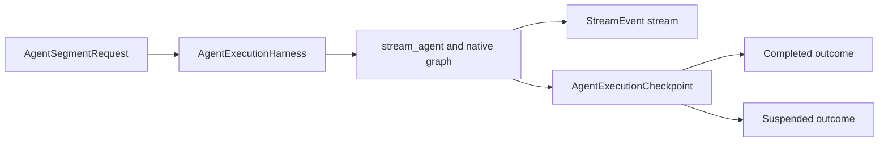
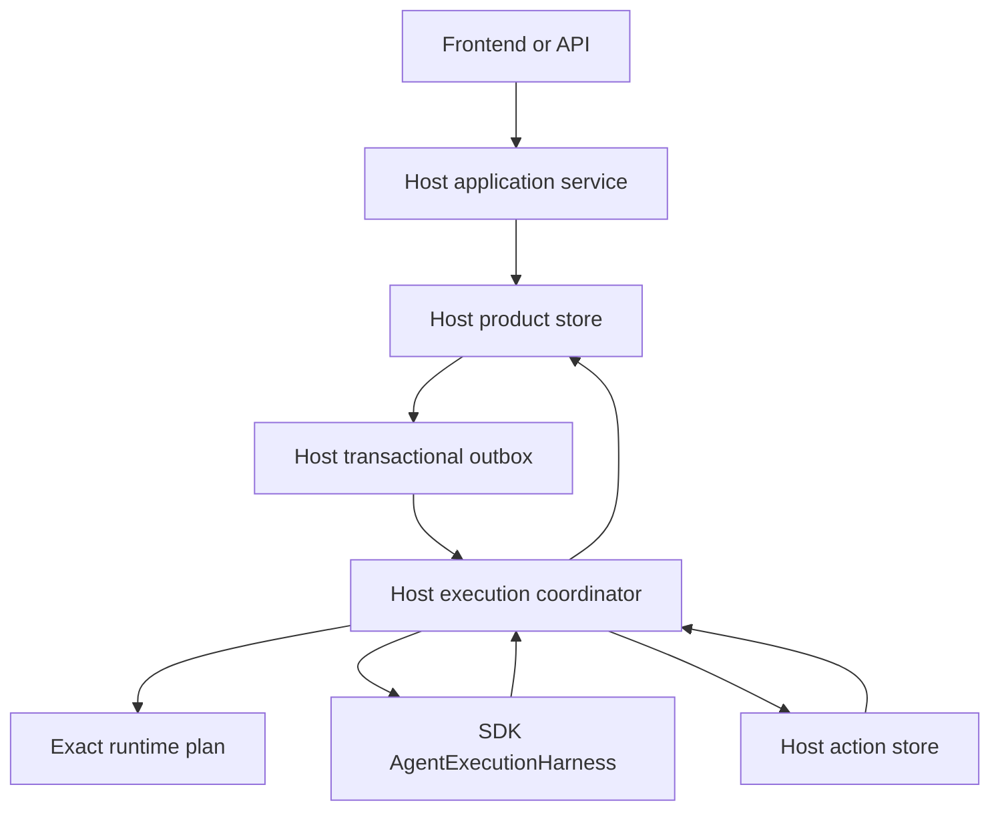

# Host-Owned Durable Sessions and Agent Segment Execution

## 1. Decision

The SDK exposes a small, host-neutral execution harness for one logical native agent
segment. It is not a workflow engine and it does not own product durability.

`AgentExecutionHarness` owns only the mechanics shared by ordinary hosts:

- start one `stream_agent()` segment from explicit prompt/history/deferred input;
- expose the SDK `StreamEvent` stream and native enqueue/interrupt controls;
- classify the boundary as `completed` or `suspended`; and
- return a canonical `AgentExecutionCheckpoint` containing recoverable messages,
  `ResumableState`, cumulative segment usage, and detached input-ledger state.

The harness deliberately owns no database, queue, scheduler, lease, retry daemon,
workflow graph, action store, session head, or crash-recovery policy. `stream_agent()`
remains the lower-level streaming API and its fast path is unchanged.

A durable host composes the harness with its own coordinator and store:

- YAACLI uses `SessionStore`, a SQLite outbox, and `LocalExecutionCoordinator`;
- YA Claw uses its SQL run/session state, scheduling, workspace lifecycle, and
  `RunCoordinator`; and
- another host may use the same harness without adopting either product model.

The host coordinator is the sole orchestration authority. It does not subclass an SDK
state machine and the SDK does not call back into a host scheduler.

## 2. Segment Boundary

A segment is one invocation of the native Pydantic AI graph that ends in exactly one of
two stable outcomes:

1. **completed**: the native result has a terminal output; or
2. **suspended**: the native result is `DeferredToolRequests` and requires host input.

A graph node, model request, tool call, token delta, or arbitrary Python instruction is
not an SDK recovery boundary. An in-flight segment may have external effects and
process-local state that cannot be reconstructed safely.

`AgentSegmentRequest` carries only segment inputs and process-local policies:

- `user_prompt`;
- canonical `message_history`;
- matching `deferred_tool_results` for continuation;
- usage limits and stream-recovery overrides; and
- an optional runtime-ready hook.

`AgentExecutionCheckpoint` is a value snapshot. It does not contain a live
`AgentRuntime`, `AgentContext`, `Environment`, model client, task, lock, queue, or
callable.

## 3. Host Composition Contract

A persistent host follows this ordering:

1. accept and commit user/product intent in host storage;
2. enqueue a host command in the same transaction when asynchronous dispatch is needed;
3. resolve the exact immutable runtime plan;
4. construct a fresh execution context from current host authority;
5. invoke one SDK segment;
6. stream transient events without treating them as canonical product state;
7. persist the returned checkpoint at the stable segment boundary;
8. either commit a terminal product revision or persist/wait for a complete action
   batch; and
9. for continuation, reconstruct a new segment from persisted history, state, usage,
   and `DeferredToolResults`.

The host must persist the checkpoint before publishing terminal success or exposing a
suspension as durable. The session head advances only on terminal publication; a
suspended checkpoint does not become a conversation head revision.

The SDK checkpoint is necessary but not sufficient for durable execution. Product
correctness still depends on host transactionality, idempotency, authorization,
cancellation fencing, and terminal commit semantics.

## 4. Identity and Exact Plan Reconstruction

Hosts keep product and runtime identities explicit:

| Identity | Owner | Purpose |
| --- | --- | --- |
| `session_id` | host store | conversation ownership and authorization scope |
| `revision_id` | host store | immutable committed session head |
| `logical_run_id` | host store and SDK context | one accepted product turn |
| `execution_id` | host coordinator | one process-owned execution of that run |
| `descriptor_id` | host plan registry | exact immutable runtime composition |
| `segment_index` | host coordinator | completed/suspended native boundary count |
| `input_id` | host inbox and SDK ledger | one accepted user or feature input |
| `action_batch_id` | host action store | one native deferred request boundary |

An immutable runtime descriptor must cover every input needed to rebuild behavior,
including native `AgentSpec`, host capability envelope, child-plan manifest, security
and workspace authority references, and executable identity. YAACLI uses one full
executable identity over participating first-party code/assets, critical dependency
versions, and Python/platform metadata. It does not keep separate workflow/application
version aliases after removal of the workflow engine.

A pending execution may run only when the exact descriptor can be reconstructed under
its recorded executable identity. Falling back to the current profile or current child
route is forbidden.

## 5. Crash and Restart Semantics

The harness provides no arbitrary graph resume and no completed-operation replay.
Persistent hosts therefore use a conservative recovery rule:

- a `pending` run whose start command was not dispatched may still be dispatched;
- a terminal run is already complete and is never executed again;
- a process-owned `running` or `suspended` execution found during startup is committed
  as `interrupted`; and
- the interrupted revision is built from the latest stable checkpoint when one exists.

The incomplete active segment is never replayed. This avoids claiming exactly-once
semantics for model calls, shell commands, MCP tools, filesystem writes, or opaque
external APIs.

`interrupted` is terminal for that execution. A product may offer an explicit new turn
from the interrupted revision, but it must not silently reuse the old execution ID or
pretend to resume an arbitrary graph node.

Normal application shutdown follows the same rule for work that cannot finish: task
cancellation commits `interrupted`, while explicit user cancellation commits
`cancelled`. These are distinct product outcomes.

## 6. YAACLI Product Store and Coordinator

YAACLI stores one transactional product model in SQLite:

- sessions and immutable head revisions;
- content-addressed runtime descriptors;
- logical runs and execution records;
- latest stable execution checkpoints;
- ordered user/feature inbox records;
- outbox commands and retry state;
- HITL action batches and decisions;
- bounded display/usage projections and terminal events; and
- process-local subagent records and their durable steering inboxes.

`SessionApplicationService` depends on the `SessionExecutionCoordinator` protocol. The
protocol exposes only `dispatch_outbox()`, `wait()`, and `cancel()`. TUI and headless
frontends use the same application boundary.

`LocalExecutionWorker` enters every exact runtime plan required by active configuration
or pending work, registers each plan by descriptor ID, and owns a
`LocalExecutionCoordinator`. The coordinator maps outbox starts to supervised asyncio
tasks. Outbox delivery is at least once and idempotent at the product identity.

A runtime plan may be shared by several sessions. YAACLI therefore holds its plan lock
only while one native segment is active. It releases the lock before waiting for HITL,
so a suspended session cannot block another session using the same descriptor.

## 7. Input and Terminal Fence

The host database is the source of truth for accepted input. A notification command is
only a wake signal and carries no canonical payload authority.

For active YAACLI runs:

1. `SessionStore.accept_input()` commits content, order, origin, priority, and stable
   identity;
2. `DurableInboxPumpCapability` drains accepted rows at native graph boundaries;
3. it calls native `ctx.enqueue()` only while the segment is bound;
4. native `EnqueuedMessagesEvent` reconciles the row and `RunInputLedger` to `applied`;
   and
5. accepted input that cannot be applied before terminal closure is explicitly rejected.

Initial and applied user input remains in `RunInputLedger` for compact/handoff recovery.
The ledger is retention truth, not an alternate delivery queue.

Before terminal publication the store closes ingress atomically. Every accepted row is
applied or rejected exactly once; no acknowledged input may be stranded behind a
terminal revision.

## 8. Deferred Interaction

A suspended segment produces exact `DeferredToolRequests`. YAACLI persists one action
batch with per-call approval or external-result items and sets the logical run to
`suspended`.

The coordinator waits outside the runtime-plan lock. Decisions are persisted with their
own idempotency IDs and wake the owning task. Once all items resolve, the coordinator
constructs matching `DeferredToolResults`, restores the latest checkpoint into a fresh
context, applies the cumulative remaining request budget, and starts the next segment.

Headless policy is explicit (`wait` or deterministic denial). Absence of a TUI is not an
implicit decision.

Because suspended process-owned work cannot survive restart, startup publishes an
`interrupted` terminal revision from the suspended checkpoint. Persisted actions remain
auditable but are not used to recreate the old task.

## 9. Tool Effects

The segment harness makes no durability claim about tool effects. A host may apply its
own operation journal and idempotency policy, but the SDK does not record/replay tool
results as an execution engine.

Useful host recovery classes remain:

| Class | Host behavior |
| --- | --- |
| deterministic-inline | pure computation over segment values |
| replay-safe | read-only operation may be retried by explicit host policy |
| idempotency-keyed | mutation accepts a stable operation key |
| ambiguous-effect | loss after start becomes unknown and requires reconciliation |

A segment crash never causes the harness to rerun a completed operation automatically.

## 10. Subagents

The SDK `SubagentExecutionService` remains host-neutral. Its store and driver must agree
on `restart_durable`.

The standalone SDK uses `InMemorySubagentExecutionStore` and
`InProcessSubagentDriver`; both are process-local.

YAACLI uses `SQLiteSubagentExecutionStore` plus `LocalSubagentDriver`:

- child descriptors, execution records, history, deferred state, usage, and steering
  intent are persisted for product inspection and in-process continuation;
- child execution itself is process-local (`restart_durable = False`);
- startup marks pending/running/suspended child orphans `lost` and rejects unresolved
  input rather than replaying model/tool work;
- exact owner scope fences inspection, steering, continuation, cancellation, and late
  commits;
- session tombstone closes child inboxes and persists cancellation commands; and
- completion delivery enters the canonical parent input path idempotently.

YA Claw keeps its SQL scheduler and async-task ownership while composing the same SDK
service/driver interfaces. Neither host inherits execution orchestration from the SDK.

## 11. Streaming and Product Events

`StreamEvent` values emitted during a segment are live observations. Provider token
fragments and tool-progress events may be transient. Canonical product state consists
of persisted input, stable segment checkpoints, immutable terminal revisions, and
idempotent terminal events.

A frontend may render live events immediately, but receipt of a token delta is not proof
that a segment checkpoint or terminal revision committed. `RUN_FINISHED` and
`RUN_ERROR` are published only after the SQLite terminal transaction.

## 12. Storage and Schema Policy

YAACLI uses one SQLite product database with foreign keys, WAL mode,
`synchronous=FULL`, a bounded busy timeout, and `BEGIN IMMEDIATE` writes.

Only an empty database may bootstrap the current schema. Any nonempty database must
already match the exact schema marker and normalized table/index definitions. Runtime
compatibility parsing, hidden repair, and automatic old-key normalization are forbidden;
migration is explicit and offline.

There is no second execution-engine database setting.

## 13. Verification Invariants

Tests must prove:

- SDK harness completed and deferred outcomes return canonical checkpoints;
- the harness owns no persistence/scheduler behavior and `stream_agent()` remains usable
  directly;
- YAACLI main turns, exact descriptor dispatch, outbox retry, cumulative request budget,
  HITL continuation, and terminal commits work through the local coordinator;
- a suspended run does not hold the shared runtime-plan lock;
- startup converts active main work to `interrupted` from the latest checkpoint and does
  not invoke the model again;
- pending exact plans execute only when their descriptor and executable identity are
  available;
- accepted input and HITL decisions are persisted before wake/application;
- process-local child execution persists product records but startup marks orphans
  `lost` rather than replaying them;
- owner tombstones fence child ingress and late success;
- YA Claw preserves SQL scheduling, workspace, AG-UI, HITL, memory, and cancellation
  semantics while using the SDK segment harness; and
- repository dependency/configuration/documentation surfaces contain no workflow-engine
  runtime path.
