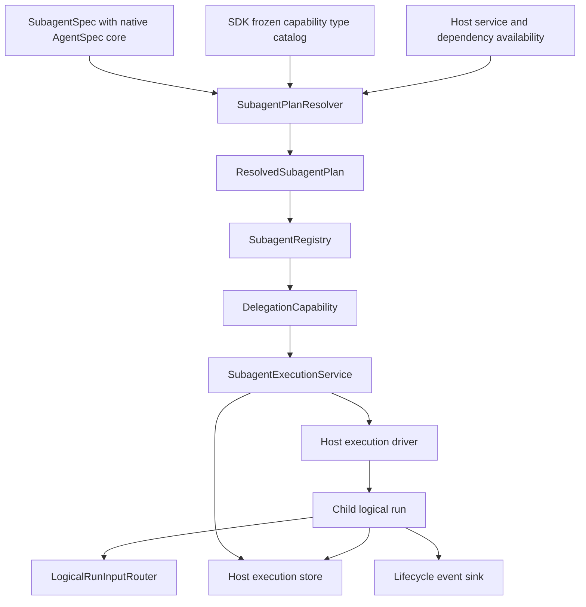

# Portable Subagent Runtime

## 1. Decision

YA Agent SDK 2.0 defines one portable subagent model shared by SDK hosts. SDK,
YAACLI, and YA Claw use the same definition, resolution, registry, execution-service,
lifecycle, steering, and completion contracts. They do not share one persistence or
scheduling engine:

- the standalone SDK provides an inline foreground execution host, in-process driver,
  and in-memory execution store;
- YAACLI replaces the execution host with its processor-owned fully asynchronous task
  host and binds the contract to SQLite product records plus process-local
  `LocalSubagentDriver`; restart orphans become `lost`;
- YA Claw binds it to existing SQL sessions, runs, async-task records, and execution
  supervisor.

A subagent definition uses the same Pydantic AI native `AgentSpec` core as a declarative
main-agent profile. A thin YA `SubagentSpec` envelope adds only delegation concerns that Pydantic AI
does not own: parent-facing routing, host requirements, history/fork policy, recursion,
and execution policy. YA does not define a second schema for model, name, description,
instructions, model settings, retries, or serialized capability configuration.

Both layers contain only serializable policy and references. They never embed live
Pydantic AI capabilities, toolsets, tools, model clients, contexts, closures, or host
controllers. The SDK resolves the native spec and YA envelope against the frozen
capability type catalog plus host service/dependency availability into an immutable
execution plan after Environment and context contributions are available.

Foreground delegate, background delegate, named resume, and self fork are operations of
one `SubagentExecutionService`. They are not separate generated-tool implementations.
The service delegates coroutine ownership to a typed `SubagentExecutionHost`: the SDK
default executes foreground work inline, while YAACLI and durable hosts replace that
adapter with their own asynchronous scheduling policy.

This is a breaking replacement for `SubagentConfig`, `Toolset.with_subagents()`, hidden
delegate backends, private roster introspection, and Claw's duplicate child-profile
resolver. YAACLI retains host-owned process-local background task scheduling behind the
portable execution-host contract. There is no compatibility adapter in the 2.0 runtime.

## 2. Goals

- Make child identity and policy portable across SDK hosts.
- Resolve capabilities coherently rather than filtering a parent's final tool list.
- Separate catalog/availability, presentation tools, execution, storage, and host
  scheduling.
- Give foreground and background calls the same lifecycle and result semantics.
- Preserve targeted steering and every accepted child-run user input through native
  recovery, compact, handoff, and durable suspension.
- Keep final main-agent-only enforcement at the execution boundary.
- Let YAACLI retain exact child records and descriptors while marking process-local restart orphans `lost`.
- Let YA Claw retain its durable SQL child-session model while deleting resolver and
  transport duplication.
- Keep logical-run and durable correlation UUIDs internal while exposing short,
  route-prefixed execution handles suitable for model-facing resume and UI display.
- Remove private SDK attribute access from product behavior.

## 3. Non-Goals

- A universal distributed workflow engine inside the SDK.
- Automatic inheritance of arbitrary parent capabilities.
- Tool-name slicing of `CombinedCapability` or opaque external capabilities.
- A global singleton registry shared across unrelated root executions.
- Treating typed lifecycle events as canonical child-result delivery.
- Making the standalone SDK in-memory driver claim restart durability.

## 4. Architecture



`SubagentRegistry` describes available targets and resolves plans. It is distinct from
`ActiveRunRegistry`, which locates currently accepting main/child logical-run routers.
It is also distinct from `SubagentExecutionStore`, which records execution lifecycle and
results.

## 5. Portable Definition

`SubagentSpec` is a versioned, serializable envelope with:

- `agent`: a native Pydantic AI `AgentSpec`;
- parent-facing routing policy not represented by `AgentSpec.description`;
- host execution requirements used for availability diagnostics;
- target kind and history policy;
- recursion and child-spawn policy;
- default execution-mode policy; and
- host-neutral linkage metadata used for display and audit.

The nested `AgentSpec` is authoritative for every native agent-definition field,
including name, description, instructions, dependency/output schema, model reference,
model settings, retries, end strategy, tool timeout, metadata, and serialized capability
list. Pydantic AI's native spec validation, `TemplateStr` rendering, capability
serialization names, JSON schema generation, and custom capability registry are reused
directly. YA profiles do not copy those fields into another wire format or define a
parallel `CapabilitySpec`. Packages that parse YAML specs or compile `TemplateStr`
install Pydantic AI's `spec` extra; template support is not assumed from the base
package. When `create_agent(spec=...)` receives no explicit `agent_name`, it preserves
`AgentSpec.name`; only an explicit host override replaces it, with `"main"` used when
neither is present. Selected third-party types come from the SDK-owned immutable
`CapabilityCatalog` defined by
[Custom Capability Type Discovery](../06-capability-plugins/README.md). Hosts and
subagent drivers do not discover entry points or assemble their own custom type
registries.

The native capability list is the exact coherent child feature grant set. Its entries
name Pydantic AI capabilities or registered YA custom capability types with typed
configuration; it never lists private tool classes or carries live
`AbstractCapability` instances. Context and Environment/resource contributions make
root instances and typed dependencies available but do not mutate the immutable type
catalog or enable an omitted feature.
The envelope's requirements cover only target-level host availability, such as a
workspace class or durable driver, that is not already implied by capability
construction.

A named child receives only the capabilities in its native `AgentSpec`. Omission means
no grant, not “inherit every parent tool”. If `AgentSpec.model` is absent, an explicit
envelope model policy may ask the host to supply the parent's model reference; a
present native model always wins. This is reference inheritance, not live-object
inheritance.

### 5.1 Effective output contract

The resolver derives one effective Pydantic AI output contract rather than passing a
host `output_type` that silently overrides native `AgentSpec.output_schema`:

- without a native `output_schema`, the base is the host's standard child result type;
- with a native `output_schema`, the base is Pydantic AI `StructuredDict` for that
  schema;
- when a recursively selected capability type or a leaf in the enumerated host grant
  graph implements `SupportsDeferredOutput`, `DeferredToolRequests` is added to the
  effective output alternatives; recursive selection follows only native `from_spec()`
  parameters typed as `CapabilitySpec`, never arbitrary capability metadata; SDK
  `ToolApprovalCapability` and `UserInteractionCapability` implement that marker; and
- an unrepresentable host/native combination fails plan resolution.

The effective output contract and deferred-call policy are part of the plan descriptor
and fingerprint. Restore rejects a descriptor whose deferred flag disagrees with its
normalized capability specs and host grants. Structured output never disables selected host-visible
HITL, and enabling HITL never discards the native output schema.

### 5.2 Portable template projection

Every host supplies the same frozen, serializable `AgentTemplateContext` shape:

```python
class AgentTemplateContext(BaseModel):
    template: dict[str, JsonValue]
```

Only native `AgentSpec.description` and `AgentSpec.instructions` are rendered, because
those are the fields Pydantic AI explicitly types as `TemplateStr`. Model references,
metadata, schemas, model settings, and serialized capability strings remain literal even
when they contain `{{...}}`. Template expressions therefore read only the bounded
`template.*` projection and cannot reach filesystem/shell authorities, stores, clients,
credentials, callbacks, or arbitrary host context.

The resolver canonicalizes the projection before rendering, so description/instruction
rendering is deterministic and does not need a runtime lease.

### 5.3 Self fork

`self` is a built-in target policy, not a separate delegate implementation. The parent
host resolves a `SelfForkPolicy` alongside the main plan. It defines:

- which capability references from the parent's declarative plan are forkable;
- which parent history snapshot is copied at spawn;
- whether model/settings references are inherited;
- which stores are shared by protocol and which are isolated; and
- whether recursive delegation is granted.

The resolver rebuilds the self-fork plan from catalog references. It does not clone
live capability instances, inspect private toolsets, or filter final tools by name.
Main-only and delegation capabilities are absent unless the explicit policy grants
them. An opaque external capability that has no re-resolvable catalog entry cannot be
silently copied into a durable or self-fork child.

## 6. Resolution

`SubagentPlanResolver` receives the host's SDK `CapabilityCatalog` and runs only after
the root Environment has entered, resumable resources have restored, and context
contributions have been collected. The static custom-type catalog is already complete;
Environment/context contributions complete dependency and root-instance availability
without mutating it.

Resolution performs:

1. native `AgentSpec` validation with Pydantic AI built-ins and
   `CapabilityCatalog.custom_capability_types`;
1. stable target-name, envelope-policy, and portable-template projection validation;
1. host requirement and capability dependency availability checks;
1. model inheritance or native model-reference resolution;
1. native/custom capability construction with provenance, selecting exactly the native
   capability entries rather than all available context/Environment contributions;
1. effective base/deferred output construction;
1. injection of only the enumerated child runtime foundation, durability/ingress, and
   final policy capabilities;
1. recursion and main-only policy checks;
1. semantic capability ordering and duplicate singleton validation;
1. durable-execution compatibility validation when the selected driver is durable; and
1. immutable plan and plan-fingerprint creation with canonical deep copies of portable
   spec, template, schema, and history values.

The resulting `ResolvedSubagentPlan` retains the normalized native `AgentSpec` and adds
the concrete host-local model binding, exact feature grants, separately identified
host-injected capabilities, effective output contract, template projection, typed
runtime requirements, visibility policy, history policy, driver policy, and stable
fingerprint. The fingerprint is the full 64-lowercase-hex SHA-256 digest of the canonical
plan input, and the descriptor identity is `<route>:<full fingerprint>`; descriptor,
host-capability configuration, and durable registration identities never truncate that
digest. A serializable plan descriptor records the native spec, envelope, audit
provenance for custom types actually used, and resolved references for persistence;
live capability objects remain process-local. Resolver, descriptor, restore, registry,
and driver boundaries clone portable values through canonical serialization. A caller
cannot mutate nested metadata/history/schema behind a previously computed fingerprint.
Packaging provenance is excluded from the plan fingerprint and resume compatibility.

Availability diagnostics identify the missing host requirement or capability dependency
and source spec. A missing requirement disables or rejects that target before
invocation. Optional behavior is expressed by typed capability/envelope configuration,
not by probing the parent's private toolset.

## 7. Capability and Safety Boundary

A child plan explicitly distinguishes its exact native feature grants from the
enumerated host-injected runtime/policy foundation. Capabilities own their tools and
instructions together. Child runtime entry binds this already resolved list and never
reruns the root context/Environment contribution merge. The resolver never extracts a
subset from an arbitrary `CombinedCapability`, dynamic toolset result, MCP wrapper, or
Tool Proxy cache.

`ToolVisibilityCapability` remains the final execution-boundary defense. It enforces:

- main-agent-only exclusion;
- host authorization and current dynamic policy;
- recursion limits;
- execution-mode restrictions; and
- stale-plan rejection.

This final filter is defense in depth. It cannot grant a feature omitted from the child
plan or repair an incoherent tool-only slice.

Child plan fingerprints and descriptor IDs are stored with durable executions. Every
child context also carries that exact descriptor identity while it runs. Nested spawn
authorization resolves the parent's immutable descriptor and checks its `spawn_targets`;
it never consults the route's mutable active plan, even after that active route changes
or is deleted. Resume resolves the prior execution's exact historical `descriptor_id`
and full fingerprint, restoring that immutable plan through the retained-plan provider
when necessary. It never substitutes the route's current active plan. If the exact
descriptor-selected executable plan is unavailable, resume or nested authorization fails
explicitly.

## 8. Public Registry

`SubagentRegistry` is a public typed service with four responsibilities:

- register and inspect portable specs;
- resolve or retrieve immutable plans;
- report target availability and diagnostics; and
- render bounded parent-facing roster/instruction data.

Presentation is a consumer of the registry. `DelegationCapability` contributes the
model-callable tools and dynamic roster instructions, but it does not hide the registry
inside a generated tool class. The instruction roster includes at most the first 20
routes, truncates each description to 300 characters, and directs the model to paged
`subagent_info` discovery when more routes exist.

YAACLI and YA Claw never read `_get_roster_instruction`, `_can_delegate`,
`_available_subagents`, `__delegate_backend`, `_get_tool_instance`, or equivalent
private attributes. Host UI and configuration validation use the registry directly.

Registry scope is one root runtime plan or one versioned host catalog. It keeps two
explicit indexes: one active plan per route for new spawn/roster operations, and every
retained descriptor version needed by existing executions. Existing records resolve by
`descriptor_id`, never by the route's mutable active plan. If a record references a
valid descriptor that is not resident, `SubagentExecutionService` asks its optional
`RetainedSubagentPlanProvider` to restore that exact historical plan, registers it only
as retained, and then revalidates descriptor ID, route, and full fingerprint. This lazy
path permits terminal resume and recovery after the active route changes or is deleted;
it never falls back to the current route. Model-facing listing exposes only active
routes; durable driver bootstrap may enumerate all registered versions. Registration,
lookup, and listing return independent portable plan snapshots; active execution state
is not stored in the registry.

## 9. Execution Service

`SubagentExecutionService` exposes host-independent operations:

- `spawn` starts a named or self target and returns a stable handle;
- `resume` starts a linked continuation from a terminal child execution's exact
  committed history and immutable descriptor;
- `steer` submits structured input to an accepting child logical run;
- `cancel` requests idempotent cancellation;
- `wait` waits for a terminal result when the caller needs foreground semantics;
- `get` retrieves one execution; and
- `list` retrieves children visible from the current parent scope.

The service accepts a resolved target, structured initial input, execution mode,
parent/session linkage, stable idempotency key, and optional resume identity. It returns
public records and handles, never an SDK-generated tool instance.

Every model-facing execution operation is authorized by one stable
`delegation_scope_id`: the root logical-run ID for an SDK runtime and the session ID for
a durable host. Spawn idempotency is unique within that scope, children inherit the
scope, and `get`, `list`, `wait`, `steer`, `cancel`, `resume`, deferred continuation,
and completion recovery cannot observe records owned by another scope. `wait` authorizes
the record before touching a host task, so a guessed foreign handle cannot become a
timing oracle. Privileged host inspection is a separate admin API and is never exposed
through model tools.

### 9.1 Foreground and background

Foreground `delegate` is:

```text
spawn(mode=foreground) -> inline child operation -> return bounded execution result
```

The standalone SDK's default `InlineSubagentExecutionHost` supports foreground only.
Caller cancellation remains attached to the calling tool. Child terminal state and a
bounded output page are returned as structured execution data, including the public
`execution_id`. A host that needs background mode must inject an execution host that
explicitly supports it.

Background `delegate` is:

```text
spawn(mode=background) -> return bounded execution result immediately
```

Both return the same structured projection with `execution_id`, route, mode, state,
resume linkage, bounded error metadata, and a paged output field. They create the same
execution record, child logical run, history, input routing, usage ownership,
cancellation semantics, and lifecycle events. They differ in coroutine ownership and
whether the calling tool waits. Host mode is fixed by default and omitted from the
model-facing `delegate` and `resume_subagent` schemas; construction rejects any visible
route that does not allow that fixed mode. An application exposes mode override only
when it intentionally supports both semantics.

Multiple foreground delegates requested in one parent model step may execute
concurrently when the selected driver supports it, but the parent still receives their
results as ordinary tool results. Background completion is delivered later through the
canonical completion path in Section 13.

The model-facing capability exposes distinct spawn and continuation tools:

- `delegate(subagent_name, prompt)` starts a new execution;
- `resume_subagent(execution_id, prompt)` starts a linked execution from that exact
  terminal record and returns a new `execution_id`;
- `subagent_info(execution_id=...)` reads one bounded output page, while the no-ID form
  returns independently paged active plans and execution summaries;
- `wait_subagent(execution_id=...)` returns one bounded result page, while the no-ID form
  snapshots every current nonterminal execution, waits in batches of 20 under one
  optional overall timeout, and returns independently paged summaries; and
- `steer_subagent` and `cancel_subagent` target one exact `execution_id`.

`delegate` never accepts a resume identity, and `resume_subagent` never asks the model to
repeat the route. Foreground and background return the same JSON projection. Text output
is returned directly inside the projection's `output.content`; structured output is
canonical JSON text with `content_type="json"`. Output pages default to 4,000 characters
and are capped at 16,000. `next_offset` points to the next page. Plan and execution
lists default to 20 entries per page and are capped at 100. List and fan-in projections
omit output, usage, descriptors, and deferred payloads. Stores may implement the bounded
page protocol so inspection does not deserialize records outside the requested page.

### 9.2 Execution record

A `SubagentExecutionRecord` includes:

- execution and parent linkage;
- target name, target kind, YA envelope version, native `AgentSpec` hash, plan
  fingerprint, and immutable plan-descriptor reference where durable;
- explicit `foreground` or `background` mode;
- host driver and durable backend linkage where applicable;
- queued/running/suspended/completed/failed/cancelled status;
- child logical-run and active agent identity;
- stable owner scope and scope-local idempotency identity;
- initial-input, history, result, error, and cumulative usage references;
- current segment index plus pending deferred requests/results while suspended;
- independent serialized child resumable state and durable steering inbox state;
- correlated parent completion-input identity plus completion-delivery state; and
- creation, update, and terminal timestamps.

Public execution handles are short, route-prefixed identifiers in the form
`<route>-<4hex>`, for example `code-reviewer-f1a2`. Foreground and background use the
same format. The model receives and reuses `execution_id` for resume, wait, steer, and
cancel; it never writes an internal UUID. Explicit `mode` remains canonical record data,
so policy and UI behavior never infer execution semantics from the handle.
Logical-run IDs, operation identities, and durable correlations remain opaque internal
values. Model-facing inspection projects only operational status/result fields, and
steering returns the public execution handle plus disposition; neither surface exposes
child logical-run, inbox-input, enqueue, idempotency, descriptor, usage, deferred-payload,
or resumable-state identities.

## 10. Execution Host, Driver, and Store Boundary

The execution service delegates coroutine ownership, execution, and persistence through
typed execution-host, driver, and store contracts.

### 10.1 Execution host

`SubagentExecutionHost` owns scheduling only. `InlineSubagentExecutionHost` directly
awaits the foreground operation in the caller task. Hosts such as YAACLI inject a task
host that starts background work, waits, cancels, and closes it under the host lifecycle.
The service retains lifecycle and record semantics but does not force all hosts through
an SDK-owned detached `asyncio.Task`. Host completion failures remain waitable until
observed, and service close first stops new spawn admission, waits for admitted records
to register with the host, then closes tasks and storage.

### 10.2 Driver

A driver admits, resumes, signals, cancels, and observes child execution. It binds the
resolved child plan and logical-run router and respects host scheduling constraints. An
ordinary SDK/Claw driver may create the child `AgentRuntime` directly from that plan; the
YAACLI local driver selects an exact persisted plan and composes host inbox capabilities.
No driver recollects or auto-enables context/Environment
features. The driver does not resolve subagent definitions or render model tools.

Every `SubagentDriverOutcome` reports the disposition of the execution's initial input.
The execution service persists it as `accepted` at creation but does not claim canonical
application before driver admission. The driver reports `applied` only after the prompt
has entered the child's canonical input ledger or an equivalent durable host boundary;
a failure or cancellation before that point reports `rejected`. Failure after admission
remains `applied` and cannot be downgraded, because model execution failure does not
erase accepted canonical history.

### 10.3 Store

A store commits execution records, immutable plan descriptors/references, child
history/state references, usage, terminal results, completion-delivery state, and
idempotency keys. In-memory storage is valid for
the standalone SDK, but a durable host must persist before acknowledging background
spawn, steer, cancellation, or completion.

The SDK does not require every host store to implement the same database schema. It
requires the lifecycle, owner-scope authorization, and scope-local idempotency semantics
exposed by the typed contract. Public handles are store-unique: a store reports a typed
execution-ID conflict atomically at create, and the service retries handle allocation
without conflating that collision with an idempotency replay. `SubagentExecutionRecord`
schema version 3 is a hard
cutover; a durable host rejects records or tables without owner scope, independent child
state, steering inbox, and parent-delivery correlation instead of guessing or silently
migrating them at runtime.

## 11. Child Context, History, and Input

Each child execution has:

- a distinct child `AgentContext` and Environment binding;
- a distinct logical run ID and `LogicalRunInputRouter`;
- a distinct `RunInputLedger` and canonical message history;
- an isolated run-local capability state set; and
- explicit references to any shared task, note, artifact, or host services.

Sharing a typed durable store does not mean sharing a mutable `AgentContext`. A child
cannot mutate parent run-local fields by object aliasing. Task, note, input-ledger,
file-inspection, Tool Proxy, deferred, and usage state are independent snapshots persisted
with the child execution. Environment and routing authorities are shared only as
explicit host services and are rebound after restore; they are never recovered from the
currently visible TUI session.

Named `resume` uses a terminal child execution/history identity to create a linked new
execution, not just a display name. It resolves the prior record's exact descriptor and
fingerprint, including through the retained-plan provider when necessary, and starts the
new execution from that immutable plan even when the active route now points elsewhere
or no longer exists. A parent-local stable name may point to the latest linked child
continuation, but resolution still begins from that execution record and its exact
`descriptor_id`; it never performs compatibility-based active-route selection. The
store preserves every execution linkage for audit.

A native `DeferredToolRequests` suspension is different: the host must resolve every
pending approval and external call exactly once with matching `DeferredToolResults`,
persist those results, increment the segment index, and continue the same execution and
child logical-run identity. History and `RunUsage` remain cumulative across segments;
the original prompt is not replayed and denied effects are not executed.

A host that supports nested child HITL injects `SubagentDeferredResolver`. The service
first commits the suspended record, then invokes that host boundary and applies its
results through the same exact-ID continuation path as public `continue_deferred()`.
Foreground `wait()` therefore spans every host-resolved segment and never returns a
suspended record as the delegate result. Without a resolver, suspension remains durable
and explicit until the host calls `continue_deferred()`. Recovery schedules a suspended
record automatically only when a resolver is configured.

The child's initial delegation prompt begins in `accepted` state and is retained as its
initial logical-run input with its source only when the driver crosses its canonical
admission boundary. `record_initial()` is that boundary for the in-process and YAACLI
native drivers; an externally hosted driver may use an equivalent committed host input
record. A pre-admission resolver/model/driver failure or cancellation rejects it, while
a post-admission model failure leaves it applied. Every accepted user or parent-targeted
steer/queue input is assigned a stable `input_id`, stored structurally, and applied
through the child router. Applied user input survives compact and handoff exactly as
defined by `RunInputLedger`; native attempt recovery and durable workflow replay do not
create duplicates.

A self fork copies the configured bounded parent canonical-history snapshot at spawn.
It never shares the live parent message list or consumes future parent messages
implicitly.

## 12. Active Steering and Cancellation

Every accepting child registers its logical-run router in the root execution's shared
`ActiveRunRegistry`. The registration handle includes child and parent identity,
owner-loop/driver information, accepting state, and an ownership-safe unregister token.

`steer(handle, content, priority)`:

1. authorizes parent/host scope;
1. derives a replay-stable operation identity from parent logical run, native
   `tool_call_id`, operation kind, and target/resumed execution;
1. durably records input first when the driver is durable;
1. resolves the active child router or durable inbox;
1. enqueues through native Pydantic AI steering from the owning run/node driver; and
1. reports accepted, native-enqueued, applied, or rejected state accurately.

A driver cannot acknowledge application merely because it accepted a notification.
When a host provides `SubagentSteeringDriver`, its durable inbox is the authoritative
admission boundary even if an in-process child router is also active; this prevents a
live fast path from bypassing persistence. YAACLI uses the workflow-owned graph-boundary
drain and terminal fence defined in the durable-session spec; Claw uses its active
router plus persistent continuation inbox. Both retain durable inbox records across
suspension or process loss. A suspended durable execution may accept input for its next
continuation segment, and each input identity is enqueued at most once per native
attempt.

Admission and terminal closure are linearized at the authoritative router/inbox. If
closure wins, `steer` returns a normal rejected receipt instead of raising a tool error.
An equal idempotent retry preserves the existing input identity and final disposition.
Unknown handles, owner-scope violations, malformed content, and idempotency-key reuse
with different content remain errors. The in-process SDK driver rejects unresolved input
on terminal cleanup and does not claim restart persistence.

Cancellation is idempotent and status-aware. Continuation admission and cancellation
serialize per execution, while stores preserve terminal lifecycle state against stale
non-terminal or different-terminal saves. It closes ingress, requests driver
cancellation, reconciles running tools/resources, records terminal state, and ensures a
late result cannot be delivered as successful completion. Cancelling a suspended
execution terminalizes it as `cancelled`, rejects input that can no longer be applied,
emits one canonical completion event, and performs any required completion delivery;
repeated cancellation of any terminal record returns that record unchanged.

## 13. Completion and Wake Delivery

A terminal child result is committed to the execution store before parent delivery.
The result includes status, bounded summary, full-result reference where retained,
child history reference, usage, and error metadata.

Child-linked background completion uses a durable delivery record and outbox:

1. commit child terminal state and one completion envelope;
1. if the parent logical run is active, submit the envelope to its router;
1. if the parent is suspended, retain it in the parent's continuation inbox;
1. if product policy permits waking an idle parent, create one durable continuation
   input/run; and
1. mark delivery complete only after the correlated parent input is canonically
   applied. If the parent terminal fence rejects that input, clear the correlation and
   restore pending delivery for redirection to a later compatible run.

Delivery is idempotent by child execution/result identity. The canonical completion
envelope uses the same bounded model projection as the tool result: it includes the
execution handle and at most the default 4,000-character output page, with
`next_offset` directing the model to `subagent_info` when more is needed. It never
injects full usage, descriptor, deferred, or resumable state. A typed host lifecycle
event may notify the UI immediately, but it cannot replace the canonical completion
envelope when the model must observe the result. Detached background execution commits
terminal state with delivery `not_required`; it never injects completion into or wakes
the parent.

Foreground completion remains the normal delegate tool return. The same committed
terminal result backs both the bounded return and paged later inspection.

## 14. Lifecycle Events

The shared public event model includes:

- execution accepted;
- queued/running/suspended;
- input accepted/native-enqueued/applied/rejected;
- cancellation requested;
- completed/failed/cancelled; and
- completion delivery pending/applied, with rejected parent input redirected from
  pending state.

Every event carries explicit execution mode, execution ID, parent identity, target name,
child logical-run identity, and relevant input/result correlation. Hosts project these
events into their own protocol/UI without inferring semantics from identifiers.

## 15. Standalone SDK Adapter

The SDK reference adapter uses an in-memory execution store and in-process async driver.
It supports foreground/background spawn, concurrent children, targeted steering,
cancellation, inspection, and result delivery for the life of the root process.

Its contract is intentionally truthful:

- completed child histories may be exported through SDK resumable state;
- active coroutine/task state is not serializable;
- process loss rejects or loses active in-memory executions; and
- restart durability requires a durable host scheduler such as YA Claw; YAACLI's local child driver is process-bound.

`DelegationCapability` depends only on the public registry and execution service. The
in-process implementation does not expose hidden generated-tool methods for hosts to
reuse.

## 16. YAACLI Adapter

YAACLI uses the durable session architecture in
[06-yaacli-durable-sessions.md](06-yaacli-durable-sessions.md):

- each child execution is process-local but selected from its exact persisted descriptor
  rather than a worker-global current session;
- the SQLite product database owns owner-scoped child records, independent resumable
  state, history, steering inbox,
  actions, cumulative usage, deferred segment state, results, and completion delivery;
- the interactive TUI fixes model-facing `delegate` to background mode, omits the mode
  argument, and commits the child record before immediately returning a structured
  result with a `<route>-<4hex>` execution handle;
- the one-shot headless frontend fixes the same tool to foreground and waits for its
  `<route>-<4hex>` execution before shutdown;
- in both frontends, the processor-owned execution host, rather than the SDK inline
  adapter, owns the child task and supports bounded wait/cancel/close;
- detached background children do not publish detailed model/tool streams into an
  abandoned turn-local queue; lifecycle and readiness are projected before AGUI replay
  persistence by explicit record mode;
- targeted steering enters the child's durable inbox and workflow, never a
  process-local MessageBus; and
- child completion reaches the parent through its durable router/continuation inbox;
- suspended native tool requests continue in-process under the same child execution and
  cumulative segment usage; a restart marks the orphan `lost`; and
- all child inspection, continuation, and delivery recovery is scoped to the owning
  session.

The removed combined shell/subagent `BackgroundMonitor` no longer owns active subagent
records, result payloads, usage publication, or delivery markers. YAACLI's dedicated
processor execution host owns process-local tasks; SQLite remains record and delivery
truth. A TUI monitor may attach to execution records and events as a projection, but
presentation does not replace either task ownership or canonical state.

Switching TUI sessions detaches presentation from old-session children. It does not
reparent them or allow late results into the new session. Explicit cancel/delete policy
controls their execution, and each child receives its own reconstructable Environment
lease rather than inheriting a revocable parent coroutine lease.

## 17. YA Claw Adapter

YA Claw retains its durable SQL architecture:

- child sessions and runs remain execution truth;
- `session_async_tasks` remains the durable parent-child orchestration record;
- `ExecutionSupervisor` and run coordinator remain the scheduler;
- existing parent-local names and child-session continuation remain product behavior;
- terminal wake uses an idempotent SQL outbox and the parent logical-run/queued-run
  boundary; and
- ownership/authorization stays session-scoped.

Claw replaces its copied profile derivation, builtin allowlist, skill/MCP assembly, and
private SDK resolver logic with native `AgentSpec` cores inside `SubagentSpec`, plus
`SubagentPlanResolver` and `SubagentRegistry`. Child profiles embed or reference the
native agent spec and store an immutable content-addressed descriptor containing the
spec, complete envelope, used custom-type provenance, resolved references, and
fingerprint; they
never rely on a mutable profile name for recovery or filter a parent tool surface.

The Claw driver maps both foreground and background executions to child session/run
records. Foreground is `spawn + durable wait` over the same SQL-backed child record;
background returns the handle. SDK-authenticated spawn preserves that public handle
byte-for-byte instead of applying Claw's human-name normalization, rejects handles beyond
the SQL boundary's length, and treats a conflicting name as a retryable typed allocation
collision. The supervisor must provide deadlock-free nested capacity. A short-lived
in-process helper, if ever offered, is a separately named,
explicitly non-durable API with different records and guarantees and is not a driver
choice behind portable delegation.

Claw's self-call HTTP client may remain an isolation/authorization transport, but it is
an adapter behind `SubagentExecutionService`. Model tools and SDK hosts do not depend on
its routes or token handling.

The existing Claw async-subagent product model is therefore retained rather than
replaced by YAACLI's coordinator. Its 2.0 changes are shared resolution, typed
service/driver boundaries,
native child input routing, and idempotent completion delivery.

## 18. Durable Execution Rules

A durable driver obeys these additional rules:

- store an immutable descriptor containing the native `AgentSpec`, complete YA envelope,
  used custom-type provenance, resolved references/injections, effective output/template
  contracts, and plan fingerprint before start;
- build the custom-type catalog through the SDK, then discover and bind every required
  executable durable plan before the workflow engine launches;
- use stable native agent names plus globally unique, versioned capability, MCP, and
  executable-toolset IDs; descriptor identities embed the complete 64-hex plan
  fingerprint without truncation;
- select only an already registered plan from a workflow descriptor and fail explicitly
  when compatible code for a retained plan is unavailable;
- create children with a stable spawn idempotency key;
- issue spawn/notification/cancel operations from workflow-safe host code, not an activity
  mutation that may disappear on replay;
- persist input and completion payloads outside transient workflow notifications;
- account child usage through explicit return/store channels rather than `RunContext`
  mutation; and
- classify child tool side effects under the host's durable recovery policy.

A parent workflow replay cannot spawn a duplicate child. A child workflow terminal
retry cannot wake the parent twice.

## 19. Migration

The 2.0 cutover proceeds as one coherent replacement:

1. adopt native Pydantic AI `AgentSpec` as the declarative agent core and introduce the
   thin YA `SubagentSpec` envelope, catalog-aware plan resolver, public registry,
   execution service, records, and lifecycle events; selected custom types come only
   from the SDK catalog;
1. make `DelegationCapability` a thin model-facing adapter over those public services;
1. replace tool-name inheritance with explicit capability grants and self-fork policy;
1. move final main-only enforcement into the resolved child execution boundary;
1. route all child input and completion through logical-run routers and durable inboxes;
1. bind the standalone SDK, YAACLI, and Claw drivers;
1. migrate builtin/custom subagent definitions to native `AgentSpec` plus the portable
   YA envelope; and
1. delete `SubagentConfig`, `Toolset.with_subagents()`, individual generated delegate
   implementations, hidden backend attributes, MessageBus delivery, copied Claw
   resolution, and mode inference from IDs; retain YAACLI process-local ownership only
   through the typed execution-host adapter.

Old markdown definitions are migrated offline to the versioned 2.0 schema or rejected
with diagnostics. Old unscoped durable execution tables are likewise rejected with an
explicit offline-migration/recreate instruction. `tools`, `optional_tools`, and implicit
empty-list inheritance are not interpreted at runtime.

## 20. Verification Invariants

### Definition and resolution

- native `AgentSpec` plus the YA envelope serialize without live runtime objects;
- native/custom capability entries and host requirements resolve with SDK type
  provenance, without host-specific entry-point or custom-registry logic;
- a context/Environment capability omitted from a named child's `AgentSpec` remains
  unavailable, while every mandatory host injection is enumerated and fingerprinted;
- no native agent-definition or capability wire field is duplicated outside
  `AgentSpec`;
- native structured output composes with `DeferredToolRequests` without either contract
  being overridden;
- all native templates validate and render through the same serializable `template.*`
  projection on SDK, YAACLI, and Claw;
- no path slices a `CombinedCapability` or private toolset by tool name;
- named children do not inherit omitted parent behavior;
- self fork rebuilds only its explicit fork policy;
- full SHA-256 fingerprints and `<route>:<full fingerprint>` descriptor identities
  reject incompatible durable resume without truncation collisions; and
- final visibility enforcement blocks main-only and unauthorized tools.

### Service and lifecycle

- standalone foreground executes inline in the caller task over the same portable record
  model used by hosted background execution;
- `delegate` starts only new work, `resume_subagent` accepts one exact terminal
  `execution_id`, and both modes return the same structured handle/result projection;
- public handles use `<route>-<4hex>` regardless of mode, while each linked resume gets a
  new handle and records `resumed_from`;
- specific output, list, fan-in, and background-completion projections enforce their
  default and maximum budgets without exposing descriptors, full usage, or deferred
  payloads;
- repeated spawn with one idempotency key creates one child within an owner scope while
  the same key in another scope remains independent;
- every model-facing operation and pending-delivery recovery is owner-scoped;
- a suspended child continues in place with exact deferred-result matching, stable
  execution identity, incremented segment index, and cumulative usage;
- terminal `resume` creates a linked new execution from the exact historical descriptor,
  including when the active route changed or was deleted, rather than impersonating
  deferred continuation or falling back to current configuration;
- mode is explicit in records/events and never inferred from IDs;
- targeted steer reaches the intended concurrent child router;
- cancellation and terminal completion races produce one terminal state;
- a host event alone cannot mark model-visible completion delivered; and
- parent and child usage commit exactly once.

### Context and input

- parent and child do not share mutable run-local context;
- named resume selects the correct terminal child history and its exact historical
  descriptor/full fingerprint, including after active-route drift or deletion;
- self fork receives one bounded spawn-time history snapshot;
- every accepted child user steer/queue input survives recovery, compact, handoff, and
  durable suspension in order;
- pre-admission initial-input failure is rejected, while failure after canonical
  admission remains applied; and
- rejected/unapplied input is not fabricated as applied canonical history.

### YAACLI

- process termination preserves exact child records, histories, and descriptors, while
  startup marks pending/running/suspended process-local executions `lost` without
  replaying model or tool work;
- session switching cannot route old-child completion to the new session;
- TUI monitor loss does not lose active child state or result;
- foreground durable wait and background completion are replay-idempotent; and
- child completion during parent HITL is applied before parent continuation advances.

### YA Claw

- existing child sessions/runs and async-task rows remain execution truth for both
  foreground and background delegation;
- shared resolver produces the same plan for tool, API, and scheduled paths;
- foreground/background spawn/resume/steer/cancel survives service restart and source
  profile mutation/deletion through the immutable descriptor;
- terminal wake outbox cannot create duplicate parent input or continuation runs;
- parent-session authorization is enforced for tools and HTTP routes; and
- no Claw path copies SDK capability/profile resolution or uses MessageBus polling.
