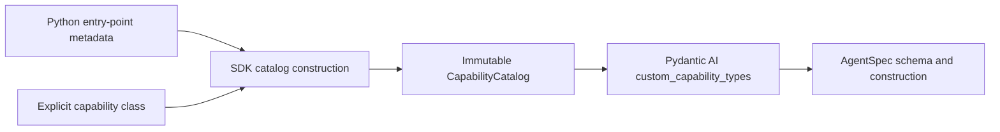

# Contract and Discovery

## 1. Identity and Dependency Direction

The mechanism needs only two capability identities:

- **capability type name**: the stable value returned by
  `get_serialization_name()`, used by `AgentSpec` and catalog lookup; and
- **capability instance ID**: the identity of one configured runtime instance, used by
  capability-first composition.

Python distribution metadata records where a class came from. It does not introduce a
provider ID or provider contract version.



The catalog contains classes, names, and provenance. It never contains capability
instances, live authorities, stores, credentials, host services, or callbacks.

## 2. Packaging Contract

The canonical entry-point group is `ya_agent_sdk.capabilities`. Each entry point targets
one class:

```toml
[project.entry-points."ya_agent_sdk.capabilities"]
"acme.search" = "acme_agent.capabilities:SearchCapability"
"acme.database" = "acme_agent.capabilities:DatabaseCapability"
```

The entry-point name must equal the loaded class's serialization name. The target is not
a factory, descriptor, instance, module-registration callback, or collection of types.

This one-to-one mapping makes installed metadata sufficient for selection and
diagnostics. Distribution name/version and the entry-point target are read from
`importlib.metadata` when available.

## 3. Explicit Imports

Applications may pass imported classes directly:

```python
from acme_agent.capabilities import SearchCapability
from ya_agent_sdk.capabilities import build_default_capability_catalog

catalog = build_default_capability_catalog(explicit_types=[SearchCapability])
```

A host may combine explicit classes with selected installed entry points through the
same catalog-construction function:

```python
from ya_agent_sdk.capabilities import discover_capability_types

references = discover_capability_types()  # metadata only

catalog = build_default_capability_catalog(
    explicit_types=[SearchCapability],
    selected_entry_points=["acme.database"],
)
```

`build_default_capability_catalog()` includes SDK built-ins. The lower-level
`build_capability_catalog()` is available to hosts that intentionally supply their own
complete `sdk_types` set.

Passing every discovered name is the explicit "load all installed types" policy. An
empty selected-name list imports none. The SDK does not silently load ambient entry
points from `create_agent()`.

Directly instantiated, non-serializable capabilities may still be passed through
`capabilities=` for ordinary in-process use. They do not need catalog registration
unless a native declarative spec must reconstruct them.

## 4. Capability Type Contract

An accepted object must:

1. be a class and satisfy
   `issubclass(value, pydantic_ai.capabilities.AbstractCapability)`;
2. satisfy the supported Pydantic AI custom capability serialization contract;
3. return one non-empty, stable serialization name;
4. keep schema generation and `from_spec()` deterministic and free of external I/O;
5. serialize every value required to reconstruct the capability;
6. implement `SupportsDeferredOutput` when its tools may emit native deferred output;
   and
7. acquire live authorities only from typed runtime dependencies or host APIs.

Third-party serialization names should be namespaced, such as `acme.search`. Renaming a
serialization name changes the declarative wire contract and requires an explicit data
migration.

A package must declare every custom class that a serialized spec may reference. The SDK
validates the concrete `AgentSpec` being resolved; it does not attempt to predict every
possible nested type relationship at catalog construction time.

## 5. Discovery and Construction

`discover_capability_types()` uses `importlib.metadata.entry_points()` and returns
sorted metadata containing at least:

- entry-point name;
- import target; and
- distribution name and version when available.

Discovery does not call `EntryPoint.load()`.

Catalog construction then:

1. combines SDK built-in custom types, explicit classes, and selected entry-point
   references;
2. requires exactly one installed candidate for every selected entry-point name;
3. loads selected candidates only;
4. requires every entry-point target and explicit value to pass explicit
   `isinstance(value, type)` and `issubclass(...)` checks;
5. validates every class through the same complete supported Pydantic AI custom
   capability registry and serialization contract, including its required dataclass
   shape;
6. requires entry-point name equality with `get_serialization_name()`;
7. rejects duplicate serialization names and collisions with SDK or native Pydantic AI
   names;
8. sorts accepted registrations by serialization name for deterministic registry and
   schema output only; and
9. returns an immutable catalog.

A selected entry point either loads successfully or catalog construction fails. The SDK
never returns a partial catalog and never uses last-one-wins behavior. Enumeration and
import order cannot alter the result.

## 6. Catalog Surface

The catalog exposes the minimum bridge required by Pydantic AI:

```python
class CapabilityCatalog:
    @property
    def custom_capability_types(
        self,
    ) -> tuple[type[AbstractCapability[Any]], ...]: ...

    def __getitem__(self, serialization_name: str) -> type[AbstractCapability[Any]]: ...

    def provenance(self, serialization_name: str) -> CapabilityTypeProvenance: ...
```

`CapabilityTypeProvenance` is lightweight diagnostic data:

- serialization name;
- source kind: SDK built-in, explicit import, or entry point;
- class module and qualified name;
- entry-point target when applicable; and
- distribution name/version when available.

It is audit and diagnostic data, not a plugin manifest or compatibility claim. Source
kind, import target, and distribution metadata are excluded from resolved-plan
fingerprints and resume compatibility checks. Catalog consumers pass one exact tuple to
both native schema and construction APIs:

```python
schema = AgentSpec.model_json_schema_with_capabilities(
    custom_capability_types=catalog.custom_capability_types,
)

agent = Agent.from_spec(
    spec,
    custom_capability_types=catalog.custom_capability_types,
    deps_type=deps_type,
    model=model,
)
```

Native Pydantic AI capability types remain in its native registry and are not duplicated
in `custom_capability_types`.

## 7. Runtime Capability Ordering

Entry-point discovery and explicit imports end at class registration. Neither source
assigns runtime priority, and the serialization-name order of
`catalog.custom_capability_types` is never reused as an instantiated capability list.
The same class therefore has identical ordering semantics whether it came from an entry
point or an explicit import.

Runtime construction uses native Pydantic AI ordering:

1. `AgentSpec.capabilities` or programmatic `capabilities=` supplies the initial caller
   order;
2. `CombinedCapability` flattens nested combined capabilities;
3. each instance's `get_ordering()` may return `CapabilityOrdering` with `position`,
   `wraps`, `wrapped_by`, or `requires` constraints;
4. Pydantic AI topologically sorts only those semantic constraints; and
5. caller order breaks ties among nodes ready in the same topological batch.

The first capability in the effective list is the outermost middleware layer. Its
before/wrapper path runs before inner layers, while after/error unwinding runs in reverse
where the corresponding Pydantic AI hook has middleware semantics.

A third-party capability should declare only relationships required for correctness. It
may reference a public native, SDK, or third-party capability type that is a real Python
package dependency. Type references are preferred over instance references because
`for_run()` may replace instances. An unrelated capability omits constraints. A fully
unconstrained list follows caller order, but active constraints may change the final
relative placement of two nodes with no path between them. Broad `outermost` or
`innermost` positions are used only when every composition requires that boundary. They
are coarse tiers rather than unique slots; peers ready in the same tier and topological
batch use caller order.

For example, a request-only extension that must run after YA media projection and before
YA runtime context can declare only those local edges:

```python
from dataclasses import dataclass
from typing import Any

from pydantic_ai.capabilities import AbstractCapability, CapabilityOrdering
from ya_agent_sdk.capabilities import (
    MediaCompatibilityCapability,
    RuntimeContextCapability,
)


@dataclass
class AcmeRequestContextCapability(AbstractCapability[Any]):
    def get_ordering(self) -> CapabilityOrdering:
        return CapabilityOrdering(
            wrapped_by=(MediaCompatibilityCapability,),
            wraps=(RuntimeContextCapability,),
        )
```

If either referenced leaf is absent, that edge is simply inactive; no replacement edge
is inferred. The final native topological order still reflects every other active edge,
so absence does not promise global pairwise stability against unrelated leaves. The
extension adds `requires` only if it cannot function without a referenced type.
Entry-point and direct-import construction of this class produce the same graph.

YA adds no numeric priority, named stage registry, serialization-name ordering reference,
or plugin-specific ordering metadata. No SDK- or YAACLI-owned capability uses `position`
in the 2.0 baseline; native Pydantic AI capabilities retain their own framework-wide
positions. If correctness depends on another third-party type, the dependency and class
reference must be explicit; otherwise the host list supplies only the initial order and
native ready-node tiebreaker. Missing `requires`, conflicting positions, and dependency
cycles fail during agent construction.

## 8. Trust Boundary

Calling `EntryPoint.load()` executes Python code with the host process's authority. The
SDK provides deterministic discovery and validation, not isolation. Hosts must choose
installed entry-point names from a trusted deployment or explicitly imported code.

Installation alone neither imports a package nor grants its capability to an agent.
Tool approval and visibility policy constrain agent calls but do not sandbox import-time
Python code.
