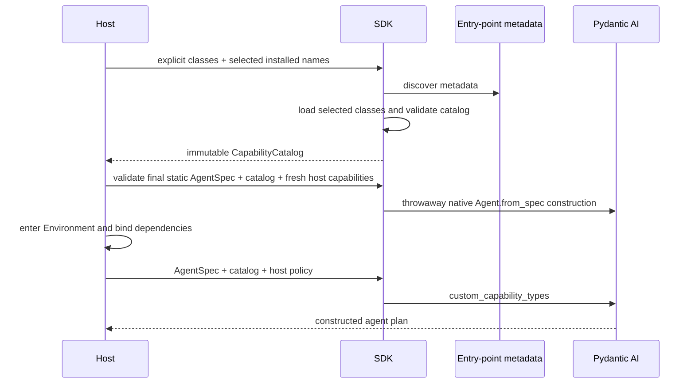

# Host Integration and Validation

## 1. Ownership Boundary

The SDK owns:

- strict parsing of the versioned plugin TOML manifest;
- entry-point metadata discovery and selected-name loading;
- explicit class validation;
- serialization-name and native/custom collision checks;
- deterministic catalog construction and provenance;
- the Pydantic AI `custom_capability_types` bridge;
- a shared native static-plan validator built on public `Agent.from_spec()`; and
- catalog-aware main and subagent plan resolution.

A host owns:

- package installation and trust;
- which installed names and explicit classes form its process catalog;
- which catalog types a particular native `AgentSpec` grants;
- runtime dependencies and authority policy; and
- restart, executable-code retention, and migration policy for durable work.

YAACLI and YA Claw consume SDK APIs. They do not call `importlib.metadata`, maintain a
parallel custom-type registry, reconstruct provenance, or parse their own plugin file
format. The SDK defines the manifest schema; each host chooses one trusted path and its
own missing-file policy through the existing bootstrap/configuration boundary.

## 2. Boot and Resolution

A standalone application may use direct imports, selected installed names, all names
returned by metadata-only discovery, or `load_capability_plugins()` with the strict SDK
manifest. `create_agent()` does not implicitly load installed extensions.

YAACLI and YA Claw load one manifest and build one process catalog before declarative
plan resolution. YA Claw root admission and SDK portable-child resolution call
`validate_agent_spec_capabilities()` before a static plan is fingerprinted or persisted;
runtime entry repeats native construction with final dynamic contributions. Other
durable applications should use the same boundary. Their profiles, sessions, requests,
and imported bundles may reference
only serialization names present in that catalog; these mutable inputs cannot introduce
Python import targets. Catalog availability still does not add an omitted capability to
an agent. Manifest `capabilities` are appended only to the root native `AgentSpec`;
named children and self forks do not inherit them.

Environment and context contributions are resolved later. They provide root capability
instances and typed dependencies but do not add classes to the static catalog.

Catalog registration order never becomes runtime capability order. Declarative agents
preserve `AgentSpec.capabilities` order; programmatic agents preserve `capabilities=`
order. Root assembly then appends context and Environment/resource contributions in the
stable source order defined by the capability-first runtime, preserving each source's
sequence. Pydantic AI applies `CapabilityOrdering` constraints to that combined list and
uses source order to break ties among nodes ready in the same topological batch; it does
not guarantee global pairwise stability for every pair without a path. The host does
not assign plugin priority or place discovered classes into named stages. SDK/YAACLI
leaves use local type relationships and no global `position`; an external class may use
`position` only when it truly owns a framework-wide boundary across every composition.

## 3. Main Agents and Portable Subagents

Main and child plans resolve native `AgentSpec` entries through the same catalog.

- named children receive exactly their native capability grants plus the enumerated
  host runtime/policy set;
- self forks rebuild from declarative references rather than cloning live capability
  instances;
- child drivers never rediscover entry points;
- a missing custom type fails before Pydantic AI agent construction; and
- persisted plan descriptors may record audit provenance only for custom types actually
  used by that plan, not the entire installed environment or catalog.

Packaging provenance never contributes to resolved-plan fingerprints or resume
compatibility. Normalized plan content, durable registration versions, and successful
resolution of each serialization name through the current catalog remain authoritative
for executable compatibility. This specification defines no separate plugin or catalog
fingerprint.

## 4. Process Lifetime and Durability

A `CapabilityCatalog` is an immutable snapshot of currently installed and explicitly
provided classes. Package installation or upgrade does not mutate an existing catalog;
a host builds a new catalog and reconstructs affected plans when it chooses to adopt the
change.

Custom type discovery establishes only that Pydantic AI can parse and construct a
capability. It does not establish that the capability is safe to replay or resume.
YAACLI and any other durable host validate the final resolved executable plan using the
same native/SDK durable contract applied to built-in and programmatic capabilities. If
an operation cannot be bound to a supported durable boundary, the custom capability is
rejected from that durable plan. The discovery mechanism defines no durability manifest,
recovery-class DSL, or adapter registration path.

A persisted descriptor may retain the used serialization name, import path, and
available distribution provenance for audit. Resume does not compare that provenance
for equality: switching between an explicit import and an entry point, or changing
packaging metadata, is not itself a plan incompatibility. The descriptor does not
contain executable Python code and cannot reconstruct a removed package. Durable
deployments must retain compatible code or handle affected executions through the
durable runtime's ordinary migration, cancellation, or recovery policy. Those deployment decisions are outside this plugin
contract.

## 5. Delivered Integration

The SDK-first slice provides:

1. metadata-only discovery for `ya_agent_sdk.capabilities`;
2. catalog construction from explicit classes and selected entry-point names;
3. validation of Pydantic AI classes, serialization names, collisions, and deterministic
   catalog ordering without treating it as runtime behavior order;
4. one strict versioned TOML manifest for entry-point selection and root grants;
5. one `custom_capability_types` tuple for schema generation and construction; and
6. one immutable catalog snapshot consumed by YAACLI and YA Claw across root, child,
   retained-plan, and restored runtime paths; and
7. one native static-plan validation helper shared by root admission and portable child
   resolution.

YAACLI and YA Claw contain no duplicated entry-point scanner or plugin registry. Focused
SDK and host tests cover manifest validation, selected loading, native construction,
root-only grants, child isolation, and stable snapshot reuse.

## 6. Validation Matrix

### Discovery and type validation

- discovery returns sorted metadata without importing provider modules;
- one entry point loads one class and its name equals the class serialization name;
- direct imports require no packaging metadata;
- selected missing, duplicate, import-failing, non-class, and non-capability targets fail
  with source provenance;
- an upstream-invalid class, including an `AbstractCapability` subclass missing the
  required direct dataclass decoration, fails during catalog construction;
- invalid and duplicate serialization names fail deterministically;
- collisions with SDK and native Pydantic AI names fail before agent construction; and
- installed but unselected packages are not imported.

### Pydantic AI integration

- namespaced custom types round-trip through JSON/YAML `AgentSpec`;
- schema generation and `Agent.from_spec()` receive the same custom-type tuple;
- SDK built-in custom types and accepted external types coexist in deterministic catalog
  order without changing instantiated capability order;
- entry-point and explicit-import construction of the same class produces the same
  `CapabilityOrdering` result;
- an external type's local `wrapped_by`/`wraps` edges interleave it with public SDK
  leaves identically from either construction path;
- absent optional edge targets add no edge, a fully unconstrained list remains
  caller-ordered, `requires` fails when its target is absent, and cycles fail with the
  native Pydantic AI construction error;
- SDK/YAACLI leaves do not occupy global `position` tiers, and native outermost/innermost
  behavior remains unchanged when external leaves are present;
- native types are not duplicated as custom types;
- nested specs fail clearly when a required custom type is absent; and
- two independently constructed catalogs can coexist without global mutation.

### File configuration

- the strict schema accepts only version 1, exact selected names, and normalized ordered
  root grants;
- unknown fields, duplicate selections, unselected grants, non-finite values, and
  secret-like nested argument keys fail closed;
- an empty selection performs no entry-point scan;
- the resolved root spec is isolated from later nested caller mutation; and
- manifest/catalog mismatch is rejected before runtime construction.

### Composition and hosts

- catalog availability does not grant an omitted type;
- main and child plans resolve one canonical type identity;
- Environment/context contributions do not mutate the catalog;
- YAACLI and Claw contain no independent entry-point scan or custom registry;
- persisted plans retain only used custom-type audit provenance, which does not affect
  fingerprints or resume compatibility; and
- a custom type unsupported by the durable runtime is rejected even though ordinary
  SDK or Claw construction succeeds.

## 7. Risk Controls

| Risk | Control |
| --- | --- |
| ambient packages change behavior | metadata-only discovery and host-chosen loading |
| import order changes registry identity | canonical serialization names, deterministic catalog sorting, and fail-closed collisions |
| catalog order changes runtime behavior | runtime order comes only from caller/source order plus native `CapabilityOrdering` |
| extensions compete for global slots | SDK/YAACLI leaves use local type edges; `position` is reserved for genuine framework-wide boundaries |
| installation is mistaken for authorization | native `AgentSpec.capabilities` remains the grant surface |
| plugin design becomes a second runtime | entry points contribute classes only |
| host implementations diverge | SDK owns discovery, validation, catalog construction, and the Pydantic bridge |
| persisted metadata is mistaken for code | descriptors record provenance only and fail when compatible code is absent |
| serializable is mistaken for durable | durable host validation remains independent and fail closed |
| durable arguments contain credentials | recursive secret-like key rejection and typed runtime dependency guidance |
| imported code is mistaken for sandboxed | explicit process-authority trust boundary |
