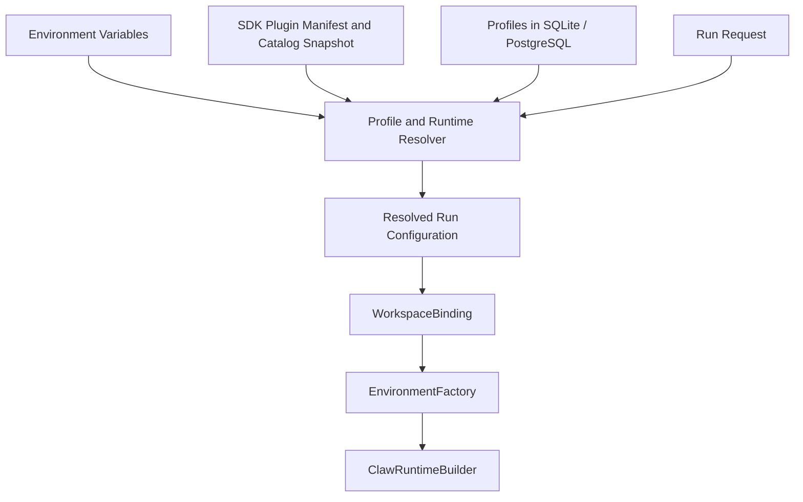
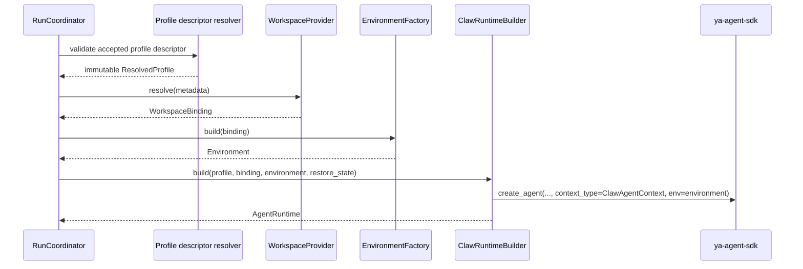

# 01 - Configuration, Profiles, and Workspace Assembly

YA Claw resolves each run from four explicit configuration inputs:

- environment variables for service infrastructure and bootstrap defaults;
- one optional process-wide SDK capability plugin manifest;
- storage-backed profiles for durable runtime behavior; and
- request-level inputs for transient run selection and execution.

## Configuration Layers



## Service Configuration

### Environment Variables

| Variable                                               | Purpose                                                                     |
| ------------------------------------------------------ | --------------------------------------------------------------------------- |
| `YA_CLAW_HOST`                                         | bind host                                                                   |
| `YA_CLAW_PORT`                                         | bind port                                                                   |
| `YA_CLAW_PUBLIC_BASE_URL`                              | public base URL                                                             |
| `YA_CLAW_INSTANCE_ID`                                  | runtime instance identity used for run ownership and heartbeat              |
| `YA_CLAW_API_TOKEN`                                    | shared bearer token required for HTTP access                                |
| `YA_CLAW_ENVIRONMENT`                                  | runtime environment label                                                   |
| `YA_CLAW_DATABASE_URL`                                 | SQLite or PostgreSQL connection string                                      |
| `YA_CLAW_AUTO_MIGRATE`                                 | startup schema migration switch                                             |
| `YA_CLAW_WEB_DIST_DIR`                                 | bundled web shell directory                                                 |
| `YA_CLAW_DATA_DIR`                                     | runtime data root for run store and runtime records                         |
| `YA_CLAW_WORKSPACE_DIR`                                | default workspace directory used when requests omit workspace binding       |
| `YA_CLAW_WORKSPACE_ENV_VARS`                           | comma-separated process environment variable names forwarded to workspaces  |
| `YA_CLAW_WORKSPACE_PROVIDER_DOCKER_EXTRA_MOUNTS`       | comma-separated Docker extra mounts using host_path:container_path[:mode]   |
| `YA_CLAW_DATABASE_ECHO`                                | SQL logging                                                                 |
| `YA_CLAW_DATABASE_POOL_SIZE`                           | pool size                                                                   |
| `YA_CLAW_DATABASE_MAX_OVERFLOW`                        | pool overflow                                                               |
| `YA_CLAW_DATABASE_POOL_RECYCLE_SECONDS`                | connection recycle interval                                                 |
| `YA_CLAW_DEFAULT_PROFILE`                              | bootstrap profile name used when a request omits `profile_name`             |
| `YA_CLAW_PROFILE_SEED_FILE`                            | optional YAML seed file for profiles                                        |
| `YA_CLAW_AUTO_SEED_PROFILES`                           | create or refresh matching seeded profiles from YAML on startup             |
| `YA_CLAW_CAPABILITY_PLUGIN_MANIFEST`                   | optional explicit SDK plugin manifest path loaded once before app startup   |
| `YA_CLAW_WORKSPACE_PROVIDER_BACKEND`                   | bootstrap workspace backend hint for local development or fallback          |
| `YA_CLAW_WORKSPACE_PROVIDER_DOCKER_IMAGE`              | Docker image for Docker-backed environment construction                     |
| `YA_CLAW_WORKSPACE_PROVIDER_DOCKER_HOST_WORKSPACE_DIR` | Docker daemon-visible host workspace path for service-in-Docker deployments |
| `YA_CLAW_WORKSPACE_PROVIDER_DOCKER_UID`                | UID used inside auto-started Docker workspace containers                    |
| `YA_CLAW_WORKSPACE_PROVIDER_DOCKER_GID`                | GID used inside auto-started Docker workspace containers                    |
| `YA_CLAW_WORKSPACE_PROVIDER_DOCKER_EXEC_USER`          | Docker exec user, default `auto` resolves to workspace UID:GID              |
| `YA_CLAW_WORKSPACE_PROVIDER_DOCKER_HOME`               | default HOME passed to Docker exec commands, default `/home/claw`           |
| `YA_CLAW_WORKSPACE_PROVIDER_DOCKER_RETENTION_POLICY`   | session sandbox retention policy, default `stop_on_idle`                    |
| `YA_CLAW_WORKSPACE_PROVIDER_DOCKER_IDLE_TTL_SECONDS`   | idle TTL for stopped-on-idle Docker session sandboxes, default `3600`       |
| `YA_CLAW_MCP_CONFIG_FILE`                              | global MCP JSON file injected into every runtime                            |
| `YA_CLAW_WORKSPACE_MCP_CONFIG_PATH`                    | workspace MCP JSON path with workspace-level priority                       |
| `YA_CLAW_SCHEDULE_DISPATCH_ENABLED`                    | enable schedule dispatcher                                                  |
| `YA_CLAW_SCHEDULE_TICK_SECONDS`                        | schedule dispatcher scan interval                                           |
| `YA_CLAW_SCHEDULE_MAX_DUE_PER_TICK`                    | maximum due schedules handled per scan                                      |
| `YA_CLAW_HEARTBEAT_ENABLED`                            | enable heartbeat dispatcher                                                 |
| `YA_CLAW_HEARTBEAT_INTERVAL_SECONDS`                   | heartbeat interval                                                          |
| `YA_CLAW_HEARTBEAT_PROFILE`                            | heartbeat profile name                                                      |
| `YA_CLAW_HEARTBEAT_PROMPT`                             | heartbeat input prompt                                                      |
| `YA_CLAW_HEARTBEAT_ON_ACTIVE`                          | heartbeat active-run policy                                                 |
| `YA_CLAW_SHUTDOWN_TIMEOUT_SECONDS`                     | optional Uvicorn graceful shutdown timeout; unset waits for active runs     |

LLM provider keys and tool API keys stay in environment variables and follow `ya-agent-sdk` conventions.

### Environment Variable Principle

Environment variables own infrastructure concerns and bootstrap defaults.
Profiles own reusable execution behavior.

### Capability Plugin Manifest

`YA_CLAW_CAPABILITY_PLUGIN_MANIFEST` names one administrator-controlled file using the
SDK schema:

```toml
schema_version = 1
entry_points = ["acme.search"]

[[capabilities]]
name = "acme.search"
arguments = { result_limit = 10 }
```

Plugin distributions are installed into the YA Claw service Python environment.
`entry_points` selects the exact installed types imported into the process catalog;
`capabilities` is the ordered root-only grant list. Omission of the environment setting
means no external types. If a path is configured, a missing file, invalid manifest,
entry-point import failure, or catalog collision fails before routes or execution
lifecycles start. YA Claw performs no package installation, project-local discovery,
ambient load-all, fallback, or hot reload.

The manifest contains durable declarative arguments and recursively rejects secret-like
keys. It is not a credential file. The settings object resolves and caches one immutable
SDK `ResolvedCapabilityPlugins` snapshot, and application creation forces that load
before exposing the service. Profile admission appends manifest grants only to the root
native `AgentSpec`, before descriptor fingerprinting and persistence. Named children and
self forks do not inherit those grants; a child can use a selected type only by naming it
in its own native spec. Profile resolution, async spawn/resume, retained plan restore,
memory execution, coordinator recovery, and runtime construction all receive the same
catalog snapshot. A service restart is the adoption boundary for manifest or package
changes.

## Execution Profile

For the 2.0 target, an execution profile embeds a native Pydantic AI `AgentSpec` core
and keeps only Claw workspace, scheduling, authorization, durability, and product policy
in its host envelope. Profiles can grant canonical serialization names already
available in the service's SDK catalog; they cannot carry Python import targets.

An execution profile is a reusable runtime definition stored in the relational database.
The profile document is strictly versioned and has three composition boundaries:

```yaml
schema_version: 2
name: default
agent:
  model: gateway@openai-responses:gpt-5.5
  name: default
  instructions: You are a workspace-bound execution agent.
  model_settings:
    openai_reasoning_effort: high
  capabilities:
    - FilesystemCapability
    - ShellCapability
host:
  model_config_preset: gpt5_270k
  model_config_override: {}
  tool_groups: [session, schedule, workflow, agency]
  need_user_approve_tools: []
  need_user_approve_mcps: []
  enabled_mcps: []
  disabled_mcps: []
  mcp_servers: {}
  workspace_backend_hint: docker
subagents:
  - schema_version: 1
    route: explorer
    execution_modes: [foreground, background]
    durability: restart
    agent:
      model: gateway@anthropic:claude-sonnet-4-6
      name: explorer
      description: Inspect the bound workspace.
      capabilities: [FilesystemCapability]
      metadata:
        claw:
          tool_groups: [session]
enabled: true
source_type: seed
source_version: "2"
```

- `agent` is a native Pydantic AI `AgentSpec`. Model, instructions, model settings,
  retries, output behavior, metadata, and all portable feature grants live here.
- `host` is `ClawProfileHostConfig`. It contains only Claw-owned model runtime policy,
  control-plane tool groups, approval policy, MCP selection, and workspace hints.
- `subagents` is a list of native SDK `SubagentSpec` documents. Every child has its own
  explicit `AgentSpec`; there is no inheritance compiler or implicit capability copy.

`agent.name`, when present, must equal the profile `name`. Child `agent.name` must equal
its route. Unknown fields are rejected by API, seed, and runtime resolution.

### Capability and Host-tool Boundaries

Portable features are granted by serialization name in `AgentSpec.capabilities` and
resolved through the immutable SDK `CapabilityCatalog`. Claw profiles do not accept
Python import targets or infer capabilities from tool names. External types enter the
catalog only through the explicit process plugin manifest; profile edits cannot load
code.

Claw's host-only `tool_groups` are limited to:

- `session`
- `schedule`
- `workflow`
- `agency`

Filesystem, shell, web, media, document conversion, tool search, skills, code execution,
and delegation are capabilities, not host groups. Final visibility and approval remain
host policy leaves; they do not become a second behavior-composition plane.

### Model Configuration

Native request settings live in `agent.model_settings`. Claw execution limits and
security configuration use `host.model_config_preset` plus
`host.model_config_override`, resolved through the shared SDK preset definitions. The
host override is merged over the preset once; there is no duplicate per-profile model
settings compiler.

### MCP Configuration

YA Claw loads MCP definitions from the workspace and global MCP JSON layers, then applies
`host.enabled_mcps`, `host.disabled_mcps`, `host.mcp_servers`, and approval policy.
Selected definitions become native capability/toolset contributions during runtime
assembly. Profile MCP policy does not duplicate model or agent definition fields.

Resolution order:

1. workspace file at `<default_mount>/.ya-claw/mcp.json`
2. global file at `~/.ya-claw/mcp.json`
3. explicit `host.mcp_servers` entries

### YAML Seed and Persisted Migration

The seed document itself is `version: 2` and contains `profiles` in the schema above.
Seed upserts by `name`, records source version/checksum, and removes missing seeded rows
only under explicit prune mode. Manually created rows remain first-class records.

Alembic revision `20260818_000016` performs the only 1.x conversion: it converts existing
persisted rows once, writes native `agent_spec`, `host_config`, and `subagent_specs`
columns, then drops the old columns. Runtime and API code do not accept the old shape.

## Workspace Binding and Mount Sets

YA Claw has one configured default workspace directory and supports request-level workspace bindings for session-scoped multi-folder execution.

The configured default workspace is used when API clients omit `workspace` on session and run creation. Desktop and other clients can provide a workspace binding with multiple mounts and one default cwd.

Workspace mapping has two path modes:

- local backend: file operations and local shell use host paths derived from the selected mount set
- Docker backend: service-side file operations map host paths into virtual paths, Docker shell sees the declared virtual paths, and Docker binds daemon-visible host paths into those virtual paths

Default Docker workspace values for requests that omit `workspace`:

- service workspace path: `YA_CLAW_WORKSPACE_DIR` or the default runtime workspace directory
- daemon-visible host mount: `YA_CLAW_WORKSPACE_PROVIDER_DOCKER_HOST_WORKSPACE_DIR` or the service workspace path
- container path: `/workspace`
- default cwd: `/workspace`
- skill path: `/workspace/.agents/skills/`
- workspace guidance: `/workspace/AGENTS.md`
- heartbeat guidance: `/workspace/HEARTBEAT.md`

Request-level workspace binding example:

```json
{
  "workspace": {
    "mounts": [
      {
        "id": "main",
        "name": "ya-mono",
        "host_path": "/Users/jizhongsheng/code/yet-another-agents/ya-mono",
        "virtual_path": "/workspace/main",
        "mode": "rw"
      },
      {
        "id": "docs",
        "name": "product-docs",
        "host_path": "/Users/jizhongsheng/docs/product",
        "virtual_path": "/workspace/docs",
        "mode": "ro"
      }
    ],
    "default_mount_id": "main",
    "cwd": "/workspace/main"
  }
}
```

Sessions, runs, schedules, heartbeat, bridges, and memory jobs resolve workspace binding through session metadata, run metadata, and provider defaults. The full mount-set contract lives in [10-workspace-mount-sets.md](10-workspace-mount-sets.md).

## Official Docker Workspace Image

The default Docker workspace image is `ghcr.io/wh1isper/ya-claw-workspace:latest`.

The image provides a ready-to-use agent workspace on Debian stable with:

- Python and `pip`/`venv`
- Node.js and Corepack
- Git, OpenSSH, curl, wget, jq, unzip, zip, and common shell utilities
- `lark-cli`
- bundled Lark and skill-creator skills copied into mounted workspace `.agents/skills/` directories at container start

The workspace provider treats the image as an implementation detail carried by `YA_CLAW_WORKSPACE_PROVIDER_DOCKER_IMAGE`. Deployments can override the image while keeping the same binding and environment factory contracts.

Auto-started Docker workspace containers receive `YA_CLAW_WORKSPACE_UID`, `YA_CLAW_WORKSPACE_GID`, `YA_CLAW_HOST_UID`, and `YA_CLAW_HOST_GID`. The default UID/GID comes from the YA Claw service process, and deployments can override them through `YA_CLAW_WORKSPACE_PROVIDER_DOCKER_UID` and `YA_CLAW_WORKSPACE_PROVIDER_DOCKER_GID`. Docker shell commands use `YA_CLAW_WORKSPACE_PROVIDER_DOCKER_EXEC_USER=auto` by default, which resolves to the workspace UID:GID. `YA_CLAW_WORKSPACE_PROVIDER_DOCKER_HOME` sets the default `HOME` for Docker exec commands and defaults to `/home/claw`.

Workspace environments receive built-in `LARK_APP_ID` and `LARK_APP_SECRET` aliases from process environment values or the configured Lark bridge app settings. `YA_CLAW_WORKSPACE_ENV_VARS` forwards additional comma-separated process environment variable names into workspace environments; values are read from the YA Claw service process environment and passed to local shell execution or Docker container creation. `YA_CLAW_WORKSPACE_PROVIDER_DOCKER_EXTRA_MOUNTS` mounts additional host directories into Docker workspace containers using comma-separated `host_path:container_path[:mode]` entries with `rw` and `ro` modes. Extra mounts are provider support mounts: they are appended to Docker environment mounts, included in sandbox fingerprints, and excluded from workspace default cwd, guidance root, memory root, and Desktop Space association.

Docker session sandboxes use `YA_CLAW_WORKSPACE_PROVIDER_DOCKER_RETENTION_POLICY=stop_on_idle` by default and `YA_CLAW_WORKSPACE_PROVIDER_DOCKER_IDLE_TTL_SECONDS=3600` by default. `keep_warm` keeps the current session sandbox running until explicit cleanup. `stop_on_idle` stops the current session sandbox after the TTL and starts it again for the next run when the workspace fingerprint still matches. The Docker container cache root remains `YA_CLAW_WORKSPACE_PROVIDER_DOCKER_CONTAINER_CACHE_DIR` or `<data_dir>/docker-workspace-containers`; session cache files live under `sessions/{session_id}/workspace.json`, and run-scoped automatic task cache files live under `runs/{run_id}/workspace.json`.

Workspace runtime APIs expose the configured backend, workspace path mapping, Docker daemon and image status, cache directory, retention policy, idle TTL, and sandbox lifecycle capabilities. Session responses expose `workspace_state` when persisted sandbox metadata exists, and dedicated session workspace endpoints resolve the current provider binding for UI and Desktop clients.

## WorkspaceProvider

`WorkspaceProvider` is the runtime boundary that returns one declarative `WorkspaceBinding` for a run.

A provider should return:

- one default host workspace path
- one default virtual workspace path exposed to the agent
- one default cwd
- a mount list with host path, virtual path, and read/write mode
- readable and writable virtual paths
- environment overrides
- provider metadata useful for logs and UI
- runtime hints such as backend preference

### WorkspaceBinding Principle

`WorkspaceBinding` is a declarative value object.
It describes execution boundaries and path policy.
Concrete SDK `Environment` construction belongs to `EnvironmentFactory`.

The selected workspace binding defines `cwd`, readable paths, writable paths, and concrete environment mounts.

### LocalWorkspaceProvider

Shape:

- host paths from the selected workspace binding
- virtual paths from the selected workspace binding
- cwd resolved from the selected default mount
- path policy restricted to declared mounts
- backend hint `local`

`LocalEnvironmentFactory` builds local file operations and a local shell over the same real path space.

### DockerWorkspaceProvider

Shape:

- service workspace paths from the selected workspace binding
- daemon-visible host workspace paths from each mount's `docker_host_path`, `YA_CLAW_WORKSPACE_PROVIDER_DOCKER_HOST_WORKSPACE_DIR`, or the service path
- virtual/container paths from declared mounts
- backend hint `docker`
- optional image hint from profile or service bootstrap config

`DockerEnvironmentFactory` builds virtual file operations over service-visible mount paths and a Docker shell over declared virtual paths. The session-owned Docker workspace container bind mounts daemon-visible host paths into the declared virtual paths. The provider records one current sandbox generation per session and replaces that state when the workspace fingerprint changes.

The Python Docker SDK manages container lifecycle. Command execution uses a
service-side Docker CLI subprocess so the shell backend owns exact stdin/stdout
transport and process termination. The service runtime therefore needs both Docker
Engine API access and the Docker CLI on `PATH`; the official `Dockerfile.ya-claw`
image bundles the CLI.

## EnvironmentFactory

`EnvironmentFactory` turns `WorkspaceBinding` into a concrete SDK `Environment`.

Recommended implementations:

- `LocalEnvironmentFactory`
- `DockerEnvironmentFactory`

Responsibilities:

- instantiate the concrete environment class
- enforce path policy from the binding
- carry environment overrides into shell or resources
- keep file operations and shell execution in one coherent path space

### Supported Workspace Combinations

| Service placement        | Shell backend | File operations                                                                     | Shell cwd                          | Docker mount source                         |
| ------------------------ | ------------- | ----------------------------------------------------------------------------------- | ---------------------------------- | ------------------------------------------- |
| Host/local process       | local shell   | file operations over declared host mounts                                           | host cwd resolved from virtual cwd | n/a                                         |
| Host/local process       | Docker shell  | `VirtualLocalFileOperator` mapping declared host mounts to virtual paths            | declared virtual cwd               | mount host path or `docker_host_path`       |
| Docker service container | Docker shell  | `VirtualLocalFileOperator` mapping service-visible declared mounts to virtual paths | declared virtual cwd               | `docker_host_path` or daemon-visible source |

## ClawAgentContext

YA Claw should define a `ClawAgentContext` subclass over `ya_agent_sdk.context.AgentContext`.

This context is the primary carrier for YA Claw runtime metadata.

Suggested fields:

- `session_id`
- `claw_run_id`
- `profile_name`
- `restore_from_run_id`
- `dispatch_mode`
- `workspace_binding`
- `source_kind`
- `source_metadata`
- `claw_metadata`

### Context Principle

`ClawAgentContext` carries YA Claw metadata in one stable place.
The context object keeps runtime metadata centralized and typed.

## ClawRuntimeBuilder

`ClawRuntimeBuilder` is the assembly boundary between runtime inputs and SDK runtime creation.

Responsibilities:

- resolve profile into concrete model settings and model config
- resolve workspace binding
- build the concrete environment through `EnvironmentFactory`
- construct `ClawAgentContext`
- instantiate native profile capabilities, host policy capabilities, MCP contributions,
  and the SDK delegation service
- create the final `AgentRuntime`

## Runtime Assembly Flow



## Design Principle

Profiles define reusable behavior at run admission; accepted runs execute their immutable content-addressed profile descriptor.
Workspace bindings define execution boundaries.
Environment factories define concrete runtime resources.
Runtime builder defines agent assembly.
