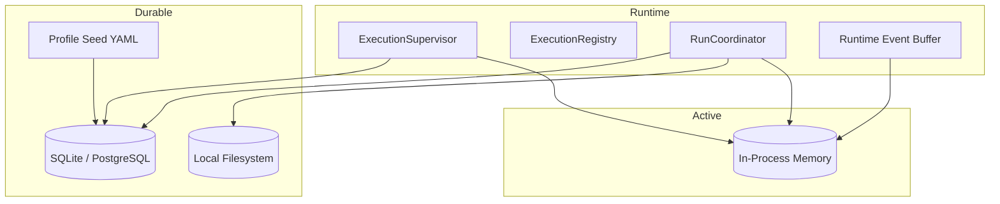

# 03 - Storage and Streaming

YA Claw uses three storage roles with clear ownership.

## Storage Topology



## Relational Store

The relational store is the durable source of truth for queryable runtime state.

It should store:

- session metadata
- session continuation pointers
- run indexes and restore relationships
- queued, running, terminal run state, and run claim ownership
- runtime instance heartbeat records
- profile records and seed provenance
- schedules and schedule fire history
- heartbeat fire history
- `profile_name` for display/routing and a server-owned content-addressed profile descriptor for exact queued execution

### Session Metadata Principle

Session metadata belongs in the database.
The runtime treats session metadata as structured queryable state.

### Profile Principle

Execution profiles belong in the database.
YAML seed is an input source for profile rows, not the runtime source of truth.

## Run Store

The local filesystem keeps committed continuity data in a flat run store.

Suggested layout:

```text
~/.ya-claw/
├── ya_claw.sqlite3
└── data/
    ├── run-store/
    │   └── {run_id}/
    │       ├── state.json
    │       └── message.json
    └── workspace/
        ├── AGENTS.md
        ├── HEARTBEAT.md
        └── ... workspace files ...
```

### Run Store Principle

Committed runtime blobs are keyed by `run_id`.
The filesystem does not need a session-first directory structure.

## `state.json`

Each committed run may write one `state.json` file. A suspended native segment also writes its stable state checkpoint before any durable HITL batch becomes externally visible.

It should include:

- exported `ClawAgentContext` resumable state
- restore metadata
- run and session identifiers needed for replay and restore
- compact metadata such as timestamps and version markers
- workspace binding snapshot when useful for later inspection
- resolved profile identity when useful for replay and debugging
- the bounded latest cumulative usage/cost snapshot when available

### Usage and Cost Snapshot

Claw normalizes SDK usage snapshots to the outer Claw run ID and accumulates them
across deferred-tool continuation segments. The canonical bounded snapshot is persisted
in `state.json` and copied into internal run metadata as a lightweight summary index.

Run detail reads the metadata index first, then may fall back to `state.json` and replay
for unindexed legacy or active runs. Paginated run and session summaries use only the
lightweight index and never scan full state or replay blobs.

## `message.json`

Each committed or best-effort checkpointed run may write one `message.json` file.

`message.json` stores a compacted replay list of AGUI events.

Recommended shape:

- top-level JSON array
- each item is one AGUI event object
- event order matches replay order
- the array is directly replayable by clients without wrapper unwrapping

Related run and session metadata live in the run record and `state.json`.
Checkpoint metadata belongs in store-side bookkeeping rather than the replay list payload.

### Deferred Segment and HITL Durability

A `DeferredToolRequests` boundary is stable only after both message history and exported resumable state have been written to the run store. YA Claw performs that write before creating and publishing the SQL HITL batch. Both approval requests and external deferred calls become ordered interactions and must produce exact per-call results.

Interaction identifiers are immutable and globally unique across a run, so delayed responses cannot target a later batch. Responses serialize on the run, persist one idempotent decision, and commit before process-local execution is notified. A conflicting retry returns the already committed decision. The HITL batch remains pending after its final response until deferred bridge inputs have been staged successfully.

Inputs received through a bridge while HITL is pending remain SQL rows. Deferred admission and staging serialize on the same run lock and revalidate the current batch. When all interactions resolve, YA Claw atomically moves each pending deferred input into the canonical `run_input_inbox`, marks the source row consumed, and closes the batch to further admission in the same transaction. Mapping and native enqueue happen later through the ordinary durable inbox delivery path, so a process crash or late bridge message cannot lose or strand accepted input.

Active segments are process-owned and are not replayed after restart. A stop request explicitly aborts the in-memory HITL wait rather than fabricating decisions. Startup interruption or an aborted continuation cancels any pending HITL batch, denies unresolved interactions, discards every unstaged deferred input for the run regardless of its batch's recorded status, clears active-interaction metadata, and retains the stable filesystem checkpoint for audit or explicit later restoration.

## In-Process Runtime State

Process memory owns active runtime state for one node.

Recommended split:

### Execution Registry

Carries:

- active run IDs
- `run_id -> task` mapping
- stop and interrupt handles
- basic supervisor metadata such as started time and dispatch mode

### Event Buffer Store

Carries:

- replayable per-run event buffers
- session to latest run mapping for live session event routing
- AGUI replay buffers used for dynamic compaction
- live ingress-binding metadata for active delivery only
- termination signals
- live subscriber counts

Accepted/enqueued/applied/rejected steering state is stored in SQL `run_input_inbox` and
the SDK logical input ledger, never in the event buffer.

## Incremental Event Buffer

The runtime keeps an in-memory incremental event buffer per active run.

Responsibilities:

- capture coordinator-observed SDK events
- transform them into AGUI events through a protocol adapter boundary
- stream replayable events over SSE
- maintain a dynamically compacted AGUI replay list for resume and history queries
- flush the compacted replay list to `message.json` at commit or best-effort checkpoint boundaries

## Session Read View

Session GET endpoints read from run-store through session pointers.

Recommended behavior:

- session status resolves from the latest run
- session run history can inline the compacted AGUI replay list for each run
- explicit rerun requests may target a failed or interrupted `restore_from_run_id`
- run GET endpoints read the addressed run directly and return `session + run + state + message`

## Event Delivery Model

### Foreground Streaming

Foreground requests may stream events directly over SSE.

### Background Execution

Queued runs are started by the supervisor and expose SSE endpoints for later subscription.

### Resume

The SSE replay contract should support:

- monotonic event IDs
- `Last-Event-ID`
- replay from the requested cursor
- live tail after replay completes

## Best-effort Checkpoints

Interrupted or failed runs should still try to persist a usable message view.

Preferred initial checkpoints are:

- after each model request starts or completes
- after each model response starts or completes when available in the SDK stream

This gives the rerun path a durable best-effort message snapshot without advancing the session success pointer.

## Schedule and Heartbeat Storage

Schedules are durable database resources. `schedules` stores the timer definition, ownership scope, trigger definition, execution mode, and latest dispatch pointers. `schedule_fires` stores each due or manual fire, dedupe key, dispatch result, created session, run, or steered active run.

Heartbeat configuration is runtime-owned settings. `heartbeat_fires` stores heartbeat fire history for console inspection and operational audit.

Schedule and heartbeat run outputs still commit through the normal run store under `run-store/{run_id}/`.

## Storage Principle

- database for sessions, runs, profiles, schedules, heartbeat fire history, and execution indexes
- run store for committed or checkpointed continuity blobs
- in-memory registry and event buffers for active execution and replay
