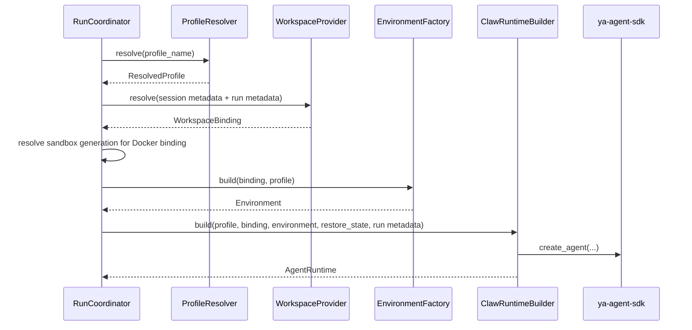

# 06 - Runtime Assembly

This document defines how YA Claw turns one durable run intent into one executable SDK runtime.

## Runtime Assembly Goal

The runtime assembly path should make each boundary explicit:

1. resolve profile
2. resolve workspace binding
3. resolve Docker sandbox generation when the binding is Docker-backed
4. build environment
5. construct `ClawAgentContext`
6. create `AgentRuntime`
7. execute through one `RunCoordinator`

## Assembly Objects

### ResolvedProfile

`ResolvedProfile` is the concrete execution-ready expansion of a profile row.

Suggested fields:

- `name`
- `model`
- `model_settings`
- `model_config`
- `system_prompt`
- `builtin_toolsets`
- `subagent_configs`
- `need_user_approve_tools`
- `need_user_approve_mcps`
- `enabled_mcps`
- `disabled_mcps`
- `workspace_backend_hint`
- `metadata`

### WorkspaceBinding

`WorkspaceBinding` is a declarative workspace value object with a default mount and optional additional mounts.

Suggested fields:

- `host_path`
- `virtual_path`
- `cwd`
- `mounts`
- `readable_paths`
- `writable_paths`
- `fingerprint`
- `generation`
- `environment_overrides`
- `metadata`
- `backend_hint`

### ClawWorkspaceBindingSnapshot

`ClawAgentContext` should carry a serializable snapshot rather than a live environment object.

Suggested fields:

- `virtual_path`
- `cwd`
- `mounts`
- `readable_paths`
- `writable_paths`
- `metadata`
- `backend_hint`

### ClawAgentContext

`ClawAgentContext` extends `AgentContext` and carries YA Claw execution metadata.

Suggested fields:

- `session_id`
- `claw_run_id`
- `profile_name`
- `restore_from_run_id`
- `dispatch_mode`
- `workspace_binding`
- `source_kind`
- `source_metadata`
- `claw_metadata`

### ClawRuntimeBuilder

`ClawRuntimeBuilder` is the factory that assembles the runtime.

Suggested inputs:

- `ResolvedProfile`
- `WorkspaceBinding`
- `Environment`
- optional `ResumableState`
- run and session metadata
- source metadata such as API, schedule, heartbeat, or bridge ingress
- resolved workspace fingerprint and sandbox generation when present

Suggested output:

- `AgentRuntime[ClawAgentContext, OutputT, Environment]`

## Assembly Flow



## Sandbox Generation Rule

Docker-backed bindings resolve sandbox scope before environment construction. API, bridge, and memory runs use a session-owned sandbox generation. Schedule and heartbeat runs use a run-owned sandbox generation and terminal cleanup.

For session-scoped sandboxes, the coordinator compares the current workspace fingerprint with the current session sandbox state. A matching fingerprint reuses the generation. A changed fingerprint increments the generation and replaces the session sandbox state.

Local bindings use workspace path policy directly and skip Docker sandbox generation.

Run state stores the resolved workspace snapshot with fingerprint, sandbox scope, and generation.

## Environment Construction Rule

Environment construction belongs to `EnvironmentFactory`.
`EnvironmentFactory` owns concrete environment instantiation.

This keeps:

- workspace resolution declarative
- environment construction replaceable
- runtime assembly easy to test

## Context Construction Rule

`ClawAgentContext` should be the stable home for YA Claw metadata.
The context object keeps runtime metadata centralized and typed.

Recommended context construction inputs:

- base SDK `env`
- resolved model config
- run and session identifiers
- workspace binding snapshot
- profile identity
- source metadata
- optional restored state

## Runtime Builder Responsibilities

`ClawRuntimeBuilder` should:

- pass the concrete environment into `create_agent`
- use `context_type=ClawAgentContext`
- inject restored `ResumableState` when present
- attach builtin tools from profile resolution
- attach runtime-wide MCP toolsets from the active MCP JSON file
- apply profile MCP filters and SDK approval review policy
- attach subagent configs
- construct system prompt or template variables from resolved profile and binding
- inject workspace guidance from `AGENTS.md` when present
- inject heartbeat guidance from `HEARTBEAT.md` only when `source_kind="heartbeat"`

## Approval Review Assembly

YA Claw should map profile security configuration into the SDK approval review system described in `packages/ya-agent-sdk/spec/03-approval-review.md`.

Profile shape:

```yaml
security:
  approval_review:
    enabled: true
    model: oauth@codex:gpt-5.5
    timeout_seconds: 30
    max_denials: 3
    truncation:
      enabled: true
      max_text_chars: 60000
    mcp_permissions:
      filesystem:
        default_decision: auto_review
        categories: [read, write]
        scopes: [workspace]
      github:
        default_decision: auto_review
        categories: [external_integration, network, write]
        scopes: [external_service]
```

`ProfileResolver` should keep the profile value declarative. `ClawRuntimeBuilder` converts it into `ya_agent_sdk.context.SecurityConfig` and sets it on `ClawAgentContext.security`.

Runtime assembly responsibilities:

- build SDK `SecurityConfig.auto_review(...)` from profile YAML
- pass reviewer model and model settings through the regular SDK model resolution path
- pass MCP permission overrides into `build_mcp_servers(...)`
- include `session_id`, `claw_run_id`, `profile_name`, `source_kind`, and workspace snapshot metadata in approval review requests
- project approval review records into live events and run trace entries
- apply SDK result truncation for built-in tools, MCP tools, and proxied tools

`need_user_approve_tools` and `need_user_approve_mcps` remain explicit HITL inputs. Security review policy lives under `security.approval_review`. Claw runtime assembly uses generic approval review for shell execution and other protected tool boundaries.

## Guidance Loading

YA Claw has two workspace guidance files:

| File                           | Loaded for                                              | Purpose                              |
| ------------------------------ | ------------------------------------------------------- | ------------------------------------ |
| `<default_mount>/AGENTS.md`    | normal runs, schedule runs, heartbeat runs, bridge runs | general workspace guidance           |
| `<default_mount>/HEARTBEAT.md` | heartbeat runs only                                     | runtime-owned heartbeat instructions |

Heartbeat guidance should be injected as a tagged block:

```xml
<heartbeat-guidance path="/workspace/main/HEARTBEAT.md">
...
</heartbeat-guidance>
```

Schedule `isolate_session` runs load schedule input and regular workspace guidance only.

## Schedule and Heartbeat Assembly

Schedule runs carry:

- `trigger_type = "schedule"`
- `source_kind = "schedule"`
- `source_metadata.schedule_id`
- `source_metadata.schedule_fire_id`
- `source_metadata.execution_mode`

Heartbeat runs carry:

- `trigger_type = "heartbeat"`
- `source_kind = "heartbeat"`
- `source_metadata.heartbeat_fire_id`
- heartbeat profile and prompt from runtime settings

## Example Construction Shape

```python
runtime = runtime_builder.build(
    profile=resolved_profile,
    binding=workspace_binding,
    environment=environment,
    restore_state=restore_state,
    session_id=session.id,
    run_id=run.id,
    source_kind=run.trigger_type,
    source_metadata=run.metadata.get("source", {}),
    workspace_metadata=resolved_workspace_metadata,
    sandbox_generation=workspace_binding.generation,
)
```

## Testing Boundaries

Runtime assembly should be testable in layers:

1. `ProfileResolver` unit tests
2. `WorkspaceProvider` unit tests
3. `EnvironmentFactory` unit tests
4. `ClawRuntimeBuilder` unit tests with stub profile and binding
5. `RunCoordinator` integration tests from queued run to terminal state
6. schedule and heartbeat assembly tests for source metadata and guidance loading

## Design Principle

YA Claw execution should read like an assembly pipeline.
Each stage should expose one clear input and one clear output.
