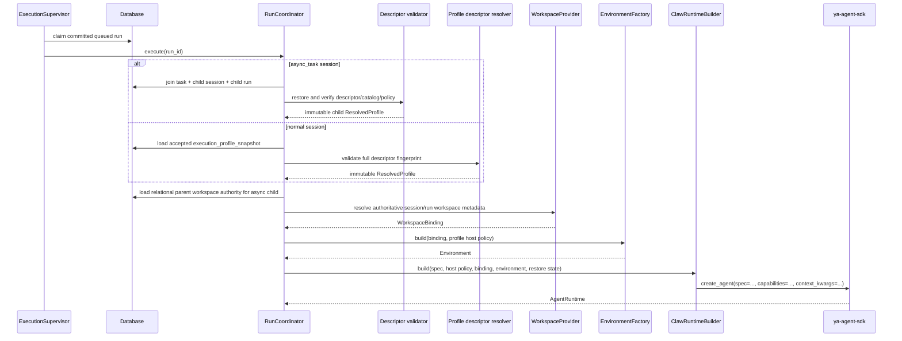

# 06 - Runtime Assembly

YA Claw turns a committed run into one capability-first SDK runtime. Native Pydantic AI
`AgentSpec` owns the declarative agent contract. `ResolvedProfile` contains that spec
plus Claw-only host policy; it does not expose a second toolset or subagent composition
plane.

## Assembly Invariants

1. A normal run resolves one enabled profile into an immutable `ResolvedProfile`.
2. An async child run does not resolve the mutable current profile. It joins the
   server-owned task/session/run linkage, validates the persisted
   `SubagentPlanDescriptor`, and derives a child profile from that descriptor only.
3. External run metadata cannot create child authority. `async_task` and
   `async_task_wake` are stripped at the external run boundary.
4. Workspace and sandbox authority comes from `WorkspaceProvider` and `Environment`,
   not from capabilities.
5. `capabilities=` is the sole runtime behavior-composition input to the SDK.
6. A run record is committed before a runtime handle or queued event is published.
7. SQL run input rows are committed before native enqueue; process-local ingress is not
   a persistence boundary.
8. Input admission, native delivery, application correlation, and every terminal run
   transition serialize on the same database `runs` row. A process-local lock is only
   an optimization.
9. A committed `completed` status is irreversible. Notification, event projection,
   async delivery, memory, or agency post-commit failures are retried or logged without
   rewriting the run to `failed`.

## ResolvedProfile

`ResolvedProfile` has two parts.

### Native agent definition

- `agent_spec: AgentSpec`
- native model and model settings
- native name, description, instructions, and metadata
- native dependency and output schemas
- native retries, end strategy, and tool timeout
- serialized capability specifications

### Claw host policy

- model transport configuration
- host tool groups and optional host tool allowlist
- named child `SubagentSpec` definitions for new executions
- tool/MCP approval policy
- shell review and shell sandbox policy
- MCP server selection
- workspace backend hint
- profile source audit metadata

Runtime, API, and seed parsing accept only schema-v2 native `AgentSpec`, host policy,
and subagent structures. The one conversion of persisted pre-v2 profile rows is owned
exclusively by its Alembic revision; `ProfileResolver` does not provide a compatibility
parser.

## Runtime Assembly Flow



For normal runs, `profile_name` selects behavior only at admission. The accepted run owns a content-addressed descriptor copied from the native profile row in that transaction. Runtime never re-resolves the current catalog entry, and descriptor validation fails closed on missing or modified content. Memory runs use the same admission helper; async child runs retain their separate `SubagentPlanDescriptor` boundary.

## Native AgentSpec Preservation

`ClawRuntimeBuilder` uses the SDK capability catalog to construct each serialized
profile capability. There is no Claw-maintained name-to-type switch. Claw host
capabilities are added explicitly and separately:

- runtime foundation;
- Claw workspace/session/schedule/workflow tools;
- skills for non-child runs;
- durable delegation for non-child runs;
- selected MCP proxy;
- approval, observation, retry, and timeout policy leaves.

For child plans, the exact approval tool/MCP sets, MCP selection and normalized server
configuration, workspace backend hint, complete injected set, and every other
behavior-affecting configuration value are included in the immutable descriptor
fingerprint. Resolution validates the
native and host-injected set together, so singleton collisions fail before persistence.
Runtime consumes the same host-capability constructor; it does not independently append
a second policy set after descriptor validation.

The already-constructed capability leaves are removed from the copy passed to
`Agent.from_spec` so they are not instantiated twice. All other native fields remain in
the spec and are interpreted by Pydantic AI.

Native instructions stay native. Claw workspace, source-kind, memory, schedule,
heartbeat, workflow, and agency guidance is appended as additional instructions rather
than concatenated into a replacement profile prompt. Memory and agency internal runs
explicitly replace ordinary profile instructions with their dedicated contracts.

If `output_schema` is present, runtime output is composed as:

```python
[StructuredDict(agent_spec.output_schema), DeferredToolRequests]
```

Otherwise it is:

```python
[str, DeferredToolRequests]
```

This keeps structured output and deferred interaction support in one native output
contract. Structured results cross the durable/API boundary as `runs.output_json`, with
canonical JSON text only as the string-facing projection. Native retries, end strategy,
`tool_timeout`, metadata, description, model settings, and dependency schema are not
re-declared by Claw.

## Workspace and Sandbox Boundary

`WorkspaceBinding` is a declarative value containing host/virtual paths, mounts,
read/write policy, fingerprint, generation, metadata, and backend hint.
`ClawWorkspaceBindingSnapshot` is the serializable context projection.

Docker-backed bindings resolve sandbox scope and generation before environment
construction. An async child recovers workspace mount authority from its relational
parent session while retaining its own child-session sandbox lifecycle; its backend hint
comes from the verified descriptor. Minimal child metadata is never treated as the
workspace authority. API, bridge, memory, and ordinary conversation runs use session scope.
Schedule and heartbeat runs use run scope and terminal cleanup. A matching workspace
fingerprint reuses a session generation; a changed fingerprint advances it.

Shell sandbox and review policy is host authority. For unattended sources, approval
requirements are converted to deterministic unattended policy rather than waiting for a
user who cannot respond.

## Context Construction

`ClawAgentContext` carries typed run metadata and restored SDK state:

- session/run/profile identities;
- restore source and dispatch mode;
- workspace binding snapshot and container identity;
- source kind and source metadata;
- Claw audit metadata;
- shell environment and security policy;
- approval selections;
- SDK logical-run input ledger and active router.

Live clients such as `ClawSelfClient` are Environment resources. They are not serialized
into context or descriptors.

## Durable Input Binding

When a native stream is active, the coordinator binds the process-local run ingress to
`AgentStreamer.enqueue`. It then replays only SQL inbox rows in `accepted` state. The
SQL row ID is passed as the SDK `input_id`; replay of the same identity validates equal
content, origin, and priority and returns the existing receipt without another native
enqueue. The persisted SQL origin selects the SDK `user` or `feature` origin. The SDK
logical-run ledger owns unresolved native attempts after acceptance. On
`EnqueuedMessagesEvent`, the coordinator commits the matching SQL row as `applied`
before consuming the next stream event.

Input admission/delivery and terminal transitions first acquire a no-op database update
lock on the owning run. Therefore terminal rejection cannot miss a concurrently accepted
row, and delivery cannot overwrite a committed rejection with stale `enqueued` state.
Permanent mapping/validation/type/I/O errors reject only their row and FIFO delivery
continues; unavailable ingress leaves the current and later rows accepted.

This division avoids all three failure modes:

- accepted SQL input is not lost when no ingress is currently bound;
- an already-enqueued SDK logical input is not duplicated after native enqueue followed
  by SQL commit failure; and
- no accepted/enqueued row survives a serialized terminal transition.

## Runtime and Environment Lifecycle

`AgentRuntime` enters the Environment and context before constructing the native Agent.
It gathers explicit, context, and Environment capability contributions with provenance,
validates singleton capability IDs, and enters the Agent. Exit unwinds the Agent,
context, and Environment in reverse order.

The coordinator owns terminal artifact commit, status transition, durable input
rejection where applicable, post-run lifecycle processing, event projection, and
runtime-handle cleanup. It marks success committed immediately after the database
commit; all later projections are outside the reversible state transition. Completed
runs keep `lifecycle_projected_at` null until Memory and Agency have durably accepted
their lifecycle effects. Memory acceptance records a unique effect identity in the same
transaction as its state changes, so retries are idempotent without collapsing distinct
effects that reference the same source sequence. Conversation projections preserve
session sequence: a newer completed run remains unprojected while an earlier marker is
null. Normal completion attempts projection immediately, while startup and periodic
recovery replay remaining null markers in commit order. Async-task delivery recovery is
independent, so one post-commit hook cannot block the other. Process shutdown is not used
as a hidden compatibility or message-delivery mechanism.

## Verification Boundary

Required tests cover:

1. profile normalization into native `AgentSpec`;
2. catalog-created feature and host capability composition;
3. native instructions, structured output, deferred requests, retries, end strategy,
   metadata, dependency schema, and tool timeout;
4. immutable child descriptor recovery independent of profile mutation;
5. workspace binding and sandbox generation;
6. SQL-before-enqueue input delivery and applied correlation;
7. TestModel end-to-end streaming and deferred interaction;
8. queued-run recovery and terminal artifact commit; and
9. complete Claw tests, lint, typing, migration, and diff checks.
