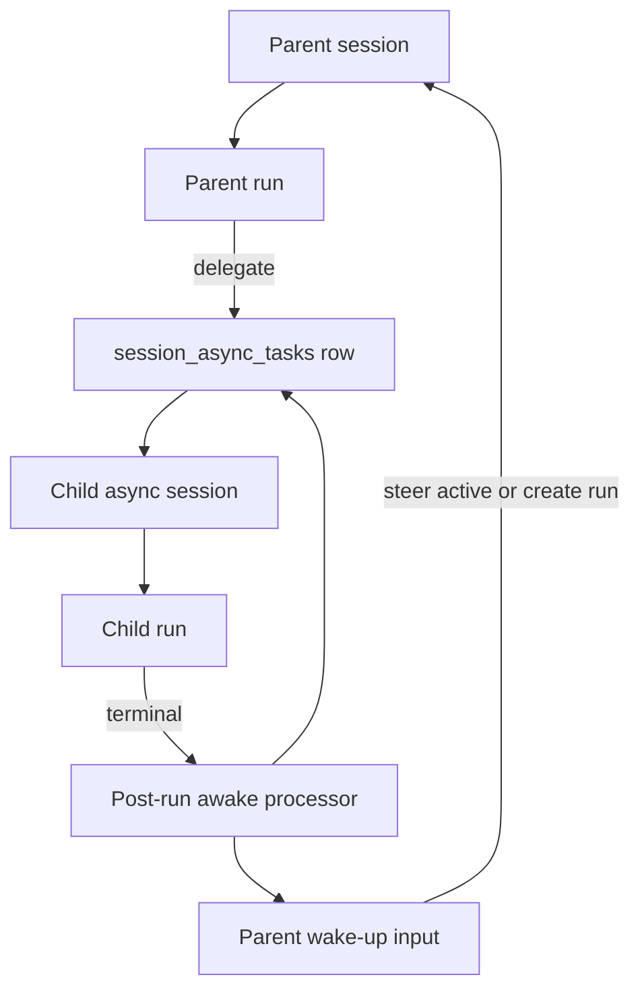
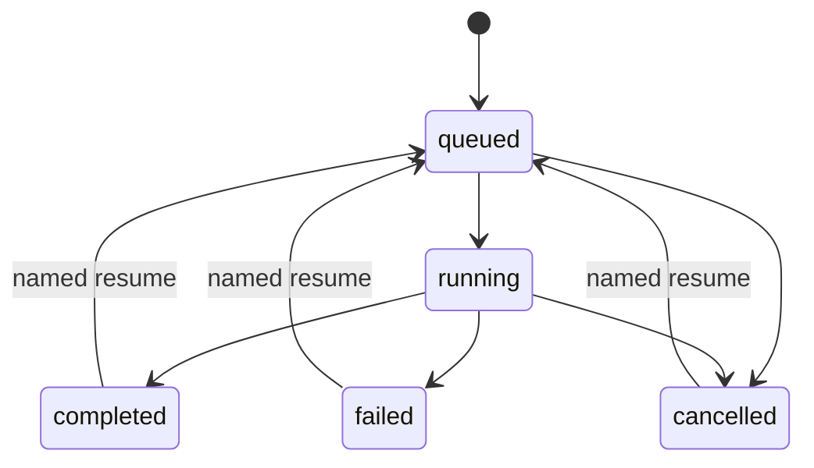
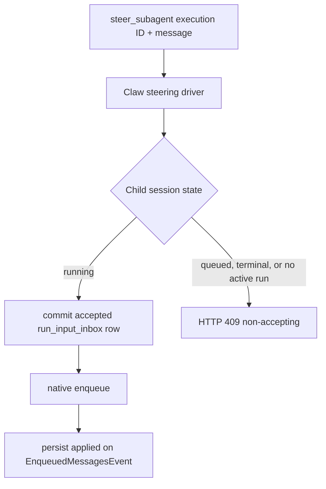
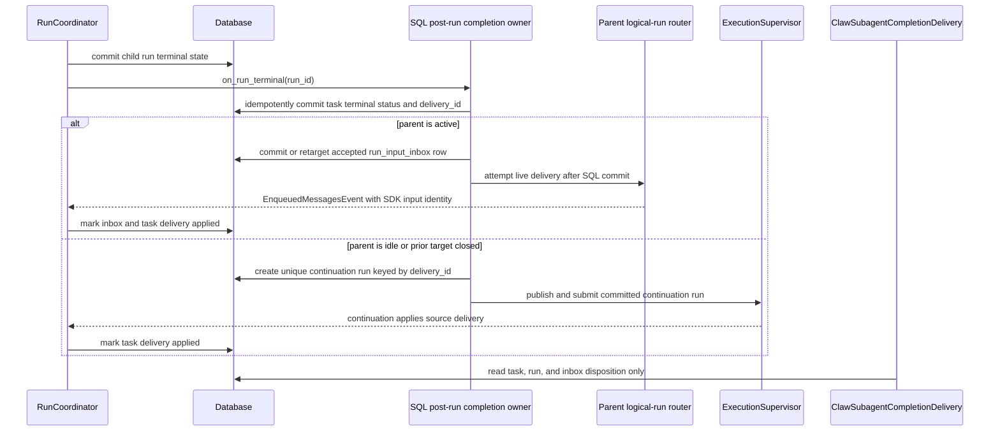

# 07 - Durable Portable Subagents

YA Claw implements the SDK portable subagent contracts with durable child sessions,
runs, SQL execution records, and a completion outbox. A parent can delegate foreground
or background work, inspect committed execution state, steer an active child, resume a
terminal child from its immutable descriptor, and cancel work through the SDK-owned
`DelegationCapability`.

Both foreground and background delegation use the durable SQL child-session/run path. Foreground waits on the same persisted child execution that background returns as a handle; there is no in-process driver hidden behind the portable delegation operation.

## Design Goals

- Make async subagents durable across parent run completion, service restarts, and UI refreshes.
- Use the existing Claw session/run execution path for async subagent work.
- Let any session spawn, resume, query, steer, and manage named child subagent sessions.
- Deliver child-linked async completion back to the parent session through the same steer-or-run wake-up path used by agency fires; detached work records its result without waking the parent.
- Expose current-session async subagent state to the agent through tools and injected context.
- Preserve subagent semantics: native Pydantic AI `AgentSpec` core, thin YA target envelope, stable name, prompt, history, explicit capability policy, plan fingerprint, and resume.
- Keep parent and child continuity separate while preserving auditable linkage.

## Core Model

An async subagent is a durable relationship between a parent session/run and a child session/run.



A child async session represents a configured subagent from the parent profile. Generic session continuations use the existing session/run API surface.

## Session Type

Add `session_type="async_task"` for child async subagent sessions.

| Session type   | Purpose                                      | Default listing behavior |
| -------------- | -------------------------------------------- | ------------------------ |
| `conversation` | user-visible work sessions                   | visible                  |
| `memory`       | internal memory extract and summary sessions | hidden                   |
| `agency`       | singleton agency coordinator session         | hidden from normal lists |
| `async_task`   | durable child subagent work                  | hidden from normal lists |

Rules:

- Async task sessions use `parent_session_id` to point to the parent session.
- Async task sessions store only the server-owned `metadata["async_task"]["task_id"]` linkage. The full descriptor and parent linkage live in relational task columns and are not exposed through ordinary session metadata.
- Default session list APIs hide `async_task` sessions. Debug/admin views and parent-session task tools can reveal them.
- Session detail and run detail APIs continue to work for async task sessions.

## Orchestration Table

Add a `session_async_tasks` table. It stores relationship and scheduling state. The child session and child run remain the source of execution truth.

Fields:

| Column                   | Type               | Description                                                 |
| ------------------------ | ------------------ | ----------------------------------------------------------- |
| `id`                     | string32 PK        | async task id                                               |
| `parent_session_id`      | string32 FK        | session that spawned the work                               |
| `parent_run_id`          | string32 nullable  | run that spawned the work                                   |
| `parent_agent_id`        | string255          | parent SDK agent id, usually `main`                         |
| `task_session_id`        | string32 FK        | child async session                                         |
| `task_run_id`            | string32 nullable  | latest child run                                            |
| `subagent_name`          | string255          | configured subagent type from the parent profile            |
| `name`                   | string255          | stable parent-session-local child name                      |
| `status`                 | string32           | `queued`, `running`, `completed`, `failed`, `cancelled`     |
| `subagent_spec_version`  | string64           | YA envelope schema version                                  |
| `agent_spec_hash`        | string255          | normalized native `AgentSpec` content identity              |
| `plan_fingerprint`       | string255          | full 64-lowercase-hex SHA-256 resolved-plan digest          |
| `plan_descriptor_ref`    | string255          | exact `<route>:<full plan_fingerprint>` identity            |
| `plan_descriptor`        | JSON nullable      | complete immutable portable `SubagentPlanDescriptor`        |
| `sdk_owner_scope_id`     | string32 nullable  | SDK owner scope; equal to parent session when present       |
| `sdk_idempotency_key`    | string255 nullable | owner-scoped SDK spawn operation identity                   |
| `sdk_intent_fingerprint` | string64 nullable  | canonical route/prompt/mode/resume intent digest            |
| `sdk_input_state`        | string32 nullable  | persisted `accepted`, `applied`, or `rejected` admission    |
| `wake_policy`            | string32           | `steer_or_run`, `record_only`                               |
| `delivery_status`        | string32 nullable  | `pending`, `accepted`, `enqueued`, `applied`, or `rejected` |
| `delivery_id`            | string255 nullable | idempotent terminal envelope/outbox identity                |
| `delivery_run_id`        | string32 nullable  | current active-run inbox or continuation-run target         |
| `input_parts`            | JSON               | initial task input                                          |
| `result_run_id`          | string32 nullable  | completed child run that produced the wake result           |
| `error_message`          | text nullable      | terminal error summary                                      |
| `metadata`               | JSON               | source context, profile info, UI hints                      |
| `created_at`             | datetime           | creation time                                               |
| `updated_at`             | datetime           | update time                                                 |
| `completed_at`           | datetime nullable  | terminal time                                               |

Indexes:

```python
Index("ix_session_async_tasks_parent_status", "parent_session_id", "status")
Index("ix_session_async_tasks_task_session", "task_session_id")
Index("ix_session_async_tasks_task_run", "task_run_id")
UniqueConstraint("parent_session_id", "name", name="uq_session_async_tasks_parent_name")
UniqueConstraint(
    "sdk_owner_scope_id",
    "sdk_idempotency_key",
    name="uq_session_async_tasks_sdk_idempotency",
)
Index("ix_session_async_tasks_delivery", "delivery_status")
Index("ix_session_async_tasks_delivery_run", "delivery_run_id")
```

`(parent_session_id, name)` remains the database identity for explicit user-named child
operations. Portable SDK spawn uses the stronger nullable unique boundary
`(sdk_owner_scope_id, sdk_idempotency_key)`. All four SDK identity/admission columns are
present together, the SDK owner must equal the parent session, and an equal retry must
match `sdk_intent_fingerprint`; conflicting route, prompt, mode, or resume intent returns
409/`ValueError` rather than silently reusing work. The parent row is locked and the
unique task is re-read after lock acquisition; a unique-conflict loser rolls back its
speculative child session/run and returns the committed winner. Task, child session,
child run, SDK record, admission marker, and linkage columns commit in one transaction.
The process-local runtime handle and queued event are published only after that commit.
A retry after commit but before the first client response recovers the same SQL task.

`plan_descriptor` stores the normalized native `AgentSpec`, complete YA envelope,
portable template context, provenance for custom types actually used, the complete
host-injected grant list with configuration digests, exact approval tool/MCP policy,
normalized MCP selection/server configuration, workspace backend hint, effective output
contract, initial history, and fingerprint. Portable values are cloned through canonical
serialization at resolver, descriptor, restore, registry, and driver boundaries so
nested mutation cannot change behavior behind an unchanged fingerprint.
`plan_descriptor_ref` stores `<route>:<full fingerprint>`. Restore validates the
complete route, descriptor ID, and 64-hex fingerprint; no shortened digest is an
executable identity. The descriptor does not contain executable Python code. Resume
resolves every used serialization name through the current SDK catalog and rejects
identity, fingerprint, provenance, policy-grant, or native-construction mismatches.
`profile_source` is audit provenance only; mutable, reseeded, or deleted profiles are
never the recovery source.

Status values:



## Spawn and Resume

The model-facing SDK uses separate spawn and continuation tools:

```python
delegate(
    subagent_name: str,
    prompt: str,
    mode: Literal["foreground", "background"] | None = None,
) -> str

resume_subagent(
    execution_id: str,
    prompt: str,
    mode: Literal["foreground", "background"] | None = None,
) -> str
```

`delegate` creates a new SDK execution. `resume_subagent` resolves the exact terminal
execution's route, committed history, and immutable descriptor and creates a linked
execution with a new short handle. Foreground waits for the durable child result;
background returns immediately. Both return the same bounded structured projection and
use the same Claw child-session and supervised-run path. Handles use
`<route>-<4hex>` in both modes; explicit mode data, not the handle, controls behavior.

Claw's store and driver perform the following host work:

1. For a new spawn, resolve the active route from the parent profile's registered
   immutable plan. For resume, load the prior SDK execution's SQL task and exact stored
   descriptor first; the current profile is not consulted and may have changed or
   deleted the route.
2. Create the SDK execution record, using its execution ID as the parent-session-local
   Claw task name.
3. Atomically claim `(owner_scope_id, idempotency_key)`, validate its canonical intent,
   and lock the parent. Create exactly one `session_async_tasks` row, `async_task` child
   session, and child run in one transaction; concurrent losers return the committed
   winner and create no orphan session or run.
4. Persist the complete SDK record in task metadata, the immutable plan descriptor in
   dedicated task columns, and `sdk_input_state="applied"` in the same commit that creates
   the canonical child run/input, before publishing the run.
5. Use `wake_policy="record_only"` for foreground or detached plans and `steer_or_run` only for child-linked background plans.
6. Poll durable task/run state through the driver; process restart does not change the
   record identity or execution mode.
7. For resume, address the prior SDK execution explicitly, reuse its child session, and
   restore only its `head_success_run_id` and descriptor. Register that plan as retained,
   not active; mutable profile data is not a recovery source.
8. Reject stale fingerprints, missing descriptors, route mismatches, and attempts to
   resume active work.
9. Treat the SQL commit of the canonical child run/input as initial-prompt admission.
   Queued and running records therefore already report persisted `applied`; a failure
   before that transaction commits creates no execution and is rejected, while publish,
   model, cancellation, or terminal run failure after admission cannot downgrade it. The
   Claw driver derives its outcome from `sdk_input_state` and never stamps `applied`
   unconditionally.

The controller's `spawn_delegate` method and `/async-tasks:spawn` route are private host
adapter boundaries used by `ClawSelfClient`; they are not a second model-facing
delegation API.

## Child Plan Resolution

A child async run uses the shared SDK `SubagentPlanResolver` over the parent profile's
native Pydantic AI `AgentSpec`, thin YA subagent envelope, immutable SDK
`CapabilityCatalog`, and completed Environment/context dependency availability. Claw
does not discover entry points, assemble a custom-type registry, or duplicate native
model, instruction, settings, retry, template, or serialized capability fields in its
profile schema.

Resolution rules:

- name, description, instructions, model, settings, retries, and capability entries come
  from the native `AgentSpec`;
- an absent native model may use the YA envelope's explicit parent-model policy;
- native/custom capability entries are the exact child feature grants; context and
  Environment contributions provide root instances and dependency availability but do
  not mutate the SDK type catalog or auto-enable omitted features;
- only the enumerated runtime foundation, Claw driver/ingress integration, durability,
  and final policy capabilities may be injected and fingerprinted;
- no required/optional tool list filters the parent's final tool surface;
- final visibility policy enforces main-only, authorization, and recursion boundaries;
- native structured output is composed with `DeferredToolRequests` when selected tools
  may suspend;
- only native `AgentSpec.description` and `AgentSpec.instructions`, the fields explicitly
  typed for `TemplateStr`, render against the portable `AgentTemplateContext` projection;
  model, metadata, schema, settings, and serialized capability strings remain literal;
- the child record stores the envelope version, normalized native spec hash, resolved
  plan fingerprint, and immutable descriptor reference;
- child source metadata carries the verified server task identity;
- child workspace mount authority is loaded relationally from the parent session, while
  child sandbox state remains child-session-local and the backend hint comes from the
  descriptor; and
- child run restore uses only the child session's `head_success_run_id` and the verified persisted descriptor, preserving child continuity separately from the parent session. Failed or cancelled heads are never restore sources.

Restart and named resume load the immutable descriptor, resolve each used serialization
name through the current SDK catalog, and verify its content hash, current authorization
policy, and supported driver version. Recorded capability provenance is part of
descriptor compatibility. The SDK store also implements
`RetainedSubagentPlanProvider`, so a missing in-memory descriptor is restored lazily from
the SQL task and revalidated against the execution record. A current profile may define
new named executions only; it cannot rewrite an existing child execution or block resume
merely because its route was deleted.

The child session metadata stores only the server task linkage:

```json
{"async_task": {"task_id": "task-..."}}
```

The child run stores the same minimal server-only linkage. External run metadata is
sanitized to remove `async_task` and `async_task_wake`, so ordinary run creation cannot
forge child execution authority. The coordinator joins task, child session, and child
run, checks both linkage copies, then restores the descriptor from `session_async_tasks`.

## Model-facing Inspection and Control

`DelegationCapability` is the only model-facing delegation surface. Every operation is
scoped to the current parent session by the injected Claw store.

| Tool              | Purpose                                                         |
| ----------------- | --------------------------------------------------------------- |
| `delegate`        | create new foreground/background work                           |
| `resume_subagent` | create linked work from one terminal SDK execution ID           |
| `subagent_info`   | list paged summaries or inspect one execution with paged output |
| `wait_subagent`   | wait for one execution or perform summary-only one-shot fan-in  |
| `steer_subagent`  | enqueue input to an active child by SDK execution ID            |
| `cancel_subagent` | cancel active durable child work                                |

Specific execution results and background completion include a 4,000-character output
page by default and expose `next_offset` for further reads. No-ID inspection independently
pages plans and execution summaries at 20 entries by default; fan-in returns a paged
summary-only result. Model projections omit descriptors, full usage, deferred payloads,
and internal logical-run/correlation identities.

`steer_subagent` crosses the SDK steering-driver boundary and then enters Claw's durable
run input inbox:



A successful steering response returns the actual SQL/native receipt fields:
`input_id`, `input_delivery_key`, `input_disposition`, `input_sdk_id`, and
`input_enqueue_id`. The SDK driver translates those values directly; it never fabricates
a delivery key, child run ID, or `idle` acknowledgement. Duplicate requests return the
same durable receipt. Queued, terminal, and no-active-run children reject with HTTP 409
before any success response.

The capability supplies a compact plan roster as stable instructions and exposes live
state only on demand through `subagent_info`. Claw does not inject a second dynamic XML
subagent snapshot into prompt history.

## Durable Run Input Inbox

Every active-run steering request and active-parent completion wake first creates one
`run_input_inbox` row. Process memory is only a best-effort delivery transport.

| Column           | Purpose                                           |
| ---------------- | ------------------------------------------------- |
| `id`             | stable host input identity                        |
| `run_id`         | owning active run                                 |
| `delivery_key`   | caller or feature idempotency key, unique per run |
| `origin`         | `user` or `feature`                               |
| `status`         | `accepted`, `enqueued`, `applied`, or `rejected`  |
| `input_parts`    | canonical structured input                        |
| `sdk_input_id`   | SDK logical-run ledger identity after acceptance  |
| `enqueue_id`     | current native enqueue attempt identity           |
| `attempt_count`  | host delivery attempts                            |
| timestamps/error | audit and terminal disposition                    |

The API commits `accepted` before acknowledging. If a native ingress is bound, the host
passes the SQL row ID as the stable SDK `input_id`, maps the persisted origin, and records
the returned SDK/enqueue identities as `enqueued`. Repeating an equal input identity
returns the existing SDK receipt and cannot enqueue a second native message, including
a retry after native enqueue followed by SQL commit failure. When Pydantic AI yields
`EnqueuedMessagesEvent`, the coordinator resolves the SDK ledger identity and commits
`applied` before advancing the stream. A new ingress binding scans `accepted` rows in
creation order. `enqueued` rows are not duplicated by the host: the SDK logical-run
ledger re-enqueues unresolved records across native attempts and the applied event is
correlated by `sdk_input_id` even when the native `enqueue_id` changes. When a run
becomes terminal, its remaining `accepted` or `enqueued` rows become `rejected` in the
same transaction as the run state transition. Admission, delivery, applied correlation,
and terminal transition serialize on a no-op update lock of the owning `runs` row, so
neither side can stale-commit over the other. Permanent mapping/validation/type/I/O
errors reject one row and allow later FIFO records to proceed; unavailable ingress stops
delivery without rejecting. No input remains indefinitely open. A
rejected feature completion resets its owning task delivery to `accepted` so the SQL
outbox dispatcher reroutes it to exactly one continuation run rather than dropping it.

## Post-run Awake Processor

Run terminal post-processing handles async task completion for every session type.



Completion wake input:

```json
{
  "type": "command",
  "name": "async_task_completed",
  "params": {
    "task_id": "task-...",
    "task_session_id": "session-child-...",
    "task_run_id": "run-child-...",
    "subagent_name": "explorer",
    "name": "repo-map",
    "status": "completed",
    "result_available": true
  }
}
```

Wake behavior:

- SQL task/run/inbox state and the post-run awake processor are the sole owner of
  completion routing and delivery disposition for `steer_or_run` tasks.
- Detached plans always persist `wake_policy="record_only"`; terminal synchronization
  preserves SDK `delivery_state="not_required"`, creates no delivery identity or parent
  inbox row, and never starts a parent continuation, including after parent interruption.
- A running parent receives one canonical completion envelope through its logical-run router.
- A temporarily unbound active parent retains the envelope as `accepted` until ingress rebind.
- An idle parent receives one queued continuation run with `restore_from_run_id=head_success_run_id`; a failed/cancelled head is never restored.
- Each continuation run has a unique `source_delivery_id`; concurrent dispatchers can create only one.
- Startup and every parent terminal transition rescan terminal tasks with open delivery states.
- The execution supervisor also runs a periodic, exception-isolated rescan, so a transient
  delivery or dispatch failure is retried without restart or unrelated API traffic.
- If an active parent closes before application, the same delivery is atomically retargeted instead of lost.
- Child cancellation uses the same terminal processor and wake contract as success and failure.
- `wake_policy="record_only"` records terminal state and skips parent wake-up.
- Typed lifecycle events notify clients but do not mark model-visible delivery applied.

Native structured child results are stored separately as `runs.output_json`; `output_text`
is canonical JSON for non-text values rather than Python `repr`. Task/run APIs expose
both fields, so foreground delegation and inspection do not discard validated structure.

## Relationship to the Shared Execution Service

`DelegationCapability` uses the public `SubagentExecutionService`. Claw binds both
background and foreground execution to its session/run driver; foreground is the same
spawn-plus-wait contract, and the supervisor must provide deadlock-free nested capacity.
`ClawSubagentCompletionDelivery` is a read-only adapter over canonical SQL task/run/inbox
state. It prevents the generic SDK service from also enqueueing through a live parent
router, reports `delivered` only when SQL observes canonical application, and leaves
`not_required` unchanged for detached records. There is no second SDK-owned completion
envelope or fallback delivery path.

A Claw self-call client may remain an adapter behind that service. The model sees task
IDs, names, session IDs, run IDs, statuses, and summaries, while API tokens, base URLs,
and parent-session authorization stay inside the client resource. SDK tools and host
code do not depend on its private transport. Foreground calls use the same child
session/run record and wait durably; they do not bypass SQL through an in-process helper.

Session-backed children provide durable history, restart recovery, UI visibility,
cancellation, and post-run wake-up without introducing a second Claw resolver.

## API Surface

HTTP APIs can mirror the tool surface for UI and external controllers:

| Method | Path                                                         | Purpose                                       |
| ------ | ------------------------------------------------------------ | --------------------------------------------- |
| `POST` | `/api/v1/sessions/{session_id}/async-tasks:spawn`            | internal SDK store adapter create/resume      |
| `GET`  | `/api/v1/sessions/{session_id}/async-tasks`                  | list parent-session durable child records     |
| `GET`  | `/api/v1/sessions/{session_id}/async-tasks/{task_id}`        | get task detail, output, and trace references |
| `POST` | `/api/v1/sessions/{session_id}/async-tasks/{task_id}:steer`  | durable SDK steering-driver adapter           |
| `POST` | `/api/v1/sessions/{session_id}/async-tasks/{task_id}:cancel` | durable SDK cancellation-driver adapter       |

These routes enforce parent-session ownership. They serve the Claw adapter, UI, and
external controllers; only `DelegationCapability` defines the model-facing tool names.

## Cutover and Verification Contract

The 2.0 migration has no descriptor compatibility execution path. Existing queued or
running async tasks without a descriptor are marked failed with an explicit migration
error; their active runs are failed and session active-run claims are cleared. New rows
always persist a descriptor before commit.

Required verification covers:

- descriptor JSON round-trip, catalog/provenance validation, and tamper rejection;
- external metadata sanitization and server task/session/run linkage checks;
- one-transaction task/session/run/linkage creation and commit-before-publish ordering;
- named replay, exact historical resume after active-profile route deletion, lazy SQL
  descriptor restore, and uniqueness-conflict behavior;
- initial-prompt admission disposition plus durable steering acceptance without a live
  ingress, stable SDK input identity after host commit failure, origin preservation,
  duplicate receipt stability, queued/terminal/no-active-run 409 rejection,
  permanent-row rejection with FIFO progress, database-serialized terminal races,
  rebind, and native applied correlation;
- active-parent and idle-parent completion wake behavior under one SQL completion owner,
  absence of duplicate SDK-router delivery, successful-only restore, stale-parent
  fingerprint rejection, and relational parent workspace recovery;
- native `AgentSpec` instructions, structured output, retries, end strategy,
  `tool_timeout`, metadata, and catalog-created capability behavior;
- fresh-database migration to the current Alembic head; and
- complete Claw tests, lint, static typing, and diff hygiene.
