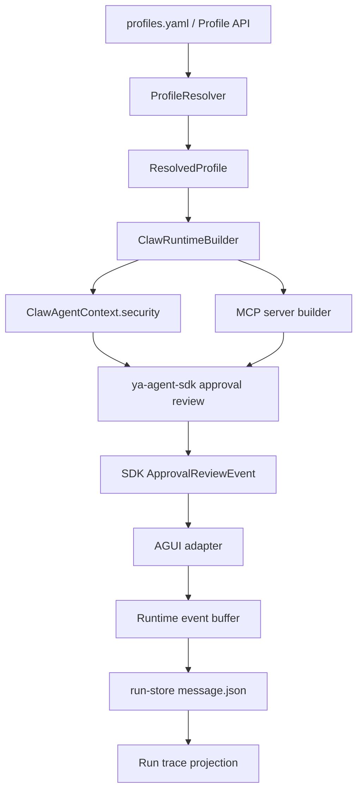

# 11 - Approval Review Integration

YA Claw should expose SDK approval review through execution profiles, runtime assembly, live events, run trace, and web operations surfaces.

This document is the product integration spec for the SDK approval review design in `packages/ya-agent-sdk/spec/03-approval-review.md` and the built-in permission catalog in `packages/ya-agent-sdk/spec/04-tool-permission-catalog.md`.

## Goals

- Configure approval review from AgentProfile security settings.
- Keep approval review execution inside `ya-agent-sdk`.
- Enrich SDK review requests with Claw run, session, profile, source, and workspace metadata.
- Store compact approval review projections in active event streams and run trace.
- Use `security.approval_review` as the single security review profile path.
- Give profile authors clear YAML examples for tool, shell, and MCP policy.

## Architecture



Ownership:

| Layer                    | Responsibility                                                                        |
| ------------------------ | ------------------------------------------------------------------------------------- |
| SDK                      | permission models, reviewer execution, MCP wrapper, result truncation, denial records |
| Claw profile resolver    | parse declarative security config into typed profile data                             |
| Claw runtime builder     | convert resolved profile into SDK `SecurityConfig` and MCP review config              |
| Claw coordinator/adapter | forward approval review events into live stream and committed replay                  |
| Claw API                 | expose profile config and compact trace projections                                   |
| Web shell                | display policy, review outcomes, and trace details                                    |

## Profile Configuration

Approval review lives under `model_config_override.security.approval_review` for persisted profile rows and under `security.approval_review` in YAML seed files.

Example:

```yaml
profiles:
  - name: default
    model: oauth@codex:gpt-5.5
    security:
      approval_review:
        enabled: true
        model: oauth@codex:gpt-5.5
        timeout_seconds: 30
        max_denials: 3
        include_recent_messages: 12
        truncation:
          enabled: true
          max_text_chars: 60000
          head_chars: 30000
          tail_chars: 20000
        mcp_permissions:
          filesystem:
            server_name: filesystem
            transport: stdio
            default_decision: auto_review
            categories: [read, write]
            scopes: [workspace]
            tool_overrides:
              read_file:
                source: mcp
                categories: [read]
                scopes: [workspace]
                default_decision: allow
              delete_file:
                source: mcp
                categories: [write, destructive]
                scopes: [workspace]
                default_decision: auto_review
          github:
            server_name: github
            transport: streamable_http
            default_decision: auto_review
            categories: [external_integration, network]
            scopes: [external_service]
```

Supported fields:

| Field                     | Type    | Purpose                                          |
| ------------------------- | ------- | ------------------------------------------------ |
| `enabled`                 | bool    | Enables SDK approval review                      |
| `model`                   | string  | Reviewer model identifier                        |
| `model_settings`          | object  | Reviewer model settings                          |
| `prompt`                  | string  | Optional reviewer policy override                |
| `timeout_seconds`         | number  | Reviewer timeout                                 |
| `max_denials`             | integer | Circuit breaker threshold                        |
| `include_recent_messages` | integer | Compact reviewer context size                    |
| `truncation`              | object  | SDK result truncation config                     |
| `mcp_permissions`         | map     | Server and tool overrides for MCP classification |

### Manual Approval Fields

Manual approval fields continue to parse:

```yaml
need_user_approve_tools: []
need_user_approve_mcps: []
```

Approval review policy lives under `security.approval_review`. Manual approval fields remain useful for explicit HITL gates.

Profile API models should preserve unknown future security keys in `model_config_override.security` so profile round-trips stay stable.

## ResolvedProfile Changes

`ResolvedProfile` should gain a typed approval review field.

```python
@dataclass(frozen=True)
class ResolvedProfile:
    ...
    approval_review: ClawApprovalReviewConfig | None = None
```

`ClawApprovalReviewConfig` should mirror SDK config with plain Pydantic-friendly fields, then runtime builder converts it into SDK models.

```python
class ClawApprovalReviewConfig(BaseModel):
    enabled: bool = False
    model: str | None = None
    model_settings: dict[str, Any] | None = None
    prompt: str | None = None
    timeout_seconds: float = 30.0
    max_denials: int = 3
    include_recent_messages: int = 12
    truncation: dict[str, Any] = Field(default_factory=dict)
    mcp_permissions: dict[str, dict[str, Any]] = Field(default_factory=dict)
```

Profile resolver rules:

1. Read `security.approval_review` from `model_config_override`.
2. Support top-level YAML `security` merging into `model_config_override.security` during seed normalization.
3. Validate enum strings through SDK model validation when runtime builder constructs the SDK config.
4. Keep disabled configs available for profile detail display with `enabled=false`.

## Runtime Assembly

`ClawRuntimeBuilder` converts `ResolvedProfile.approval_review` into SDK `SecurityConfig`.

```python
security = SecurityConfig()
if profile.approval_review and profile.approval_review.enabled:
    security = SecurityConfig.auto_review(
        reviewer_model=profile.approval_review.model,
        model_settings=profile.approval_review.model_settings,
        prompt=profile.approval_review.prompt,
        timeout_seconds=profile.approval_review.timeout_seconds,
        max_denials=profile.approval_review.max_denials,
        truncation=ToolResultTruncationConfig.model_validate(profile.approval_review.truncation),
        mcp_permissions={
            name: McpPermissionProfile.model_validate(value)
            for name, value in profile.approval_review.mcp_permissions.items()
        },
    )
```

Context construction should set:

```python
ClawAgentContext(
    ...,
    security=security,
)
```

Review request metadata should include:

```python
{
    "claw": {
        "session_id": ctx.session_id,
        "run_id": ctx.claw_run_id,
        "profile_name": ctx.profile_name,
        "source_kind": ctx.source_kind,
        "source_metadata": redacted_source_metadata,
        "workspace": ctx.workspace_binding.model_dump(mode="json"),
    }
}
```

MCP build path should pass review config into `build_mcp_servers(...)`:

```python
mcp_servers = build_mcp_servers(
    filtered_config,
    approval_review=ctx.security.approval_review,
    need_approval_mcps=profile.need_user_approve_mcps,
)
```

The `need_approval_mcps` argument remains the explicit HITL input. The MCP wrapper applies approval review for security review.

## Events

The SDK should emit typed approval review events. Claw should forward them through the regular SDK event stream.

Recommended event names:

| Event                       | Timing                    | Purpose                               |
| --------------------------- | ------------------------- | ------------------------------------- |
| `approval_review.requested` | before reviewer call      | record pending review request summary |
| `approval_review.completed` | after reviewer result     | record reviewer outcome               |
| `approval_review.denied`    | when execution is blocked | make denial visible in UI and trace   |
| `approval_review.truncated` | after result truncation   | record output truncation metadata     |

Recommended event payload:

```json
{
  "type": "approval_review.completed",
  "request_id": "apr_...",
  "tool_call_id": "call_...",
  "tool_name": "shell_exec",
  "source": "builtin",
  "categories": ["execute", "write"],
  "scopes": ["workspace", "local_system"],
  "decision": "auto_review",
  "outcome": "allow",
  "risk_level": "medium",
  "authorization": "implied",
  "rationale": "Runs the project test suite and writes only bounded cache output.",
  "metadata": {
    "mcp_server": null,
    "claw": {
      "session_id": "...",
      "run_id": "...",
      "profile_name": "default"
    }
  }
}
```

Event payload rules:

- Store summarized arguments only.
- Redact secret-looking values before persistence.
- Keep reviewer rationale concise.
- Include raw reviewer result in runtime memory only when a debug flag enables it.
- Keep denial messages visible as regular tool results so the agent can continue safely.

## Run Store and Trace

`message.json` should include approval review events as AGUI custom events or SDK event projections. The run trace endpoint should project approval review events alongside tool calls and tool responses.

Extend trace item type to include approval review:

```python
RunTraceItemType = Literal["tool_call", "tool_response", "approval_review"]
```

Approval review trace content shape:

```json
{
  "request_id": "apr_...",
  "tool_call_id": "call_...",
  "tool_name": "shell_exec",
  "source": "builtin",
  "decision": "auto_review",
  "outcome": "deny",
  "risk_level": "high",
  "authorization": "missing",
  "categories": ["execute", "network"],
  "scopes": ["workspace", "local_system", "network"],
  "rationale": "Downloads and executes a remote script with missing user authorization."
}
```

Trace projection rules:

- `approval_review.requested` can be omitted from default trace when a completed event exists.
- `approval_review.completed` maps to one `approval_review` trace item.
- `approval_review.denied` maps to one `approval_review` item for denial-only event sequences.
- `approval_review.truncated` attaches truncation metadata to the nearest tool response when possible.
- Trace item truncation uses existing `max_item_chars` and `max_total_chars` parameters.

## API Surface

The profile API should accept and return `security.approval_review` as part of `model_config_override` and YAML seed normalization.

Run trace response should include approval review items in the existing `trace` array.

Suggested response example:

```json
{
  "run_id": "run_123",
  "item_count": 3,
  "truncated": false,
  "trace": [
    {
      "sequence_no": 1,
      "type": "tool_call",
      "tool_call_id": "call_1",
      "tool_name": "shell_exec",
      "content": "{\"command\": \"uv run pytest\"}"
    },
    {
      "sequence_no": 2,
      "type": "approval_review",
      "tool_call_id": "call_1",
      "tool_name": "shell_exec",
      "content": "{\"outcome\": \"allow\", \"risk_level\": \"medium\"}"
    },
    {
      "sequence_no": 3,
      "type": "tool_response",
      "tool_call_id": "call_1",
      "tool_name": "shell_exec",
      "content": "pytest output..."
    }
  ]
}
```

This auto-review phase uses existing run event and trace APIs. Product approval inbox work belongs to a later manual/HITL UX spec.

## Web Shell

Profile admin should display:

- approval review enabled state
- reviewer model
- timeout and max denial threshold
- result truncation limits
- MCP server override summary
- approval review status and policy details

Run view should display approval review events inline with tool execution:

- pending reviewer call
- allowed or denied outcome
- risk level
- short rationale
- truncation marker on large tool outputs

Run trace view should include `approval_review` items with filtering by tool name and outcome.

## Lark Bridge

Lark bridge approval cards render generic approval interactions with risk, rationale, command, cwd, and arguments when available.

For bridge-triggered unattended runs:

- reviewer model uses the profile setting
- review requests include `source_kind="bridge"`
- source metadata includes adapter, tenant, chat, and event ids after redaction
- repeated denials should produce a concise message visible in the bridge conversation when the agent surfaces the tool denial result

## Operational Settings

Runtime settings can provide optional global defaults:

| Setting                                   | Purpose                                                                          |
| ----------------------------------------- | -------------------------------------------------------------------------------- |
| `YA_CLAW_APPROVAL_REVIEW_MODEL`           | default reviewer model for profiles that enable approval review and omit a model |
| `YA_CLAW_APPROVAL_REVIEW_TIMEOUT_SECONDS` | default reviewer timeout                                                         |
| `YA_CLAW_APPROVAL_REVIEW_MAX_DENIALS`     | default denial circuit breaker threshold                                         |
| `YA_CLAW_APPROVAL_REVIEW_TRACE_ARGS`      | debug-only flag for including redacted argument summaries in trace               |

Profiles own the primary policy. Runtime settings supply deployment defaults.

## Delivery Plan

### Phase 1: Profile Parsing

- Add `ClawApprovalReviewConfig`.
- Parse `security.approval_review` in `ProfileResolver`.
- Preserve explicit `need_user_approve_tools` and `need_user_approve_mcps` behavior.
- Add profile API round-trip tests.

### Phase 2: Runtime Wiring

- Build SDK `SecurityConfig.auto_review(...)` in runtime assembly.
- Pass MCP permission overrides into SDK MCP builder.
- Enrich approval review metadata from `ClawAgentContext`.
- Add runtime builder unit tests.

### Phase 3: Event and Trace Projection

- Forward SDK approval review events through AGUI adapter.
- Persist events in `message.json`.
- Add `approval_review` run trace projection.
- Add API tests for trace projection.

### Phase 4: Web Operations

- Show approval review config in profile admin.
- Show approval review outcomes in run view and trace view.
- Render approval interactions through generic HITL card components.

### Phase 5: Removal of shell-specific review surface

- Remove shell-specific review config, helpers, tests, evals, docs, and card branches.
- Route Claw shell execution review through generic approval review.

## Test Matrix

| Area             | Expected test                                               |
| ---------------- | ----------------------------------------------------------- |
| YAML seed        | `security.approval_review` merges into profile override     |
| Profile resolver | `ResolvedProfile.approval_review` is populated              |
| Disabled config  | disabled config round-trips through profile detail          |
| Runtime builder  | SDK `SecurityConfig.approval_review` is constructed         |
| MCP builder      | server override reaches SDK MCP wrapper                     |
| Context metadata | review request includes session/run/profile/source metadata |
| Event stream     | completed approval review event reaches run event buffer    |
| Run store        | approval review event persists in `message.json`            |
| Trace            | run trace includes `approval_review` item                   |
| Redaction        | trace content omits secret-like raw argument values         |
| Web model        | profile detail exposes approval review summary              |
| Cleanup          | shell-specific review API and branches are absent           |

## Documentation Updates

Implementation should update:

- `packages/ya-claw/profiles.yaml`
- `packages/ya-claw/README.md`
- `packages/ya-claw/spec/04-api.md`
- `packages/ya-claw/spec/05-web-ui-and-operations.md`
- `skills/ya-claw-deploy/SKILL.md` when deployment settings are added
