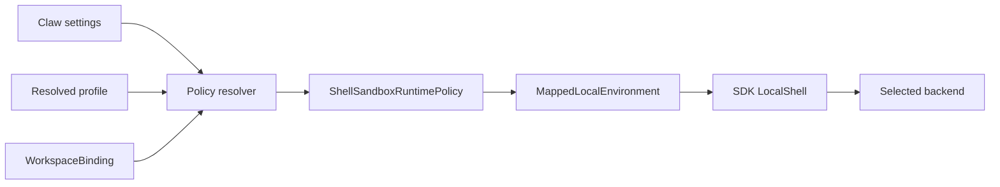

# Shell Sandbox

## Scope

YA Claw resolves one shell sandbox policy for each local workspace environment and
passes it to the SDK `LocalShell`. The policy combines deployment defaults, the resolved
execution profile, and the exact `WorkspaceBinding` mount snapshot.

This document describes the implemented 2.0 contract. It does not promise a separate
sandbox diagnostics API, persisted audit ledger, mounted-provider proxy protocol, or
container/VM orchestration layer.

## Ownership

The SDK owns reusable policy types, backend command construction, environment filtering,
and subprocess lifecycle. Claw owns translation from product settings, execution
profiles, and workspace bindings.

## Configuration

Deployment defaults use these `ClawSettings` fields:

| Field                          | Default | Meaning                             |
| ------------------------------ | ------- | ----------------------------------- |
| `shell_sandbox_enabled`        | `true`  | enable the resolved policy          |
| `shell_sandbox_backend`        | `auto`  | select the platform backend         |
| `shell_sandbox_network`        | `full`  | default network mode                |
| `shell_sandbox_allow_raw_host` | `false` | permit raw-host fallback/escalation |

A profile may provide `security.shell_sandbox` inside its model configuration. The
strict `ShellSandboxConfig` fields are:

- `enabled`;
- `profile`: `read_only`, `workspace_write`, `mounted_workspace_write`,
  `network_proxy`, or `danger_full_access`;
- `backend_preference`;
- `network`: `blocked`, `restricted`, `proxy`, or `full`;
- `env_allowlist`;
- `masked_path_aliases` and `masked_paths`;
- `raw_shell_approval`;
- `audit_enabled` as policy metadata.

Timeouts remain the environment shell timeout. Output bounding remains the shared shell
and tool boundary. They are not profile sandbox fields.

## Resolution

`resolve_workspace_shell_sandbox_policy()` performs one deterministic translation:

1. map every `WorkspaceBinding.mounts` entry to a concrete host-path mount policy;
2. preserve each mount's `ro` or `rw` mode;
3. apply deployment defaults when the profile omits sandbox configuration;
4. let an explicit profile select its profile, backend, network, environment allowlist,
   path masks, and raw-host approval;
5. resolve `auto` to the current platform backend; and
6. attach the resolved metadata to the workspace binding and pass the policy to the
   local environment.

File operations and shell execution therefore consume the same binding snapshot.

## Backend Behavior

| Backend                      | Current behavior                                                                                                                                   |
| ---------------------------- | -------------------------------------------------------------------------------------------------------------------------------------------------- |
| `linux_bwrap_seccomp`        | uses `bubblewrap`; binds the host root read-only, overlays declared mounts, applies path masks, and unshares networking for `blocked`/`restricted` |
| `macos_seatbelt`             | generates a temporary Seatbelt profile with declared mount permissions and network access for `proxy`/`full`                                       |
| `windows_restricted_token`   | fails closed unless raw-host execution is explicitly allowed                                                                                       |
| `raw_host`                   | runs only when `raw_shell_allowed` is true                                                                                                         |
| `docker`, `podman`, `nsjail` | accepted policy selectors but not local SDK backends in this build; execution fails as unsupported                                                 |

The Linux backend currently relies on bubblewrap's namespace boundary; the backend name
does not imply an additional in-process seccomp program. Missing bubblewrap or
`sandbox-exec` fails closed unless the resolved policy explicitly allows raw-host
fallback.

## Filesystem, Network, and Environment

- The shell validates `cwd` against its allowed host paths before process creation.
- Declared mounts are bound read-only or read-write according to the workspace binding.
- Existing masked paths are hidden by the native backend where supported.
- Linux `blocked` and `restricted` modes use an unshared network namespace.
- macOS permits network operations only for `proxy` and `full`.
- `env_allowlist=["*"]` passes the effective environment through; otherwise only listed
  variables plus required `HOME`/`PATH` defaults are retained.
- Raw mode with sandboxing disabled preserves normal SDK `LocalShell` behavior.

## Raw Host Boundary

Raw-host execution is denied unless either the deployment permits it or the profile uses
`raw_shell_approval="allowed_for_profile"`. The boolean is enforced by `LocalShell` and
by native-backend fallback paths. Human approval policy remains a separate capability
and host concern; the sandbox layer does not fabricate an approval flow.

## Agent Context and Metadata

`LocalShell.get_context_instructions()` reports the resolved enabled state, profile,
backend, network mode, and raw-host allowance. `ShellSandboxRuntimePolicy.to_metadata()`
also exposes the requested/resolved backend, mount snapshot, path masks, and environment
allowlist. Claw stores this metadata on the workspace binding; there is no standalone
public capability endpoint or required run-level audit record in the current contract.

## Verification

- SDK policy tests cover profile/default resolution, mask expansion, backend command
  construction, network behavior, mount modes, raw-host denial, and environment
  filtering.
- SDK Linux integration tests run only where bubblewrap is available.
- Claw's `test_workspace_shell_sandbox.py` verifies binding/default/profile translation.

Future backends, richer resource limits, network proxies, and durable audit records must
be introduced as explicit product changes rather than inferred from this contract.
