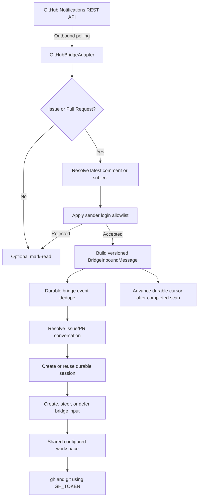

# GitHub Notification Bridge

YA Claw includes an outbound-only GitHub bridge for an ordinary GitHub service account. The bridge polls the authenticated account's notification inbox, maps each Issue or Pull Request to one durable YA Claw session, and lets the agent inspect and act on GitHub from the configured shared workspace with `gh` and `GH_TOKEN`.

The adapter does not require a GitHub App, webhook endpoint, public ingress, tunnel, or external relay.

## Identity and Credential Boundary

The bridge uses one classic personal access token owned by an ordinary GitHub account. GitHub's Notifications REST endpoints do not support fine-grained personal access tokens.

Required classic PAT scopes depend on the deployment:

- `notifications` is sufficient for the Notifications API itself.
- `repo` is required when the account must read or modify private repository resources.
- Public-repository actions require the corresponding classic PAT access granted by GitHub.

`YA_CLAW_BRIDGE_GITHUB_TOKEN` is a `SecretStr` service setting. YA Claw also injects the same value into workspace environments as `GH_TOKEN`. The official workspace image includes GitHub CLI. The token is supplied at runtime and must not be baked into the workspace image.

The token, account membership, and GitHub notification subscriptions define repository visibility and action authority. YA Claw does not duplicate that boundary with a repository allowlist.

## Configuration

```env
YA_CLAW_BRIDGE_DISPATCH_MODE=embedded
YA_CLAW_BRIDGE_ENABLED_ADAPTERS=github
YA_CLAW_BRIDGE_GITHUB_TOKEN=replace-with-classic-pat
YA_CLAW_BRIDGE_GITHUB_ALLOWED_SENDERS=alice,bob
YA_CLAW_BRIDGE_GITHUB_DEFAULT_PROFILE=default
YA_CLAW_BRIDGE_GITHUB_POLL_INTERVAL_SECONDS=60
YA_CLAW_BRIDGE_GITHUB_INITIAL_LOOKBACK_SECONDS=0
YA_CLAW_BRIDGE_GITHUB_MARK_READ=true
```

Use `YA_CLAW_BRIDGE_GITHUB_ALLOWED_SENDERS=*` to accept every resolvable or unresolvable sender. Explicit entries are case-insensitive exact GitHub login matches. When an explicit list is configured, notifications whose triggering sender cannot be attributed are ignored. The authenticated bridge account is always rejected when it can be identified as the sender.

`YA_CLAW_BRIDGE_GITHUB_API_URL` defaults to `https://api.github.com`. It may point to a compatible HTTPS GitHub API origin; plaintext HTTP is rejected. The client refuses to forward credentials to subject or comment URLs on a different origin.

`YA_CLAW_BRIDGE_GITHUB_ENABLED=true` is a compatibility enablement switch. New deployments should use `YA_CLAW_BRIDGE_ENABLED_ADAPTERS=github`.

## Runtime Flow



The adapter runs as one long-lived task under `BridgeSupervisor`. Transient bootstrap and polling failures are logged and retried after the configured polling interval. `stop()` interrupts the poll wait so service shutdown does not wait for the full interval.

## Notification Semantics

GitHub Notifications returns mutable thread snapshots, not an immutable event stream. A notification thread has a stable `id`; later activity updates fields such as `updated_at`, `reason`, `unread`, and `subject.latest_comment_url`. Intermediate GitHub actions may be coalesced before YA Claw polls them.

The bridge therefore treats a notification as a wake-up signal:

- It does not maintain an event-type or notification-reason allowlist.
- It scans every notification returned for the authenticated account.
- It routes only subjects that resolve to an Issue or Pull Request.
- The GitHub-specific agent prompt instructs the agent to inspect the current resource with `gh` before acting.
- Follow-up notifications for the same resource continue the existing session even when the new comment does not mention the service account again.

The adapter follows `subject.latest_comment_url` as an opaque API URL when present. This supports both Issue conversation comments and Pull Request review comments without guessing their endpoint shape. If the latest comment has disappeared, the adapter falls back to `subject.url`; an absent Issue or Pull Request is ignored. Foreign-origin URLs are rejected before authorization headers are sent.

## Sender Attribution

Notification thread objects do not include the triggering actor. The adapter resolves the source object to apply `YA_CLAW_BRIDGE_GITHUB_ALLOWED_SENDERS`:

- A newly created object from `latest_comment_url` is attributable to its `user`, `actor`, `sender`, or `author` only when its `created_at` and `updated_at` both match the notification version timestamp. A stale latest comment or edited source is not attributed to the current update.
- A newly created subject body is attributable only for `mention` and `team_mention` reasons when its `created_at` and `updated_at` both match the notification version timestamp. Later subject edits are unattributable because the subject author may differ from the editor.
- Other subject-only notification reasons are not reliably attributable because the subject author may differ from the actor who changed assignment, state, labels, or review requests.

With an explicit sender list, an unattributable notification is ignored. With `*`, sender attribution is not required and every Issue/PR notification snapshot is accepted, except an identified self-event.

## Conversation and Event Identity

The authenticated API host and account ID form the tenant boundary:

```text
github:{api_host}:{authenticated_user_id}
```

The stable conversation key uses repository ID, resource kind, and number:

```text
github:{repository_id}:issue:{number}
github:{repository_id}:pull:{number}
```

Repository ID keeps the conversation stable if a repository is renamed or transferred. Issue and Pull Request numbers remain scoped by repository ID.

A notification occurrence is versioned by thread ID and `updated_at`:

```text
github:{notification_thread_id}:{updated_at_utc}
```

The adapter uses this complete version as both `event_id` and `message_id`. This is required because `bridge_events` has unique constraints on both `(adapter, tenant_key, event_id)` and `(adapter, tenant_key, external_message_id)`. Reusing only the notification thread ID would incorrectly suppress later updates to the same Issue or Pull Request.

## Durable Cursor and Replay

Polling state lives in `bridge_cursors`, keyed by `(adapter, tenant_key, cursor_key)`. The GitHub adapter uses cursor key `notifications` and stores an ISO-8601 UTC timestamp.

On first startup:

1. Authenticate with `GET /user` and derive the tenant key.
2. Create the cursor at current time minus `YA_CLAW_BRIDGE_GITHUB_INITIAL_LOOKBACK_SECONDS`.
3. Query notifications from that cursor without an overlap window.

On later polls and restarts:

1. Read the durable cursor.
2. Query `GET /notifications?all=true&since={cursor-60s}`.
3. Follow every `Link: rel="next"` page, using GitHub's maximum `per_page=50`.
4. Process results from oldest to newest.
5. Persist or deduplicate accepted bridge events.
6. Advance the cursor to the first response's trusted GitHub `Date` timestamp only after the complete scan succeeds, falling back to the local scan start when the header is unavailable.

The server timestamp avoids missing notifications when the YA Claw host clock is ahead of GitHub. The 60-second overlap protects timestamp boundaries and crash/restart races. Existing bridge event uniqueness makes replay safe. A failed scan does not advance the cursor. GitHub `received` or `failed` bridge events are retried; recovery first reconciles any already-persisted run or HITL deferred input so a crash between durable writes does not submit the same input again.

The adapter honors `X-Poll-Interval` by waiting for the greater of GitHub's returned minimum and `YA_CLAW_BRIDGE_GITHUB_POLL_INTERVAL_SECONDS`. It sends `If-Modified-Since` and accepts `304 Not Modified` as an empty poll.

## Read State

When `YA_CLAW_BRIDGE_GITHUB_MARK_READ=true`, accepted, rejected, and unsupported notification threads are marked read after successful local handling. A failed local dispatch is retried without marking the thread read or advancing the cursor. Mark-read is best-effort and is not the delivery authority.

The adapter intentionally does not call GitHub's mark-as-done/delete-thread endpoint. A thread ID is reused for later activity and GitHub does not expose a compare-and-delete operation tied to `updated_at`. Correctness comes from `all=true`, the local cursor, and durable versioned event dedupe rather than remote unread state.

## Session Workspace and Prompt

GitHub bridge sessions do not persist a session-specific workspace binding. They inherit the configured default workspace exactly like API sessions that omit `workspace`. Every Issue or Pull Request has independent conversation history while using the same configured workspace files.

The GitHub prompt includes:

- repository, resource kind, number, title, and URL
- notification reason, sender, thread ID, event ID, and update time
- the resolved latest source content when available
- a recommended `gh issue view` or `gh pr view` command
- a recommended command for replying on the same resource

The prompt explicitly labels GitHub content as untrusted and tells the agent to inspect the current resource because Notifications may coalesce updates.

## Operational Limits

- The adapter represents one GitHub account per YA Claw process because `BridgeSupervisor` holds one task per adapter type.
- Notifications can coalesce intermediate activity. This bridge provides current-thread wake-ups, not lossless GitHub event auditing.
- Editing a comment does not guarantee a new notification.
- Non-Issue and non-Pull Request subjects are scanned and optionally marked read but do not create sessions.
- Docker workspace containers receive `GH_TOKEN` when they are created. Recreate existing session containers after rotating the token.
