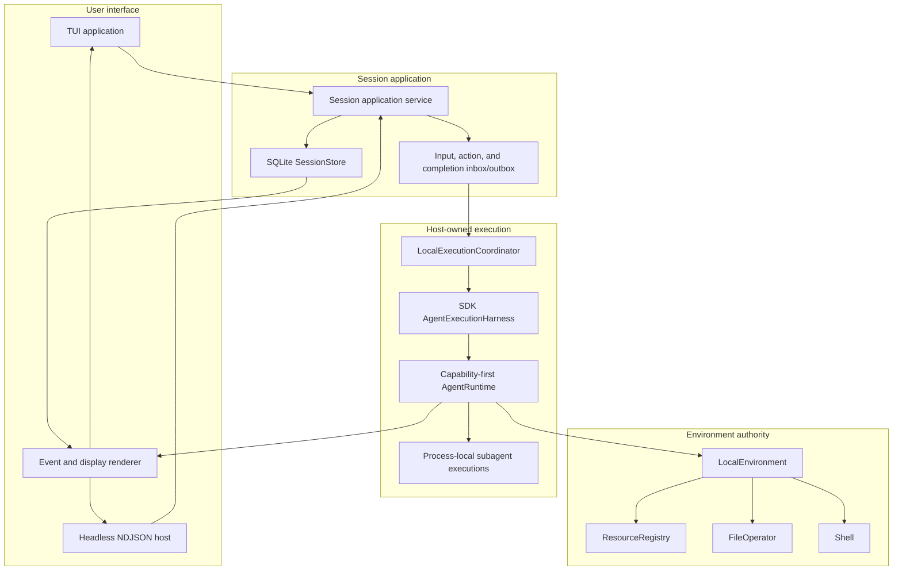

# YAACLI CLI TUI Architecture Overview

## Document Index

| Document                                     | Description                                       |
| -------------------------------------------- | ------------------------------------------------- |
| [01-event-system.md](./01-event-system.md)   | Event system and multi-agent display architecture |
| [02-configuration.md](./02-configuration.md) | Configuration via environment variables           |
| [03-tui-environment.md](./03-tui-environment.md) | TUI Environment with process management       |
| [04-steering.md](./04-steering.md)           | Durable input admission and native Pydantic AI steering |
| [05-session-persistence.md](./05-session-persistence.md) | SQLite SessionStore, local execution coordination, revisions, and recovery |
| [06-ui-layout.md](./06-ui-layout.md)         | TUI layout and user experience design             |
| [07-logging.md](./07-logging.md)             | Logging configuration                             |
| [08-hitl.md](./08-hitl.md)                   | Human-in-the-loop approval workflow               |
| [09-shell-monitor.md](./09-shell-monitor.md) | Background shell process monitoring               |
| [Host-owned session architecture](../../ya-agent-sdk/spec/05-capability-first-runtime/06-yaacli-durable-sessions.md) | SDK segment harness, host coordinators, input/HITL persistence, and recovery contracts |
| [Portable subagent runtime](../../ya-agent-sdk/spec/05-capability-first-runtime/07-subagent-runtime.md) | Native `AgentSpec`, YA policy envelopes, and the YAACLI durable subagent driver |
| [SDK custom capability discovery](../../ya-agent-sdk/spec/06-capability-plugins/README.md) | per-type entry points, explicit imports, SDK-owned validation, and immutable custom-type catalogs |

## High-Level Architecture

## Design Principles

### 1. Event-Driven via SDK Lifecycle Events

All agent activity flows through SDK lifecycle events and durable product
projections:

- SDK emits model request, tool, input, subagent, compact, and handoff events.
- Native segment live events are best-effort until their stable boundary commits.
- `SessionStore` owns idempotent terminal and bounded replay projections.
- TUI and headless render the same committed event semantics.

### 2. Simplified Configuration

Configuration primarily uses `~/.yaacli/config.toml`, project `.yaacli/` files, and
`YAACLI_*` environment overrides. Declarative main and child definitions embed native
Pydantic AI `AgentSpec` cores; YA config adds only TUI/session/durability and subagent
policy envelopes. User config directories also store MCP configuration, skills, and
runtime settings. `SessionStore` owns session revisions, canonical history,
`RunInputLedger`, actions, stable segment checkpoints, usage, event replay, and execution
linkage. There is no second execution-engine store.

### 3. Capability-First Composition

The runtime composes Pydantic AI capabilities from host configuration, context, and
Environment/resource contribution groups. Capabilities own tools and instructions
together. Skills, MCP, Tool Proxy, CodeAct, and delegation are capability entries rather
than a second public toolset-composition plane.

YAACLI obtains one immutable `CapabilityCatalog` through the SDK from trusted
application/bootstrap choices. It does not scan entry points or maintain a parallel
custom-type registry. Profiles, sessions, and imported bundles may reference available
serialization names but cannot introduce Python import targets. Catalog availability
does not grant a feature absent from the native `AgentSpec`.

### 4. Interactive Runtime

Worker boot builds the SDK type catalog, enters the Environment, and resolves and
constructs every required executable agent plan before dispatching product work. A
retained plan with unavailable compatible code fails explicitly. Each product turn then
selects one registered plan and becomes one host-coordinated logical run. The TUI
attaches to that execution and supports:

- live output reconciled with committed replay;
- durable human-in-the-loop suspension and audited continuation;
- steer-now and queue-after-current-work input persisted before acknowledgement;
- durable subagent inspection, steering, cancellation, and completion; and
- session reattachment and logical-run recovery after process restart.

MessageBus and process-local subagent ownership do not exist in the 2.0 target.
