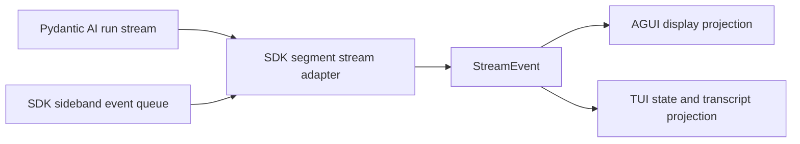
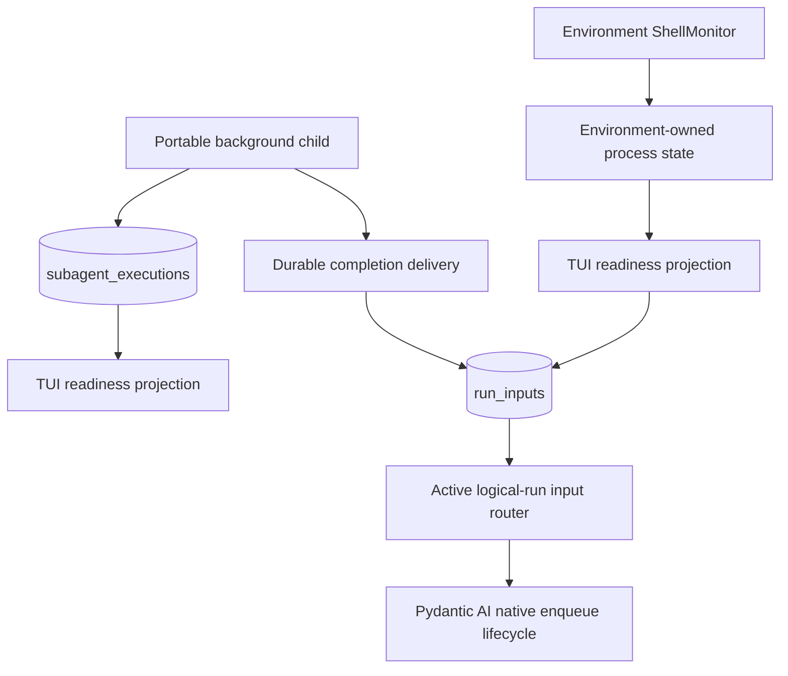

# Event and Projection Architecture

## Purpose

YAACLI presents three different kinds of information without conflating their
ownership:

1. **Pydantic AI stream events** describe model output and direct tool execution.
2. **SDK sideband events** describe SDK-owned lifecycle, usage, compact, handoff, and
   foreground subagent activity.
3. **Durable product projections** describe session, background-subagent, shell, and
   HITL state whose authority lives in SQLite rather than in an in-memory event queue.

Events are notifications and display inputs. They are not durable commands, canonical
session history, or a hidden input transport.

## Live Stream Boundary

`StreamEvent` is the common live envelope:

```python
@dataclass
class StreamEvent:
    agent_id: str
    agent_name: str
    event: AgentStreamEvent
```

The payload can be a native Pydantic AI event or a typed SDK/YAACLI sideband event.
The envelope provides attribution only; it does not grant an agent access to another
agent's tools, context, or result.



The interactive runtime consumes the SDK segment stream directly for live model/tool
events. `stream_agent()` remains the lower-level SDK convenience boundary and also emits
SDK lifecycle events.

## Native Model and Tool Events

YAACLI renders native Pydantic AI events directly:

| Event | Projection |
| --- | --- |
| `PartStartEvent`, `PartDeltaEvent`, `PartEndEvent` | streaming text and thinking blocks |
| `FunctionToolCallEvent`, `OutputToolCallEvent` | tool-call start |
| `FunctionToolResultEvent`, `OutputToolResultEvent` | bounded tool result and completion |

AGUI is the sole owner of display replay when an AGUI adapter is active. The raw event
path still updates non-display state, but must not duplicate transcript content.

## SDK Sideband Events

SDK code emits typed notifications through `AgentContext.emit_event()` while a stream
queue is active.

### Execution lifecycle

`stream_agent()` can emit:

- `AgentExecutionStartEvent`
- `ModelRequestStartEvent` and `ModelRequestCompleteEvent`
- `ToolCallsStartEvent` and `ToolCallsCompleteEvent`
- `AgentExecutionResumeEvent`
- `AgentExecutionCompleteEvent` or `AgentExecutionFailedEvent`

These events expose phase, loop, attempt, duration, and recovery state. They do not
replace canonical Pydantic AI messages or `RunUsage`.

### Usage

`UsageSnapshotEvent` contains the latest cumulative `UsageSnapshot` for one run. YAACLI
replaces the prior snapshot for the same `run_id` before committing it into session
usage, so late durable-child usage can update totals without double counting.

### Compact and handoff

The SDK emits start/complete/failure events for compact and handoff operations. The TUI
renders bounded status and summary output. Lifecycle extensions receive richer typed
callback contexts separately; display events are not the persistence contract for
history replacement.

### Foreground subagents

`SubagentStartEvent` and `SubagentCompleteEvent` carry `execution_id`, explicit mode,
parent logical-run attribution, agent identity, and bounded progress/result fields.
Lifecycle events and detailed child events use the same child-attributed stream envelope.
For foreground children, the TUI maintains an in-place progress block using the readable
`<route>-<short-id>` handle and silently counts child tool calls. Background lifecycle
and detail events are suppressed by explicit mode before AGUI adaptation or replay
persistence; detached children also disable detailed turn-local stream publication at
the source. Readiness comes from durable records, not from parsing an ID. The canonical
child result remains in
`SubagentExecutionService` and its execution store.

## Durable Product Projections

Background work can outlive the current model request or process. Its source of truth
therefore cannot be an SDK event queue.



### Background subagent completion

YAACLI polls durable `subagent_executions` records only to show readiness for the active
session. Projection is idempotent by `execution_id`. It neither consumes the result nor
wakes the model. `DurableSubagentCompletionDelivery` writes the canonical completion
message to a compatible active session run with an idempotency key and
`wake_execution=False`.

### Background shell readiness

`ShellMonitor` owns readiness derived from Environment shell state. YAACLI shows the
notification and persists feature input through the durable inbox. Product policy may
start one idle turn when no run can accept that input; this is an explicit application
choice, not SDK event behavior.

### Session and HITL events

SQLite session events and execution records represent durable run transitions, revision
commits, cancellation, interruption, and action-batch decisions. The UI reconstructs state
from durable records and replay artifacts. A missed live event must not make a committed
turn, pending approval, or completed child disappear.

## TUI Dispatch Rules

`TUIApp._handle_stream_event()` applies these rules:

1. project foreground subagent lifecycle before ordinary stream parts and suppress
   background lifecycle/detail events by explicit mode;
2. attribute foreground child tool calls to the active readable progress block and
   suppress child transcript noise;
3. replace run usage snapshots rather than accumulating duplicate snapshots;
4. let AGUI own display content when AGUI replay is active;
5. render main-agent text, thinking, tools, compact, handoff, task/note/file, and goal
   events by concrete type;
6. use model/tool lifecycle events only for transient phase state.

`StreamEventHandler` is a small type-dispatch utility for consumers that prefer
registered callbacks. It does not persist, reorder, or retry events.

## Invariants

- No MessageBus, bus cursor, or `MessageReceivedEvent` exists in the 2.0 runtime.
- User text, steering, shell readiness, and child completion enter model execution only
  through the logical-run input ledger and native Pydantic AI enqueue lifecycle.
- Durable state is reconstructed from SQLite records, not from sideband event replay.
- Display replay is bounded and non-authoritative.
- Event payloads shown in the terminal are bounded; full durable records remain behind
  their owning service APIs.
- Subagent attribution never changes capability or authority boundaries.

## Implementation Map

| Concern | Canonical implementation |
| --- | --- |
| SDK event types | `ya_agent_sdk/events.py` |
| SDK stream envelope and queue | `ya_agent_sdk/context/agent.py` |
| SDK streaming and lifecycle emission | `ya_agent_sdk/agents/main.py` |
| YAACLI-specific goal events | `yaacli/events.py` |
| TUI stream projection | `yaacli/app/tui.py` |
| Dispatch helper | `yaacli/streaming/event_handler.py` |
| Durable session events and input | `yaacli/durable/` |
| Durable child execution records | `yaacli/durable/subagents.py` |
| Environment shell readiness | `yaacli/shell_monitor.py` |
