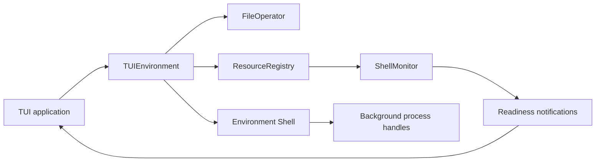
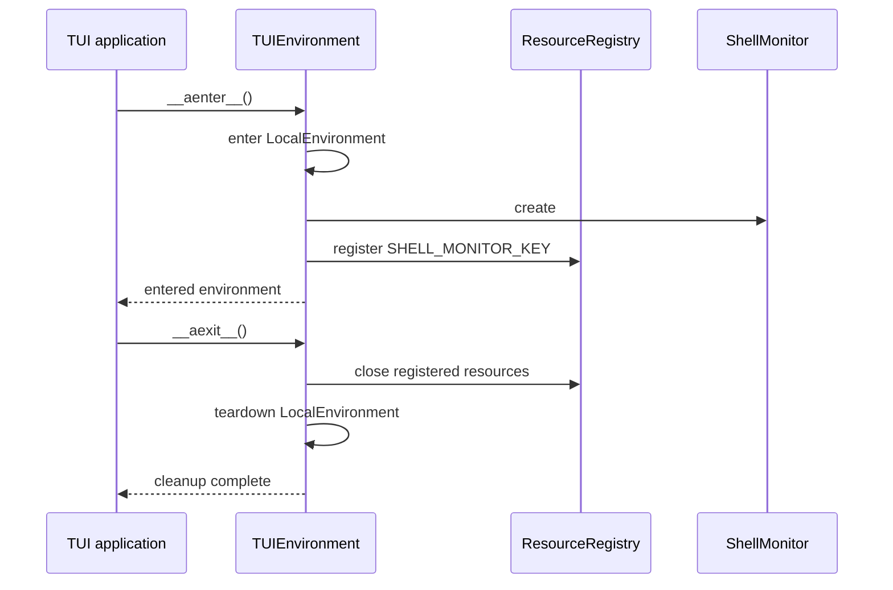

# TUI Environment

## Overview

`TUIEnvironment` is YAACLI's entered local environment. It preserves the SDK
`LocalEnvironment` contract and adds one lifecycle-managed `ShellMonitor` resource for
the terminal application.

Process ownership remains with `Environment.shell`. YAACLI does not maintain a second
`ProcessManager`, process registry, or `!ps`/`!kill` command family.

## Composition

`TUIEnvironment` supplies:

- the SDK file and shell authorities;
- the SDK resource registry;
- a system-temporary-root override for environment-managed scratch data; and
- `ShellMonitor` registered under `SHELL_MONITOR_KEY` while the environment is entered.

## Temporary Storage

YAACLI deliberately passes the resolved system temporary directory as
`tmp_base_dir`. Environment-managed scratch data therefore stays outside the active
repository while workspace file access remains governed by `allowed_paths` and
`default_path`.

## Shell and Monitor Ownership

The environment shell owns command execution, process handles, output buffers,
termination, and cleanup. `ShellMonitor` observes readiness only. It does not launch,
kill, or retain subprocesses independently.

The monitor is an environment resource so the TUI can obtain it from the same entered
authority graph as the shell. The detailed notification, acknowledgement, reset, and
durable-routing contract is defined in [09-shell-monitor.md](09-shell-monitor.md).

## Lifecycle

Before entry, `shell_monitor` raises `RuntimeError`. During teardown, registered
resources close before the environment clears its monitor reference. Re-entering the
environment creates a fresh monitor.

## Verification

Focused environment tests cover entry requirements, shell availability, monitor
registration, and cleanup. Shell process behavior is verified by the shared environment
package; YAACLI-specific notification behavior is verified by its background-monitor
and TUI tests.
