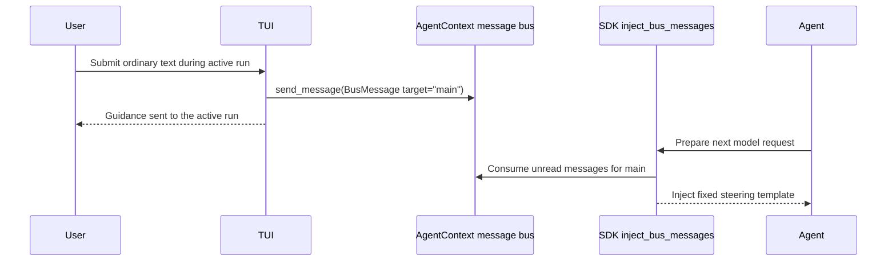

# Steering and TUI Context

## Overview

YAACLI treats every ordinary input submitted while the main agent is active as immediate steering. There is no steering prefix, steering configuration section, dedicated steering queue, or deferred next-prompt queue.

Steering is useful for:

- correcting the current approach;
- adding context or constraints;
- redirecting a long-running tool workflow;
- responding while the model is still thinking or streaming.

The built-in `steer_subagent` tool is a separate mechanism for targeting a background subagent. Compose-area input always targets the main agent.

## Input Contract

| Foreground state | Ordinary input | Special input |
| --- | --- | --- |
| `IDLE` / `BACKGROUND_RESULT_READY` | Starts a new main-agent turn | Slash commands and `!shell` use their own dispatch paths |
| `THINKING` | Sent to the active run as steering | Busy-safe slash commands retain local command semantics; `!shell` and idle-only slash commands are rejected |
| `TOOL_CALLING` | Sent to the active run as steering | Busy-safe commands remain available; control syntax is never steering |
| `STREAMING_OUTPUT` | Sent to the active run as steering | Busy-safe commands remain available; control syntax is never steering |
| `AWAITING_APPROVAL` | Non-decision ordinary text is steering and approval remains pending | Explicit decisions, deferred-call results, and busy-safe commands are handled before ordinary text |
| `COMMAND_RUNNING` / `SHELL_RUNNING` / `SAVING` / `CANCELLING` | Rejected without clearing the draft | Busy-safe commands retain local semantics; `/cancel` follows lifecycle rules and an in-progress save cannot be cancelled |

Binary attachments cannot steer an active run. They remain attached for the next turn while any accompanying text is sent as steering.

## Delivery Path



The TUI creates a `BusMessage` with:

- `source="user"`;
- `target="main"`;
- the fixed SDK-compatible steering template;
- the submitted text as content.

The SDK message-bus filter owns injection and idempotency. YAACLI does not maintain a second local buffer. The status bar derives `steering N pending` directly from unread main-subscriber messages with `source="user"`; it never renders their content. Once the filter consumes those messages for a model request, the count disappears automatically. When a foreground run ends, YAACLI clears the resumable steering list and selectively marks any remaining unread user messages consumed. Background messages remain unread, so user guidance cannot leak into a future run and background results are not swallowed.

## Input Routing

The routing order is intentional:

1. Reject input while a session reset is active.
2. Reconcile attachment chips, dropping binaries whose chip was deleted; remove any remaining generated chip text for classification without consuming its queued binary.
3. Reserve `/...` and `!...` as local control namespaces before any steering or HITL-result parsing.
4. Dispatch busy-safe slash commands; diagnose unknown slash commands locally; reject idle-only and custom slash commands without clearing the draft.
5. During an active agent phase, route only ordinary text to the message bus immediately.
6. During non-agent foreground work, preserve ordinary drafts and ask the user to wait.
7. While idle, dispatch slash commands, direct shell commands, or a new prompt.

The busy-safe command surface is `/cancel`, `/integrate`, `/agents`, `/process`, `/cost`, `/perf`, `/help`, `/attachments`, `/paste-image`, `/remove-image`, and `/tool`. There is no fallback that converts control syntax into steering or stores ordinary active-run input for a later turn.

## HITL Interaction

HITL decisions must be explicit:

- empty Enter never approves;
- `y`, `yes`, or `approve` approves an approval request;
- `n`, `no`, or `reject <reason>` rejects it;
- a deferred call accepts non-empty text as its result, while `/deny <reason>` denies it;
- `/cancel` has priority over all approval and call parsing;
- all busy-safe commands retain command semantics before approval or deferred-call result parsing;
- unknown slash commands are diagnosed locally, while idle-only/custom slash and `!shell` input are rejected without resolving the request;
- the HITL parser is active only while the authoritative phase is `AWAITING_APPROVAL`; `SAVING` and `CANCELLING` always use cleanup-phase routing;
- for approval requests, non-decision ordinary text is steering and leaves the request pending.

This preserves both safety and the global active-run steering contract.

## Foreground Ownership

Steering does not start another task. A single foreground owner covers:

- agent execution;
- deferred approval/call handling;
- direct shell execution;
- session persistence;
- slash/custom command dispatch;
- cancellation cleanup.

Foreground ownership is claimed synchronously before a new task receives event-loop time. This prevents a second prompt or shell command from racing the first submission.

## Lifecycle and Recovery

- The elapsed timer starts when foreground dispatch is claimed, not when the model emits its first event.
- The same start time is retained across thinking, tools, output streaming, approval, and saving.
- Background completion only marks results ready. It does not take over the compose buffer.
- The next prompt integrates ready background results. During an active run, `/integrate` delivers them to the current message bus for the next model request; while idle it starts an explicit integration turn.
- `/agents` inspects running and recently completed background subagents; `/process` inspects active background shell processes. Neither command changes agent context.
- Session restore preserves the current runtime approval policy and restores into a clean session context.
- Every terminal path clears the resumable steering list and unread main-subscriber user messages before snapshot export, with final cleanup as a fallback; background bus messages remain pending.

## Configuration

Steering has no YAACLI configuration section and no environment variables. In particular, the following legacy settings are unsupported and must not appear in examples:

```text
YAACLI_STEERING_ENABLED
YAACLI_STEERING_PREFIX
[steering]
prefix
buffer_size
```

This is a behavioral invariant rather than an optional mode.

## Verification

The test suite covers:

- real active phases routing ordinary input to steering;
- no `_queued_prompts` state;
- strict HITL decisions and `/cancel` priority;
- non-decision HITL text steering without resolving approval;
- foreground race prevention;
- timer continuity across real lifecycle phases;
- steering delivery through `AgentContext.send_message()`;
- cleanup and session-boundary isolation.
