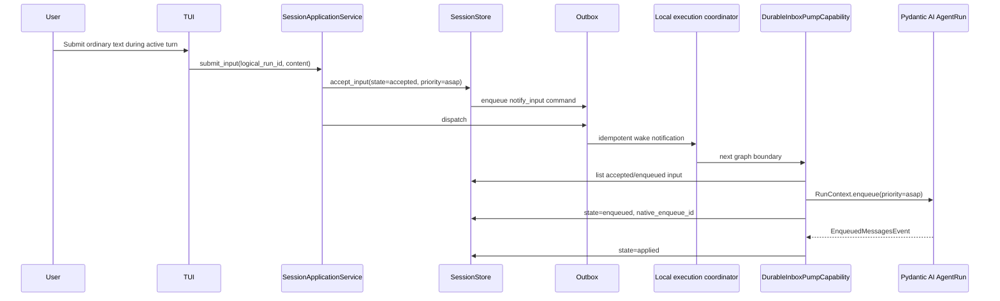

# Durable Steering and Input Admission

## Overview

Ordinary compose input submitted while a main-agent turn is active is immediate
steering. YAACLI first persists it in the product `SessionStore`, then wakes the owning
local execution task. The host capability drains the durable inbox at native Pydantic AI
graph boundaries and calls `RunContext.enqueue(priority="asap")`.

There is no MessageBus, process-local steering buffer, configurable steering prefix,
or deferred next-prompt queue. Before native enqueue, active-run user text is formatted
with the established `<steering>` guidance and system-reminder envelope so the model can
distinguish course correction from a new ordinary prompt. This formatting is a pure
host-boundary transformation; persisted content remains the original text.

The built-in `steer_subagent` tool is a separate targeted child-input operation.
Compose-area input always targets the active main logical run. Targeted child admission
uses the same accepted/enqueued/applied/rejected receipt contract: a suspended child may
persist input for its next continuation, while a terminal-close race returns `rejected`
instead of failing the parent run. Unknown handles, owner-scope violations, malformed
content, and conflicting idempotency reuse remain errors.

## Input Contract

| Foreground state | Ordinary input | Special input |
| --- | --- | --- |
| `IDLE` | Starts a new durable logical run | Registered slash commands, explicit skills, and `!shell` use local dispatch |
| `THINKING` | Persisted as active-run steering | Busy-safe commands retain local semantics |
| `TOOL_CALLING` | Persisted as active-run steering | Busy-safe commands retain local semantics |
| `STREAMING_OUTPUT` | Persisted as active-run steering | Busy-safe commands retain local semantics |
| `AWAITING_APPROVAL` | Non-decision ordinary text is steering; the action remains pending | Explicit approval/deferred results and busy-safe commands are handled first |
| `COMMAND_RUNNING` / `SHELL_RUNNING` / `SAVING` / `CANCELLING` | Rejected without clearing the draft | Busy-safe commands retain local semantics |

Binary attachments do not steer an active run. They remain queued for the next turn
while accompanying text may be admitted as steering.

## Durable Delivery Path



Persistence precedes acknowledgement and notification. The outbox command ID and input
idempotency key make retry safe. A workflow notification contains only the durable
input identity; the payload remains in `SessionStore`.

`DurableInboxPumpCapability` runs from the workflow-owned native capability hook. It:

- drains only records for the current logical run;
- validates stored content as Pydantic AI `UserContent`;
- formats non-initial user text as model-facing steering guidance while leaving feature
  input and persisted content unchanged;
- records that same model-facing input in `RunInputLedger`;
- uses the persisted `asap` or `when_idle` priority;
- shares the router's current native-attempt identity instead of deriving one from
  Pydantic AI run metadata;
- calls native enqueue at most once for each input in one native segment attempt;
- permits one fresh enqueue when an unresolved input crosses into a new native attempt;
- records every native enqueue attempt; and
- marks the product row applied when any recorded attempt emits `EnqueuedMessagesEvent`.

At a terminal graph boundary it reads one serialized snapshot of unresolved input; it
does not close ingress or lock the session. SQLite transaction order provides
last-write-wins behavior. An input committed before the boundary snapshot can be
injected. If graph completion advances first, the terminal commit rejects any input it
finds still unresolved. Input submitted after the terminal write is persisted directly
as `rejected` with the terminal reason. Neither ordering raises an admission transition
error.

Repeated graph nodes in one attempt cannot duplicate the same input or replace the
receipt identity before its application event arrives. Accepted input is therefore
applied or explicitly rejected; it is never silently cleared because a foreground task
ended. The TUI acknowledges and notifies only `accepted` input. A terminal-winning
`rejected` result preserves the compose draft without adding a session lock, deferred
next-prompt queue, or special race detector.

## Input States

| State | Meaning |
| --- | --- |
| `accepted` | Payload and idempotency identity committed to product storage |
| `enqueued` | Owning native run accepted it and returned an enqueue ID |
| `applied` | Native enqueue event confirmed canonical graph application |
| `rejected` | Terminal state or policy won before native application; includes a reason |

The status bar counts non-initial user inputs in `accepted` or `enqueued`. It never
renders their content and does not maintain another queue. After durable acceptance, the transcript records a replayable
`Guidance sent to the active run.` receipt; it is deliberately not rendered with the
`> ...` ordinary-input treatment. The receipt stores only its derived projection key,
not the raw guidance, which remains in the durable input row. This is the visible
receive boundary and does not claim that the model has seen the guidance.
When native application is confirmed, the transcript emits a bounded `Guidance injected`
display projection. Adjacent inputs applied at the same graph boundary keep distinct
durable events but merge into one visible block with at most eight single-line previews.
If terminal recovery supplies a missing application fact, it is inserted beside the
matching acceptance receipt instead of at the end of replay. Together these form the
receive/application event pair. Replay stores only user-visible content, sanitized
applied previews, and a derived projection digest; raw durable input IDs and native
enqueue IDs remain private.

## Input Routing

Routing order is intentional:

1. reject input while a session transition is active;
2. reconcile attachment chips and queued binaries;
3. recognize reserved built-in `/command` tokens, configured prompt commands, and the
   `!` namespace;
4. dispatch busy-safe commands and reject idle-only/custom commands while busy;
5. parse explicit HITL decisions/results when an action is pending;
6. during an active agent phase, persist ordinary text for that logical run;
7. during non-agent foreground work, preserve the draft and ask the user to wait; and
8. while idle, preserve reserved built-in command precedence, then refresh the skill
   catalog and resolve an explicit skill before a same-named configured prompt command,
   shell command, or new durable turn.

Busy-safe commands are `/cancel`, `/agents`, `/process`, `/cost`, `/help`,
`/attachments`, `/paste-image`, `/remove-image`, and `/tool`. `/integrate` is not a 2.0
command; canonical feature/subagent delivery is owned by durable input records.

## HITL Interaction

HITL decisions are explicit:

- empty Enter never approves;
- `y`, `yes`, or `approve` approves;
- `n`, `no`, or `reject <reason>` rejects;
- an external deferred call accepts non-empty text, while `/deny <reason>` denies it;
- `/cancel` and busy-safe commands are classified before action input;
- idle-only/custom control syntax is rejected without resolving the action; and
- non-decision ordinary text during approval is steering, not an implicit decision.

The coordinator persists an `ActionBatch`, waits on a process-local wake after the
stable checkpoint, reconstructs `DeferredToolResults` from audited decisions, and starts
the next segment of the same logical run. The TUI
is a presenter; action truth remains in `SessionStore`.

## Foreground Ownership

Steering does not start a second foreground task. One foreground boundary owns agent
execution, action collection, direct shell, session persistence, commands,
cancellation, and cleanup. Ownership is claimed synchronously before asynchronous work
starts, preventing double submission races.

## Background Results

Durable subagent completion and shell readiness have different presentation policies:

- a terminal background subagent commits its result and delivery state in the durable
  subagent store; the TUI only projects pending readiness for the active session;
- the projection does not transport model input and does not wake the model;
- canonical subagent completion is delivered by `SubagentExecutionService` through the
  parent durable inbox on the next accepting turn/boundary;
- monitored-shell notifications are persisted as feature input and may start one idle
  turn according to shell-monitor product policy; and
- switching sessions scopes projections by parent logical-run ownership, so an old
  session cannot surface as a new session's result.

## Configuration

Steering has no configuration section or environment variables. These legacy settings
are unsupported:

```text
YAACLI_STEERING_ENABLED
YAACLI_STEERING_PREFIX
[steering]
prefix
buffer_size
```

## Verification Invariants

Tests cover:

- persistence before workflow notification;
- idempotent input and outbox handling;
- native enqueue and application-state transitions;
- terminal/input last-write-wins ordering without an ingress fence;
- active-phase input routing and busy control precedence;
- strict HITL decisions without implicit approval;
- foreground ownership race prevention;
- status counts from persisted input state;
- session-scoped background completion projection; and
- absence of MessageBus or a second local steering queue.
