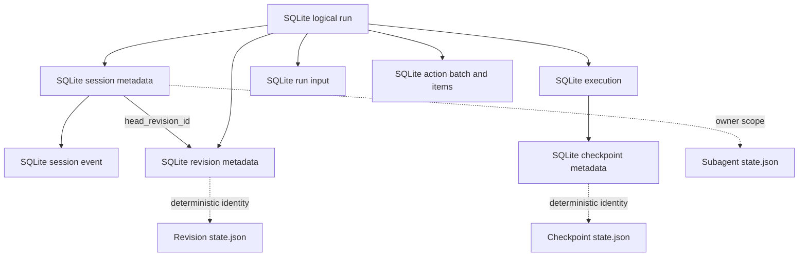

# Session Persistence and Local Execution Coordination

## Scope

YAACLI uses one hybrid session store:

- SQLite owns transactional product metadata and small coordination records.
- Deterministic JSON files own revision, checkpoint, and subagent state that can grow
  with model history or tool output.
- `LocalExecutionCoordinator` composes this store with the SDK's host-neutral
  `AgentExecutionHarness`.

There is no workflow-engine database, artifact catalog, content-addressed payload
layer, dual-read compatibility path, or replay engine.

The SDK execution harness remains stateless across native segments. YAACLI, as the
host, persists both Pydantic AI message history and the SDK `ResumableState`; neither
is reconstructed from the other.

## Storage Layout

The default layout is:

```text
~/.yaacli/sessions/
  sessions-v2.sqlite3
  <session-id>/
    revisions/<revision-id>/state.json
    checkpoints/<execution-id>/state.json
    subagents/<execution-id>/state.json
```

`[session] session_dir` changes the default directory. An explicit
`[session] database_path` remains authoritative, and state directories are placed next
to that database. The database filename remains `sessions-v2.sqlite3`; this file-state
cutover does not introduce a v3 database.

Every `state.json` is UTF-8, pretty-printed, and written with `ensure_ascii=False`, so
agents and users can inspect history directly with ordinary tools such as `rg`, `jq`,
and `less`.

### SQLite ownership

SQLite retains:

- schema metadata;
- sessions;
- logical runs and process-owned executions;
- revision metadata, counts, and bounded input/output previews;
- checkpoint identity and segment metadata;
- ordered run inputs;
- HITL action batches and decisions;
- ordered session events.

`run_inputs.content_json`, action payloads, and event payloads remain in SQLite because
they are bounded transaction-critical coordination data.

SQLite does not contain revision message/context payloads, checkpoint payloads,
subagent descriptors, subagent records, child history, child usage, or child inbox
payloads.

### File ownership

A revision file is a versioned, self-contained `RevisionRecord`. It includes canonical
Pydantic AI messages, portable `ResumableState`, the logical-run input ledger, bounded
display projection, usage, terminal metadata, revision identity, parent identity, and
creation time. The revision usage payload also carries the compact cumulative session
usage snapshot used by the TUI status projection; host-only session totals never enter
portable root or child `ResumableState`.

A checkpoint file is a versioned, self-contained `ExecutionCheckpointRecord`, including
the complete revision payload and deferred requests when suspended.

A subagent file is a versioned, self-contained document containing:

- the exact `SubagentPlanDescriptor`;
- the complete `SubagentExecutionRecord`;
- persisted child inputs and their transitions;
- input-open and cancellation fences;
- the owning process ID plus a process-generation token used to distinguish current-process work from retained work after restart; and
- creation and update timestamps.

Each child owns a separate file. YAACLI performs state transitions sequentially inside
one process and does not coordinate concurrent writers to the same durable store.

## Data Model



Paths are derived from typed identities; SQLite stores no file path columns.

## Publication and Durability

Large state uses file-first publication:

1. serialize the complete typed state;
2. create a temporary file in the destination directory;
3. flush and `fsync` the temporary file;
4. atomically replace `state.json` with `os.replace`;
5. `fsync` the parent directory; and
6. publish metadata, head, run status, input resolution, and terminal event in SQLite.

A crash before the SQLite commit can leave an orphan file, but SQLite never publishes
a revision or checkpoint whose file was not already installed. Session directories
carry an explicit YAACLI ownership marker; explicit maintenance re-reads marked
sessions before removing orphans. Unmarked sibling directories are never claimed or
deleted.

Retention uses the reverse order: commit metadata deletion first, then remove the now
unreferenced files. A failed file deletion therefore leaves only an orphan, which a
later maintenance pass can remove.

Revision files are immutable after publication. Checkpoint and subagent files use
atomic replacement for each stable transition. A staged checkpoint temporarily retains
the previous committed checkpoint in the same document, so a failed SQLite metadata
advance still reads the committed segment; the backup is removed after a successful
metadata commit.

## Session and Revision

A session has a stable ID, workspace reference, active/tombstoned status, one committed
head revision, and timestamps. Session list/show projections read only SQLite metadata;
they do not load message history merely to compute counts or previews. A bounded
session-summary page is produced by one joined query rather than one detail query per
session.

Every successful, failed, cancelled, or interrupted logical run publishes one terminal
revision. Revision metadata insertion, session-head publication, run/execution terminal
state, unresolved input rejection, checkpoint metadata deletion, and the canonical
terminal event share one SQLite transaction. Repeated publication with the same logical
identity and payload is idempotent.

`/dump`, `/load`, TUI restore, and headless restore load the complete revision file.
Current runtime and environment policy remain authoritative; persisted context cannot
weaken current capability, filesystem, shell, or approval policy.

## Logical Runs, Inputs, Checkpoints, and HITL

Run states are `pending`, `running`, `suspended`, `cancelling`, `completed`, `failed`,
`cancelled`, and `interrupted`.

A checkpoint records only a completed or suspended native segment boundary. It does not
advance the session head. Deferred continuation restores the complete checkpoint file,
including message history and `ResumableState`, then applies audited
`DeferredToolResults`.

Additional user and feature input is stored before acknowledgement. Input states are
`accepted`, `enqueued`, `applied`, and `rejected`. `DurableInboxPumpCapability` applies
persisted rows through Pydantic AI's native enqueue mechanism. Main-run input has no
ingress fence: graph-boundary snapshots, input writes, and terminal publication are
serialized by SQLite transaction order. A snapshot-winning input may be enqueued and
applied; a terminal-winning input is persisted as rejected, and terminal publication
resolves every earlier accepted/enqueued row as applied or rejected.

A native `DeferredToolRequests` result creates a transactionally persisted action batch.
Each decision has stable identity, actor, timestamp, and typed payload. A partial batch
remains pending; a completed batch wakes continuation from the stable checkpoint.
Process-local events are wake optimizations, never durable truth.

## Local Execution and Restart

The coordinator creates a fresh `TUIContext` for each native segment. It restores either
the expected head revision for a new turn or the latest checkpoint for continuation,
then calls the SDK execution harness.

The coordinator persists every stable checkpoint before terminal commit or HITL wait.
Usage limits remain cumulative across continuation segments. Runtime locks cover only a
native segment and are released before waiting for actions.

YAACLI never replays an arbitrary in-flight graph segment after restart:

- pending accepted work remains dispatchable;
- cancelling runs settle as cancelled;
- process-owned running or suspended runs settle as interrupted;
- interrupted publication uses the latest stable checkpoint when available; and
- a later user continuation is a new logical run from the published head.

Controlled failure and shutdown may publish the SDK's safe recoverable subset. The host
preserves message history and resumable context as separate typed fields. Canonical model
history follows the SDK's recoverable-message rules and is never reconstructed from UI
events. The non-authoritative display projection independently retains observed tool
invocations so interrupted activity remains visible after reattach. Cancellation
acceptance freezes the complete live bounded projection before process-local worker
cancellation begins. That frozen boundary takes precedence over an older stable
checkpoint, including when cancellation lands between a native segment and checkpoint
publication. Terminal UI reconciliation then rebuilds the active run only from the
committed revision; transient transcript block IDs and tool-render caches are never used
as a second recovery source. Observed tool starts remain replayable even if cancellation
arrives before an argument chunk or result.

## Process-Local Subagents

`FileSubagentExecutionStore` implements the SDK `SubagentExecutionStore` protocol.
`FileSubagentExecutionStore.restart_durable` and `LocalSubagentDriver.restart_durable`
are both `False`: storage survives restart for inspection and delivery reconciliation,
but model/tool execution is process-owned and is not resumed automatically.

Consequences:

- frontend startup marks retained `pending`, `running`, or `suspended` children whose
  process-generation token differs from the current process `lost` and rejects unresolved child input;
- one process-level file store indexes retained descriptors during that same startup scan and is reused by lazily entered model-profile runtimes, so historical child payloads are not reparsed once per active plan or profile;
- terminal child records remain inspectable after completion;
- exact descriptors are embedded in each child file and restored lazily for linked
  continuation or nested authorization;
- unavailable historical capability code fails only the operation that needs it and
  does not block current runtime startup;
- spawn and steering idempotency are owner scoped;
- child steering is persisted before graph application;
- suspended children retain their inbox for the continuation segment;
- child usage is cumulative across deferred continuation;
- terminal completion enters the parent SQLite `run_inputs` path idempotently; and
- pending completion-delivery state remains in the child file for later inspection and
  reconciliation.

The TUI's `/agents` view and background readiness projection scan only the current
session's child directory without traversing every session marker. Parsed child state is
reused while the file's inode, modification time, and size remain unchanged, so the periodic
projection does not repeatedly decode unchanged history. Switching sessions clears that
scoped cache and does not reparent work.

## Single-Process Ownership

YAACLI uses no application-level filesystem locks for session, checkpoint, revision, or
subagent state. One process owns one configured durable store at a time; concurrent
writers to the same store are unsupported. Within that process, synchronous SQLite and
file-state transitions run sequentially.

SQLite transactions remain the authority for metadata publication and state-transition
validation. Large JSON documents use temporary-file publication, `fsync`, and
`os.replace` for crash safety, not concurrency control. Tombstoning first verifies that
main work is terminal, commits the SQLite tombstone, then fences retained child state.
Child writes recheck the SQLite owner status before publication.

## Retention and Maintenance

Retention keeps the configured number of complete terminal run bundles per session and
the configured number/age of quiescent sessions. It never deletes nonterminal main or
child work.

`yaacli sessions maintain` runs one explicit store maintenance pass while no other
YAACLI process is using the configured store. Maintenance is not part of TUI or headless
startup. A pass:

1. physically purges previously tombstoned, quiescent sessions;
2. prunes complete old run bundles;
3. tombstones only quiescent count/age candidates;
4. removes orphan revision/checkpoint files and directories for purged sessions;
5. performs a passive WAL checkpoint; and
6. runs rate-limited `VACUUM` only when configured thresholds permit it.

`VACUUM` is never part of a product write transaction. Busy-database failures defer it.

## Schema Cutover

The internal SQLite schema marker is version 6. The default path is still
`<session_dir>/sessions-v2.sqlite3`.

YAACLI performs no runtime schema reset or migration. Schema-v5 and other incompatible,
malformed, or unmarked databases are rejected without modification. Migration or store
recreation is an explicit offline operation.

The former pre-2.0 default `sessions.sqlite3` remains untouched and is not migrated.

## Verification Invariants

Tests cover:

- non-destructive rejection of schema-v5 and unknown schemas;
- absence of subagent tables and large revision/checkpoint columns in SQLite;
- grep-readable revision, checkpoint, and child files;
- file-first publication and orphan cleanup;
- metadata-only session summaries;
- checkpoint and terminal publication idempotency;
- input, HITL, terminal, and tombstone state transitions;
- interrupted recovery without model replay;
- process-local child deferred continuation, cumulative usage, persisted steering,
  owner fencing, exact descriptor restoration, terminal inspection, and startup
  orphan-to-lost recovery;
- lock-free sequential child state transitions and absence of filesystem lock files;
- retention refusal for nonterminal main or child work; and
- identical revision semantics in TUI and headless frontends.
