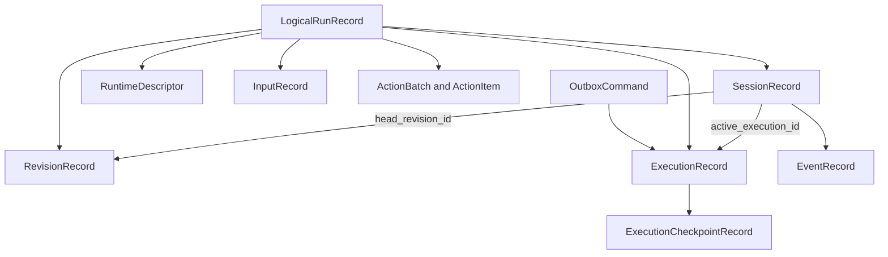

# Session Persistence and Local Execution Coordination

## Scope

YAACLI stores product sessions in one transactional SQLite `SessionStore`. Each user
turn is a logical run executed by `LocalExecutionCoordinator` through the SDK's
host-neutral `AgentExecutionHarness`.

The product store is the sole durable source of truth for:

- sessions and immutable head revisions;
- content-addressed runtime descriptors;
- logical runs, process-owned executions, and stable segment checkpoints;
- ordered run input;
- retryable outbox commands;
- HITL action batches and decisions;
- canonical message/context/input snapshots;
- bounded display projections, usage, and terminal outcomes;
- process-local subagent records and steering input; and
- ordered session events.

There is no separate workflow-engine store and no replay engine.

## Data Model



### Session and revision

A session has a stable ID, workspace reference, active/tombstoned status, one committed
head revision, and at most one active execution. Listing reads bounded metadata only.

A terminal revision atomically stores canonical Pydantic AI message history,
`ResumableState`, logical-run input ledger, bounded display projection, usage, terminal
metadata, and parent revision identity. Publication uses compare-and-swap against the
run's expected head.

Revision insertion, head advance, run/execution terminal state, active execution
release, and ordered terminal event are one transaction. Repeated publication with the
same terminal identity is idempotent.

### Runtime descriptor

Every run references an immutable, content-addressed `RuntimeDescriptor`. It contains
the native agent spec, complete host behavior envelope, main/child plan manifests,
full plan fingerprint, and executable version.

The executable version hashes participating first-party code and package/native assets,
critical dependency versions, and Python/compiler/platform metadata. YAACLI has one
executable identity; it does not maintain workflow/application version aliases.

Worker startup enters every exact plan required by current configuration or pending
work. A persisted run executes only when its descriptor ID, full plan fingerprint,
behavior payload, and executable identity match the registered plan. Falling back to a
current profile, current child route, or similar-looking plan is forbidden.

### Logical run, execution, and checkpoint

A logical run records session ownership, expected head, descriptor, state,
cancellation, and pending action identity. An execution records process ownership and
exact descriptor/executable identity.

Run states are `pending`, `running`, `suspended`, `cancelling`, `completed`, `failed`,
`cancelled`, and `interrupted`.

`ExecutionCheckpointRecord` stores the latest completed native segment boundary:
canonical messages, resumable state, input ledger, usage, projection, segment index and
status, plus deferred requests when suspended. A checkpoint does not advance the
session head.

## Application and Coordinator Boundary

`SessionApplicationService` depends on `SessionExecutionCoordinator`, whose operations
are:

- `dispatch_outbox()`;
- `wait(logical_run_id)`; and
- `cancel(logical_run_id, reason)`.

TUI and headless frontends use the same service. `LocalExecutionWorker` owns entered
runtime plans and one `LocalExecutionCoordinator`; it is not itself product state.

Starting a turn is one product transaction:

1. validate the current head and active-session state;
2. persist the exact descriptor;
3. create logical run and execution identities;
4. store order-zero structured input;
5. set the session's active execution; and
6. enqueue an idempotent `start_execution` command.

The application then requests outbox dispatch. If delivery fails, the command remains
retryable. Worker startup releases stale delivery claims, drains available commands,
and starts a supervised delayed-retry loop.

## Segment Execution

The coordinator creates a fresh `TUIContext` for each segment while reusing the entered
immutable runtime plan. It restores the expected head for a new turn, or the latest
segment checkpoint for deferred continuation.

It invokes:

```python
AgentExecutionHarness.stream_segment(runtime, AgentSegmentRequest(...))
```

The harness returns either:

- `completed`, with terminal output; or
- `suspended`, with exact native `DeferredToolRequests`.

After every stable boundary the coordinator persists the checkpoint before terminal
commit or HITL waiting. Usage limits are cumulative across continuation segments.

A runtime plan has one lock because the entered `AgentRuntime` is shared. The lock is
held only during a native segment. It is released before waiting for actions, so one
suspended session cannot block another session using the same descriptor.

Live `StreamEvent` values are sent directly to the frontend event sink. They are
transient observations, not canonical durability records.

## Active Input and Terminal Fence

Additional user or feature input is committed as ordered `InputRecord` state before a
wake command is delivered. States are `accepted`, `enqueued`, `applied`, and `rejected`.

The database row is canonical. `notify_input` is only a wake/correlation command.
`DurableInboxPumpCapability` drains rows at native graph boundaries and calls native
`ctx.enqueue()` while the segment is bound. Native enqueue-application events reconcile
both the product row and `RunInputLedger`.

At terminal boundaries the store closes ingress. Every previously accepted input must
be applied or rejected with a reason before terminal publication. Late writes to a
closed, cancelling, terminal, or tombstoned run fail explicitly.

See [04-steering.md](04-steering.md).

## HITL Suspension

A native `DeferredToolRequests` output becomes one action batch with exact approval and
external-result items. The run transitions to `suspended` and the coordinator waits on
a process-local event only after the checkpoint and action state are durable.

Each decision has its own idempotency identity, actor, timestamp, and typed payload. A
partial batch remains pending. Once all items resolve, `notify_action` wakes the task;
the coordinator reconstructs matching `DeferredToolResults` and begins the next
segment from the checkpoint.

Interactive policy presents actions. Headless policy either waits or records explicit
denials. An `asyncio.Event` is a wake optimization, never durable truth.

## Crash and Restart

YAACLI does not replay an arbitrary in-flight graph segment or completed tool/model
operation.

Startup reconciliation is explicit:

- `pending` runs remain eligible for normal outbox dispatch;
- `cancelling` runs commit `cancelled`;
- process-owned `running` or `suspended` runs commit terminal `interrupted`; and
- interrupted publication uses the latest stable checkpoint when present.

The incomplete active segment is never invoked again. `interrupted` is terminal for the
old execution. A later user continuation is a new logical run from the published head.

Worker shutdown cancels active tasks and commits `interrupted`. Explicit user cancel
sets cancellation intent first and commits `cancelled`; shutdown and cancellation are
not conflated.

## Process-Local Subagents

YAACLI persists portable child descriptors, records, history, deferred state, usage,
steering input, completion delivery, and owner scope in the product database. Execution
itself uses `LocalSubagentDriver` over SDK `InProcessSubagentDriver` and is process-local.

Consequences:

- `SQLiteSubagentExecutionStore.restart_durable` and
  `LocalSubagentDriver.restart_durable` are both `False`;
- startup marks `pending`, `running`, or `suspended` child orphans `lost` and rejects
  unresolved input;
- it does not recreate or replay child model/tool work;
- foreground/background calls share one SDK service lifecycle during the process;
- spawn and steering idempotency are owner scoped;
- child request usage is cumulative across native deferred continuation;
- exact descriptors remain available for product inspection and in-process resume;
- terminal completion enters the canonical parent input path idempotently; and
- tombstoning an owner closes child inboxes, persists cancellation commands, and fences
  late model starts, saves, steering, and success commits.

The TUI poller is a session-scoped readiness projection only. Switching sessions does
not reparent work.

## Restore, New, and Delete

Startup restore and `/session <id>` load the active session and its head revision from
`SessionStore`, then restore canonical history, validated resumable context, bounded
display replay, and metadata. Current runtime/environment authority remains in force;
persisted state cannot weaken current security or approval policy.

`/new` publishes a fresh session identity. It does not reuse the previous head or inbox.

Deletion writes a tombstone that hides the session, closes active input, requests main
cancellation, atomically fences every nonterminal child, rejects pending child input,
enqueues idempotent child cancellation commands, and rejects all later product writes.

## Offline Export and Import

`/dump` exports a user-readable bundle. `/load` validates and imports one completed
`offline_import` revision through `SessionStore.import_revision()`.

Import advances the head transactionally and schedules no execution command. It is not
a compatibility loader for removed runtime state.

## Headless Contract

Headless stdout is NDJSON; diagnostics go to stderr. Terminal ordering follows product
commit:

- success commits before `RUN_FINISHED`;
- failure commits before `RUN_ERROR`;
- explicit cancellation commits `run_cancelled`;
- restart/shutdown loss commits `run_interrupted`; and
- persistence failure cannot emit false success.

## SQLite Operational Contract

`SQLiteSessionStore` enables foreign keys, WAL mode, `synchronous=FULL`, and a bounded
busy timeout. Writes use `BEGIN IMMEDIATE`.

Only an empty database may bootstrap the current unified schema. Every nonempty database
must match the exact marker and normalized table/index definitions. Validation runs
before write-affecting operational pragmas, so an incompatible database is rejected
without changing its content or journal mode. Missing constraints, indexes, or marker
are rejected without runtime stamping or repair. The subagent adapter validates the
exact child-table subset in the same database.

The default YAACLI 2 product store is `<session_dir>/sessions-v2.sqlite3`. YAACLI does
not inspect, migrate, or modify the former default `sessions.sqlite3`. Explicit
`[session] database_path` and `YAACLI_DATABASE_PATH` values remain authoritative and
use the same strict schema validation; YAACLI never silently redirects an incompatible
explicit path.

`[session] session_dir` and `database_path` select the product store. There is no second
execution database setting.

## Verification Invariants

Tests cover:

- reopen-safe sessions, descriptors, checkpoints, and exact schema validation;
- atomic run/input/outbox creation and delayed retry;
- exact descriptor dispatch and explicit failure when historical code is unavailable;
- main TestModel turn, stable checkpoint, terminal revision, and event publication;
- cumulative request budgets across deferred segments;
- HITL suspension without holding the shared plan lock;
- startup `interrupted` publication from the latest checkpoint without model replay;
- accepted input, action, terminal, and tombstone state transitions;
- process-local child deferred continuation, usage, persisted steering, owner fencing,
  exact descriptor retention, and startup orphan-to-`lost` recovery;
- offline import without execution dispatch; and
- TUI/headless restoration from identical revision semantics.
