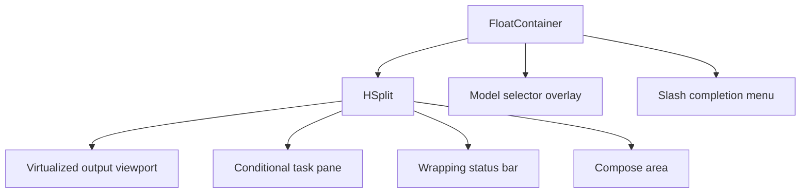

# TUI Layout and Interaction

## Overview

YAACLI uses one full-screen prompt_toolkit application. The output viewport is the primary surface; auxiliary UI is bounded, hidden when unused, or rendered as an overlay.

## Layout Structure

The body order is:

1. flexible output window;
2. conditional task pane;
3. terminal-width-aware status bar;
4. bounded compose area.

The output window has no fixed height and receives the remaining terminal rows. The model selector and completion menu are `Float` overlays, so opening them does not permanently shrink output.

## Output Viewport

The transcript is stored as bounded render blocks and exposed through a virtual viewport rather than a `ScrollablePane` containing every historical line.

- The rendered output height is read from the real `Window.render_info` when available.
- Before first render, the fallback subtracts task, status, and input rows from the terminal height.
- `PageUp` and `PageDown` scroll the transcript.
- Scrolling away from the bottom disables auto-follow.
- Returning to the bottom or pressing `Ctrl+L` re-enables auto-follow.
- Streaming text and thinking update stable block IDs instead of appending duplicate snapshots.
- Tool previews are bounded; `/tool <call-id>` retrieves the complete retained result.

## Task Pane

The task pane reads the current SDK `TaskManager` snapshot directly.

| State | Height and content |
| --- | --- |
| No tasks | Hidden by `ConditionalContainer`; height `0` |
| Tasks, collapsed | One summary row |
| Tasks, expanded | Summary plus a bounded visible task list |

`F2` toggles the expanded state only when tasks exist. Completed history is bounded so old completed tasks cannot consume the viewport. `TaskEvent` updates do not append repeated task panels to the transcript.

## Model Selector

`/model` opens a floating model-profile selector.

- It is unavailable while foreground work owns the TUI.
- Up/Down moves selection while the overlay is open.
- Enter applies the selected profile.
- Escape closes the overlay.
- The overlay uses terminal-aware height and never becomes a permanent layout row.

## Slash Completion

The compose buffer uses `SlashCommandCompleter`.

- Command names complete from built-in and configured commands.
- Effective skill names from `AgentContext.available_skills` complete as `/skill-name`.
- After one skill is selected, completion supports additional leading skill tokens while excluding duplicates.
- `/session <prefix>` completes confirmed session IDs.
- A `CompletionsMenu` float makes suggestions visible.
- While completion is active, navigation and acceptance keys are delegated to prompt_toolkit completion handling rather than prompt history or mode toggles.
- Outside completion, Tab toggles send/edit mode.

## Status Bar

The status bar is priority ordered and wraps instead of clipping when its display width exceeds the terminal width. Its dynamic height is the ceiling of prompt_toolkit fragment width divided by terminal width. It can include:

- explicit execution phase;
- active model profile;
- task/background status;
- context-window utilization;
- elapsed foreground time.

Compact layouts below 100 columns omit the active model label, but keep context-window utilization visible when `display.show_token_usage` is enabled.

The timer starts at synchronous foreground claim and retains one `_run_started_at` across thinking, tools, streaming, HITL, and saving. While the TUI waits for HITL user input, the displayed duration is frozen and the wait interval is excluded when timing resumes. The timer is cleared only after the foreground owner exits or pre-start dispatch is cancelled. Durations render as seconds below one minute (`42s`), minutes plus zero-padded seconds below one hour (`3m 05s`), and hours plus zero-padded minutes and seconds thereafter (`1h 05m 09s`).

The phase labels are:

- `Ready`;
- `Thinking`;
- `Tools`;
- `Approval`;
- `Streaming`;
- `Shell`;
- `Command`;
- `Saving`;
- `Cancelling`;
- `Background ready`.

The status bar shows `steering N pending` while non-initial user inputs for the active durable logical run remain `accepted` or `enqueued`. It reads the count from `SessionStore`, exposes no content, and maintains no second local queue. The count disappears after native enqueue application or explicit terminal rejection. `COMMAND_RUNNING`, `SAVING`, and `CANCELLING` advertise a wait state rather than claiming that Enter will send or steer.

`TUIStateMachine` enforces `VALID_TRANSITIONS`: an invalid transition returns `False`, leaves the authoritative phase unchanged, and is logged by the TUI boundary. The transition table includes all ten phase origins and the valid background-ready exit from every live agent phase.

## Compose Area

The compose area is three rows on small terminals and five rows otherwise. It supports multiline drafts, history, bracketed text paste, and explicit clipboard-image attachment.

### Input Modes

- `send`: Enter submits.
- `edit`: Enter inserts a newline.
- `Ctrl+O`: inserts a newline in either mode.
- Tab toggles modes only when no completion menu is active.

### State-Dependent Submission

| Phase | Submission behavior |
| --- | --- |
| Idle | Starts a new prompt, registered slash command, explicit skill invocation, or `!shell` command |
| Active agent phase | Ordinary text, including unrecognized slash-prefixed text, is immediate steering; busy-safe slash commands execute locally |
| Awaiting approval | Explicit decisions/results resolve HITL; ordinary non-decision text steers; control syntax remains local |
| Command/Shell/Saving/Cancelling | Ordinary and idle-only control drafts are preserved; busy-safe commands retain local semantics |
| Background result ready | Shows session-scoped readiness only; the next accepting agent turn receives canonical durable completion input |

Registered `/command` tokens and the `!` namespace are classified before prompt, steering, or HITL-result parsing. While idle, one or more consecutive leading `/skill-name` tokens that match the effective skill catalog create an explicit skill-selection prompt; the remaining text is the task. For slash tokens that are not known commands, YAACLI synchronously reserves foreground ownership and snapshots the submitted attachments, refreshes `AgentContext.available_skills`, and only then classifies the submitted text, so runtime skill additions, removals, and overrides cannot race dispatch. Attachments added during that refresh remain queued for the next prompt. Existing built-in and configured commands take precedence when the first token conflicts with a skill name. If no command or skill matches, the complete slash-prefixed text is ordinary user input, allowing prompts such as `/home/user/file is the input`. Idle-only/custom slash commands and direct shell input are rejected while busy rather than sent to the model. Generated attachment-chip text is removed before routing; if the user deleted the chip, the binary is dropped before dispatch.

The model-facing skill-selection block contains only escaped, catalog-grounded names and paths plus the task; it does not inject skill bodies. The transcript and prompt history retain the original user text. The agent still inspects each selected `SKILL.md` and applies the SDK skill activation policy.

## Direct Foreground Shell

Input beginning with `!` claims the foreground synchronously and runs a bounded local shell command only while idle. During any busy phase it remains local control syntax, is rejected without clearing the draft, and is never sent to the model or accepted as a deferred-call result.

- stdout and stderr are drained concurrently so one full pipe cannot deadlock the other;
- each stream uses an incremental UTF-8 decoder, preserving code points split across subprocess reads;
- live output is emitted on real line boundaries, with bounded fragments for a long line that never emits a newline;
- the visible in-progress line is updated in place rather than duplicated for every pipe read;
- retained diagnostic tails are independently bounded to 64 KiB for stdout and stderr;
- truncation reports byte counts without replaying the retained tail a second time;
- timeout and cancellation terminate the process group on POSIX and perform bounded terminate/kill cleanup elsewhere.

This foreground `!command` path is separate from the background `shell_monitor` contract in `09-shell-monitor.md`.

## Foreground Ownership

The UI uses one explicit foreground boundary covering agent, shell, save, command dispatch, approval, and cancellation cleanup.

- Ownership is claimed before creating the asynchronous task.
- A second prompt or shell cannot race the first submission.
- Busy-safe commands (`/cancel`, `/agents`, `/process`, `/cost`, `/perf`, `/help`, `/attachments`, `/paste-image`, `/remove-image`, and `/tool`) remain available without taking foreground ownership from the active task.
- Repeated cancellation does not add another `Task.cancel()` request.
- A `/cancel` command never cancels its own dispatch task.
- Non-agent slash commands use `COMMAND_RUNNING`, so Ctrl+C cancellation and Ctrl+D exit gating share the authoritative foreground state.
- Persistence already in `SAVING` is allowed to finish and Ctrl+C cannot fall through to idle exit handling.

## Keyboard Reference

| Key | Action |
| --- | --- |
| Enter / `Ctrl+J` | Submit or accept the current mode-specific action |
| Up / Down | Completion navigation, model selection, multiline movement, or prompt history depending on state |
| `Ctrl+P` / `Ctrl+N` | Previous / next prompt history outside completion |
| Tab | Completion acceptance/navigation when active; otherwise toggle send/edit mode |
| `Ctrl+O` | Insert newline |
| `Ctrl+C` | Close selector, cancel foreground once, or arm idle double-press exit |
| `Ctrl+D` | Exit only from an empty safe idle compose state |
| `Ctrl+L` | Scroll output to the bottom |
| `F2` | Expand/collapse tasks |
| `Ctrl+V` | Attach a clipboard image |
| `Ctrl+X` | Remove the latest queued attachment |
| `Ctrl+U` | Clear compose input |
| Page Up / Page Down | Scroll output |
| Escape | Close the model overlay; otherwise toggle mouse scroll/select mode |

## Theme and Rendering

The TUI coalesces application invalidation and streaming Markdown previews at a terminal-friendly base cadence of 15 frames per second. Streaming preview rendering is adaptive because each preview parses and highlights the complete retained response: retained text at or above 32 KiB renders no faster than every 100 ms, and text at or above 128 KiB renders no faster than every 200 ms. Finalization at a text, reasoning, or tool boundary still commits the complete latest content immediately.

Terminal size changes enter a short resize period. Repeated changes replace one 150 ms settle timer, streaming previews are limited to eight frames per second during the burst, and the settled size receives one final invalidation. The virtual viewport cache includes terminal width as well as scroll offset, viewport height, and output generation, so a width-only resize cannot reuse a cache entry for different geometry. Historical blocks remain bounded pre-rendered ANSI and are not reflowed from source Markdown during resize.

`display.code_theme` accepts `auto`, `dark`, or `light`.

For `auto`, YAACLI resolves terminal background in this order:

1. short OSC 11 query in recognized local terminals;
2. `COLORFGBG`;
3. dark fallback.

OSC queries are skipped over SSH. The resolved theme supplies both Rich syntax highlighting and prompt_toolkit style rules.

## Verification

The integration suite exercises:

- real task visibility, one-row collapse, and F2 handler transitions;
- viewport row budgeting;
- model selector overlay behavior;
- real command, session, and multi-skill completion menu/key routing;
- bounded transcript and streaming updates;
- timer continuity, compact duration formatting, and status wrapping;
- shell/prompt/command race prevention;
- cancellation and saving behavior;
- small terminal fallback dimensions.
