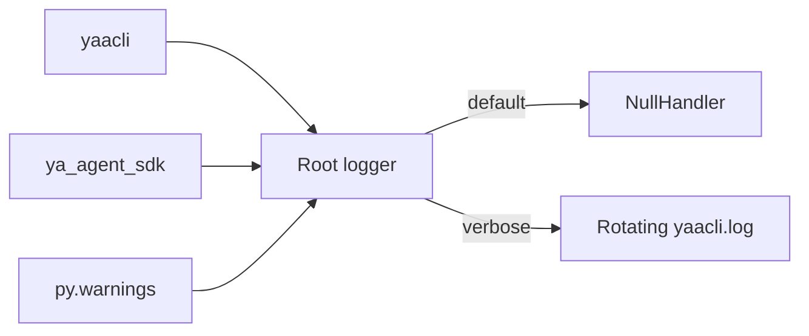

# Logging

## Overview

YAACLI logging must never write to stdout or stderr while the terminal UI is active.
There are two modes:

| Mode | Root handler | Result |
| --- | --- | --- |
| Default | `logging.NullHandler` | logging is silent |
| Verbose (`-v`) | one `RotatingFileHandler` | logs are written to `./yaacli.log` |

There is no asyncio logging queue, `LogEvent`, or TUI log panel. Durable product events
and live agent events use their own typed event paths rather than Python logging.

## Handler Ownership

YAACLI configures the root logger with exactly one stderr-safe handler. The `yaacli`,
`ya_agent_sdk`, and `py.warnings` loggers clear direct handlers and propagate to that
root handler. This avoids duplicate records and prevents multiple handlers from rotating
the same file.



Python warnings are captured into logging. The known SWIG `DeprecationWarning` noise is
filtered explicitly.

## Verbose Retention

The file handler writes UTF-8 records using:

```text
%(asctime)s %(levelname)s [%(name)s] %(message)s
```

Retention is bounded by:

- active file: `yaacli.log`;
- maximum size: 5 MiB per file;
- backups: 3;
- maximum retained footprint: approximately 20 MiB.

## API

### `configure_logging(verbose=False)`

Configures startup logging. Default mode discards records; verbose mode writes
DEBUG-and-above YAACLI/SDK records to the rotating file. Verbose startup records stable
phase names and monotonic durations for runtime imports, configuration, builtin assets,
runtime sources, durable store and plans, active runtime entry, application services,
and background services. CLI help and version discovery do not import the runtime
stack.

### `configure_tui_logging(level=logging.INFO, verbose=False)`

Configures the entered TUI using the same single-handler policy. Verbose mode selects
DEBUG for YAACLI and SDK loggers. In default mode `level` controls their logger level,
while the root remains stderr-safe and silent.

### `reset_logging()`

Stops warning capture, removes and closes handlers installed by YAACLI, and resets
initialization state. Tests and alternate hosts use it before reconfiguration.

### `get_logger(name)`

Returns a logger below the `yaacli` namespace, adding that prefix when needed.

## Verification

`tests/test_logging.py` verifies silent mode, one rotating handler, bounded rotation,
warning routing, idempotent configuration, and reset behavior.
