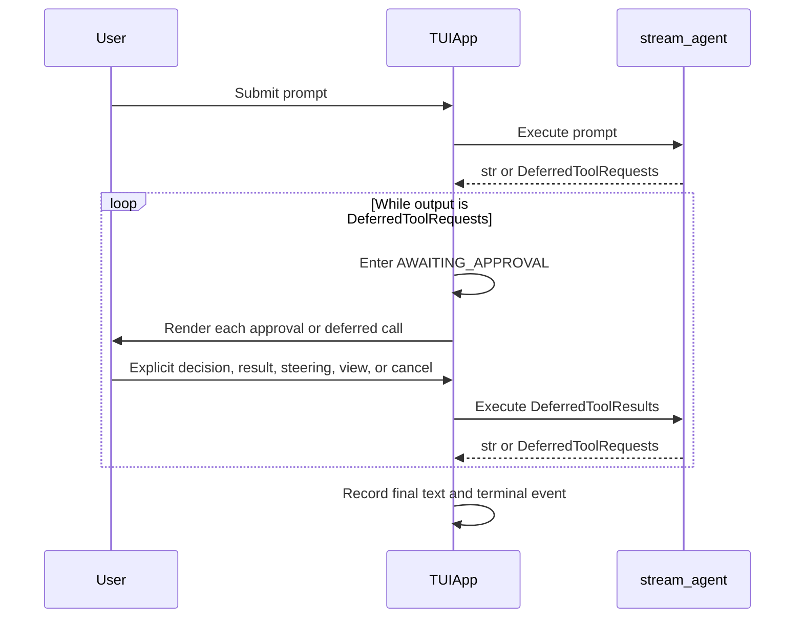

# Human-in-the-Loop Tool Requests

## Purpose

YAACLI handles Pydantic AI `DeferredToolRequests` inside the foreground agent turn. A turn does not emit a successful terminal result until every approval and deferred call has been resolved and the model returns final text.

HITL is both:

- an inner execution loop in `TUIApp._run_agent()`; and
- an explicit interaction phase, `TUIPhase.AWAITING_APPROVAL`, used for input ownership, status, cancellation, and elapsed-time display.

## Runtime Contract

`create_tui_runtime()` configures the agent output type as:

```python
[str, DeferredToolRequests]
```

Current approval policy comes from:

- `tools.need_approval` for tool names; and
- `tools.need_approval_mcps` for MCP servers.

These values are passed to `create_agent()` as `need_user_approve_tools` and `need_user_approve_mcps`.

Persisted state must not weaken this policy. `restore_resumable_state_safely()` restores conversation data and then reapplies the approval lists from the active runtime.

## Execution Flow



`TUIApp._run_agent()` rejects an empty `DeferredToolRequests` payload and rejects completion without final text. This prevents malformed deferred output from being reported as a successful run.

## Foreground Ownership and Timing

HITL remains part of the same foreground turn:

- `_run_started_at` is established when the turn is synchronously claimed;
- entering `AWAITING_APPROVAL` does not reset it;
- ordinary prompts and shell commands cannot start a competing foreground owner;
- `/cancel` and `Ctrl+C` cancel the active foreground task; and
- the timer is cleared only when the foreground owner exits.

## Request Processing

`TUIApp._request_user_action()` processes all entries in deterministic order:

1. every item in `DeferredToolRequests.approvals`;
2. every item in `DeferredToolRequests.calls`.

For approvals:

- approve stores `True` under the original tool-call ID;
- reject stores `ToolDenied(message=reason)` under that ID.

For deferred calls:

- a supplied result becomes a `RetryPromptPart`;
- an explicit denial also becomes a `RetryPromptPart` whose content records the denial;
- the original tool name and tool-call ID are retained.

The resulting `DeferredToolResults` is sent through the same agent stream, which may return another deferred batch.

## Input Contract

The real prompt_toolkit Enter handler applies the following contract before ordinary submission:

| Input while an approval is pending | Action |
|---|---|
| `y`, `yes`, `approve` | Approve the current request |
| `n`, `no`, `reject` | Reject with the default reason |
| `reject <reason>` | Reject with the supplied reason |
| Empty Enter | Keep waiting and show the decision hint |
| Other non-empty ordinary text | Send immediate steering and keep the approval pending |
| `view`, `v` | Render the full deferred request |
| Busy-safe slash command | Execute locally without deciding the request |
| Idle-only/custom/unknown slash or `!shell` | Reject or diagnose locally without deciding the request |
| `/cancel` | Cancel the foreground run without deciding the request |

Deferred calls have a separate explicit contract:

| Input while a deferred call is pending | Action |
|---|---|
| Non-empty ordinary text | Supply the call result |
| `/deny <reason>` | Deny the call explicitly |
| Empty Enter | Keep waiting and show the result hint |
| `view`, `v` | Render the full deferred request |
| Busy-safe slash command | Execute locally without supplying a result |
| Idle-only/custom/unknown slash or `!shell` | Reject or diagnose locally without supplying a result |
| `/cancel` | Cancel without supplying a result |

`/cancel` and deferred-call `/deny` are checked before the generic control classifier. The `/` and `!` namespaces are then resolved before approval steering or deferred-call result parsing. Empty Enter never approves, and approval text outside the explicit allowlist never approves accidentally. The entire HITL parser additionally requires the authoritative phase to remain `AWAITING_APPROVAL`; once cancellation or saving begins, cleanup-phase routing wins even if the pending flag has not yet been reset.

## Steering During Approval

Non-decision approval text follows the normal active-run steering path:

1. clear the compose buffer;
2. add the text to prompt history;
3. send a `BusMessage` from `user` to `main` with `STEERING_TEMPLATE`;
4. leave `_approval_event` unset; and
5. remain in `TUIPhase.AWAITING_APPROVAL`.

There is no local steering queue, steering prefix mode, or deferred next-prompt queue.

Binary attachments cannot steer an active run. They remain queued for the next turn.

## Presentation

For each request, YAACLI renders:

- request index and total count;
- tool name;
- bounded arguments;
- shell-review risk and reason metadata when present; and
- an input hint matching the current approval or deferred-call contract.

`view` toggles the expanded representation without resolving the request. The status bar derives its approval label and progress from the explicit phase and request fields rather than dynamic attribute probing.

## Cancellation and Cleanup

Cancellation does not synthesize an approval or a deferred-call result.

When the turn exits, `_reset_hitl_state()` clears:

- pending request lists;
- current request and metadata;
- approval result and reason;
- expansion state; and
- the in-process `asyncio.Event`.

A cancelled run records `run_cancelled` and may persist a recoverable snapshot according to the TUI persistence policy. A completed run is not reclassified as cancelled if cancellation arrives during post-response persistence.

## Session Restore

Session restore is transactional:

1. parse history, resumable state, and display replay into temporary values;
2. derive a fresh candidate `TUIContext` from the current runtime;
3. reset conversation-scoped state on that candidate;
4. restore persisted state while preserving the active approval policy;
5. tombstone and reset old background subagents; and
6. commit context, history, replay, session identity, and message bus without an `await` boundary.

HITL UI state is intentionally process-local. YAACLI does **not** infer or recreate a pending approval prompt from the last `ModelResponse` during restore. The approval `asyncio.Event`, current request cursor, and panel expansion state are reset. Restored model history remains available to the next normal turn, and the active runtime policy determines any future approval request.

## Headless Mode

Headless mode cannot collect interactive HITL input. It converts deferred approvals and calls into explicit denials, sends those `DeferredToolResults` back to the agent, and continues until final text or an error is produced.

The headless terminal-event contract is independent of the TUI panel flow:

- successful output is persisted before `RUN_FINISHED` is emitted;
- persistence failure emits `RUN_ERROR` and no `RUN_FINISHED`; and
- cancellation emits `run_cancelled` and re-raises cancellation.

## Verification Invariants

Tests must cover:

- the deferred inner loop and final-text requirement;
- explicit approve and reject inputs through the real Enter handler;
- empty Enter remaining pending;
- non-decision text steering without resolving approval;
- deferred-call result and `/deny` routing;
- `/cancel` priority;
- `ToolDenied` and `RetryPromptPart` construction;
- timer continuity across approval and other phases;
- runtime approval policy surviving state restore;
- transactional session isolation; and
- headless denial, persistence-failure, and cancellation terminal events.
