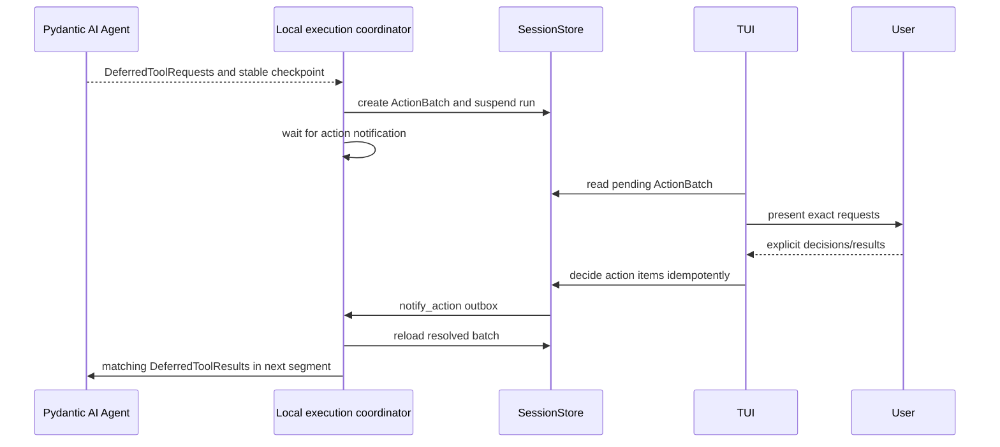

# Durable Human-in-the-Loop Requests

## Purpose

YAACLI handles native Pydantic AI `DeferredToolRequests` as a stable segment suspension. A logical run does not publish successful terminal output until every
approval/external call has an audited decision and the model returns final non-deferred
output.

The TUI presents pending actions; `SessionStore` owns durable truth and the local
coordinator owns process execution.

## Runtime Composition

`create_tui_runtime()` configures:

```python
output_type = [str, DeferredToolRequests]
```

Current host policy comes from existing YAACLI configuration inputs:

- `tools.enable_user_input` controls `UserInteractionCapability`;
- `tools.user_input_timeout_seconds` bounds interactive structured-question waits;
- `tools.need_approval` configures `ToolApprovalCapability.tools`; and
- `tools.need_approval_mcps` configures `ToolApprovalCapability.toolset_ids`.

These configuration fields remain supported, but they compile into capabilities and
context state. They are not forwarded as removed `create_agent()` keyword arguments.
Persisted conversation state cannot weaken current runtime security or approval policy.

## Durable Execution Flow



Every batch and item has stable identity. Items retain tool-call ID, request payload,
decision kind, state, decision ID, actor, timestamps, and result. A partially decided
batch remains pending. Replaying the same decision ID returns the existing outcome;
reusing it for different intent fails.

The coordinator rejects empty `DeferredToolRequests` and continues segments until final
output or a terminal error/cancellation.

## Foreground Ownership and Timing

HITL remains part of the same foreground turn:

- the original durable logical-run/execution ID remains active;
- `TUIPhase.AWAITING_APPROVAL` owns input classification;
- the displayed elapsed timer is paused for the user wait and resumes afterward;
- one configurable terminal bell is emitted for a non-empty batch;
- another prompt or shell command cannot claim foreground ownership; and
- `/cancel` or Ctrl+C cancels the durable execution, not an in-memory approval event
  alone.

Process-local panel cursors and `asyncio.Event` objects are presentation details and are
never persistence truth.

## Decision Contract

Approvals:

| Input | Result |
| --- | --- |
| `y`, `yes`, `approve` | Explicit approval |
| `n`, `no`, `reject` | Denial with default reason |
| `reject <reason>` | Denial with supplied reason |
| Empty Enter | Keep waiting |
| Other ordinary text | Durable main-run steering; approval remains pending |
| `view`, `v` | Expand request without deciding |
| Busy-safe slash command | Execute locally without deciding |
| Idle-only/custom command or `!shell` | Reject locally without deciding |
| `/cancel` | Cancel execution without fabricating a decision |

External deferred calls:

| Input | Result |
| --- | --- |
| Non-empty ordinary text | Supply external result |
| `/deny <reason>` | Supply an explicit denial result |
| Empty Enter | Keep waiting |
| `view`, `v` | Expand request without deciding |
| Busy-safe slash command | Execute locally without deciding |
| Idle-only/custom command or `!shell` | Reject locally without deciding |
| `/cancel` | Cancel without fabricating a result |

Control syntax is classified before ordinary decision/result input. Empty Enter never
approves. Once the phase leaves `AWAITING_APPROVAL`, cleanup routing wins even if stale
presentation flags remain.

## Structured Questions

`ask_user_question` is recognized through exact tool name/metadata and parsed with the
SDK schema. YAACLI renders each question's header, text, numbered options,
descriptions, and single/multi-select mode.

- single-select accepts one option number or free text;
- multi-select accepts comma-separated option numbers or free text;
- valid numeric input becomes option labels;
- non-empty non-numeric input remains free text;
- empty input keeps the question pending; and
- successful output preserves original questions plus an exact-keyed `answers` map.

If a configured question timeout expires, partial answers are discarded and the whole
call receives an explicit retry result directing the model to continue with best
judgment instead of asking the same question again.

## Steering While Suspended

Non-decision approval text follows the same durable active-run input path as any other
steering:

1. persist an `InputRecord` for the active logical run;
2. enqueue an idempotent wake notification;
3. keep the action item pending; and
4. let `DurableInboxPumpCapability` apply it through native Pydantic AI enqueue at the
   next host-owned graph boundary.

There is no MessageBus, local steering queue, or deferred next-prompt buffer. Binary
attachments remain queued for the next turn.

## Presentation

For each request YAACLI renders bounded tool name/arguments, index/total, applicable
shell-review metadata, and an input hint. Structured questions use their dedicated
panel. Expansion never decides a request.

The status bar and panel derive state from the explicit durable action/run state rather
than dynamic probing of model history.

## Cancellation and Recovery

Cancellation records the main run as cancelling, cancels both the durable execution and
its TUI interaction waiter, commits cancelled terminal state, and never synthesizes
approval or external results. A pending approval, deferred result, or structured question
therefore cannot keep the foreground alive after cancellation. Main-run input has no
ingress fence: SQLite transaction order determines whether an input
is included by an earlier graph-boundary snapshot or is persisted as rejected after the
cancellation/terminal write wins. Child execution input fences remain independent.

On controlled cancellation during a continuation segment, YAACLI publishes safe partial
text and host state while keeping the old execution terminal. Already observed tool-call
display records remain in the live bounded projection even when cancellation lands at a
native segment/checkpoint boundary. After process restart, pending batches remain
auditable in `SessionStore`, but the old process-owned execution is committed as
`interrupted` from its stable suspended checkpoint. YAACLI does not recreate the old task
or replay the incomplete segment. A later continuation is an explicit new turn from the
committed head.

Session switching scopes actions by logical-run/session identity, so an old session's
decision cannot resolve a new session's request.

## Headless Policy

Headless mode does not grant `UserInteractionCapability`. If another capability yields
an approval or external call, headless policy persists and resolves explicit denials,
then continues until final output or error. It never waits for terminal input.

Terminal protocol ordering follows durable commit: success before `RUN_FINISHED`, error
without false success, and cancellation as `run_cancelled`.

## Verification Invariants

Tests cover:

- exact durable batch/item creation and workflow suspension;
- partial and fully resolved idempotent decisions;
- matching `DeferredToolResults` reconstruction;
- explicit approve/reject/result/deny input;
- empty Enter remaining pending;
- non-decision durable steering without resolving approval;
- command and cancellation precedence;
- structured-question parsing, timeout, and cleanup;
- elapsed-time pause and notification bell;
- restart/session isolation of pending actions;
- current policy surviving state restore; and
- headless denial plus success/error/cancellation terminal ordering.
