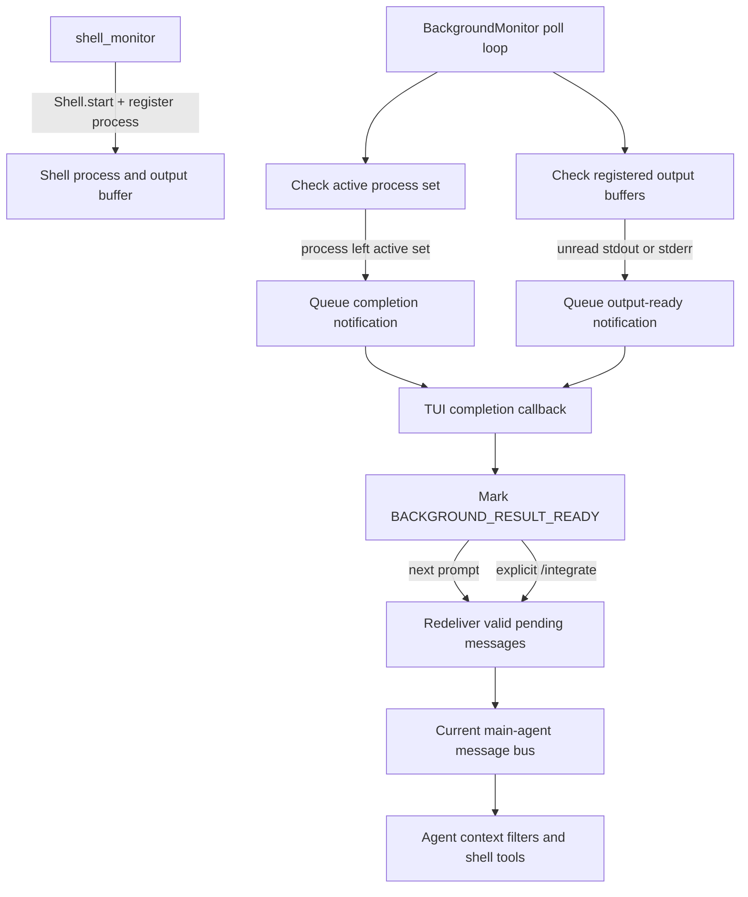

# Background Shell Monitoring

## Overview

YAACLI uses one `BackgroundMonitor` resource for two independent kinds of
background work:

- background subagent task tracking and result delivery;
- background shell process output and completion notifications.

The shell monitor is readiness infrastructure. It tells the TUI that work is
available, but it does not start an agent turn automatically. This preserves the
user's compose buffer and prevents an asynchronous notification from stealing
foreground ownership.

## Components

### `BackgroundMonitor`

`yaacli.background.BackgroundMonitor` owns:

- the shell polling task;
- the current shell and message-bus bindings;
- the active-process baseline used for completion detection;
- the set of processes registered for unread-output monitoring;
- per-process output-notification deduplication state;
- bounded pending notifications that survive the boundary between agent turns;
- the shared completion callback used by shell processes and background
  subagents.

The resource is created by `TUIEnvironment`. After the agent runtime is entered,
`TUIApp` binds the current core toolset, callback, shell, message bus, and main
agent ID. `BackgroundMonitor.close()` cancels the poll task, cancels tracked
subagent tasks with a bounded wait, and clears retained monitor state.

### `shell_monitor` tool

`MonitoredShellTool` is exposed as `shell_monitor`. It:

1. validates the command;
2. starts it with `Shell.start()`;
3. registers the returned process ID with `register_monitored_process()`;
4. emits `BackgroundShellStartEvent`;
5. returns a process ID compatible with `shell_wait`, `shell_status`,
   `shell_input`, `shell_signal`, and `shell_kill`.

The tool is available only when both a shell and a running `BackgroundMonitor`
exist. It merges the runtime shell environment with per-call overrides.

Ordinary `shell_exec(background=True)` processes still receive completion
monitoring through the shell active-process poll. Use `shell_monitor` when
incremental unread-output notifications are required.

## Runtime Flow



### Polling

`start_shell_monitor()` snapshots `Shell.active_background_processes` and starts
one polling task. Each poll runs these checks in order:

1. `_check_shell()` compares the current active process IDs with the previous
   snapshot.
2. `_check_monitored_output()` inspects output buffers for registered processes.

A process newly present in the active set is added to the baseline. A process
that leaves the active set produces one completion notification and is removed
from unread-output monitoring. The monitor also scans terminal output buffers,
so a process that starts and completes entirely between polls still produces
exactly one completion notification, whether or not it emitted output. Deduplication
state is released after the shell removes the process buffer. Completion payloads
do not duplicate the actual process result; stdout, stderr, and exit code remain
owned by the shell and are read through shell tools or background-result injection.

Registered processes are also inspected directly through their output buffers.
This means buffered output from a short-lived monitored command remains
observable even when its running interval falls between polls.

### Incremental output readiness

For a registered process, either unread stdout or unread stderr produces an
output-ready notification:

```text
Background shell process has new output: <process-id> (<command>).
Use shell_wait(process_id, timeout_seconds=0) to read it.
```

The process ID is placed in `_notified_pending` after notification. Further
polls do not emit duplicates while the same unread buffer remains non-empty.
After `shell_wait` or another consumer drains the buffer, the marker is cleared.
A later batch of output can then produce another notification.

If the output buffer is removed because the process was consumed or killed, the
monitor drops that process from unread-output tracking.

### Completion readiness

When a previously active process is no longer active, the monitor queues:

```text
Background shell process completed: <process-id> (<command>)
```

The command suffix is best-effort metadata. The notification is only a readiness
signal; callers must use shell APIs for the authoritative terminal result.

## Pending Delivery and Stale-Wakeup Suppression

Shell notifications are first retained by `BackgroundMonitor` rather than sent
only to the currently active SDK context. This provides redelivery across agent
turn boundaries, where the runtime may replace or clear message-bus state.

Immediately before the next user turn, or before an explicit `/integrate`
turn, the TUI calls `deliver_pending_messages()` against the current bus and
agent ID. Delivery revalidates shell state:

- an output notification is dropped if stdout and stderr were already drained;
- a completion notification is dropped if its completed buffer is no longer
  available;
- a notification for another target remains queued;
- duplicate message IDs replace earlier queued copies;
- only a message still unread by the target counts as delivered.

This prevents an already-consumed shell result from creating an empty agent
turn or stale context message.

## TUI Contract

The shared callback handles shell and subagent readiness identically at the UI
boundary:

- append a concise status line;
- set `_pending_bus_check_needed` and `_background_results_ready`;
- transition an idle TUI to `BACKGROUND_RESULT_READY`;
- retain notifications while a foreground run is active;
- never launch an agent turn from the callback;
- never modify or clear the compose buffer.

Ready messages are integrated with the next submitted prompt. The user may run
`/integrate` to request immediate integration explicitly. During an active
agent phase the command delivers queued notifications to the current message
bus, allowing the SDK filter to inject them at the next model request without
starting a competing turn. End-of-run reconciliation keeps any unread result
ready for a later prompt. During non-agent foreground cleanup the command leaves
results queued and reports that they will be available after foreground work.
Pending user steering shares the bus but is not counted as a background result.
An explicitly cancelled turn does not immediately redeliver a notification into
the cancelled interaction; the next prompt or `/integrate` performs delivery.

## Conversation Reset

Conversation and environment lifetimes are intentionally different.
`reset_subagent_state()` cancels and tombstones background subagent work from the
old conversation, but it preserves:

- running shell processes;
- registered shell process IDs;
- shell notification deduplication state;
- pending shell notifications.

When `/new`, `/load`, or another session transition replaces the main-agent
message bus, `set_message_bus()` retargets subsequent delivery to the new bus.
The real `/new` command republishes retained readiness only after its
`COMMAND_RUNNING` ownership returns to idle, so the notification is neither
lost nor injected into the conversation being cleared. Late results from
tombstoned subagents cannot enter the new conversation, while shell work owned
by the environment remains reachable.

## Constraints

- The default poll interval is one second.
- Only `shell_monitor` registrations receive incremental output readiness;
  ordinary background shell calls receive active-set completion monitoring.
- Notification text is bounded and carries no stdout, stderr, or exit code.
- Shell output buffers remain the source of truth and are subject to the shell's
  own retention and truncation policies.
- A callback failure is logged and does not terminate the polling loop.
- Calling `start_shell_monitor()` more than once is ignored.
- Shell notifications target the configured runtime agent ID, normally `main`.
- Background delegation tools remain main-agent-only.

## Verification

`tests/test_background.py` covers:

- monitor start, duplicate-start protection, shutdown, and target routing;
- active-process discovery and single or multiple completions;
- completion redelivery and stale completion suppression;
- stdout and stderr output readiness;
- no duplicate output notification before drain;
- re-notification after drain and subsequent output;
- stale output suppression and removed-buffer cleanup;
- callback invocation and `shell_monitor` registration;
- shell environment merging, tool availability, failure handling, and event
  emission;
- conversation reset preserving shell state while discarding subagent state;
- TUI readiness without automatic agent launch and without compose-buffer
  mutation.
