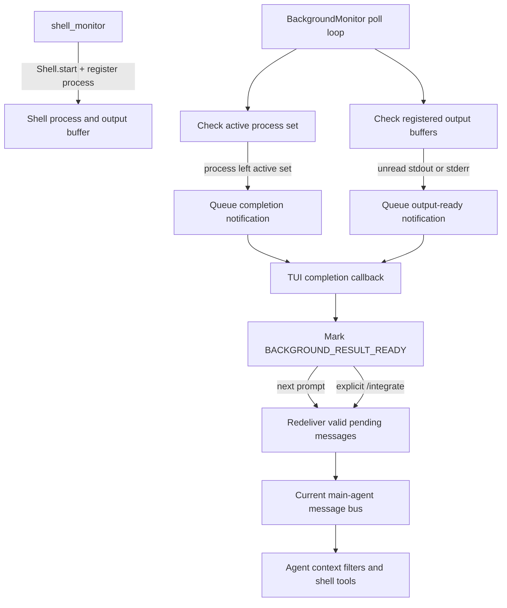

# Background Shell Monitoring

## Overview

YAACLI uses one `BackgroundMonitor` resource for two independent kinds of
background work:

- background subagent task tracking and result delivery;
- background shell process output and completion notifications.

The shell monitor is readiness infrastructure. It tells the TUI that work is
available, but it does not start an agent turn automatically. This preserves the
user's compose buffer and prevents an asynchronous notification from stealing
foreground ownership.

## Components

### `BackgroundMonitor`

`yaacli.background.BackgroundMonitor` owns:

- the shell polling task;
- the current shell and message-bus bindings;
- the active-process baseline used for completion detection;
- the set of processes registered for unread-output monitoring;
- per-process output-notification deduplication state;
- bounded pending notifications that survive the boundary between agent turns;
- the shared completion callback used by shell processes and background
  subagents.

The resource is created by `TUIEnvironment`. After the agent runtime is entered,
`TUIApp` binds the current core toolset, callback, shell, message bus, and main
agent ID. `BackgroundMonitor.close()` cancels the poll task, cancels tracked
subagent tasks with a bounded wait, and clears retained monitor state.

### `shell_monitor` tool

`MonitoredShellTool` is exposed as `shell_monitor`. It:

1. validates the command;
2. starts it with `Shell.start()`;
3. registers the returned process ID with `register_monitored_process()`;
4. emits `BackgroundShellStartEvent`;
5. returns a process ID compatible with `shell_wait`, `shell_status`,
   `shell_input`, `shell_signal`, and `shell_kill`.

The tool is available only when both a shell and a running `BackgroundMonitor`
exist. It merges the runtime shell environment with per-call overrides.

Ordinary `shell_exec(background=True)` processes still receive completion
monitoring through the shell active-process poll. Use `shell_monitor` when
incremental unread-output notifications are required.

## Runtime Flow



### Polling

`start_shell_monitor()` snapshots `Shell.active_background_processes` and starts
one polling task. Each poll runs these checks in order:

1. `_check_shell()` compares the current active process IDs with the previous
   snapshot.
2. `_check_monitored_output()` inspects output buffers for registered processes.

A process newly present in the active set is added to the baseline. A process
that leaves the active set produces one completion notification and is removed
from unread-output monitoring. The monitor also scans terminal output buffers,
so a process that starts and completes entirely between polls still produces
exactly one completion notification, whether or not it emitted output. Deduplication
state is released after the shell removes the process buffer. Completion payloads
do not duplicate the actual process result; stdout, stderr, and exit code remain
owned by the shell and are read through shell tools or background-result injection.

Registered processes are also inspected directly through their output buffers.
This means buffered output from a short-lived monitored command remains
observable even when its running interval falls between polls.

### Incremental output readiness

For a registered process, either unread stdout or unread stderr produces an
output-ready notification:

```text
Background shell process has new output: <process-id> (<command>).
Use shell_wait(process_id, timeout_seconds=0) to read it.
```

The process ID is placed in `_notified_pending` after notification. Further
polls do not emit duplicates while the same unread buffer remains non-empty.
After `shell_wait` or another consumer drains the buffer, the marker is cleared.
A later batch of output can then produce another notification.

If the output buffer is removed because the process was consumed or killed, the
monitor drops that process from unread-output tracking.

### Completion readiness

When a previously active process is no longer active, the monitor queues:

```text
Background shell process completed: <process-id> (<command>)
```

The command suffix is best-effort metadata. The notification is only a readiness
signal; callers must use shell APIs for the authoritative terminal result.

## Pending Delivery and Stale-Wakeup Suppression

Shell notifications are first retained by `BackgroundMonitor` rather than sent
only to the currently active SDK context. This provides redelivery across agent
turn boundaries, where the runtime may replace or clear message-bus state.

Immediately before the next user turn, or before an explicit `/integrate`
turn, the TUI calls `deliver_pending_messages()` against the current bus and
agent ID. Delivery revalidates shell state:

- an output notification is dropped if stdout and stderr were already drained;
- a completion notification is dropped if its completed buffer is no longer
  available;
- a notification for another target remains queued;
- duplicate message IDs replace earlier queued copies;
- only a message still unread by the target counts as delivered.

This prevents an already-consumed shell result from creating an empty agent
turn or stale context message.

## TUI Contract

The shared callback handles shell and subagent readiness identically at the UI
boundary:

- append a concise status line;
- set `_pending_bus_check_needed` and `_background_results_ready`;
- when foreground ownership is idle, redeliver a valid notification and start a main-agent turn with a small system reminder;
- retain notifications while a foreground run is active, then wake the main agent after its task handle is released;
- never launch a turn for a stale or already-consumed notification;
- never modify or clear the compose buffer.

A deliverable notification wakes the main agent automatically with a small
system reminder and reaches it through the message bus. During an active agent phase, `/integrate` can deliver
queued notifications to the current message bus for the next model request
without starting a competing turn. End-of-run reconciliation retains unread
messages until the old task has completed, then starts the wake-up turn. During
non-agent foreground cleanup the command leaves results queued and reports that
they will be available after foreground work. Pending user steering shares the
bus but is not counted as a background result. An explicitly cancelled turn
does not immediately redeliver a notification into the cancelled interaction;
the next valid wakeup or `/integrate` performs delivery.

## Session Reset

The shell backend belongs to the runtime environment, but foreground and
background commands and their results belong to the session that started them.
`/new`, `/load`, and
`/session` therefore use the full `BackgroundMonitor` session boundary:

1. background task creation synchronously captures the current shell-session
   generation; the lease is inherited by child tasks through `ContextVar`;
2. `begin_session_reset()` advances that generation before cancellation,
   tombstones and cancels old subagents, drops pending shell wakeups, suppresses
   reset-time shell callbacks, and clears shell monitor deduplication state before
   the first `await`;
3. final `Shell.execute()` and `Shell.start()` boundaries serialize process
   creation and registration with reset through a lifecycle lock; creation runs
   in a shielded shell-owned task, so caller cancellation cannot discard a handle
   after the backend has allocated a process;
4. foreground execution remains registered while it runs, and cancellation does
   not return until its kill hook has completed or reported a retryable failure;
5. `reset_session_state()` calls `Shell.reset_background_processes()` before the
   bounded subagent wait;
6. the shell terminates foreground and background processes and discards completed output buffers,
   retained terminal results, stdin streams, and signal handlers; and
7. `finish_session_reset()` leaves the monitor and shell backend reusable for
   work started by the new session.

This boundary prevents both notification leakage and silent filter injection:
replacing only the message bus would be insufficient because background-result
filters read completed buffers directly from the shared shell. Late results from
tombstoned subagents cannot enter the new conversation. A subagent or inherited
child task that ignores cancellation still carries the retired generation, so
all standard shell process APIs and SDK foreground execution reject its access.
Killed old-session processes cannot later publish completion lines into the new
transcript.

Process termination is a commit prerequisite. On POSIX, LocalShell starts a
stable group/session guardian that launches the real command, installs handlers
for the supported catchable signal set, reports readiness and command exit status
over separate private inherited host pipes, and remains alive until the host has
terminated the complete group. Public signals wait for readiness before delivery;
unsupported signal numbers fail explicitly, and SIGKILL uses the full owned kill
path. Natural completion therefore kills residual members, including children
that closed inherited output pipes, before reaping the guardian and releasing its
numeric PGID. A reaped leader's bare numeric PGID is never treated as a durable
ownership identity.

Each Docker exec also uses an in-container guardian as its stable process-group
and session leader. The guardian publishes PID/start-time identity over that
exact `docker exec` stderr transport, then waits for a nonce-bound acknowledgement
over the same exec's stdin transport before user code can start. Public output and
stdin remain gated until this handshake completes. The host cross-checks the
transport identity against `/proc` and the `active` marker, but marker content and
path existence are never the source of identity or release authority. A same-user
sibling that substitutes a valid marker identity or creates files in `/tmp`
cannot release the command or redirect cleanup. Later marker deletion,
corruption, or a forged `done` value likewise cannot replace the locally retained
transport identity. If registration has not produced identity, reset atomically
forbids ACK, closes the exact stdin transport, and requires the blocked guardian
to exit rather than trusting marker content.

After release, the guardian remains alive until two scans find no non-zombie
descendants in that PGID/SID and then transitions the marker to `done`.
Registration runs inside the immediately returned handle, and natural completion
requires a second Docker exec to verify that the trusted group has no live
members. Kill and SIGKILL paths stop, kill, and verify the complete remote group;
other supported signals are mapped by symbolic name and sent to the remote group
rather than the local `docker` CLI. Local CLI exit alone is not accepted as proof.
Each active
`ExecutionHandle` is retained until its kill hook succeeds. A failed or
unconfirmed hook raises
`ShellBackgroundResetError`, preserves retryable ownership, and prevents the TUI
from committing `/new`, `/load`, or `/session`. A later reset retries the retained
handle; only successful termination clears lifecycle tracking. Non-shell cleanup
errors may still roll forward after tombstoning because they cannot regain shell
access or publish old results.

`Shell.execute()` is also enforced at runtime. Defining a custom or legacy
`Shell` subclass that overrides it raises `TypeError`; custom backends must expose
owned process creation through `_create_process()` instead. Foreground timeout
budgets begin before process creation; an expired timeout still waits for the
shell-owned creation path to expose and terminate any eventual handle. Deferred
shells apply their configured default timeout at the proxy ownership boundary.

`reset_subagent_state()` remains a narrower API for callers that intentionally
replace only subagent state; it preserves shell work and is not used for YAACLI
session transitions.

## Constraints

- The default poll interval is one second.
- Only `shell_monitor` registrations receive incremental output readiness;
  ordinary background shell calls receive active-set completion monitoring.
- Notification text is bounded and carries no stdout, stderr, or exit code.
- Shell output buffers remain the source of truth and are subject to the shell's
  own retention and truncation policies.
- A callback failure is logged and does not terminate the polling loop.
- Calling `start_shell_monitor()` more than once is ignored.
- Shell notifications target the configured runtime agent ID, normally `main`.
- Background delegation tools remain main-agent-only.
- Raw Local and shared-container Docker exec ownership is bounded by the isolated
  PGID/SID and exact transport handshake. It is not a security boundary against a
  command that deliberately creates a new session, reparents itself, escapes its
  sandbox, can hijack another exec's file descriptors, or controls the Docker
  daemon; workloads that require adversarial containment must use a backend with
  cgroup, Job Object, or per-session container enforcement.

## Verification

`tests/test_background.py` covers:

- monitor start, duplicate-start protection, shutdown, and target routing;
- active-process discovery and single or multiple completions;
- completion redelivery and stale completion suppression;
- stdout and stderr output readiness;
- no duplicate output notification before drain;
- re-notification after drain and subsequent output;
- stale output suppression and removed-buffer cleanup;
- callback invocation and `shell_monitor` registration;
- shell environment merging, tool availability, failure handling, and event
  emission;
- subagent-only reset preserving shell state;
- full session reset terminating and discarding old shell work and wakeups;
- cancellation during process creation retaining or terminating the eventual
  handle instead of losing ownership;
- reset-visible foreground execution, including a real local process that must
  not mutate the workspace after reset returns;
- stable LocalShell guardian readiness before immediate signal delivery,
  ignored-signal survival, termination before leader reap, natural command
  completion with detached-pipe children, cleanup-stage retry, and propagation
  of non-`ESRCH` signal failures without stale numeric-PGID signaling;
- Docker exact-transport identity registration and ACK, pre-ACK marker identity
  substitution rejection, guardian retention after a command leader exits,
  deletion/forgery-resistant cleanup, remote symbolic signal delivery,
  natural-completion confirmation, and retained ownership when registration or
  termination cannot be confirmed;
- runtime rejection of direct and mixin-MRO custom `execute()` overrides and
  deferred default timeout;
- captured-generation rejection before a queued task's first loop turn;
- revoked shell access for cancellation-resistant subagents and child tasks;
- failed kill hooks retaining execution handles, blocking session commits, and
  succeeding on retry;
- reusable shell operation after a full reset;
- TUI readiness without automatic agent launch and without compose-buffer
  mutation.
