# Background Shell Monitoring

## Overview

YAACLI's `ShellMonitor` is an Environment-owned lifecycle resource for explicitly
monitored background shell processes. It observes unread output and terminal completion,
projects readiness to the TUI, and retains bounded pending notifications until the TUI
persists them through the durable session input boundary.

It does not own conversation state, Agent tasks, subagents, model delivery, or terminal
process results. The Environment `Shell` remains authoritative for process ownership,
output buffers, exit status, stdin, signals, and cleanup.

## Components

### `ShellMonitor`

`TUIEnvironment` registers one `ShellMonitor` resource under `shell_monitor`. On TUI
entry it is bound to the entered Environment shell and a synchronous readiness callback.
It owns:

- one polling task;
- active-process and terminal-completion deduplication sets;
- the set of processes eligible for incremental unread-output monitoring;
- unread-output notification deduplication; and
- an ordered pending readiness map.

The default polling interval is one second. Starting twice is an error. Callback failure
is logged without turning readiness into execution truth.

### `shell_monitor` tool

`MonitoredShellTool` is contributed through the YAACLI background-shell capability and
exposed as `shell_monitor`. It:

1. validates a non-empty command;
2. merges context shell environment with per-call overrides;
3. starts the process through `Shell.start()`;
4. registers its process ID for incremental monitoring;
5. emits `BackgroundShellStartEvent`; and
6. returns the ID used by `shell_wait`, `shell_status`, `shell_input`, `shell_signal`,
   and `shell_kill`.

The tool is available only while both the Environment shell and monitor are active.
Ordinary `shell_exec(background=True)` processes receive completion detection through
the active/buffer scan but are not registered for incremental unread-output readiness.

## Runtime Flow

```mermaid
flowchart LR
    Tool[shell_monitor]
    Shell[Environment Shell]
    Monitor[ShellMonitor poller]
    Pending[Pending ShellNotification]
    TUI[TUI readiness projection]
    Store[SessionStore input]
    Coordinator[Owning local coordinator task]
    Native[Native AgentRun enqueue]

    Tool -->|Shell.start and register| Shell
    Shell --> Monitor
    Monitor --> Pending
    Pending --> TUI
    TUI -->|persist feature input| Store
    Store --> Coordinator
    Coordinator --> Native
```

The monitor notification is readiness only. TUI delivery revalidates that the matching
shell buffer is still useful, persists a bounded `ShellNotification.prompt()` as
feature input, and acknowledges the unchanged pending notification only after the
durable application boundary accepts it.

If an agent logical run is active, feature input targets that run. If the TUI is idle,
shell-monitor product policy may start one durable turn containing the readiness
reminder. This wake behavior is specific to monitored shell work; background subagent
readiness is projection-only and does not automatically wake the model.

There is no MessageBus or `/integrate` path.

## Output Readiness

For a registered process, non-empty unread stdout or stderr produces one output
notification. The process remains suppressed while the same buffer is unread. When a
consumer drains it, suppression clears; later output can produce another notification.

The prompt is bounded and contains only process identity, optional command metadata,
and guidance to call `shell_wait(timeout_seconds=0)`. It never duplicates stdout or
stderr.

A pending output notification is dropped if the buffer was drained or removed before
durable delivery.

## Completion Readiness

The poller detects completion from both the active-process transition and completed
output buffers. The buffer scan covers commands that start and finish between polls.
Exactly one completion readiness notification is retained while the completed buffer
exists.

The notification does not copy the exit code or terminal output. `shell_wait` and the
Shell buffer remain authoritative. A completion notification is dropped when its
buffer has already been consumed or removed.

## Durable Delivery

`TUIApp._route_pending_shell_notifications()` joins all currently deliverable reminders
and submits them through `SessionApplicationService`:

- active turn: `submit_input(..., origin="feature")`;
- idle TUI: start one normal durable turn according to shell wake policy.

Persistence precedes workflow notification. Native application is tracked by the same
accepted/enqueued/applied/rejected input state machine as user steering. The durable
inbox enqueues one readiness record at most once per native segment attempt, so repeated
graph nodes cannot replay a stale reminder after `shell_wait` consumes the retained
result. Monitor acknowledgement never claims that the model observed content.

Concurrent routing is coalesced by one TUI delivery task. Notifications that become
stale during delivery are safely omitted on the next revalidation.

## Session Reset

Processes and output belong to the session that created them even though the Shell
resource is Environment-owned. `/new`, `/load`, `/session`, and shutdown establish a
shell ownership boundary:

1. revoke the current shell-session access generation;
2. stop accepting old-session process creation;
3. call `Shell.reset_background_processes()`;
4. wait for owned terminate/kill hooks and preserve retryable handles on failure;
5. discard foreground/background buffers, terminal results, stdin, and signal state;
6. clear monitor active/dedup/pending state; and
7. keep the Environment and monitor reusable only after successful ownership cleanup.

`ShellBackgroundResetError` is a commit blocker. A session switch cannot complete while
an execution handle remains unconfirmed; a later reset retries retained ownership.
Cancellation-resistant child tasks carry the revoked generation and cannot regain shell
access.

The detailed local/Docker process-group, guardian, exact transport identity, and reset
contracts belong to `ya-agent-environment` and are tested there. YAACLI depends on the
Shell protocol and does not duplicate process ownership logic in the monitor.

## Constraints

- Poll interval defaults to one second.
- Only `shell_monitor` registrations receive incremental output readiness.
- All background processes remain eligible for terminal completion detection.
- Notification content is bounded and never contains authoritative process output.
- Pending readiness exists only while the backing buffer remains useful.
- The monitor is presentation/readiness infrastructure, not a model-input store.
- Session reset must complete shell ownership cleanup before identity commit.

## Verification

YAACLI's focused monitor tests cover unread-output readiness, completion superseding
output readiness, reset/reuse, and bounded reminder formatting. Environment entry and
basic background-shell lifecycle have separate YAACLI integration tests.

Process creation, stream draining, process-group cleanup, revoked generations, and
retryable reset failures are owned and verified by `ya-agent-environment`. Durable
active/idle notification routing is verified with the TUI application tests rather than
attributing command-delivery behavior to `ShellMonitor` itself.
