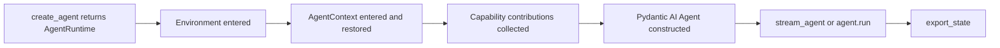

# AgentContext and Session State

`AgentContext` is the typed dependency and session-state owner for an entered agent
runtime. It references the active `Environment` and exposes its filesystem, shell, and
resource authorities. It also owns the logical-run input ledger, task/note state,
usage projection, deferred metadata, model context policy, and native input router.

Canonical Pydantic AI message history is separate from `ResumableState`; a host that
supports continuation must persist both.

## Lifecycle



`runtime.agent`, `runtime.capabilities`, and capability provenance are unavailable until
runtime entry.

```python
from ya_agent_sdk.agents.main import create_agent
from ya_agent_sdk.capabilities import RuntimeFoundationCapability

runtime = create_agent(
    "openai-chat:gpt-4o",
    capabilities=[RuntimeFoundationCapability()],
)

async with runtime:
    result = await runtime.agent.run("Hello", deps=runtime.ctx)
```

`stream_agent()` manages the same runtime lifecycle automatically. Keep an outer
`async with runtime` when one logical host flow may call `stream_agent()` repeatedly,
for example across deferred HITL continuations.

## Constructing Context

Use `model_cfg` for context/media/recovery policy and `context_kwargs` for additional
validated `AgentContext` fields:

```python
from ya_agent_sdk.context import ModelConfig, ModelFeature, ToolConfig

runtime = create_agent(
    "anthropic:claude-sonnet-4",
    model_cfg=ModelConfig(
        context_window=200_000,
        capabilities={ModelFeature.vision},
        stream_resume_on_error=True,
    ),
    context_kwargs={
        "tool_config": ToolConfig(),
        "shell_env": {"APP_ENV": "development"},
    },
)
```

Use `context_type=MyContext` for a typed application context. Do not pass removed
free-form `extra_context_kwargs`, `tool_config`, or approval arguments directly to
`create_agent()`.

## `ModelConfig`

Important fields include:

| Field                                    | Purpose                                           |
| ---------------------------------------- | ------------------------------------------------- |
| `context_window`                         | Total model context window                        |
| `proactive_context_management_threshold` | Reminder threshold before compaction              |
| `compact_threshold`                      | Automatic compaction threshold                    |
| `cold_start_trim_seconds`                | Large tool-result trim policy after cache expiry  |
| `stream_resume_on_error`                 | Default stream recovery enablement                |
| `stream_resume_max_attempts`             | Non-transport execution recovery attempts         |
| `stream_transport_resume_max_attempts`   | Attempts per consecutive transport-failure streak |
| `stream_resume_prompt`                   | Default recovered-run continuation prompt         |
| `max_images`, `max_videos`               | History media count limits                        |
| `max_image_bytes`, `max_image_dimension` | Image normalization bounds                        |
| `capabilities`                           | Explicit `ModelFeature` set                       |

```python
from ya_agent_sdk.context import ModelConfig, ModelFeature

config = ModelConfig(
    context_window=128_000,
    capabilities={
        ModelFeature.vision,
        ModelFeature.audio_understanding,
    },
)
assert config.has_vision
```

## Session Persistence

Persist model messages and SDK state as separate artifacts:

```python
from pathlib import Path
from pydantic_ai import ModelMessagesTypeAdapter
from ya_agent_sdk.context import ResumableState

# After a completed run:
Path("messages.json").write_bytes(result.all_messages_json())
Path("state.json").write_text(
    runtime.ctx.export_state().model_dump_json(indent=2),
    encoding="utf-8",
)

# Before the next run:
messages = ModelMessagesTypeAdapter.validate_json(
    Path("messages.json").read_bytes()
)
state = ResumableState.model_validate_json(
    Path("state.json").read_text(encoding="utf-8")
)
runtime = create_agent("openai-chat:gpt-4o", state=state)
result = await runtime.agent.run(
    "Continue",
    deps=runtime.ctx,
    message_history=messages,
)
```

`create_agent(state=...)` restores the context before capability contributions are
resolved. A current host security policy must not be weakened by persisted state.

`export_state()` excludes the usage ledger by default because normal hosts commit usage
through their run store. Use `include_usage_ledger=True` only for an explicit recovery
contract. The old `include_extra_usages` name is not part of new application guidance.

## Logical-Run Input

`AgentContext.run_input_ledger` is structured retention truth for all user inputs
applied to the current logical run. `input_router` is a process-local
`LogicalRunInputRouter` bound only while a native run accepts input, and
`active_run_registry` locates active main or child routers.

Hosts should not call a MessageBus or append ad hoc replay strings. Native steering is:

1. persist input first when the host is durable;
2. resolve the active logical-run router;
3. call `router.enqueue(...)`, which uses Pydantic AI `AgentRun.enqueue()`;
4. observe native enqueue/application events; and
5. retain unapplied durable input in the host inbox when no run is active.

Applied user input is preserved by the `RunInputLedger` across compact, handoff, native
recovery, and durable replay without becoming a second delivery path.

## Context Contributions

An entered context may contribute ordered Pydantic AI capabilities through the
Environment contribution protocol. The runtime retains every source group separately
for diagnostics and validates all leaves together. Contributions may provide concrete
host authority, but they do not mutate the immutable custom capability type catalog or
silently grant a feature omitted from a child `AgentSpec`.

## Custom Context and State

```python
from pydantic import Field
from ya_agent_sdk.context import AgentContext, ResumableState


class AppState(ResumableState):
    tenant_id: str = ""

    def restore(self, ctx: "AppContext") -> None:
        super().restore(ctx)
        ctx.tenant_id = self.tenant_id


class AppContext(AgentContext):
    tenant_id: str = ""

    def export_state(self, **kwargs) -> AppState:
        base = super().export_state(**kwargs)
        return AppState(**base.model_dump(), tenant_id=self.tenant_id)


runtime = create_agent(
    "openai-chat:gpt-4o",
    context_type=AppContext,
    context_kwargs={"tenant_id": "tenant-123"},
)
```

Keep live clients, callbacks, locks, Environment authorities, and model wrappers out of
serializable state. Reconstruct them through runtime/environment setup.

## Model Wrapper

`model_wrapper(model, agent_name, metadata)` can wrap every resolved model for tracing,
caching, or rate limiting. The wrapper passed to `create_agent()` must be synchronous
because Agent construction occurs during runtime entry. It may return a wrapped
Pydantic AI `Model`.

```python
from pydantic_ai.models import Model


def wrap_model(model: Model, agent_name: str, metadata: dict[str, object]) -> Model:
    return traced(model, name=agent_name, run_id=metadata.get("run_id"))

runtime = create_agent(
    "openai-chat:gpt-4o",
    model_wrapper=wrap_model,
    context_kwargs={
        "wrapper_metadata": {"tenant_id": "tenant-123"},
    },
)
```

Model wrappers and metadata are process-local and are not part of `ResumableState`.
Child drivers receive the same wrapper through an explicit host binding, not by
serializing a live closure.

## Manual Context Use

Advanced infrastructure can enter an Environment and context directly:

```python
from ya_agent_sdk.context import AgentContext
from ya_agent_sdk.environment.local import LocalEnvironment

async with LocalEnvironment() as env:
    async with AgentContext(env=env) as ctx:
        text = await ctx.file_operator.read_file("README.md")
```

Application agents should usually use `create_agent()` so capability contribution
ordering, state restore, and Agent construction share one lifecycle.

## See Also

- [`streaming.md`](streaming.md) - stream driver and recovery
- [`subagent.md`](subagent.md) - isolated child contexts and durable records
- [`environment.md`](environment.md) - authority and contribution lifecycle
- [`resumable-resources.md`](resumable-resources.md) - reconstructable resources
- [`user-input.md`](user-input.md) - deferred host continuation
