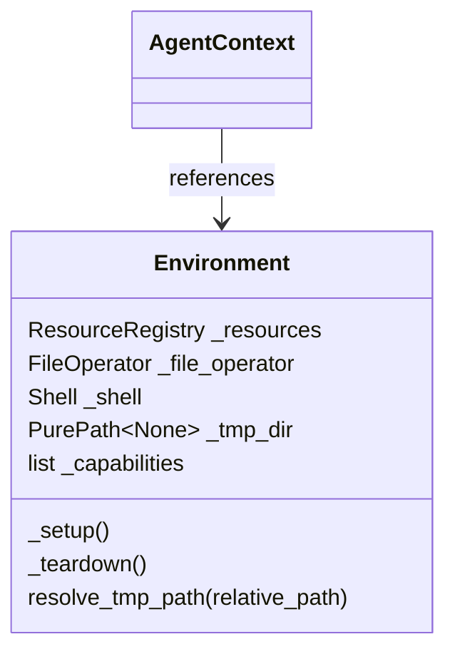

# Environment Management

Resource management, lifecycle hooks, and environment implementations.

> **Note**: Base abstractions (`Environment`, `FileOperator`, `Shell`, `ResourceRegistry`, etc.) are defined in the [ya-agent-environment](https://github.com/wh1isper/ya-mono/tree/main/packages/ya-agent-environment) protocol package. This SDK provides concrete implementations (`LocalEnvironment`, `SandboxEnvironment`).

## Overview

- **FileOperator**: One backend-agnostic logical path space for file operations
- **Shell**: Abstraction for command execution
- **ResourceRegistry**: Type-safe runtime resource management
- **Temporary storage**: Environment-owned `tmp_dir` and safe `resolve_tmp_path()`
- **Lifecycle hooks**: `_setup()` / `_teardown()` pattern for subclasses



## Basic Usage

### Recommended: create_agent

```python
from ya_agent_sdk.agents.main import create_agent, stream_agent

# Default: uses LocalEnvironment
runtime = create_agent("openai-chat:gpt-4")
async with stream_agent(runtime, "Hello") as streamer:
    async for event in streamer:
        print(event)
```

### Manual Environment Management

```python
from ya_agent_sdk.environment import LocalEnvironment
from ya_agent_sdk.context import AgentContext

async with LocalEnvironment(allowed_paths=[path]) as env:
    async with AgentContext(env=env) as ctx:
        await ctx.file_operator.read_file("test.txt")
```

## Resource Management

`ResourceRegistry` provides type-safe resource management with protocol validation:

```python
# Register resources
registry.set("database", database)  # Must implement Resource protocol (close())

# Access resources
database = registry.get_typed("database", DatabasePool)

# Collect provenance-preserving capability groups from all resources
groups = registry.get_agent_contributions()

# Cleanup (called automatically by Environment before backend teardown)
await registry.close_all()
```

> Full API: [ya-agent-environment](https://github.com/wh1isper/ya-mono/tree/main/packages/ya-agent-environment)

## Creating Custom Environments

Implement `_setup` and `_teardown` hooks instead of overriding `__aenter__`/`__aexit__`:

```python
class MyEnvironment(Environment):
    async def _setup(self) -> None:
        self._file_operator = LocalFileOperator(...)
        self._shell = LocalShell(...)
        db = await Database.connect(...)
        self._resources.set("db", db)

    async def _teardown(self) -> None:
        # Release environment-owned backend/container/tmp resources.
        # Registered resources, shell, and file_operator are already closed.
        await self._backend.close()
        self._file_operator = None
        self._shell = None
        self._tmp_dir = None
```

**Why hooks instead of __aenter__/__aexit__?**

- Safe inheritance without `await super().__aenter__()` concerns
- Base class uses dependency-safe cleanup on normal exit and partial setup failure
- Cleanup order is resources, shell, file operator, then `_teardown()`

## Available Implementations

### LocalEnvironment

```python
LocalEnvironment(
    allowed_paths=[Path("/workspace")],
    default_path=Path("/workspace"),
    shell_timeout=30.0,
)
```

By default, a workspace-backed `LocalEnvironment` creates managed temporary storage
at `<default_path>/.tmp/ya-agent-<id>`. Without a workspace it falls back to the system
temporary directory. Set `enable_tmp_dir=False` to disable it; low-level SDK users may
pass `tmp_base_dir` when they explicitly need a different parent. The temporary
directory is added as an ordinary allowed path for both the file operator and shell.

## Temporary Storage

Temporary storage belongs to `Environment`, not `FileOperator`. It is available only
while the environment is entered:

```python
async with LocalEnvironment(allowed_paths=[workspace]) as env:
    if env.tmp_dir is not None:
        intermediate = env.resolve_tmp_path("downloads/page.html")
        await env.file_operator.mkdir(str(intermediate.parent), parents=True)
        await env.file_operator.write_file(str(intermediate), html)
```

`resolve_tmp_path()` accepts only relative paths and rejects absolute paths and `..`
traversal. It raises when temporary storage is disabled. Use `tmp_dir` for
intermediate, agent-only data; write user-facing deliverables to the workspace.

A `FileOperator` has no separate temporary backend, routing API, or temporary-file
convenience methods. Temporary paths use the operator's normal methods. Local
walk/search operations accept an explicit absolute root for any allowed path: entries
under the default path remain relative, while entries outside it use directly reusable
absolute paths. Searching `root="."` stays scoped to the default path and does not
implicitly union temporary storage. Likewise, `read_bytes_stream()` directly returns
an `AsyncIterator`; do not await the call:

```python
stream = env.file_operator.read_bytes_stream(str(intermediate))
async for chunk in stream:
    ...
```

Workspace-backed environments, including `SandboxEnvironment` and YA Claw, use a
hidden `.tmp/ya-agent-<id>` directory below an existing writable shared mount. Every
owned instance contains a `.gitignore` with `*`, so both the marker and temporary
contents stay out of Git status without editing the project's root ignore file. The
agent-facing `tmp_dir` uses the mounted virtual path, so both file operations and the
container shell see the same location. Explicit searches rooted at `tmp_dir` continue
to use that separately allowed root. No extra bind mount is added; this is important
when reusing an already-created container. YAACLI intentionally keeps its managed
instance in the system temporary directory. Lifecycle cleanup removes only the current
owned instance; abrupt process termination can leave an ignored instance behind, and
environments do not scan or delete another process's temporary directories.

### SandboxEnvironment

Sandbox environment with virtual file operations and containerized shell.
Both file operations and shell commands see the same path space (e.g., `/workspace`).
Managed temporary storage is created below the writable mount containing `work_dir`.

```python
# Single mount with Docker
SandboxEnvironment(
    mounts=[VirtualMount(Path("/home/user/project"), Path("/workspace"))],
    image="python:3.11",
    cleanup_on_exit=True,
)

# Multiple mounts
SandboxEnvironment(
    mounts=[
        VirtualMount(Path("/home/user/project"), Path("/workspace/project")),
        VirtualMount(Path("/home/user/.config"), Path("/workspace/.config")),
    ],
    work_dir="/workspace/project",
    image="python:3.11",
)

# With custom shell backend
SandboxEnvironment(
    mounts=[VirtualMount(Path("/home/user/project"), Path("/workspace"))],
    shell=my_custom_shell,
)
```

A custom `Shell` implements `_create_process()` and returns an `ExecutionHandle`; it must not override the final `Shell.execute()` boundary. Runtime class creation rejects an `execute()` override with `TypeError`, so migrate legacy backends to `_create_process()` instead of bypassing ownership. The base class keeps foreground and background commands owned across cancellation and session reset, so each handle's `kill` callback must confirm termination or raise for retry.

## Environment Capabilities

Environments contribute opaque Pydantic AI capabilities after entering. This keeps the
Environment package independent from Pydantic AI while preserving source provenance:

```python
from pydantic_ai.capabilities import Toolset as ToolsetCapability


class ContainerEnvironment(Environment):
    async def _setup(self) -> None:
        # ... setup file_operator, shell ...
        container_toolset = FunctionToolset()

        @container_toolset.tool
        def get_container_status() -> str:
            return "running"

        self._capabilities = [
            ToolsetCapability(container_toolset, id="container"),
        ]
```

After Environment setup and resource restoration, `create_agent` collects
`env.get_agent_contributions()` and validates the resulting capabilities with the
explicit runtime capabilities. There is no environment toolset aggregation path.

## Resource-Provided Capabilities

A resource can own the capabilities that expose its behavior. Wrap a resource-backed
toolset at that boundary instead of returning a raw toolset:

```python
from pydantic_ai.capabilities import Toolset as ToolsetCapability
from ya_agent_environment import BaseResource


class ProcessManager(BaseResource):
    async def setup(self) -> None:
        self._processes = {}

    def get_capabilities(self) -> tuple[object, ...]:
        return (
            ToolsetCapability(
                ProcessToolset(self),
                id="process_manager",
            ),
        )

    async def close(self) -> None:
        await self._kill_all_processes()
```

`ResourceRegistry.get_agent_contributions()` returns one
`AgentContributionGroup(source_id="resource:<key>", ...)` per contributing resource.
The SDK consumes these groups after restore; callers do not flatten and pass them back
to `create_agent()` manually.

## Resumable Resources

Resources can be exported and restored across process restarts using factories.

### Using BaseResource (Recommended)

`BaseResource` is a convenience abstract class with async `close()` and default export/restore:

```python
from pydantic_ai.capabilities import Toolset as ToolsetCapability
from ya_agent_environment import BaseResource


class ApiClientSession(BaseResource):
    def __init__(self, client: ApiClient):
        self._client = client

    async def setup(self) -> None:
        """Async initialization (called after factory, before restore_state)."""
        await self._client.connect()

    async def close(self) -> None:
        await self._client.close()

    async def export_state(self) -> dict[str, Any]:
        return {"cursor": self._client.cursor}

    async def restore_state(self, state: dict[str, Any]) -> None:
        self._client.cursor = state.get("cursor")

    def get_capabilities(self) -> tuple[object, ...]:
        """Provide one capability backed by this API client."""
        return (
            ToolsetCapability(
                ApiClientToolset(self._client),
                id="api_client",
            ),
        )
```

### Using Factories

Factory functions receive the `Environment` instance, allowing access to `file_operator`, `shell`, `resources`, and `tmp_dir`:

```python
from ya_agent_environment import Environment

async def create_api_client(env: Environment) -> ApiClientSession:
    return ApiClientSession(
        client=ApiClient(cache_dir=env.tmp_dir),
    )

# First run: create and export
async with LocalEnvironment() as env:
    env.resources.register_factory("api_client", create_api_client)
    api_client = await env.resources.get_or_create("api_client")
    # ... use api_client ...
    state = await env.export_resource_state()
    Path("state.json").write_text(state.model_dump_json())

# Later: restore from state
state = ResourceRegistryState.model_validate_json(Path("state.json").read_text())
async with LocalEnvironment(
    resource_state=state,
    resource_factories={"api_client": create_api_client},
) as env:
    api_client = env.resources.get("api_client")  # Already restored
```

### Chaining API

```python
env = (LocalEnvironment()
    .with_resource_factory("api_client", create_api_client)
    .with_resource_state(state))
```

> Non-resumable resources (without `export_state`/`restore_state`) are silently skipped during export.

## See Also

- [context.md](context.md) - AgentContext and session management
- [toolset.md](toolset.md) - Toolset architecture
- [resumable-resources.md](resumable-resources.md) - Full resumable resources documentation
