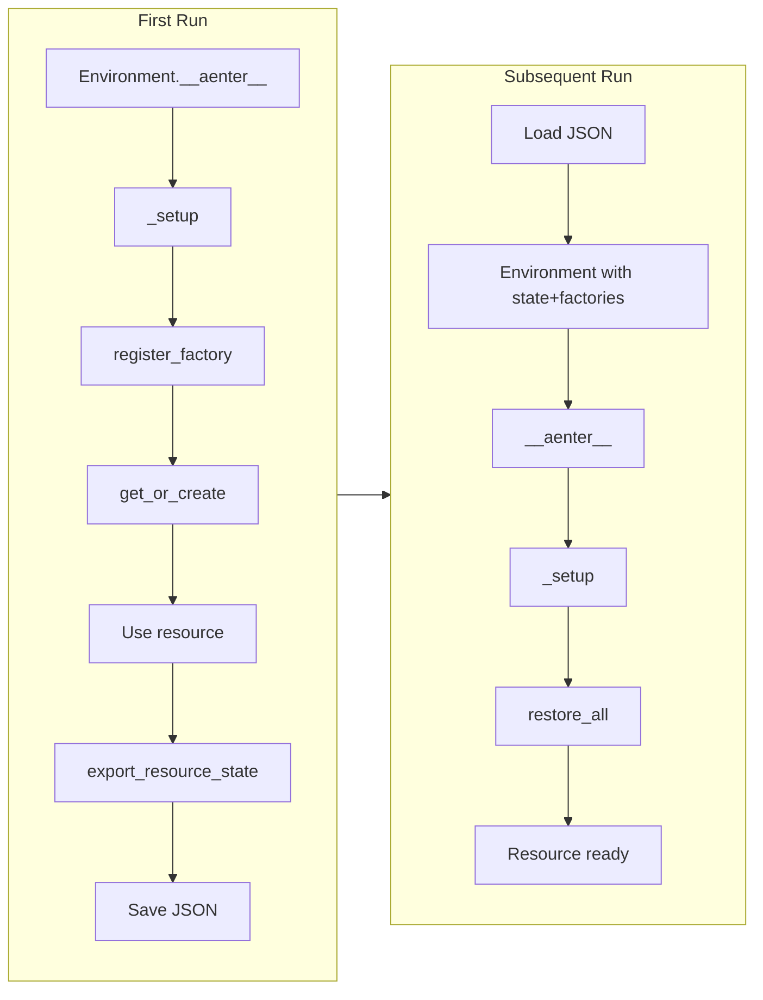

# Resumable Resources

Export and restore resource states across process restarts via async factories.

> **Note**: Base protocols and classes (`Resource`, `ResumableResource`, `BaseResource`, `ResourceRegistry`, etc.) are defined in the [ya-agent-environment](https://github.com/wh1isper/ya-mono/tree/main/packages/ya-agent-environment) protocol package.

## Overview

- **Resource**: Protocol requiring `close()` method
- **ResumableResource**: Protocol adding `export_state()`/`restore_state()`
- **InstructableResource**: Protocol adding `get_context_instructions()`
- **Resource capabilities**: `get_capabilities()` contributes opaque Pydantic AI capabilities
- **BaseResource**: Abstract base class with lifecycle, capability, and resumable defaults
- **ResourceFactory**: Async callable that creates resources
- **ResourceRegistryState**: Serializable state container



## Using BaseResource (Recommended)

`BaseResource` is a convenience abstract class with async `close()` and default no-op export/restore:

```python
from pydantic_ai.capabilities import Toolset as ToolsetCapability
from ya_agent_environment import BaseResource


class ApiClientSession(BaseResource):
    def __init__(self, client: ApiClient):
        self._client = client

    async def close(self) -> None:
        await self._client.close()

    async def export_state(self) -> dict[str, Any]:
        return {"cursor": self._client.cursor}

    async def restore_state(self, state: dict[str, Any]) -> None:
        self._client.cursor = state.get("cursor")

    async def get_context_instructions(self) -> str | None:
        return f"API client cursor: {self._client.cursor}"

    def get_capabilities(self) -> tuple[object, ...]:
        """Provide a capability backed by this API client."""
        return (
            ToolsetCapability(
                ApiClientToolset(self._client),
                id="api_client",
            ),
        )
```

For resources that don't need state persistence, just implement `close()`:

```python
class DatabasePool(BaseResource):
    async def close(self) -> None:
        await self._pool.close()

    # export_state/restore_state use defaults (empty dict / no-op)
```

## Resource Lifecycle: setup()

`BaseResource.setup()` is called by `ResourceRegistry` after factory creation, before `restore_state()`. Use it for async initialization:

```python
class ProcessManager(BaseResource):
    def __init__(self):
        self._processes: dict[str, Process] = {}

    async def setup(self) -> None:
        """Called after factory creation, before restore_state()."""
        # Perform async initialization here
        await self._initialize_process_pool()

    async def close(self) -> None:
        await self._cleanup_all_processes()
```

Lifecycle order:

1. Factory creates resource instance (`__init__`)
2. `setup()` called for async initialization
3. `restore_state()` called if restoring from saved state
4. Resource is ready for use
5. `close()` called on cleanup

## Resource-Provided Capabilities

Resources encapsulate both state and agent behavior through `get_capabilities()`. The
Environment layer keeps these values opaque; an application resource may use Pydantic
AI's native toolset capability:

```python
from pydantic_ai.capabilities import Toolset as ToolsetCapability


class ProcessManager(BaseResource):
    def get_capabilities(self) -> tuple[object, ...]:
        from my_app.toolsets import ProcessToolset

        return (
            ToolsetCapability(
                ProcessToolset(self),
                id="process_manager",
            ),
        )

    async def get_context_instructions(self) -> str | None:
        if not self._processes:
            return None
        return f"<processes count='{len(self._processes)}'>...</processes>"
```

After resources are restored, `ResourceRegistry.get_agent_contributions()` returns one
provenance-preserving group per resource. SDK runtime entry combines those groups with
explicit and Environment capabilities; callers must not manually flatten toolsets into
a second composition path.

## Implementing ResumableResource Protocol

For classes that can't inherit from `BaseResource`:

```python
class ApiClientSession:
    async def export_state(self) -> dict[str, Any]:
        return {"cursor": self._client.cursor}

    async def restore_state(self, state: dict[str, Any]) -> None:
        self._client.cursor = state.get("cursor")

    def close(self) -> None:
        self._client.close()
```

## Basic Usage

### First Run: Create and Export

Factory functions receive the `Environment` instance:

```python
from ya_agent_environment import Environment


async def create_api_client(env: Environment) -> ApiClientSession:
    return ApiClientSession(
        client=ApiClient(cache_dir=env.tmp_dir),
    )


async with LocalEnvironment() as env:
    env.resources.register_factory("api_client", create_api_client)
    api_client = await env.resources.get_or_create("api_client")

    # Use api_client...

    state = await env.export_resource_state()
    Path("state.json").write_text(state.model_dump_json())
```

### Subsequent Run: Restore

```python
state = ResourceRegistryState.model_validate_json(Path("state.json").read_text())

async with LocalEnvironment(
    resource_state=state,
    resource_factories={"api_client": create_api_client},
) as env:
    api_client = env.resources.get("api_client")  # Already restored
```

### Chaining API

```python
env = LocalEnvironment().with_resource_factory("api_client", create_api_client).with_resource_state(state)
```

## ResourceRegistry API

```python
# Factory registration
registry.register_factory("key", async_factory)

# Lazy creation
resource = await registry.get_or_create("key")
typed = await registry.get_or_create_typed("key", MyResource)

# State management
state = await registry.export_state()
count = await registry.restore_all()
restored = await registry.restore_one("key")

# Provenance-preserving capability contribution groups
groups = registry.get_agent_contributions()

# Existing API (preserved)
registry.set("key", resource)
registry.get("key")
registry.get_typed("key", MyResource)
```

## Key Behaviors

- **Non-resumable resources**: Silently skipped during export/restore
- **Idempotent restore**: `restore_all()` clears pending state after first call
- **Lazy restoration**: Use `restore_one()` to restore on demand
- **Automatic restore**: `Environment.__aenter__` calls `restore_all()` after `_setup()`
- **Context instructions**: Resources with `get_context_instructions()` contribute to `Environment.get_context_instructions()`
- **Capability contribution**: `get_capabilities()` values are returned in one source-labelled group per resource

## See Also

- [environment.md](environment.md) - Environment management
- [context.md](context.md) - AgentContext and session state
