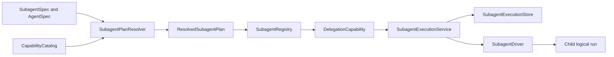

# Portable Subagent Runtime

YA Agent SDK 2.0 uses one host-neutral subagent domain model and one execution service.
Foreground delegation, background delegation, named resume, targeted steering,
cancellation, and self fork are operations over the same records and plans.

Removed 1.x concepts are not accepted at runtime: `SubagentConfig`, generated delegate
tool classes, `Toolset.with_subagents()`, implicit/automatic tool inheritance, hidden
delegate backends, and MessageBus delivery.

## Architecture



The layers have distinct responsibilities:

- native Pydantic AI `AgentSpec` owns model, settings, description, instructions,
  output schema, and serialized capability configuration;
- YA `SubagentSpec` adds route, history, recursion, execution mode, linkage, host
  requirements, and durability policy;
- `SubagentPlanResolver` validates and fingerprints exact child grants;
- `SubagentRegistry` stores immutable plan snapshots;
- `DelegationCapability` contributes the model-facing tools and roster instruction;
- `SubagentExecutionService` owns host-neutral lifecycle semantics;
- the store and driver define process-local or restart-durable execution.

## Complete In-Process Example

```python
from pydantic_ai import AgentSpec
from ya_agent_sdk.agents.main import create_agent
from ya_agent_sdk.capabilities import (
    RuntimeFoundationCapability,
    build_default_capability_catalog,
)
from ya_agent_sdk.subagents import (
    DelegationCapability,
    InMemorySubagentExecutionStore,
    InProcessSubagentDriver,
    SelfForkPolicy,
    SubagentExecutionMode,
    SubagentExecutionService,
    SubagentPlanResolver,
    SubagentRegistry,
    SubagentSpec,
)

model = "anthropic:claude-sonnet-4"
catalog = build_default_capability_catalog()
resolver = SubagentPlanResolver(catalog, default_model=model)

researcher = resolver.resolve(
    SubagentSpec(
        route="researcher",
        execution_modes=(SubagentExecutionMode.foreground,),
        agent=AgentSpec.from_dict(
            {
                "name": "researcher",
                "description": "Research a bounded question and return sources",
                "instructions": "Return concise sourced findings and uncertainties.",
                "capabilities": [
                    {"RuntimeFoundationCapability": {}},
                    {"WebSearchCapability": {}},
                    {"WebContentCapability": {}},
                    {"ToolObservationCapability": {}},
                    {"ToolRetryCapability": {}},
                    {"ToolTimeoutCapability": {}},
                ],
            }
        ),
    )
)

self_plan = resolver.resolve_self(
    SelfForkPolicy(
        agent=AgentSpec.from_dict(
            {
                "name": "self",
                "description": "Fork the parent for a bounded independent task",
                "model": model,
                "instructions": "Work independently and report concise findings.",
                "capabilities": [
                    {"RuntimeFoundationCapability": {}},
                    {"FilesystemCapability": {"writable": False}},
                    {"ToolObservationCapability": {}},
                    {"ToolRetryCapability": {}},
                    {"ToolTimeoutCapability": {}},
                ],
            }
        ),
        history_message_limit=50,
        execution_modes=(SubagentExecutionMode.foreground,),
    )
)

registry = SubagentRegistry([researcher, self_plan])
service = SubagentExecutionService(
    registry,
    InMemorySubagentExecutionStore(),
    InProcessSubagentDriver(
        custom_capability_types=catalog.custom_capability_types,
    ),
)

runtime = create_agent(
    model,
    capabilities=[
        RuntimeFoundationCapability(),
        DelegationCapability(registry=registry, service=service),
    ],
)
```

`DelegationCapability.close_runtime()` closes its service when the owning
`AgentRuntime` exits. The in-memory store and in-process driver are truthful
process-local adapters; active executions do not survive process loss.

## Portable Definition

### Host file adapters

`SubagentSpec` is the portable runtime boundary, not a requirement that every human
configuration file use the native YAML/JSON shape. A host may accept a concise Markdown
subagent definition with YAML frontmatter and normalize it into `SubagentSpec` before
catalog resolution, fingerprinting, or persistence.

Keep that adapter at the trusted host configuration boundary. It must materialize an
explicit `AgentSpec`, capability list, model settings, and delegation policy. It must
not restore `SubagentConfig`, generated delegate classes, ambient parent-tool copying,
or alternate execution semantics. Persist only the normalized plan/descriptor so a
restart never depends on reparsing mutable Markdown.

YAACLI supports this generic input form under `~/.yaacli/subagents/*.md`:

```markdown
---
name: explorer
description: Inspect an unfamiliar codebase.
instruction: Use this agent for focused codebase exploration.
model: inherit
model_settings: inherit
model_cfg: inherit
tools: [glob, grep, ls, view]
---

Return concise findings with exact file paths and unresolved questions.
```

The host combines `description` and optional `instruction` for the parent-facing roster,
uses the body as child instructions, resolves `inherit` against the active root
configuration, and converts tool names into a visibility policy over an explicit child
capability plan. Native `SubagentSpec` YAML/JSON remains the right input when users need custom capability
serialization names, nesting, durability, or complete delegation policy.

### `SubagentSpec`

| Field                   | Meaning                                                                     |
| ----------------------- | --------------------------------------------------------------------------- |
| `route`                 | Stable parent-facing target name; must match `AgentSpec.name` when provided |
| `agent`                 | Native Pydantic AI `AgentSpec` core                                         |
| `history`               | `isolated`, `resumable`, or `parent_snapshot`                               |
| `history_message_limit` | Bounded history grant, 1 to 1000 messages                                   |
| `host_requirements`     | Explicit host features required before registration                         |
| `max_depth`             | Maximum child depth for this route                                          |
| `spawn_targets`         | Routes this child may spawn                                                 |
| `execution_modes`       | Allowed `foreground` and/or `background` modes                              |
| `linkage`               | `child` for parent delivery or `detached`                                   |
| `durability`            | `process` or `restart` requirement                                          |

A named child receives exactly the capabilities listed in its native `AgentSpec` plus
the resolver's explicitly enumerated host-policy capabilities. An omitted capability is
not inherited from the parent.

The resolver injects a final `ToolVisibilityCapability` when the native spec does not
already declare one. If a spec declares an explicit allow/deny policy, that policy is
preserved and remains authoritative.

### Capability serialization

Use Pydantic AI capability specifications inside `AgentSpec`:

```python
AgentSpec.from_dict(
    {
        "name": "reviewer",
        "model": "openai-chat:gpt-4o",
        "capabilities": [
            {"RuntimeFoundationCapability": {}},
            {"FilesystemCapability": {"writable": False}},
            {
                "ToolVisibilityCapability": {
                    "allow": ["glob", "grep", "ls", "view"]
                }
            },
        ],
    }
)
```

SDK built-ins come from `build_default_capability_catalog()`. Selected custom types
must be added through that catalog's explicit type or selected entry-point inputs.
Profiles and persisted specs may reference trusted serialization names but cannot add
Python import targets. A custom capability whose tools may emit native deferred output
must also inherit `SupportsDeferredOutput` so resolved child output types include
`DeferredToolRequests`.

## Resolution and Fingerprints

`SubagentPlanResolver`:

1. deep-clones and validates the portable envelope;
2. checks host requirements and requested durability;
3. supplies `default_model` only when native `AgentSpec.model` is absent;
4. renders only native template-capable description/instruction fields against the
   frozen `AgentTemplateContext.template` projection;
5. validates capability construction with native `Agent.from_spec()`;
6. audits custom capability provenance;
7. injects enumerated host policy grants; and
8. creates a content-addressed immutable plan and descriptor.

The fingerprint includes the complete YA envelope, normalized native spec (including
capability names and configuration), template projection, host policy IDs, effective
output contract, durability, and bounded initial history. Packaging provenance in
`custom_capability_audit` is retained separately and does not participate in identity
or resume compatibility. The fingerprint is the full 64-lowercase-hex SHA-256 digest,
and the content-addressed descriptor ID is `<route>:<full fingerprint>`;
host-capability and durable-registration identities also retain the full digest.
Mutating a plan after resolution causes registry or driver validation to fail.

For restart-durable execution, persist `plan.to_descriptor()` before start and restore
it with a compatible resolver. Never recover by re-reading a mutable profile name. A
registry keeps one active plan per route for new spawns and a separate descriptor index
for retained execution versions; existing records always select by `descriptor_id`.
When that descriptor is not resident, a host may provide
`RetainedSubagentPlanProvider`; the execution service restores and revalidates the exact
historical plan as retained, never as the active route. Persist schema-v3 execution
records with `owner_scope_id`, `segment_index`, independent child resumable state,
durable steering inbox, deferred state, and correlated parent completion input. Reject
older durable schemas explicitly; do not infer ownership or add a runtime compatibility
adapter.

## Self Fork

`self` is a normal registered route resolved from `SelfForkPolicy`. It does not clone a
live `Agent`, capability instance, context, toolset, or model client.

At delegation time, `DelegationCapability` snapshots the parent's canonical messages,
removes the current incomplete `ModelResponse`, bounds the snapshot by
`history_message_limit`, and passes it through the same execution service. Future parent
messages are not shared implicitly.

Grant only capabilities that are safe and reconstructable in the child. User-facing
HITL and delegation should remain absent unless the host explicitly implements the
nested policy.

## Model-Facing Tools

One `DelegationCapability` exposes:

| Tool              | Purpose                                                                              |
| ----------------- | ------------------------------------------------------------------------------------ |
| `delegate`        | Spawn a route or resume `agent_id`; foreground waits and background returns a handle |
| `subagent_info`   | List plans/executions or inspect one execution                                       |
| `wait_subagent`   | Bounded wait for one execution or one-shot fan-in across current executions          |
| `steer_subagent`  | Send targeted native logical-run input                                               |
| `cancel_subagent` | Request idempotent cancellation                                                      |

The SDK default executes foreground delegation inline in the calling tool task. A host
must explicitly inject a `SubagentExecutionHost` that supports background mode before it
can expose asynchronous delegation. Mode is fixed by the host by default; construction
rejects visible routes that do not allow that mode. Mode remains explicit record data
and is never inferred from an ID string.

Every model-facing operation is authorized by `AgentContext.delegation_scope_id`.
Model inspection returns an operational projection rather than the full durable record,
and steering returns only the execution handle plus disposition. Internal logical-run,
inbox, enqueue, idempotency, and resumable-state identities remain host-only.

Standalone roots default it to their stable root run ID; durable hosts use a stable
session/root scope. Delegate, resume, and steering calls derive replay-stable operation
keys from the parent logical run, native `tool_call_id`, operation, and target/resumed
execution. Spawn idempotency is local to that scope, children inherit it, and
one scope cannot inspect, wait for, steer, cancel, resume, or recover another scope's
children. Host-wide inspection uses the separate `admin_get()` and `admin_list()`
methods, never a model tool.

## History, Steering, and Completion

Each child owns a distinct `AgentContext`, logical run ID, `RunInputLedger`, router,
history, task/note state, and run-local capability state. Durable hosts persist and
restore that independent state for every segment; switching the visible parent session
never selects a different child context. Shared Environment/routing authorities are
explicit host services, not mutable context aliases.

`resume()` starts a linked new execution only after a prior execution is terminal. It
uses that record's exact descriptor and history even if the active route changed or was
deleted; it never falls back to the current route. Native `DeferredToolRequests` instead
use `continue_deferred()`: resolve every pending approval/call exactly once with matching
`DeferredToolResults`, then continue the same execution and child logical run at the
next segment. A host may inject
`SubagentDeferredResolver` to perform the same continuation automatically after the
suspended record commits; foreground wait then spans all resolved segments. Without
that resolver, suspension remains explicit for manual continuation. History and usage
remain cumulative, and the initial prompt is not replayed.

The initial delegation prompt begins as `accepted`. Each driver outcome must report its
`input_state`; the driver reports `applied` only after `record_initial()` or an equivalent
durable host admission, and reports `rejected` on failure or cancellation before that
boundary. A post-admission model failure remains `applied` and cannot be downgraded.

Targeted steering is accepted only while the child execution is accepting input. A
durable host persists it in the child's owner-scoped inbox before acknowledging it,
drains it at native graph boundaries, and reports accepted/enqueued/applied/rejected
truthfully. The standalone adapter rejects input when no active router exists.

Every running child context carries its exact immutable plan descriptor. A nested spawn
checks the `spawn_targets` from that descriptor, never from the route's mutable active
plan; policy edits or active-route deletion therefore cannot add or revoke authority for
an already-running child.

A background result is committed before parent delivery. The in-process service can
enqueue it into an active parent router. A durable host instead retains one idempotent,
owner-scoped completion envelope in the parent inbox. The child remains pending delivery
while that input is only accepted/enqueued; only canonical parent application marks it
delivered. Terminal rejection clears the correlation so a later compatible run can
receive it. UI events and readiness projections may notify a human, but they never
substitute for canonical model input and never imply an automatic model wake.

## Host Drivers

- **Standalone SDK:** `InlineSubagentExecutionHost`,
  `InMemorySubagentExecutionStore`, and `InProcessSubagentDriver`; foreground only and no
  restart guarantee.
- **YAACLI:** processor-owned asynchronous execution host, SQLite product records, and
  `LocalSubagentDriver`; execution is process-local, persisted steering/result state is
  inspectable, and restart orphans become `lost`.
- **YA Claw:** SQL child sessions/runs plus its execution supervisor and durable outbox.

Driver and store `restart_durable` declarations must agree. A plan requiring
`SubagentDurability.restart` is rejected by the process-local resolver/driver.

## Best Practices

1. Give every route one focused responsibility and bounded expected output.
2. Declare coherent child capabilities, not copied tool names.
3. Keep host requirements explicit and fail before model invocation.
4. Prefer `foreground` for results needed immediately; use `background` only when
   independent progress has value.
5. Use idempotency keys for retried spawn operations.
6. Resume with the returned short route-prefixed execution handle and its exact retained
   descriptor; internal logical-run UUIDs are never model-facing.
7. Keep parent planning, integration, and user-facing synthesis in the parent.
8. Treat lifecycle events as observations; stores and canonical input own truth.
9. Use a restart-durable host driver whenever process loss must not lose work.

## API Reference

| API                              | Responsibility                                                              |
| -------------------------------- | --------------------------------------------------------------------------- |
| `SubagentSpec`                   | Thin YA delegation envelope around native `AgentSpec`                       |
| `SelfForkPolicy`                 | Declarative bounded self-fork definition                                    |
| `SubagentPlanResolver`           | Validation, normalization, audit, and fingerprinting                        |
| `ResolvedSubagentPlan`           | Immutable exact-grant host-local execution plan                             |
| `SubagentPlanDescriptor`         | Portable content-addressed durable snapshot                                 |
| `SubagentRegistry`               | Public immutable plan registry                                              |
| `DelegationCapability`           | Model-facing tools and roster instructions                                  |
| `SubagentExecutionService`       | Spawn, deferred continuation, resume, steer, cancel, wait, inspect, deliver |
| `SubagentExecutionHost`          | Host-selectable inline or asynchronous coroutine ownership                  |
| `SubagentExecutionIdConflict`    | Typed store signal used to retry a colliding public handle                  |
| `InlineSubagentExecutionHost`    | SDK default foreground execution in the calling task                        |
| `AsyncioSubagentExecutionHost`   | Explicit process-local async task host for applications                     |
| `SubagentDeferredResolver`       | Optional host-authorized child HITL continuation boundary                   |
| `SubagentExecutionStore`         | Host-neutral execution-record persistence protocol                          |
| `SubagentDriver`                 | Host-neutral resolved-plan execution protocol                               |
| `InMemorySubagentExecutionStore` | Standalone process-local store                                              |
| `InProcessSubagentDriver`        | Standalone process-local Pydantic AI driver                                 |

See the canonical architecture specification at
`packages/ya-agent-sdk/spec/05-capability-first-runtime/07-subagent-runtime.md`.
